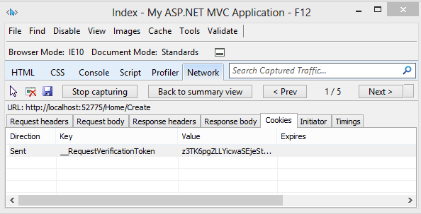

XSRF/CSRF Prevention in ASP.NET MVC and Web Pages
====================
by [Rick Anderson](https://github.com/Rick-Anderson)

> Cross-site request forgery (also known as XSRF or CSRF) is an attack against web-hosted applications whereby a malicious web site can influence the interaction between a client browser and a web site trusted by that browser. These attacks are made possible because web browsers will send authentication tokens automatically with every request to a web site. The canonical example is an authentication cookie, such as ASP.NET's Forms Authentication ticket. However, web sites which use any persistent authentication mechanism (such as Windows Authentication, Basic, and so forth) can be targeted by these attacks.
> 
> An XSRF attack is distinct from a phishing attack. Phishing attacks require interaction from the victim. In a phishing attack, a malicious web site will mimic the target web site, and the victim is fooled into providing sensitive information to the attacker. In an XSRF attack, there is often no interaction necessary from the victim. Rather, the attacker is relying on the browser automatically sending all relevant cookies to the destination web site.
> 
> For more information, see the [Open Web Application Security Project](https://www.owasp.org/index.php/Main_Page)(OWASP) [XSRF](https://www.owasp.org/index.php/Cross-Site_Request_Forgery_(CSRF)).

## Anatomy of an attack

To walk through an XSRF attack, consider a user who wants to perform some online banking transactions. This user first visits WoodgroveBank.com and logs in, at which point the response header will contain her authentication cookie:

[!code-console[Main](xsrfcsrf-prevention-in-aspnet-mvc-and-web-pages/samples/sample1.cmd)]

Because the authentication cookie is a session cookie, it will be automatically cleared by the browser when the browser process exits. However, until that time, the browser will automatically include the cookie with each request to WoodgroveBank.com. The user now wants to transfer $1000 to another account, so she fills out a form on the banking site, and the browser makes this request to the server:

[!code-console[Main](xsrfcsrf-prevention-in-aspnet-mvc-and-web-pages/samples/sample2.cmd)]

Because this operation has a side effect (it initiates a monetary transaction), the banking site has chosen to require an HTTP POST in order to initiate this operation. The server reads the authentication token from the request, looks up the current user's account number, verifies that sufficient funds exist, and then initiates the transaction into the destination account.

Her online banking complete, the user navigates away from the banking site and visits other locations on the web. One of those sites – fabrikam.com – includes the following markup on a page embedded within an &lt;iframe&gt;:

[!code-html[Main](xsrfcsrf-prevention-in-aspnet-mvc-and-web-pages/samples/sample3.html)]

Which then causes the browser to make this request:

[!code-console[Main](xsrfcsrf-prevention-in-aspnet-mvc-and-web-pages/samples/sample4.cmd)]

The attacker is exploiting the fact that the user might still have a valid authentication token for the target web site, and she is using a small snippet of Javascript to cause the browser to make an HTTP POST to the target site automatically. If the authentication token is still valid, the banking site will initiate a transfer of $250 into the account of the attacker's choosing.

### Ineffective mitigations

It is interesting to note that in the above scenario, the fact that WoodgroveBank.com was being accessed via SSL and had an SSL-only authentication cookie was insufficient to thwart the attack. The attacker is able to specify the [URI scheme](http://en.wikipedia.org/wiki/URI_scheme) (https) in her &lt;form&gt; element, and the browser will continue to send unexpired cookies to the target site as long as those cookies are consistent with the URI scheme of the intended target.

One could argue that the user should simply not visit untrusted sites, as visiting only trusted sites is helps to remain safe online. There is some truth to this, but unfortunately this advice is not always practical. Perhaps the user "trusts" the local news site ConsolidatedMessenger. ConsolidatedMessenger.com and goes to visit that site instead, but that site has an XSS vulnerability which allows an attacker to inject the same snippet of code that was running on fabrikam.com.

You can verify that incoming requests have a [Referer header](http://www.w3.org/Protocols/HTTP/HTRQ_Headers.html#z14) referencing your domain. This will stop requests unwittingly submitted from a third-party domain. However, some people disable their browser's Referer header for privacy reasons, and attackers can sometimes spoof that header if the victim has certain insecure software installed. Verifying the [Referer header](http://www.w3.org/Protocols/HTTP/HTRQ_Headers.html#z14) is not considered a secure approach to preventing XSRF attacks.

## Web Stack Runtime XSRF mitigations

The ASP.NET Web Stack Runtime uses a variant of the [synchronizer token pattern](https://www.owasp.org/index.php/Cross-Site_Request_Forgery_(CSRF)_Prevention_Cheat_Sheet#General_Recommendation:_Synchronizer_Token_Pattern) to defend against XSRF attacks. The general form of the synchronizer token pattern is that two anti-XSRF tokens are submitted to the server with each HTTP POST (In addition to the authentication token): one token as a cookie, and the other as a form value. The token values generated by the ASP.NET runtime are not deterministic or predictable by an attacker. When the tokens are submitted, the server will allow the request to proceed only if both tokens pass a comparison check.

The XSRF request verification *session token* is stored as an HTTP cookie and currently contains the following information in its payload:

- A security token, consisting of a random 128-bit identifier.   
 The following image shows the XSRF request verification session token displayed with the Internet Explorer F12 developer tools: (Note this is the current implementation and is subject, even likely, to change.)

The *field token* is stored as an `<input type="hidden" />` and contains the following information in its payload:

- The logged-in user's username (if authenticated).
- Any additional data provided by an [IAntiForgeryAdditionalDataProvider](https://msdn.microsoft.com/en-us/library/system.web.helpers.iantiforgeryadditionaldataprovider(v=vs.111).aspx).

The payloads of the anti-XSRF tokens are encrypted and signed, so you can't view the username when using tools to examine the tokens. When the web application is targeting ASP.NET 4.0, cryptographic services are provided by the [MachineKey.Encode](https://msdn.microsoft.com/en-us/library/system.web.security.machinekey.encode.aspx) routine. When the web application is targeting ASP.NET 4.5 or higher, cryptographic services are provided by the [MachineKey.Protect](https://msdn.microsoft.com/en-us/library/system.web.security.machinekey.protect(v=vs.110)) routine, which offers better performance, extensibility, and security. See the following blog posts for more details:

- [Cryptographic Improvements in ASP.NET 4.5, pt. 1](https://blogs.msdn.com/b/webdev/archive/2012/10/22/cryptographic-improvements-in-asp-net-4-5-pt-1.aspx)
- [Cryptographic Improvements in ASP.NET 4.5, pt. 2](https://blogs.msdn.com/b/webdev/archive/2012/10/23/cryptographic-improvements-in-asp-net-4-5-pt-2.aspx)
- [Cryptographic Improvements in ASP.NET 4.5, pt. 3](https://blogs.msdn.com/b/webdev/archive/2012/10/24/cryptographic-improvements-in-asp-net-4-5-pt-3.aspx)

## Generating the tokens

To generate the anti-XSRF tokens, call the [@Html.AntiForgeryToken](https://msdn.microsoft.com/en-us/library/dd470175.aspx) method from an MVC view or @AntiForgery.GetHtml() from a Razor page. The runtime will then perform the following steps:

1. If the current HTTP request already contains an anti-XSRF session token (the anti-XSRF cookie \_\_RequestVerificationToken), the security token is extracted from it. If the HTTP request does not contain an anti-XSRF session token or if extraction of the security token fails, a new random anti-XSRF token will be generated.
2. An anti-XSRF field token is generated using the security token from step (1) above and the identity of the current logged-in user. (For more information on determining user identity, see the **[Scenarios with special support](#_Scenarios_with_special)** section below.) Additionally, if an [IAntiForgeryAdditionalDataProvider](https://msdn.microsoft.com/en-us/library/jj158328(v=vs.111).aspx) is configured, the runtime will call its [GetAdditionalData](https://msdn.microsoft.com/en-us/library/system.web.helpers.iantiforgeryadditionaldataprovider.getadditionaldata(v=vs.111).aspx) method and include the returned string in the field token. (See the **[Configuration and extensibility](#_Configuration_and_extensibility)** section for more information.)
3. If a new anti-XSRF token was generated in step (1), a new session token will be created to contain it and will be added to the outbound HTTP cookies collection. The field token from step (2) will be wrapped in an `<input type="hidden" />` element, and this HTML markup will be the return value of `Html.AntiForgeryToken()` or `AntiForgery.GetHtml()`.

## Validating the tokens

To validate the incoming anti-XSRF tokens, the developer includes a [ValidateAntiForgeryToken](https://msdn.microsoft.com/en-us/library/system.web.mvc.validateantiforgerytokenattribute(VS.108).aspx) attribute on her MVC action or controller, or she calls `@AntiForgery.Validate()` from her Razor page. The runtime will perform the following steps:

1. The incoming session token and field token are read and the anti-XSRF token extracted from each. The anti-XSRF tokens must be identical per step (2) in the generation routine.
2. If the current user is authenticated, her username is compared with the username stored in the field token. The usernames must match.
3. If an [IAntiForgeryAdditionalDataProvider](https://msdn.microsoft.com/en-us/library/system.web.helpers.iantiforgeryadditionaldataprovider(v=vs.111).aspx) is configured, the runtime calls its *ValidateAdditionalData* method. The method must return the Boolean value *true*.

If validation succeeds, the request is allowed to proceed. If validation fails, the framework will throw an *HttpAntiForgeryException*.

## Failure conditions

Starting with The ASP.NET Web Stack Runtime v2, any *HttpAntiForgeryException* that is thrown during validation will contain detailed information about what went wrong. The currently defined failure conditions are:

- The session token or form token is not present in the request.
- The session token or form token is unreadable. The most likely cause of this is a farm running mismatched versions of The ASP.NET Web Stack Runtime or a farm where the &lt;machineKey&gt; element in Web.config differs between machines. You can use a tool such as Fiddler to force this exception by tampering with either anti-XSRF token.
- The session token and field token were swapped.
- The session token and field token contain mismatched security tokens.
- The username embedded within the field token does not match the current logged-in user's username.
- The *[IAntiForgeryAdditionalDataProvider.ValidateAdditionalData](https://msdn.microsoft.com/en-us/library/system.web.helpers.iantiforgeryadditionaldataprovider.validateadditionaldata(v=vs.111).aspx)* method returned *false*.

The anti-XSRF facilities may also perform additional checking during token generation or validation, and failures during these checks may result in exceptions being thrown. See the [WIF / ACS / claims-based authentication](#_WIF_ACS) and **[Configuration and extensibility](#_Configuration_and_extensibility)** sections for more information.

## Scenarios with special support

### Anonymous authentication

The anti-XSRF system contains special support for anonymous users, where "anonymous" is defined as a user where the *IIdentity.IsAuthenticated* property returns *false*. Scenarios include providing XSRF protection to the login page (before the user is authenticated) and custom authentication schemes where the application uses a mechanism other than *IIdentity* to identify users.

To support these scenarios, recall that the session and field tokens are joined by a security token, which is a 128-bit randomly-generated opaque identifier. This security token is used to track an individual user's session as she navigates the site, so it effectively serves the purpose of an anonymous identifier. An empty string is used in place of the username for the generation and validation routines described above.

### WIF / ACS / claims-based authentication

Normally, the *IIdentity* classes built in to the .NET Framework have the property that *IIdentity.Name* is sufficient to uniquely identify a particular user within a particular application. For example, *FormsIdentity.Name* returns the username stored in the membership database (which is unique for all applications depending on that database), *WindowsIdentity.Name* returns the domain-qualified identity of the user, and so on. These systems provide not only authentication; they also *identify* users to an application.

Claims-based authentication, on the other hand, does not necessarily require identifying a particular user. Instead, the *ClaimsPrincipal* and *ClaimsIdentity* types are associated with a set of *Claim* instances, where the individual claims might be "is 18+ years of age" or "is an administrator" to anything else. Since the user hasn't necessarily been identified, the runtime cannot use the *ClaimsIdentity.Name* property as a unique identifier for this particular user. The team has seen real-world examples where *ClaimsIdentity.Name* returns *null*, returns a friendly (display) name, or otherwise returns a string that isn't appropriate for use as a unique identifier for the user.

Many of deployments which use claims-based authentication are using [Azure Access Control Service](https://msdn.microsoft.com/en-us/library/windowsazure/gg429786.aspx) (ACS) in particular. ACS allows the developer to configure individual *identity providers* (such as ADFS, the Microsoft Account provider, OpenID providers like Yahoo!, etc.), and the identity providers return *name identifiers*. These name identifiers may contain Personally Identifiable Information (PII) like an email address, or they could be anonymized like a Private Personal Identifier (PPID). Regardless, the tuple (identity provider, name identifier) sufficiently serves as an appropriate tracking token for a particular user while she is browsing the site, so the ASP.NET Web Stack Runtime can use the tuple in place of the username when generating and validating anti-XSRF field tokens. The particular URIs for the identity provider and the name identifier are :

- `http://schemas.microsoft.com/accesscontrolservice/2010/07/claims/identityprovider`
- `http://schemas.xmlsoap.org/ws/2005/05/identity/claims/nameidentifier`

(see this [ACS doc page](https://msdn.microsoft.com/en-us/library/windowsazure/gg185971.aspx) for more info.)

When generating or validating a token, the ASP.NET Web Stack Runtime will at runtime try binding to the types:

- `Microsoft.IdentityModel.Claims.IClaimsIdentity, Microsoft.IdentityModel, Version=3.5.0.0, Culture=neutral, PublicKeyToken=31bf3856ad364e35` (For the WIF SDK.)
- `System.Security.Claims.ClaimsIdentity` (For .NET 4.5).

If these types exist, and if the current user's *IIIIdentity* implements or subclasses one of these types, the anti-XSRF facility will use the (identity provider, name identifier) tuple in place of the username when generating and validating the tokens. If no such tuple is present, the request will fail with an error describing to the developer how to configure the anti-XSRF system to understand the particular claims-based authentication mechanism in use. See the **[Configuration and extensibility](#_Configuration_and_extensibility)** section for more information.

### OAuth / OpenID authentication

Finally, the anti-XSRF facility has special support for applications which use OAuth or OpenID authentication. This support is heuristic-based: if the current *IIdentity.Name* begins with http:// or https://, then username comparisons will be done using an Ordinal comparer rather than the default OrdinalIgnoreCase comparer.

## Configuration and extensibility

Occasionally, developers may want tighter control over the anti-XSRF generation and validation behaviors. For example, perhaps the MVC and Web Pages helpers' default behavior of automatically adding HTTP cookies to the response is undesirable, and the developer may wish to persist the tokens elsewhere. There exist two APIs to assist with this:

`AntiForgery.GetTokens(string oldCookieToken, out string newCookieToken, out string formToken);`  
`AntiForgery.Validate(string cookieToken, string formToken);`

The *GetTokens* method takes as input an existing XSRF request verification session token (which may be null) and produces as output a new XSRF request verification session token and field token. The tokens are simply opaque strings with no decoration; the *formToken* value will for instance not be wrapped in an &lt;input&gt; tag. The *newCookieToken* value may be null; if this occurs, then the *oldCookieToken* value is still valid and no new response cookie need be set. The caller of *GetTokens* is responsible for persisting any necessary response cookies or generating any necessary markup; the *GetTokens* method itself will not alter the response as a side effect. The *Validate* method takes the incoming session and field tokens and runs the aforementioned validation logic over them.

### AntiForgeryConfig

The developer may configure the anti-XSRF system from Application\_Start. Configuration is programmatic. The properties of the static *AntiForgeryConfig* type are described below. Most users using claims will want to set the UniqueClaimTypeIdentifier property.

| **Property** | **Description** |
| --- | --- |
| **AdditionalDataProvider** | An [IAntiForgeryAdditionalDataProvider](https://msdn.microsoft.com/en-us/library/system.web.helpers.iantiforgeryadditionaldataprovider(v=vs.111).aspx) that provides additional data during token generation and consumes additional data during token validation. The default value is *null*. For more information, see the [IAntiForgeryAdditionalDataProvider](https://msdn.microsoft.com/en-us/library/system.web.helpers.iantiforgeryadditionaldataprovider(v=vs.111).aspx) section. |
| **CookieName** | A string that provides the name of the HTTP cookie that is used to store the anti-XSRF session token. If this value is not set, a name will be automatically generated based on the application's deployed virtual path. The default value is *null*. |
| **RequireSsl** | A Boolean that dictates whether the anti-XSRF tokens are required to be submitted over an SSL-secured channel. If this value is *true*, any automatically-generated cookies will have the "secure" flag set, and the anti-XSRF APIs will throw if called from within a request that is not submitted via SSL. The default value is *false*. |
| **SuppressIdentityHeuristicChecks** | A Boolean that dictates whether the anti-XSRF system should deactivate its support for claims-based identities. If this value is *true*, the system will assume that *IIdentity.Name* is appropriate for use as a unique per-user identifier and will not try to special-case *IClaimsIdentity* or *ClClaimsIdentity* as described in the [WIF / ACS / claims-based authentication](#_WIF_ACS) section. The default value is `false`. |
| **UniqueClaimTypeIdentifier** | A string that indicates which claim type is appropriate for use as a unique per-user identifier. If this value is set and the current *IIdentity* is claims-based, the system will attempt to extract a claim of the type specified by *UniqueClaimTypeIdentifier*, and the corresponding value will be used in place of the user's username when generating the field token. If the claim type is not found, the system will fail the request. The default value is *null*, which indicates that the system should use the (identity provider, name identifier) tuple as previously described in place of the user's username. |

### IAntiForgeryAdditionalDataProvider

The *[IAntiForgeryAdditionalDataProvider](https://msdn.microsoft.com/en-us/library/system.web.helpers.iantiforgeryadditionaldataprovider(v=vs.111).aspx)* type allows developers to extend the behavior of the anti-XSRF system by round-tripping additional data in each token. The *GetAdditionalData* method is called each time a field token is generated, and the return value is embedded within the generated token. An implementer could return a timestamp, a nonce, or any other value she wishes from this method.

Similarly, the *ValidateAdditionalData* method is called each time a field token is validated, and the "additional data" string that was embedded within the token is passed to the method. The validation routine could implement a timeout (by checking the current time against the time that was stored when the token was created), a nonce checking routine, or any other desired logic.

## Design decisions and security considerations

The security token that links the session and field tokens is technically only necessary when trying to protect anonymous / unauthenticated users against XSRF attacks. When the user is authenticated, the authentication token itself (presumably submitted in the form of a cookie) could be used as one half of a synchronizer token pair. However, there are valid scenarios for protecting login pages hit by unauthenticated users, and the anti-XSRF logic was made simpler by always generating and validating the security token, even for authenticated users. It also does provide some additional protection in the event that a field token is ever compromised by an attacker, as setting or guessing the session token would be another hurdle for the attacker to overcome.

Developers should use caution when multiple applications are hosted in a single domain. For example, even though *example1.cloudapp.net* and *example2.cloudapp.net* are different hosts, there is an implicit trust relationship between all hosts under the *\*.cloudapp.net* domain. This implicit trust relationship [allows potentially untrusted hosts to affect each other's cookies](http://stackoverflow.com/questions/9636857/how-can-asp-net-or-asp-net-mvc-be-protected-from-related-domain-cookie-attacks) (the same-origin policies that govern AJAX requests do not necessarily apply to HTTP cookies). The ASP.NET Web Stack Runtime provides some mitigation in that the username is embedded into the field token, so even if a malicious subdomain is able to overwrite a session token it will be unable to generate a valid field token for the user. However, when hosted in such an environment the built-in anti-XSRF routines still cannot defend against session hijacking or login XSRF.

The anti-XSRF routines currently do not defend against [clickjacking](https://www.owasp.org/index.php/Clickjacking). Applications that wish to defend themselves against clickjacking may easily do so by sending an X-Frame-Options: SAMEORIGIN header with each response. This header is supported by all recent browsers. For more information, see the [IE blog](https://blogs.msdn.com/b/ieinternals/archive/2010/03/30/combating-clickjacking-with-x-frame-options.aspx), the [SDL blog](https://blogs.msdn.com/b/sdl/archive/2009/02/05/clickjacking-defense-in-ie8.aspx), and [OWASP](https://www.owasp.org/index.php/Clickjacking). The ASP.NET Web Stack Runtime may in some future release make the MVC and Web Pages anti-XSRF helpers automatically set this header so that applications are automatically protected against this attack.

Web developers should continue to ensure that their site is not vulnerable to XSS attacks. XSS attacks are very powerful, and a successful exploit would also break the ASP.NET Web Stack Runtime defenses against XSRF attacks.

## Acknowledgment

[@LeviBroderick](https://twitter.com/LeviBroderick), who wrote much of the ASP.NET security code the bulk of this information.
