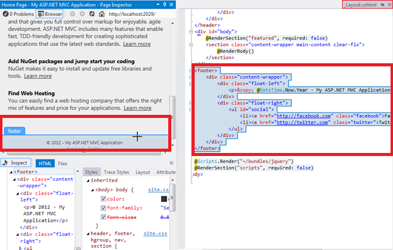
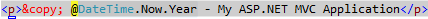
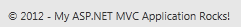
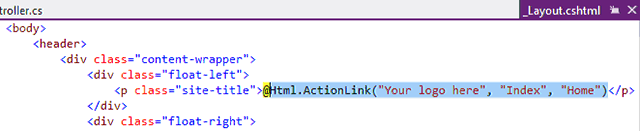
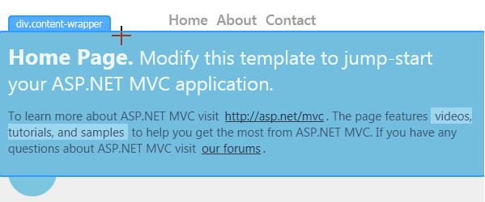
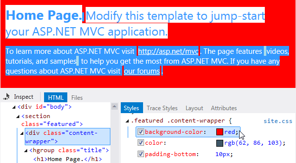
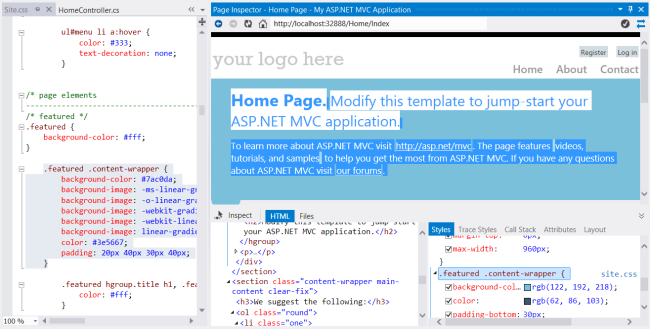
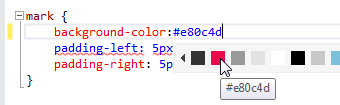
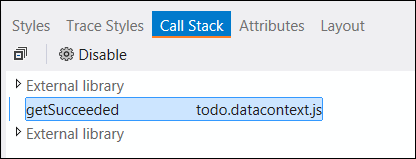
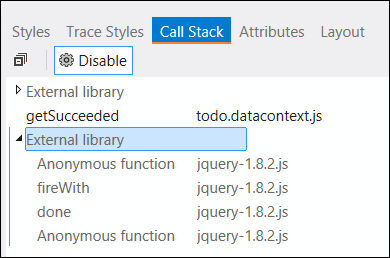

Using Page Inspector in ASP.NET MVC
====================
by Tim Ammann

> Page Inspector in Visual Studio 2012 is a web development tool with an integrated browser. Select any element in the integrated browser, and Page Inspector instantly highlights the element's source and CSS. You can browse any MVC view, quickly find the sources of rendered markup, and use browser tools right within the Visual Studio environment.
> 
> [Watch the Video](../../videos/mvc-4/using-page-inspector-in-aspnet-mvc.md)
> 
> This tutorial shows how to enable Inspection Mode, and then quickly locate and edit markup and CSS within your web project. The tutorial uses an MVC Project, but you can also use Page Inspector for [Web Forms](https://go.microsoft.com/?linkid=9802001) and other ASP.NET applications.
> 
> The tutorial has the following sections:
> 
> - [Prerequisites](#_1_prerequisites)
> - [Create a Web Application](#_2_creating_a)
> - [Use Page Inspector to Browse to a View](#_3_using_page)
> - [Enable Inspection Mode](#_4_inspection_mode)
> - [Use Page Inspector to Make Changes to Markup](#_5_using_page)
> - [Inspection Mode and the HTML Window](#_6_inspection_mode)
> - [Preview CSS Changes in the Styles window](#_7_previewing_css)
> - [CSS Auto Sync](#css_auto_sync)
> - [Using the CSS Color Picker](#css_color_picker)
> - [Mapping Dynamic Page Elements to JavaScript](#map_dynamic_elements)

## Prerequisites

- [Visual Studio 2012](https://www.microsoft.com/visualstudio/11/en-us) or [Visual Studio Express 2012 for Web](https://www.microsoft.com/visualstudio/11/en-us/downloads#express-web).

> [!NOTE]
> To get the latest version of Page Inspector, use [Web Platform Installer](https://go.microsoft.com/fwlink/?LinkId=255386) to install the Windows Azure SDK for .NET 2.0.

Page Inspector is bundled with Microsoft Web Developer Tools. The latest version is 1.3. To check which version you have, run Visual Studio and select **About Microsoft Visual Studio** from the **Help** menu.

## Create a Web Application

First, create a web application that you will use Page Inspector with. In Visual Studio, choose **File** &gt; **New Project**. On the left, expand **Visual C#**, select **Web**, and then select **ASP.NET MVC4 Web Application**.

Click **OK**.

In the **New ASP.NET MVC 4 Project** dialog box, select **Internet Application**. Leave **Razor** as the default view engine.

The application opens in **Source** view.

Now that you have an application to work with, you can use Page Inspector to examine and modify it.

## Use Page Inspector to Browse to a View

In Visual Studio 2012, you can right-click any view in your project, select **View in Page Inspector**, and Page Inspector will figure out the route and display the page.

In **Solution Explorer**, expand the **Views** folder and then the **Home** folder. Right click the Index.cshtml file and choose **View in Page Inspector**.

By default, Page Inspector is docked as a window on the left side of the Visual Studio environment. If you prefer, you can dock it elsewhere, or undock the window. See [How to: Arrange and Dock Windows](https://msdn.microsoft.com/en-us/library/z4y0hsax.aspx).

The top pane of the Page Inspector window shows the current page in a browser window. The bottom pane shows the page in HTML markup, along with some tabs that let you inspect different aspects of the page. The bottom pane is similar to the [F12 Developer Tools](https://msdn.microsoft.com/en-us/ie/aa740478) in Internet Explorer.

In this tutorial, you will use the **HTML** and **Styles** tabs to navigate quickly and make changes to the application.

## EnableInspection Mode

To put Page Inspector into Inspection Mode, click the **Inspect** button. In Inspection Mode, when you hold the mouse pointer over any part of the rendered page, the corresponding source markup or code is highlighted.

Now move your mouse over different parts of the page within Page Inspector. As you do, the mouse pointer changes to a large plus sign, and the element underneath is highlighted:

As you move the mouse pointer, Visual Studio highlights the corresponding Razor syntax in the source file. If the HTML element comes from another source file, Visual Studio automatically opens the file.

In Page Inspector, the **HTML** tab shows the HTML that was generated from the Razor syntax. As you move the mouse pointer, the HTML elements are highlighted. The **Styles** tab shows the CSS rules for the element.

## Use Page Inspector to Make Changes to Markup

Page Inspector lets you find markup whose location might not be obvious. Then you can modify the markup and see the resulting changes.

To see this, click **Inspect** and then scroll to the bottom of the page in the Page Inspector window.

When you move the mouse pointer into the footer area, Page Inspector opens the \_Layout.cshtml file and highlights the section of the layout page that you have selected. As you can see, the footer are is defined in the layout file, and not the view itself.

Now move your mouse pointer over the line with the copyright notice. In the \_Layout.cshtml page, the corresponding line is highlighted.

Add some text to the end of the line in the \_Layout.cshtml file.

&lt;p&gt;&amp;copy; @DateTime.Now.Year - My ASP.NET MVC Application Rocks!&lt;/p&gt;

Now, press Ctrl+Alt+Enter or click the Update Bar to see the results in the Page Inspector browser window.

You might have thought that the footer defined in Index.cshtml, but it turned out to be in the \_Layout.cshtml, and Page Inspector found it for you.

## Inspection Mode and the HTML Window

Next, you will have a quick look at the HTML window and how it maps elements for you.

Click **Inspect** to put Page Inspector in Inspection Mode.

Click the top part of the page that says "Your logohere". You are examining a particular element in more detail, so the display in the browser window no longer changes as you move the mouse pointer.

Now move the mouse pointer to the **HTML** window. As you move the mouse pointer, Page Inspector outlines the element within the **HTML** window and highlights the corresponding element in the browser window.

As before, Page Inspector opens the \_Layout.cshtml file for you in a temporary tab. Click the \_Layout.cshtml temporary tab, and the corresponding markup will be highlighted in the &lt;header&gt; section for you:

## Preview CSS Changes in the Styles Window

Next, you will use the Page Inspector **Styles** window to preview changes to CSS.

Click **Inspect** to put Page Inspector in Inspection Mode.

In the Page Inspector browser window, move the mouse pointer over the "Home Page" section until the **div.content-wrapper** label appears.

Click within the div.content-wrapper section once, and then move the mouse pointer to the **Styles** window. The **Syles** window shows all of the CSS rules for this element. Scroll down to find the .featured .content-wrapper class selector. Now clear the checkbox for the background-color property.

Notice how the change previews instantly in the Page Inspector browser window.

Select the checkbox again, then double-click the property value and change it to red. The change shows immediately:

The **Styles** window makes it easy to test and preview CSS changes before you commit the changes to the style sheet itself.

## CSS Auto Sync

> [!NOTE]
> This feature requires version 1.3 of Page Inspector.

The CSS Auto-Sync feature allows you to edit a CSS file directly, and see the changes immediately in the Page Inspector browser.

Click **Inspect** to put Page Inspector in Inspection Mode.

In the Page Inspector browser, move the mouse pointer over the "Home Page" section until the **div.content-wrapper** label appears. Click once to select this element.

The **Syles** window shows all of the CSS rules for this element. Scroll down to find the .featured .content-wrapper class selector. Click on ".featured .content-wrapper". Page Inspector opens the CSS file that defines this style (Site.css) and highlights the corresponding CSS style.

Now change the value for `background-color` to "red". The change appears immediately in the Page Inspector browser.

## Using the CSS Color Picker

The CSS editor in Visual Studio 2012 has a color picker that makes it easy to choose and insert colors. The color picker includes a standard palette of colors, supports standard color names, hash codes, RGB, RGBA, HSL, and HSLA colors, and maintains a list of the colors you've used most recently in the document.

In the previous section, you changed the value of the `background-color` property. To invoke the color picker, place the insertion point after the property name and type **#** or **rgb(**.

Click on a color to select it, or press the down arrow key and then use the left and right arrow keys to traverse the colors. When you visit a color, the corresponding hex value is previewed:

If the color bar doesn't have the exact color you want, you can use the color picker pop-down. To open it, click the double chevron at the right end of the color bar, or press the Down Arrow once or twice on the keyboard.

Click a color from the vertical bar on the right. This shows a gradient for that color in the main window. Choose a color directly from the vertical bar by pressing Enter, or click any point in the main window to choose with greater precision.

If there is a color on your computer screen that you want to use (it doesn't have to be inside the Visual Studio user interface), you can capture its value by using the eyedropper tool on the lower right.

You also can change the opacity of a color by moving the slider at the bottom of the color picker. Doing so changes color values to RGBA values, because the RGBA format can represent opacity.

After you have chosen a color, press Enter, and then type a semicolon to complete the background-color entry in the *Site.css* file.

### The Page Inspector Update Bar

Page Inspector immediately detects the change to the *Site.css* file and displays an alert in an update bar.

To save all your files and refresh the Page Inspector browser, press Ctrl+Alt+Enter or click the update bar. The change in the highlight color appears in the browser.

## Mapping Dynamic Page Elements to JavaScript

In modern web applications, elements in the page are often generated dynamically with JavaScript. That means there is no static markup (either HTML or Razor) that corresponds to these page elements.

With version 1.3, Page Inspector can now map items that were dynamically added to the page back to the corresponding JavaScript code. To demonstrate this feature, we'll use the [Single Page Application (SPA) template](../../../single-page-application/overview/introduction/knockoutjs-template.md).

> [!NOTE]
> The SPA template requires the [ASP.NET and Web Tools 2012.2](https://go.microsoft.com/fwlink/?LinkId=282650) update.

In Visual Studio, choose **File** &gt; **New Project**. On the left, expand **Visual C#**, select **Web**, and then select **ASP.NET MVC4 Web Application**. Click **OK**.

In the **New ASP.NET MVC 4 Project** dialog, select **Single Page Application**.

In Solution Explorer, expand the **Views** folder and then the **Home** folder. Right click the Index.cshtml file and choose **View in Page Inspector**.

The first thing that is displayed in the Page Inspector browser is a login page. Click "Sign Up" and create a user name and password. Once you sign up, the application logs you in and creates a to-do list with some sample items.

Click **Inspect** to put Page Inspector in Inspection Mode. In the Page Inspector browser, click on one of the to-do items. Notice that instead of being highlighted in blue, the element is highlighted in orange, with "JS" next to the element name. This indicates that the element was created dynamically through script.

In addition, an orange underline appears on the **Call Stack** tab. This indicates that the **Call Stack** pane has more information about the element.

Click on the **Call Stack** tab. The **Call Stack** pane shows the call stack for the JavaScript call that created the element. Calls to external libraries such as jQuery are collapsed, so that you can easily see the calls to your application script.

To see the full stack, including calls to external libraries, you can expand the nodes labeled "External Libraries":

If you click an item in the call stack, Visual Studio opens the code file and highlights the corresponding script.

## See Also

[Intro to ASP.NET MVC 4 with Visual Studio](../older-versions/getting-started-with-aspnet-mvc4/intro-to-aspnet-mvc-4.md) (ASP.net website)

[Introducing Page Inspector](https://channel9.msdn.com/posts/visual-studio-vnext-introducing-page-inspector/) (Channel 9 video)

[Page Inspector Error Messages](https://go.microsoft.com/?linkid=9813062) (MSDN)