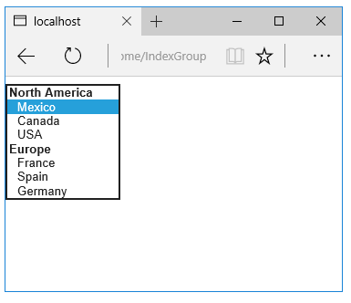

Working with Forms 
====================

By `Rick Anderson`_, `Dave Paquette <https://twitter.com/Dave_Paquette>`_ and `Jerrie Pelser <https://twitter.com/jerriepelser>`__

This document demonstrates working with Forms and the HTML elements commonly used on a Form. The HTML `Form <https://www.w3.org/TR/html401/interact/forms.html>`__ element provides the primary mechanism web apps use to post back data to the server. Most of this document describes :doc:`Tag Helpers <tag-helpers/intro>` and how they can help you productively create robust HTML forms. We recommend you read :doc:`tag-helpers/intro` before you read this document. 

In many cases, :doc:`HTML Helpers </mvc/views/html-helpers>` provide an alternative approach to a specific Tag Helper, but it's important to recognize that Tag Helpers do not replace HTML Helpers and there is not a Tag Helper for each HTML Helper. When an HTML Helper alternative exists, it is mentioned.

.. contents:: Sections:
  :local:
  :depth: 1

.. _my-asp-route-param-ref-label:

The Form Tag Helper
---------------------
  
The `Form <https://www.w3.org/TR/html401/interact/forms.html>`__ Tag Helper:

- Generates the HTML `<FORM> <https://www.w3.org/TR/html401/interact/forms.html>`__ ``action`` attribute value for a MVC controller action or named route
- Generates a hidden `Request Verification Token <http://www.asp.net/mvc/overview/security/xsrfcsrf-prevention-in-aspnet-mvc-and-web-pages>`__ to prevent cross-site request forgery (when used with the ``[ValidateAntiForgeryToken]`` attribute in the HTTP Post action method)
- Provides the ``asp-route-<Parameter Name>`` attribute, where ``<Parameter Name>`` is added to the route values. The  ``routeValues`` parameters to ``Html.BeginForm`` and ``Html.BeginRouteForm`` provide similar functionality.  
- Has an HTML Helper alternative ``Html.BeginForm`` and ``Html.BeginRouteForm``

Sample:

.. literalinclude::   forms/sample/final/Views/Demo/RegisterFormOnly.cshtml
  :language: HTML

The Form Tag Helper above generates the following HTML:
 
.. code-block:: HTML

  <form method="post" action="/Demo/Register">
    <!-- Input and Submit elements -->
    <input name="__RequestVerificationToken" type="hidden" value="<removed for brevity>" />
   </form>
  
The MVC runtime generates the ``action`` attribute value from the Form Tag Helper attributes ``asp-controller`` and ``asp-action``. The Form Tag Helper also generates a hidden `Request Verification Token <http://www.asp.net/mvc/overview/security/xsrfcsrf-prevention-in-aspnet-mvc-and-web-pages>`__ to prevent cross-site request forgery (when used with the ``[ValidateAntiForgeryToken]`` attribute in the HTTP Post action method). Protecting a pure HTML Form from cross-site request forgery is very difficult, the Form Tag Helper provides this service for you.

Using a named route
^^^^^^^^^^^^^^^^^^^

The ``asp-route`` Tag Helper attribute can also generate markup for the HTML ``action`` attribute. An app with a :doc:`route </fundamentals/routing>`  named ``register`` could use the following markup for the registration page:
 
.. literalinclude::  forms/sample/final/Views/Demo/RegisterRoute.cshtml 
  :language: HTML
  :emphasize-lines: 4

Many of the views in the *Views/Account* folder (generated when you create a new web app with *Individual User Accounts*) contain the `asp-route-returnurl <http://docs.asp.net/en/latest/mvc/views/working-with-forms.html#the-form-tag-helper>`__ attribute: 

.. code-block:: HTML
  :emphasize-lines: 2
  
  <form asp-controller="Account" asp-action="Login" 
    asp-route-returnurl="@ViewData["ReturnUrl"]" 
    method="post" class="form-horizontal" role="form">

:Note: With the built in templates, ``returnUrl`` is only populated automatically when you try to access an authorized resource but are not authenticated or authorized. When you attempt an unauthorized access, the security middleware redirects you to the login page with the ``returnUrl`` set.

The Input Tag Helper
---------------------
 
The Input Tag Helper binds an HTML `<input> <https://www.w3.org/wiki/HTML/Elements/input>`__ element to a model expression in your razor view.

Syntax:

.. code-block:: HTML

  <input asp-for="<Expression Name>" /> 

The Input Tag Helper:

- Generates the ``id`` and ``name`` HTML attributes for the expression name specified in the ``asp-for`` attribute.  ``asp-for="Property1.Property2"`` is equivalent to ``m => m.Property1.Property2``, that is the attribute value literally is part of an expression. The name of the expression is what's used for the ``asp-for`` attribute value.
- Sets the HTML ``type`` attribute value based on the model type and  `data annotation <https://msdn.microsoft.com/en-us/library/system.componentmodel.dataannotations.aspx>`__ attributes applied to the model property
- Will not overwrite the HTML ``type`` attribute value when one is specified 
- Generates `HTML5 <https://developer.mozilla.org/en-US/docs/Web/Guide/HTML/HTML5>`__  validation attributes from `data annotation <https://msdn.microsoft.com/en-us/library/system.componentmodel.dataannotations.aspx>`__ attributes applied to model properties
- Has an HTML Helper feature overlap with ``Html.TextBoxFor`` and ``Html.EditorFor``. See the **HTML Helper alternatives to Input Tag Helper** section for details.
- Provides strong typing. If the name of the property changes and you don't update the Tag Helper you'll get an error similar to the following:

.. code-block:: HTML

     An error occurred during the compilation of a resource required to process
     this request. Please review the following specific error details and modify
     your source code appropriately.
    
     Type expected
      'RegisterViewModel' does not contain a definition for 'Email' and no
      extension method 'Email' accepting a first argument of type 'RegisterViewModel'
      could be found (are you missing a using directive or an assembly reference?)

The ``Input`` Tag Helper sets the HTML ``type`` attribute based on the .NET type. The following table lists some common .NET types and generated HTML type (not every .NET type is listed). 

+---------------------+--------------------+
|.NET type            |  Input Type        |  
+=====================+====================+
|Bool                 |  type="checkbox"   |
+---------------------+--------------------+  
|String               |  type="text"       |
+---------------------+--------------------+  
|DateTime             |  type="datetime"   |
+---------------------+--------------------+  
|Byte                 |  type="number"     |
+---------------------+--------------------+  
|Int                  |  type="number"     |
+---------------------+--------------------+  
|Single, Double       |  type="number"     |
+---------------------+--------------------+  

The following table shows some common `data annotations <https://msdn.microsoft.com/en-us/library/system.componentmodel.dataannotations.aspx>`__ attributes that the input tag helper will map to specific input types (not every validation attribute is listed):

+-------------------------------+--------------------+
|Attribute                      |  Input Type        |  
+===============================+====================+
|[EmailAddress]                 |  type="email"      |
+-------------------------------+--------------------+  
|[Url]                          |  type="url"        |
+-------------------------------+--------------------+  
|[HiddenInput]                  |  type="hidden"     |
+-------------------------------+--------------------+  
|[Phone]                        |  type="tel"        |
+-------------------------------+--------------------+   
|[DataType(DataType.Password)]  |  type="password"   |
+-------------------------------+--------------------+  
|[DataType(DataType.Date)]      |  type="date"       |
+-------------------------------+--------------------+  
|[DataType(DataType.Time)]      |  type="time"       |
+-------------------------------+--------------------+  
 
Sample: 
 
.. literalinclude::  forms/sample/final/ViewModels/RegisterViewModel.cs
  :language: c#

.. literalinclude::  forms/sample/final/Views/Demo/RegisterInput.cshtml
  :language: HTML

The code above generates the following HTML:

.. code-block:: HTML

    <form method="post" action="/Demo/RegisterInput">
      Email:  
      <input type="email" data-val="true" 
             data-val-email="The Email Address field is not a valid e-mail address." 
             data-val-required="The Email Address field is required." 
             id="Email" name="Email" value="" />  
      Password: 
      <input type="password" data-val="true" 
             data-val-required="The Password field is required." 
             id="Password" name="Password" /> 
      <button type="submit">Register</button>
    <input name="__RequestVerificationToken" type="hidden" value="<removed for brevity>" />
  </form>

The data annotations applied to the ``Email`` and ``Password`` properties generate metadata on the model. The Input Tag Helper consumes the model metadata and produces `HTML5 <https://developer.mozilla.org/en-US/docs/Web/Guide/HTML/HTML5>`__ ``data-val-*`` attributes (see :doc:`/mvc/models/validation`). These attributes describe the validators to attach to the input fields. This provides unobtrusive HTML5 and `jQuery <https://jquery.com/>`__ validation. The unobtrusive attributes have the format ``data-val-rule="Error Message"``, where rule is the name of the validation rule (such as ``data-val-required``, ``data-val-email``, ``data-val-maxlength``, etc.) If an error message is provided in the attribute, it is displayed as the value for the ``data-val-rule`` attribute. There are also attributes of the form ``data-val-ruleName-argumentName="argumentValue"`` that provide additional details about the rule, for example, ``data-val-maxlength-max="1024"`` .  

HTML Helper alternatives to Input Tag Helper
^^^^^^^^^^^^^^^^^^^^^^^^^^^^^^^^^^^^^^^^^^^^^

``Html.TextBox``, ``Html.TextBoxFor``, ``Html.Editor`` and ``Html.EditorFor`` have overlapping features with the Input Tag Helper. The Input Tag Helper will automatically set the ``type`` attribute; ``Html.TextBox`` and ``Html.TextBoxFor`` will not. ``Html.Editor`` and ``Html.EditorFor`` handle collections, complex objects and templates; the Input Tag Helper does not. The Input Tag Helper, ``Html.EditorFor``  and  ``Html.TextBoxFor`` are strongly typed (they use lambda expressions); ``Html.TextBox`` and ``Html.Editor`` are not (they use expression names).

Expression names 
^^^^^^^^^^^^^^^^^^^^^^^^^^^^^^^^^^

The ``asp-for`` attribute value is a `ModelExpression <https://docs.asp.net/projects/api/en/latest/autoapi/Microsoft/AspNet/Mvc/Rendering/ModelExpression/index.html>`__ and the right hand side of a lambda expression. Therefore, ``asp-for="Property1"`` becomes ``m => m.Property1`` in the generated code which is why you don't need to prefix with ``Model``. You can use the "@" character to start an inline expression and move before the ``m.``:

.. code-block:: HTML

  @{
      var joe = "Joe";
  }
  <input asp-for="@joe" />

Generates the following:

.. code-block:: HTML
  
    <input type="text" id="joe" name="joe" value="Joe" />

Navigating child properties 
^^^^^^^^^^^^^^^^^^^^^^^^^^^^

You can also navigate to child properties using the property path of the view model. Consider a more complex model class that contains a child ``Address`` property.

.. literalinclude::  forms/sample/final/ViewModels/AddressViewModel.cs
  :language: c#
  :lines: 5-8
  :dedent: 3
  :emphasize-lines: 1-

.. literalinclude::  forms/sample/final/ViewModels/RegisterAddressViewModel.cs
  :language: c#
  :lines: 5-14
  :dedent: 3
  :emphasize-lines: 8

In the view, we bind to ``Address.AddressLine1``: 

.. literalinclude::  forms/sample/final/Views/Demo/RegisterAddress.cshtml 
  :language: HTML
  :emphasize-lines: 6

The following HTML is generated for ``Address.AddressLine1``:

.. code-block:: HTML

  <input type="text" id="Address_AddressLine1" name="Address.AddressLine1" value="" />
  
Expression names and Collections
^^^^^^^^^^^^^^^^^^^^^^^^^^^^^^^^^^

Sample, a model containing an array of ``Colors``:

.. literalinclude::  forms/sample/final/ViewModels/Person.cs
  :language: c#
  :lines: 5-10
  :dedent: 3
  :emphasize-lines: 3

The action method:

.. code-block:: c#

    public IActionResult Edit(int id, int colorIndex)
    {
        ViewData["Index"] = colorIndex;        
        return View(GetPerson(id));
    }

The following Razor shows how you access a specific ``Color`` element:

.. literalinclude::   forms/sample/final/Views/Demo/EditColor.cshtml 
  :language: HTML

The *Views/Shared/EditorTemplates/String.cshtml* template:

.. literalinclude::   forms/sample/final/Views/Shared/EditorTemplates/String.cshtml 
  :language: HTML
  
Sample using ``List<T>``:

.. literalinclude::  forms/sample/final/ViewModels/ToDoItem.cs
  :language: c#
  :lines: 3-7
  :dedent: 3

The following Razor shows how to iterate over a collection:

.. literalinclude::   forms/sample/final/Views/Demo/Edit.cshtml 
  :language: HTML

The *Views/Shared/EditorTemplates/ToDoItem.cshtml* template:

.. literalinclude::   forms/sample/final/Views/Shared/EditorTemplates/ToDoItem.cshtml 
  :language: HTML
  
:Note: Always use ``for`` (and *not* ``foreach``) to iterate over a list. Evaluating an indexer in a LINQ expression can be expensive and should be minimized.
:Note: The commented sample code above shows how you would replace the lambda expression with the ``@`` operator to access each ``ToDoItem`` in the list.

  
The Textarea Tag Helper
-------------------------

The `Textarea Tag Helper <https://docs.asp.net/projects/api/en/latest/autoapi/Microsoft/AspNet/Mvc/TagHelpers/TextAreaTagHelper/index.html>`__ tag helper is  similar to the Input Tag Helper.  

- Generates the ``id`` and ``name`` attributes, and the data validation attributes from the model for a `<textarea> <http://www.w3.org/wiki/HTML/Elements/textarea>`__ element. 
- Provides strong typing. 
- HTML Helper alternative: ``Html.TextAreaFor``

Sample:

.. literalinclude::  forms/sample/final/ViewModels/DescriptionViewModel.cs
  :language: c#

..  literalinclude::  forms/sample/final/Views/Demo/RegisterTextArea.cshtml
  :language: HTML
  :emphasize-lines: 4
  
The following HTML is generated:

.. code-block:: HTML  
  :emphasize-lines: 2-8

  <form method="post" action="/Demo/RegisterTextArea">
    <textarea data-val="true" 
     data-val-maxlength="The field Description must be a string or array type with a maximum length of &#x27;1024&#x27;."
     data-val-maxlength-max="1024" 
     data-val-minlength="The field Description must be a string or array type with a minimum length of &#x27;5&#x27;." 
     data-val-minlength-min="5" 
     id="Description" name="Description">
    </textarea>
    <button type="submit">Test</button>
    <input name="__RequestVerificationToken" type="hidden" value="<removed for brevity>" />
  </form>

The Label Tag Helper
--------------------

- Generates the label caption and ``for`` attribute on a `<label> <https://www.w3.org/wiki/HTML/Elements/label>`__ element for an expression name
- HTML Helper alternative: ``Html.LabelFor``.

The `Label Tag Helper <https://docs.asp.net/projects/api/en/latest/autoapi/Microsoft/AspNet/Mvc/TagHelpers/LabelTagHelper/index.html>`__  provides the following benefits over a pure HTML label element:

- You automatically get the descriptive label value from the ``Display`` attribute. The intended display name might change over time, and the combination of ``Display`` attribute and Label Tag Helper will apply the ``Display`` everywhere it's used.
- Less markup in source code
- Strong typing with the model property.

Sample:

.. literalinclude::  forms/sample/final/ViewModels/SimpleViewModel.cs
  :language: c#

..  literalinclude::  forms/sample/final/Views/Demo/RegisterLabel.cshtml
  :language: HTML
  :emphasize-lines: 4

The following HTML is generated for the ``<label>`` element:

.. code-block:: HTML

 <label for="Email">Email Address</label>  
 
The Label Tag Helper generated the ``for`` attribute value of "Email", which is the ID associated with the ``<input>`` element. The Tag Helpers generate consistent ``id`` and ``for`` elements so they can be correctly associated. The caption in this sample comes from the ``Display`` attribute. If the model didn't contain a ``Display`` attribute, the caption would be the property name of the expression.
 
The Validation Tag Helpers
---------------------------

There are two Validation Tag Helpers. The `Validation Message Tag Helper <https://docs.asp.net/projects/api/en/latest/autoapi/Microsoft/AspNet/Mvc/TagHelpers/ValidationMessageTagHelper/index.html>`__ (which displays a validation message for a single property on your model), and the `Validation Summary Tag Helper <https://docs.asp.net/projects/api/en/latest/autoapi/Microsoft/AspNet/Mvc/TagHelpers/ValidationSummaryTagHelper/index.html>`__ (which displays a summary of validation errors). The `Input Tag Helper <https://docs.asp.net/projects/api/en/latest/autoapi/Microsoft/AspNet/Mvc/TagHelpers/InputTagHelper/index.html>`__ adds HTML5 client side validation attributes to input elements based on data annotation attributes on your model classes. Validation is also performed on the server. The Validation Tag Helper displays these error messages when a validation error occurs. 

The Validation Message Tag Helper
^^^^^^^^^^^^^^^^^^^^^^^^^^^^^^^^^^^^

- Adds the `HTML5 <https://developer.mozilla.org/en-US/docs/Web/Guide/HTML/HTML5>`__  ``data-valmsg-for="property"`` attribute to the `span <https://developer.mozilla.org/en-US/docs/Web/HTML/Element/span>`__ element, which attaches the validation error messages on the input field of the specified model property. When a client side validation error occurs, `jQuery <https://jquery.com/>`__ displays the error message in the ```` element. 
- Validation also takes place on the server. Clients may have JavaScript disabled and some validation can only be done on the server side.
- HTML Helper alternative: ``Html.ValidationMessageFor``

The `Validation Message Tag Helper <https://docs.asp.net/projects/api/en/latest/autoapi/Microsoft/AspNet/Mvc/TagHelpers/ValidationMessageTagHelper/index.html>`__  is used with the ``asp-validation-for`` attribute on a HTML `span <https://developer.mozilla.org/en-US/docs/Web/HTML/Element/span>`__ element.

.. code-block:: HTML
  
  
  
The Validation Message Tag Helper will generate the following HTML:

.. code-block:: HTML

    

You generally use the `Validation Message Tag Helper <https://docs.asp.net/projects/api/en/latest/autoapi/Microsoft/AspNet/Mvc/TagHelpers/ValidationMessageTagHelper/index.html>`__  after an ``Input`` Tag Helper for the same property. Doing so displays any validation error messages near the input that caused the error.

:Note: You must have a view with the correct JavaScript and `jQuery <https://jquery.com/>`__ 
 script references in place for client side validation. See :doc:`/mvc/models/validation` for more information.
 
When a server side validation error occurs (for example when you have custom server side validation or client-side validation is disabled), MVC places that error message as the body of the ```` element.

.. code-block:: HTML

   
      The Email Address field is required.
   
 
The Validation Summary Tag Helper
^^^^^^^^^^^^^^^^^^^^^^^^^^^^^^^^^^^^

- Targets ``
`` elements with the ``asp-validation-summary`` attribute 
- HTML Helper alternative: ``@Html.ValidationSummary``

The `Validation Summary Tag Helper <https://docs.asp.net/projects/api/en/latest/autoapi/Microsoft/AspNet/Mvc/TagHelpers/ValidationSummaryTagHelper/index.html>`__  is used to display a summary of validation messages. The ``asp-validation-summary`` attribute value can be any of the following:

+-------------------------------+--------------------------------+
|asp-validation-summary         |  Validation messages displayed |  
+===============================+================================+
|ValidationSummary.All          | Property and model level       |
+-------------------------------+--------------------------------+  
|ValidationSummary.ModelOnly    | Model                          |
+-------------------------------+--------------------------------+  
|ValidationSummary.None         | None                           |
+-------------------------------+--------------------------------+  

Sample
^^^^^^^^^

In the following example, the data model is decorated with ``DataAnnotation`` attributes, which generates validation error messages on the ``<input>`` element.  When a validation error occurs, the Validation Tag Helper displays the error message:

.. literalinclude::  forms/sample/final/ViewModels/RegisterViewModel.cs
  :language: c#

..  literalinclude::  forms/sample/final/Views/Demo/RegisterValidation.cshtml
  :language: HTML
  :emphasize-lines: 4,6,8
  :lines: 1-10

The generated HTML (when the model is valid):

.. code-block:: HTML
  :emphasize-lines: 2,3,8,9,12,13
  
  <form action="/DemoReg/Register" method="post">
    

    <ul><li style="display:none"></li></ul>

    Email:  <input name="Email" id="Email" type="email" value="" 
     data-val-required="The Email field is required." 
     data-val-email="The Email field is not a valid e-mail address." 
     data-val="true">  
     
    Password: <input name="Password" id="Password" type="password" 
     data-val-required="The Password field is required." data-val="true"> 
     
    <button type="submit">Register</button>
    <input name="__RequestVerificationToken" type="hidden" value="<removed for brevity>" />
  </form>

The Select Tag Helper
-------------------------

- Generates `select <https://www.w3.org/wiki/HTML/Elements/select>`__ and associated `option <https://www.w3.org/wiki/HTML/Elements/option>`__ elements for properties of your model. 
- Has an HTML Helper alternative ``Html.DropDownListFor`` and ``Html.ListBoxFor``

The `Select Tag Helper <https://docs.asp.net/projects/api/en/latest/autoapi/Microsoft/AspNet/Mvc/TagHelpers/SelectTagHelper/index.html>`__ ``asp-for`` specifies the model property  name for the `select <https://www.w3.org/wiki/HTML/Elements/select>`__ element  and ``asp-items`` specifies the `option <https://www.w3.org/wiki/HTML/Elements/option>`__ elements.  For example:

.. literalinclude::   forms/sample/final/Views/Home/Index.cshtml
  :language: HTML
  :lines: 4
  :dedent: 3
  
Sample:

.. literalinclude::  forms/sample/final/ViewModels/CountryViewModel.cs
  :language: c#
  
The ``Index`` method initializes the ``CountryViewModel``, sets the selected country and passes it to the ``Index`` view.

.. literalinclude:: forms/sample/final/Controllers/HomeController.cs
  :language: c#
  :lines: 8-13
  :dedent: 6

The HTTP POST ``Index`` method displays the selection:

.. literalinclude::  forms/sample/final/Controllers/HomeController.cs
  :language: c#
  :lines: 15-27
  :dedent: 6
  
The ``Index`` view:

.. literalinclude:: forms/sample/final/Views/Home/Index.cshtml
  :language: HTML
  :emphasize-lines: 4
  
Which generates the following HTML (with "CA" selected):

.. code-block:: HTML  
  :emphasize-lines: 2-6 

  <form method="post" action="/">
    <select id="Country" name="Country">
      <option value="MX">Mexico</option>
      <option selected="selected" value="CA">Canada</option>
      <option value="US">USA</option>
    </select> 
       <button type="submit">Register</button>
    <input name="__RequestVerificationToken" type="hidden" value="<removed for brevity>" />
  </form>

:Note: We do not recommend using ``ViewBag`` or ``ViewData`` with the Select Tag Helper. A view model is more robust at providing MVC metadata and generally less problematic. 

The ``asp-for`` attribute value is a special case and doesn't require a ``Model`` prefix, the other Tag Helper attributes do (such as ``asp-items``)

.. literalinclude::   forms/sample/final/Views/Home/Index.cshtml
  :language: HTML
  :lines: 4
  :dedent: 3  
 
Enum binding
^^^^^^^^^^^^^^

It's often convenient to use ``<select>`` with an ``enum`` property and generate the `SelectListItem <https://docs.asp.net/projects/api/en/latest/autoapi/Microsoft/AspNet/Mvc/Rendering/SelectListItem/index.html?highlight=selectlistitem>`__ elements from the ``enum`` values. 

Sample:

.. literalinclude::  forms/sample/final/ViewModels/CountryEnumViewModel.cs
  :language: c#
  :lines: 3-6
  :dedent: 3
  
.. literalinclude::  forms/sample/final/ViewModels/CountryEnum.cs
  :language: c#
  :lines: 1-4,6,8-

The `GetEnumSelectList <https://docs.asp.net/projects/api/en/latest/autoapi/Microsoft/AspNet/Mvc/Rendering/IHtmlHelper/index.html>`__ method generates a `SelectList <https://docs.asp.net/projects/api/en/latest/autoapi/Microsoft/AspNet/Mvc/Rendering/SelectList/index.html>`__ object for an enum.

.. literalinclude::   forms/sample/final/Views/Home/IndexEnum.cshtml
  :language: HTML
  :emphasize-lines: 5

You can decorate your enumerator list with the ``Display`` attribute to get a richer UI:

.. literalinclude::  forms/sample/final/ViewModels/CountryEnum.cs
  :language: c#
  :emphasize-lines: 5,7

The following HTML is generated:

.. code-block:: HTML  
  :emphasize-lines: 4,5

    <form method="post" action="/Home/IndexEnum">
        <select data-val="true" data-val-required="The EnumCountry field is required." 
                id="EnumCountry" name="EnumCountry">
            <option value="0">United Mexican States</option>
            <option value="1">United States of America</option>
            <option value="2">Canada</option>
            <option value="3">France</option>
            <option value="4">Germany</option>
            <option selected="selected" value="5">Spain</option>
        </select>
         <button type="submit">Register</button>
        <input name="__RequestVerificationToken" type="hidden" value="<removed for brevity>" />
   </form>

Option Group
^^^^^^^^^^^^^^^^^^^^^

The HTML  `<optgroup> <https://www.w3.org/wiki/HTML/Elements/optgroup>`__ element is generated when the view model contains one or more `SelectListGroup  <https://docs.asp.net/projects/api/en/latest/autoapi/Microsoft/AspNet/Mvc/Rendering/SelectListGroup/index.html>`__ objects.

The ``CountryViewModelGroup`` groups the ``SelectListItem`` elements into the "North America" and "Europe" groups:

.. literalinclude::  forms/sample/final/ViewModels/CountryViewModelGroup.cs
  :language: c#
  :lines: 6-59
  :dedent: 3
  :emphasize-lines: 5-6,14,20,26,32,38,44

The two groups are shown below:

The generated HTML:

.. code-block:: HTML 
  :emphasize-lines: 3-12

    <form method="post" action="/Home/IndexGroup">
        <select id="Country" name="Country">
            <optgroup label="North America">
                <option value="MEX">Mexico</option>
                <option value="CAN">Canada</option>
                <option value="US">USA</option>
            </optgroup>
            <optgroup label="Europe">
                <option value="FR">France</option>
                <option value="ES">Spain</option>
                <option value="DE">Germany</option>
            </optgroup>
        </select>
         <button type="submit">Register</button>
        <input name="__RequestVerificationToken" type="hidden" value="<removed for brevity>" />
   </form>

Multiple select
^^^^^^^^^^^^^^^^^^^^^

The Select Tag Helper  will automatically generate the `multiple = "multiple" <https://www.w3.org/TR/html-markup/select.html#select.attrs.multiple>`__  attribute if the property specified in the ``asp-for`` attribute is an ``IEnumerable``. For example, given the following model:

.. literalinclude::  forms/sample/final/ViewModels/CountryViewModelIEnumerable.cs
  :language: c#
  :emphasize-lines: 6

With the following view:

.. literalinclude::   forms/sample/final/Views/Home/IndexMultiSelect.cshtml
  :language: HTML
  :emphasize-lines: 4
  
Generates the following HTML:

.. code-block:: HTML  
  :emphasize-lines: 3

  <form method="post" action="/Home/IndexMultiSelect">
      <select id="CountryCodes" 
      multiple="multiple" 
      name="CountryCodes"><option value="MX">Mexico</option>
  <option value="CA">Canada</option>
  <option value="US">USA</option>
  <option value="FR">France</option>
  <option value="ES">Spain</option>
  <option value="DE">Germany</option>
  </select> 
       <button type="submit">Register</button>
    <input name="__RequestVerificationToken" type="hidden" value="<removed for brevity>" />
  </form>

No selection
^^^^^^^^^^^^^^

To allow for no selection, add a "not specified" option to the select list. If the property is a `value type <https://msdn.microsoft.com/en-us/library/s1ax56ch.aspx>`__, you'll have to make it `nullable <https://msdn.microsoft.com/en-us/library/2cf62fcy.aspx>`__. 

.. literalinclude::   forms/sample/final/Views/Home/IndexEmpty.cshtml
  :language: HTML
  :emphasize-lines: 5

If you find yourself using the "not specified" option in multiple pages, you can create a template to eliminate repeating the HTML:

.. literalinclude::   forms/sample/final/Views/Home/IndexEmptyTemplate.cshtml
  :language: HTML
  :emphasize-lines: 5

The *Views/Shared/EditorTemplates/CountryViewModel.cshtml* template:

.. literalinclude::   forms/sample/final/Views/Shared/EditorTemplates/CountryViewModel.cshtml
  :language: HTML

Adding HTML `<option> <https://www.w3.org/wiki/HTML/Elements/option>`__ elements is not limited to the *No selection* case. For example, the following view and action method will generate HTML similar to the code above:

.. literalinclude:: forms/sample/final/Controllers/HomeController.cs
  :language: c#
  :lines: 114-119
  :dedent: 6

.. literalinclude::   forms/sample/final/Views/Home/IndexOption.cshtml
  :language: HTML
 
The correct ``<option>`` element will be selected ( contain the ``selected="selected"`` attribute) depending on the current ``Country`` value. 

.. code-block:: HTML 
  :emphasize-lines: 5

   <form method="post" action="/Home/IndexEmpty">
       <select id="Country" name="Country">
           <option value="">&lt;none&gt;</option>
           <option value="MX">Mexico</option>
           <option value="CA" selected="selected">Canada</option>
           <option value="US">USA</option>
       </select>
        <button type="submit">Register</button>
    <input name="__RequestVerificationToken" type="hidden" value="<removed for brevity>" />
  </form>

Additional Resources
---------------------

- :doc:`Tag Helpers <tag-helpers/intro>`
- `HTML Form element <https://www.w3.org/TR/html401/interact/forms.html>`__
- `Request Verification Token <http://www.asp.net/mvc/overview/security/xsrfcsrf-prevention-in-aspnet-mvc-and-web-pages>`__ 
- :doc:`/mvc/models/model-binding` 
- :doc:`/mvc/models/validation` 
- `data annotations <https://msdn.microsoft.com/en-us/library/system.componentmodel.dataannotations.aspx>`__ 
- `Code snippets for this document <https://github.com/aspnet/Docs/tree/master/aspnet/mvc/views/forms/sample>`_.