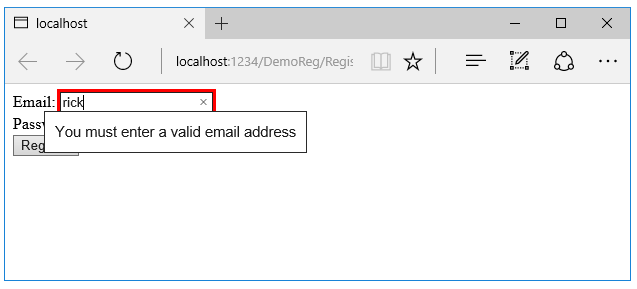
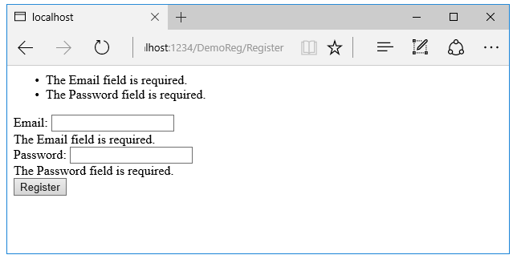
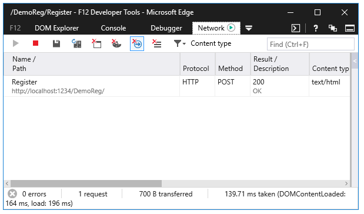
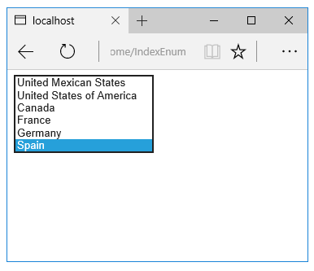

Working with Forms
============================

By `Rick Anderson`_, `Dave Paquette <https://twitter.com/Dave_Paquette>`_ and `Jerrie Pelser <https://twitter.com/jerriepelser>`__

This document will demonstrate working with Forms and the HTML elements commonly used on a Form. The HTML Form element provides the primary mechanism web apps use to postback data to the server. Most of this document describes :doc:`Tag Helpers <tag-helpers/intro>` and how they can help you productively create robust HTML forms. We recommend you read :doc:`tag-helpers/intro` before you read this document.

`View or download sample from GitHub <https://github.com/aspnet/Docs/tree/master/aspnet/mvc/views/forms/sample>`_.

.. contents:: Sections:
  :local:
  :depth: 1

The Form Tag Helper
---------------------
  
The `Form <https://www.w3.org/TR/html401/interact/forms.html>`__ Tag Helper generates the HTML ``action`` attribute value to a MVC controller action or named route. In the following code the ``action`` attribute value will be set to ``action="/DemoReg/Register"``.

.. literalinclude::   forms/sample/final/Views/DemoReg/RegisterFormOnly.cshtml
  :language: HTML
  :emphasize-lines: 4
  
The markup above is a simplified version of the *Views/Account/Login.cshtml* Razor view generated when you create a new ASP.NET 5 Web app with individual user accounts. The ``@addTagHelper`` line brings in :doc:`Tag Helpers <tag-helpers/intro>`, which are needed for the Form Tag Helper.  The ``RegisterViewModel`` contains the email address and password for registration.

.. literalinclude::  forms/sample/final/ViewModels/RegisterViewModelFirst.cs
  :language: c#
  :lines: 8-13
  :dedent: 3

`Download the starter app <https://github.com/aspnet/Docs/tree/master/aspnet/mvc/views/forms/sample>`__ to follow along.
  
#. Run the app and navigate to DemoReg/Register.
#. View the HTML source. ( In most browsers right click > **View Source**. )
  
.. code-block:: HTML

  <form method="post" action="/DemoReg/Register">
    Email:  <input id="Email" name="Email" />  
    Password: <input type="password" id="Password" name="Password" /> 
    <button type="submit">Log in</button>
    <input name="__RequestVerificationToken" type="hidden" value="<removed for brevity>" />
   </form>
   
The MVC runtime generated the ``action`` attribute value from the Form Tag Helper attributes ``asp-controller`` and ``asp-action``. The Form Tag Helper also generated the hidden `Request Verification Token <http://www.asp.net/mvc/overview/security/xsrfcsrf-prevention-in-aspnet-mvc-and-web-pages>`__ to prevent a cross-site request forgery. Protecting a pure HTML Form from cross-site request forgery is very difficult, the Form Tag Helper provides this service for you.

Using a named route
^^^^^^^^^^^^^^^^^^^^

The ``asp-route`` Tag Helper attribute can also generate markup for the HTML ``action`` attribute. An app with a :doc:`route </fundamentals/routing>`  named ``register`` could use the following markup for the registration page:
 
.. literalinclude::  forms/sample/final/Views/DemoReg/RegRoute.cshtml 
  :language: HTML
  :emphasize-lines: 4

The Input Tag Helper
---------------------
 
Add the ``DataType.Password`` attribute to the *RegisterViewModel.cs*.

.. literalinclude::  forms/sample/final/ViewModels/RegisterViewModelPW.cs
  :language: c#
  :lines: 4-15
  :emphasize-lines: 1,9

The input Tag Helper binds an HTML input element to a model property in your razor view. Replace the ``input`` elements in the *Register.cshtml* Razor view with the following markup: 

.. literalinclude::  forms/sample/final/Views/DemoReg/RegisterInput.cshtml
  :language: HTML
  :emphasize-lines: 5-6
  
The input Tag Helper applies data validation attributes on the model (such as ``DataType.Password``) and  generates the HTML ``type="password"`` attribute (so the password input is hidden).
  
Run the app and view the generated HTML:

.. code-block:: HTML

  <form method="post" action="/DemoReg/Register">
    Email:  <input type="text" id="Email" name="Email" value="" />  
    Password: <input type="password" id="Password" name="Password" /> 
    <button type="submit">Log in</button>
    <input name="__RequestVerificationToken" type="hidden" value="<removed for brevity>" />
  </form>
  
The ``Input`` Tag Helper generated the ``id`` and ``name`` HTML attributes for the model name specified in the ``asp-for`` attribute. For the ``Email`` property, the Tag Helper set the HTML ``type`` attribute to "text" based on the model type (string in this case). The ``DataType.Password`` `data annotation <https://msdn.microsoft.com/en-us/library/system.componentmodel.dataannotations.aspx>`__  was consumed by the input Tag Helper to generate ``type="password"``. 

The ``Input`` Tag Helper  will only generate the type attribute when one is not specified. The ``Input`` Tag Helper sets the HTML ``type`` attribute based on the .Net type:

+---------------------+--------------------+
|.NET type            |  Input Type        |  
+=====================+====================+
|Bool                 |  type="checkbox"   |
+---------------------+--------------------+  
|String               |  type="text"       |
+---------------------+--------------------+  
|DateTime             |  type="datetime"   |
+---------------------+--------------------+  
|Byte                 |  type="number"     |
+---------------------+--------------------+  
|Int                  |  type="number"     |
+---------------------+--------------------+  
|Single, Double       |  type="number"     |
+---------------------+--------------------+  

The following table shows `data annotations <https://msdn.microsoft.com/en-us/library/system.componentmodel.dataannotations.aspx>`__ attributes that the input tag helper will map to specific input types:

+-------------------------------+--------------------+
|Attribute                      |  Input Type        |  
+===============================+====================+
|[EmailAddress]                 |  type="email"      |
+-------------------------------+--------------------+  
|[Url]                          |  type="url"        |
+-------------------------------+--------------------+  
|[HiddenInput]                  |  type="hidden"     |
+-------------------------------+--------------------+  
|Phone]                         |  type="tel"        |
+-------------------------------+--------------------+   
|[DataType(DataType.Password)]  |  type="password"   |
+-------------------------------+--------------------+  
|[DataType(DataType.Date)]      |  type="date"       |
+-------------------------------+--------------------+  
|[DataType(DataType.Time)]      |  type="time"       |
+-------------------------------+--------------------+  

.. comment When you POST the Form, MVC :doc:`/mvc/models/model-binding` binds the ``Password`` and ``Email`` properties and values.

Add the following highlighted `DataAnnotations <https://msdn.microsoft.com/en-us/library/system.componentmodel.dataannotations.aspx>`__  to the *RegisterViewModel.cs*.

.. literalinclude::  forms/sample/final/ViewModels/RegisterViewModelFinal.cs
  :language: c#
  :lines: 8-17
  :dedent: 3
  :emphasize-lines: 3,7,8

Run the app and view the generated HTML:

.. code-block:: HTML

  <form method="post" action="/DemoReg/Register">
    Email:  <input type="email" data-val="true" 
             data-val-email="The Email field is not a valid e-mail address." 
             data-val-required="The Email field is required." 
             id="Email" name="Email" value="" />  
    Password: <input type="password" data-val="true" 
                data-val-required="The Password field is required." 
                id="Password" name="Password" /> 
    <button type="submit">Log in</button>
    <input name="__RequestVerificationToken" type="hidden" value="<removed for brevity>" />
  </form>

The data annotations applied to the ``Email`` and ``Password`` generated several `HTML5 <https://developer.mozilla.org/en-US/docs/Web/Guide/HTML/HTML5>`__ ``data-val-*`` attributes. (``data-val-`` specifies data validation.) These HTML5-compatible attributes describe the validators to attach to the input fields and provide unobtrusive HTML5 and `jQuery <https://jquery.com/>`__ validation. The unobtrusive attributes have the format ``data-val-rule="Error Message"``, where rule is the validation rule (such as required, email format, minimum string length, and maximum string length). If an error message is provided in the attribute, it is displayed as the value for the data-val-rule attribute. Although the HTML5 ``data-val-*`` attributes were originally targeted for jQuery validation, all the major browsers will generate client side errors without jQuery. For example, enter an invalid email address (such as "rick"), and when you tab out (or post the form, depending on the browser) you get an error message and the form will not be posted to the server. 

The browser validation is a start, but it's not robust or complete. For example, enter a valid email address and an empty password, then tap the **Register** button. The form data will be posted to the server, but because the ``ModelState`` is not valid, the HTTP POST Register method will send the data back to the Register view. We have not hooked up jQuery validation or provided any validation markup, so there is no error message to tell the client what has gone wrong. If you enter a valid email address and an empty password, the registration will fail but you won't get an error message indicating why. You see this by setting a break point in the ``HTTP POST Register`` method, and posting the form with an empty password. ``ModelState`` will be invalid, and action method will return the view with the posted model. The highlighted return line (when ``ModelState`` is not valid) returns the ``model`` posted to the server back to the ``HTTP GET Register`` method, so any data you entered will not be lost and will populate the form. This data round tripping eliminates re-entering correctly entered data.

.. literalinclude:: forms/sample/final/Controllers/DemoRegisterController.cs
  :language: c#
  :lines: 15-27
  :dedent: 6
  :emphasize-lines: 11-12

:doc:`/mvc/models/model-binding` explains model binding and ``ModelState``. :doc:`/mvc/models/validation` goes into data validation in detail. 

Navigating child properties
-----------------------------

You can also navigate to child properties of your view model. Consider a more complex model class that contains a child ``Address`` property.

.. literalinclude::  forms/sample/final/ViewModels/AddressViewModel.cs
  :language: c#
  :lines: 4-15
  :dedent: 3
  :emphasize-lines: 1-4,11

In the view, we bind to `` Address.AddressLine1``:

.. literalinclude::  forms/sample/final/Views/DemoReg/Register2.cshtml
  :language: HTML
  :emphasize-lines: 7

The following HTML is generated for `` Address.AddressLine1``:

.. code-block:: HTML

  <input type="text" id="Address_AddressLine1" name="Address.AddressLine1" value="" />
  
Formatting values
^^^^^^^^^^^^^^^^^^

asp-format

The Validation Tag Helper
---------------------------

There are two Validation Tag Helpers. The Validation Message Tag Helper (which displays a validation message for a single property on your model), and the Validation Summary Tag Helper (which displays a summary of validation errors). The Input Tag Helper adds HTML5 client side validation attributes to input elements based on data annotation attributes on your model classes. The Validation Tag Helper displays these error messages. 

The Validation Summary Tag Helper is used to display a summary of validation messages. The `asp-validation-summary`` attribute value can be any of the following:

+-------------------------------+--------------------------------+
|asp-validation-summary         |  Validation messages displayed |  
+===============================+================================+
|ValidationSummary.All          | Property and model level       |
+-------------------------------+--------------------------------+  
|ValidationSummary.ModelOnly    | Model                          |
+-------------------------------+--------------------------------+  
|ValidationSummary.None         | None                           |
+-------------------------------+--------------------------------+  

Update the *Register.cshtml* Razor view with the following markup: 

..  literalinclude::  forms/sample/final/Views/DemoReg/RegisterVal.cshtml
  :language: HTML
  :emphasize-lines: 5,7,9

Run the app and view the generated HTML:

.. code-block:: HTML
  
  <form action="/DemoReg/Register" method="post">
    

    <ul><li style="display:none"></li></ul>

    Email:  <input name="Email" id="Email" type="email" value="" 
     data-val-required="The Email field is required." 
     data-val-email="The Email field is not a valid e-mail address." 
     data-val="true">  
     
    Password: <input name="Password" id="Password" type="password" 
     data-val-required="The Password field is required." data-val="true"> 
     
    <button type="submit">Register</button>
    <input name="__RequestVerificationToken" type="hidden" value="<removed for brevity>" />
  </form>

The ``Validation`` Tag Helper takes the data annotations validation messages on the model and places them inside the  HTML `span <https://developer.mozilla.org/en-US/docs/Web/HTML/Element/span>`__ element. The HTML5 ``data-valmsg-for="property"`` attribute attaches the error message to the input field of the specified model property. You generally use the ``Validation`` Tag Helper after an ``Input`` Tag Helper for the same property (as we've done here). Doing so displays any validation error messages near the input that caused the error.

Run the app and post an empty form. We now have validation errors:

You can use your browsers tools (such as the `F12 Edge developer tools <https://dev.windows.com/en-us/microsoft-edge/platform/documentation/f12-devtools-guide/>`__ ) or `Fiddler <http://www.telerik.com/fiddler>`__ to see the form is posted to the server:

While the server validation errors are a big improvement over no errors, it's best to catch these errors on the client side. We'll do that by adding `jQuery <https://jquery.com/>`__ :

..  literalinclude::  forms/sample/final/Views/DemoReg/RegisterJQuery.cshtml
  :language: HTML
  :emphasize-lines: 13-

You now get client side validation. If there are validation errors, the browser reports the validation errors and the form data is not posted to the server.

The Label Tag Helper
---------------------

The Label Tag Helper generates a label element for a property on your model. Update the *Register.cshtml* view with the Label Tag Helper:

..  literalinclude::  forms/sample/final/Views/DemoReg/RegisterLabel.cshtml
  :language: HTML
  :lines: 4-13
  :emphasize-lines: 3,6
  
Update the ``RegisterViewModel`` with the ``Display`` attribute:

.. literalinclude::  forms/sample/final/ViewModels/RegisterViewModelDisplay.cs
  :language: c#
  :lines: 8-18
  :dedent: 3
  :emphasize-lines: 5

Run the app and display the HTML generated. The Label Tag Helper generates the following markup:

.. code-block:: HTML

  <label for="Email">Email Address</label>
 
The Label Tag Helper generated the ``for`` attribute value of "Email", which is the name of the property. The content displayed comes from the ``Display`` attribute. The Label Tag Helper provides the following advantage over use the pure HTML label element:

- You automatically get the more descriptive label value from the ``Display`` attribute. The intended display name might change over time, and the combination of ``Display`` attribute and Label Tag Helper will apply the name everywhere it's used.
- Less markup in source code
- Strong typing with the model property. If the name of the property changes you'll get an error similar to the following:

.. code-block:: HTML

     An error occurred during the compilation of a resource required to process
     this request. Please review the following specific error details and modify
     your source code appropriately.
    
     Type expected
      'RegisterViewModel' does not contain a definition for 'Email' and no
      extension method 'Email' accepting a first argument of type 'RegisterViewModel'
      could be found (are you missing a using directive or an assembly reference?)

The Textarea Tag Helper
-------------------------

The Textarea Tag Helper tag helper is  similar to the Input Tag Helper.  Consider the following form:

..  literalinclude::  forms/sample/final/Views/DemoReg/RegisterTA.cshtml
  :language: HTML
  :emphasize-lines: 5

Using the following model:

.. literalinclude::  forms/sample/final/ViewModels/SimpleViewModel.cs
  :language: c#
  :lines: 5-9
  :dedent: 3
  
The following HTML is generated:

.. code-block:: HTML  

  <form method="post" action="/DemoReg/RegisterTA">
    <textarea data-val="true" data-val-maxlength="The field Description must be a string or 
        array type with a maximum length of &#x27;5000&#x27;." 
      data-val-maxlength-max="5000" 
      data-val-minlength="The field Description must be a string or array type with a 
        minimum length of &#x27;10&#x27;." 
      data-val-minlength-min="10" data-val-required="The Description field is required." 
      id="Description" name="Description">
  </textarea>
    <button type="submit">Test</button>
    <input name="__RequestVerificationToken" type="hidden" value="<removed for brevity>" />
  </form>

The tag helper generates the ``id`` and ``name`` attribute, and the data validation attributes from the model.

The Select Tag Helper
-------------------------

.. question One odd thing I noticed about this is that "asp-for" doesn't require the Model. prefix, but "asp-items" does. If anybody knows why this is, I'd love to hear it.  http://www.exceptionnotfound.net/tag-helpers-in-asp-net-5-an-overview/#selecttaghelper 

The Select Tag Helper generates `select <https://www.w3.org/wiki/HTML/Elements/select>`__ and associated `option <https://www.w3.org/wiki/HTML/Elements/option>`__ elements for properties of your model. ``asp-for`` specifies the model property  name for the `select <https://www.w3.org/wiki/HTML/Elements/select>`__ element  and ``asp-items`` specifies the `option <https://www.w3.org/wiki/HTML/Elements/option>`__ elements. Consider the following view model:

.. literalinclude::  forms/sample/final/ViewModels/CountryViewModel.cs
  :language: c#
  
The ``Index`` method initializes the ``CountryViewModel``, sets the selected country passes it to the ``Index`` view.

.. literalinclude:: forms/sample/final/Controllers/HomeController.cs
  :language: c#
  :lines: 10-15
  :dedent: 6

The HTTP POST ``Index`` method displays the selection:

.. literalinclude:: forms/sample/final/Controllers/HomeController.cs
  :language: c#
  :lines: 17-29
  :dedent: 6
  :emphasize-lines: 1,7
  
The ``Index`` view:

.. literalinclude::   forms/sample/final/Views/Home/Index.cshtml
  :language: HTML
  :emphasize-lines: 5
  
Which generates the following HTML:

.. code-block:: HTML  

  <form method="post" action="/">
    <select id="Country" name="Country">
      <option value="MX">Mexico</option>
      <option selected="selected" value="CA">Canada</option>
      <option value="US">USA</option>
    </select> 
       <button type="submit">Register</button>
    <input name="__RequestVerificationToken" type="hidden" value="<removed for brevity>" />
  </form>

:Note: We do not recommend using ``ViewBag`` or ``ViewData`` with the Select Tag Helper. A view model is more robust at providing MVC metadata and generally works much better. 

Enum binding
^^^^^^^^^^^^^^

It's often convenient to use an ``enum`` for a list. The ``CountryEnumViewModel`` uses the ``CountryEnum`` to generate a list of countries:

.. literalinclude::  forms/sample/final/ViewModels/CountryEnumViewModel.cs
  :language: c#
  :lines: 3-6
  :dedent: 3
  
.. literalinclude::  forms/sample/final/ViewModels/CountryEnum.cs
  :language: c#
  :lines: 6-14
  :dedent: 3

The `GetEnumSelectList <https://docs.asp.net/projects/api/en/latest/autoapi/Microsoft/AspNet/Mvc/Rendering/IHtmlHelper/index.html>`__ method generates a select list for an enum.

.. literalinclude::   forms/sample/final/Views/Home/IndexEnum.cshtml
  :language: HTML
  :emphasize-lines: 8

You can decorate your model with the ``Display`` attribute to get a richer UI:

.. literalinclude::  forms/sample/final/ViewModels/CountryEnumDA.cs
  :language: c#

Option Group
^^^^^^^^^^^^^^^^^^^^^

The HTML  `<optgroup> <https://www.w3.org/wiki/HTML/Elements/optgroup>`__ element is generated when the view model contains one or more `SelectListGroup  <https://docs.asp.net/projects/api/en/latest/autoapi/Microsoft/AspNet/Mvc/Rendering/SelectListGroup/index.html>`__ objects.

The ``CountryViewModelGroup`` groups the  ``SelectListItem`` elements into the "North America" and "Europe" groups:

.. literalinclude::  forms/sample/final/ViewModels/CountryViewModelGroup.cs
  :language: c#
  :lines: 6-56
  :dedent: 3
  :emphasize-lines: 8-9,17,23,35,41,47,29

The two groups are shown below:

.. image:: forms/_static/grp.png  

Additional Resources
---------------------

- :doc:`Tag Helpers <tag-helpers/intro>`
- `HTML Form element <https://www.w3.org/TR/html401/interact/forms.html>`__
- `Request Verification Token <http://www.asp.net/mvc/overview/security/xsrfcsrf-prevention-in-aspnet-mvc-and-web-pages>`__ 
- :doc:`/mvc/models/model-binding` 
- :doc:`/mvc/models/validation` 
- `data annotations <https://msdn.microsoft.com/en-us/library/system.componentmodel.dataannotations.aspx>`__ 