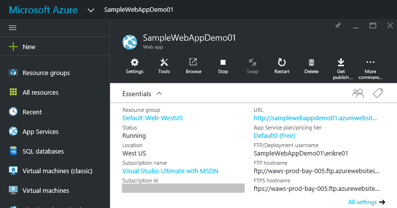

Publishing to an Azure Web App with Continuous Deployment
=========================================================

By `Erik Reitan`_ 

This tutorial shows you how to create an ASP.NET 5 web app using Visual Studio and deploy it from Visual Studio to Azure App Service using continuous deployment.

.. note:: To complete this tutorial, you need a Microsoft Azure account. If you don't have an account, you can `activate your MSDN subscriber benefits <http://azure.microsoft.com/pricing/member-offers/msdn-benefits-details/?WT.mc_id=A261C142F>`_ or `sign up for a free trial <http://azure.microsoft.com/pricing/free-trial/?WT.mc_id=A261C142F>`_.

.. contents:: In this article:
  :local:
  :depth: 1

Prerequisites
-------------
Before you start, make sure that you have the followed the getting started steps for :doc:`/getting-started/installing-on-windows`. This tutorial assumes you have already installed the following:

- `Visual Studio Community 2015 <https://www.visualstudio.com/en-us/downloads/download-visual-studio-vs.aspx>`_
- `ASP.NET 5  <http://go.microsoft.com/fwlink/?LinkId=627627>`_ (runtime and tooling)
- `Git <http://git-scm.com/downloads>`_ for Windows

.. note:: For additional information about installing ASP.NET 5, including information about installing on other platforms, see :doc:`/getting-started/index`.

Create an ASP.NET 5 web app
---------------------------

1. Start Visual Studio 2015.

2. From the **File** menu, select **New** > **Project**. 

3. Select the **ASP.NET Web Application** project template. It appears under **Installed** > **Templates** > **Visual C#** > **Web**. Name the project ``SampleWebAppDemo``. Select the **Add to source control** option and click **OK**.

	.. image:: azure-continuous-deployment/_static/01-new-project.png

4. In the **New ASP.NET Project** dialog, select **Empty** under **ASP.NET 5 Preview Templates**, then click **OK**.

	.. image:: azure-continuous-deployment/_static/02-web-site-template.png
	
5. From the **Choose Source Control** dialog box, select **Git** as the source control system for the new project.

	.. image:: azure-continuous-deployment/_static/03-source-control.png

Running the web app locally
^^^^^^^^^^^^^^^^^^^^^^^^^^^

1. Once Visual Studio finishes creating the app, run the app by selecting **Debug** -> **Start Debugging**. As an alternative, you can press **F5**.

	It may take time to initialize Visual Studio and the new app. Once it is complete, the browser will show the running app.				

	.. image:: azure-continuous-deployment/_static/04-browser-runapp.png

2. After reviewing the running Web app, close the browser and click the "Stop Debugging" icon in the toolbar of Visual Studio to stop the app.

.. note:: To review the ASP.NET 5 project, see the "Review the project" section of :doc:`/tutorials/your-first-aspnet-application`.

Create a web app in the Azure Portal
------------------------------------

The following steps will guide you through creating a web app in the Azure Portal.

1. Log in to the `Azure Portal <https://portal.azure.com>`_.

2. Click **NEW** at the top left of the Portal.

3. Click **Web + Mobile** > **Web App**.

	.. image:: azure-continuous-deployment/_static/05-azure-newwebapp.png

4. In the **Web App** blade, enter a unique value for the **App Service Name**. 

	.. image:: azure-continuous-deployment/_static/06-azure-newappblade.png
	
	|
	
	.. note:: The **App Service Name** name needs to be unique. The portal will enforce this rule when you attempt to enter the name. After you enter a different value, you'll need to substitute that value for each occurrence of **SampleWebAppDemo** that you see in this tutorial. 

	Also in the **Web App** blade, select an existing **App Service Plan/Location** or create a new one. If you create a new plan, select the pricing tier, location, and other options. For more information on App Service plans, `Azure App Service plans in-depth overview <https://azure.microsoft.com/en-us/documentation/articles/azure-web-sites-web-hosting-plans-in-depth-overview/>`_.

5. Click **Create**. Azure will provision and start your web app.

Enable Git publishing for the new web app
-----------------------------------------

Git is a distributed version control system that you can use to deploy your Azure App Service web app. You'll store the code you write for your web app in a local Git repository, and you'll deploy your code to Azure by pushing to a remote repository.   

1. Log into the `Azure Portal <https://portal.azure.com>`_, if you're not already logged in.

2. Click **Browse**, located at the bottom of the navigation pane.

3. Click **Web Apps** to view a list of the web apps associated with your Azure subscription.

4. Select the web app you created in the previous section of this tutorial.

5. If the **Settings** blade is not shown, select **Settings** in the **Web App** blade. 

6. In the **Settings** blade, select **Continuous deployment** > **Choose Source** > **Local Git Repository**. 

	.. image:: azure-continuous-deployment/_static/08-azure-localrepository.png

7. Click **OK**.

8. If you have not previously set up deployment credentials for publishing a web app or other App Service app, set them up now:

	* Click **Settings** > **Deployment credentials**. The **Set deployment credentials** blade will be displayed.

	* Create a user name and password.  You'll need this password later when setting up Git.

	* Click **Save**.

9. In the **Web App** blade, click **Settings** > **Properties**. The URL of the remote Git repository that you'll deploy to is shown under **GIT URL**.

10. Copy the **GIT URL** value for later use in the tutorial.

	.. image:: azure-continuous-deployment/_static/09-azure-giturl.png

Publish your web app to Azure App Service
-----------------------------------------

In this section, you will create a local Git repository using Visual Studio and push from that repository to Azure to deploy your web app. The steps involved include the following:

	* Add the remote repository setting using your GIT URL value, so you can deploy your local repository to Azure.
	
	* Commit your project changes.
	
	* Push your project changes from your local repository to your remote repository on Azure.
	
1. In **Solution Explorer** right-click **Solution 'SampleWebAppDemo'** and select **Commit**. The **Team Explorer** will be displayed. 

	.. image:: azure-continuous-deployment/_static/10-team-explorer.png

2. In **Team Explorer**, select the **Home** (home icon) > **Settings** > **Repository Settings**.

3. In the **Remotes** section of the **Repository Settings** select **Add**. The **Add Remote** dialog box will be displayed.

4. Set the **Name** of the remote to **Azure-SampleApp**.

5. Set the value for **Fetch** to the **Git URL** that you copied from Azure earlier in this tutorial. Note that this is the URL that ends with **.git**.

	.. image:: azure-continuous-deployment/_static/11-add-remote.png
	
	|
	
	.. note:: As an alternative, you can specify the remote repository from the **Command Window** by opening the **Command Window**, changing to your project directory, and entering the command. For example:
	
		``git remote add Azure-SampleApp https://me@sampleapp.scm.azurewebsites.net:443/SampleApp.git``
	
6. Select the **Home** (home icon) > **Settings** > **Global Settings**. Make sure you have your name and your email address set. You may also need to select **Update**.
	
7. Select **Home** > **Changes** to return to the **Changes** view. 

8. Enter a commit message, such as **Initial Push #1** and click **Commit**. This action will create a *commit* locally. Next, you need to *sync* with Azure.

	.. image:: azure-continuous-deployment/_static/12-initial-commit.png
	
	|
	
	.. note:: As an alternative, you can commit your changes from the **Command Window** by opening the **Command Window**, changing to your project directory, and entering the git commands. For example:
	
		``git add .``
		
		``git commit -am "Initial Push #1"``
	
9. Select **Home** > **Sync** > **Actions** > **Open Command Prompt**. The command prompt will open to your project directory.

10. Enter the following command in the command window:

	``git push -u Azure-SampleApp master``

11. Enter your Azure **deployment credentials** password that you created earlier in Azure. 

	.. note:: Your password will not be visible as you enter it.
	
This command will start the process of pushing your local project files to Azure. The output from the above command ends with a message that deployment was successful.
	
|	remote: Finished successfully.
|	remote: Running post deployment command(s)...
|	remote: Deployment successful.
|	To https://username@samplewebappdemo01.scm.azurewebsites.net:443/SampleWebAppDemo01.git
|	* [new branch]      master -> master
|	Branch master set up to track remote branch master from Azure-SampleApp.
|

.. note:: If you need to collaborate on a project, you should consider pushing to `GitHub <https://github.com>`_ in between pushing to Azure.

Verify the Active Deployment
^^^^^^^^^^^^^^^^^^^^^^^^^^^^
You can verify that you successfully transferred the web app from your local environment to Azure. You'll see the listed successful deployment.

1. In the `Azure Portal <https://portal.azure.com>`_, select your web app. Then, select **Settings** > **Continuous deployment**. 

	.. image:: azure-continuous-deployment/_static/13-verify-deployment.png

Run the app in Azure
--------------------
Now that you have deployed your web app to Azure, you can run the app. 

This can be done in two ways:

* In the Azure Portal, locate the web app blade for your web app, and click **Browse** to view your app in your default browser.
* Open a browser and enter the URL for your web app. For example:

	``http://SampleWebAppDemo.azurewebsites.net``

Update your web app and republish
---------------------------------
After you make changes to your local code, you can republish. 

1. In **Solution Explorer** of Visual Studio, open the *Startup.cs* file.

2. In the ``Configure`` method, modify the ``Response.WriteAsync`` method so that it appears as follows:

.. code-block:: aspx-cs

	await context.Response.WriteAsync("Hello World! Deploy to Azure.");
	
3. Save changes to *Startup.cs*.

4. In **Solution Explorer**, right-click **Solution 'SampleWebAppDemo'** and select **Commit**. The **Team Explorer** will be displayed. 

5. Enter a commit message, such as:

.. code-block:: none

	Update #2
	
6. Press the **Commit** button to commit the project changes.

7. Select **Home** > **Sync** > **Actions** > **Push**. 

	.. note:: As an alternative, you can push your changes from the **Command Window** by opening the **Command Window**, changing to your project directory, and entering a git command. For example:
	
		``git push -u Azure-SampleApp master``

View the updated web app in Azure
---------------------------------

View your updated web app by selecting **Browse** from the web app blade in the Azure Portal or by opening a browser and entering the URL for your web app. For example:

	``http://SampleWebAppDemo.azurewebsites.net``

Additional Resources
--------------------
- :doc:`ASP.NET 5 Publishing </publishing/index>`
- `Project Kudu <https://github.com/projectkudu/kudu/wiki>`_
- :doc:`/conceptual-overview/understanding-aspnet5-apps`
- :doc:`ASP.NET 5 Fundamentals </fundamentals/index>`
