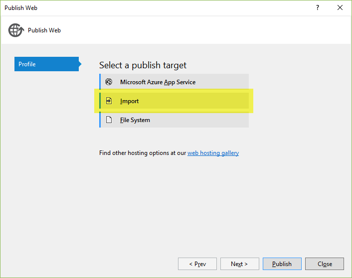

Publishing to IIS with Web Deploy using Visual Studio 2015
============================================================

By `Sayed Ibrahim Hashimi`_

Publishing an ASP.NET 5 project to an IIS server with Web Deploy requires a few
additional steps in comparison to an ASP.NET 4 project. We are working on
simplifying the experience for the next version. Until then you can use these
instructions to get started with publishing an ASP.NET 5 web application using
Web Deploy to any IIS host.

To publish an ASP.NET 5 application to a remote IIS server the following steps
are required.

1. Configure your remote IIS server to support ASP.NET 5
2. Create a publish profile
3. Customize the profile to support Web Deploy publish

In this document we will walk through each step.

Preparing your web server for ASP.NET 5
^^^^^^^^^^^^^^^^^^^^^^^^^^^^^^^^^^^^^^^^^

The first step is to ensure that your remote server is configured for ASP.NET 5.
At a high level you’ll need.

1. An IIS server with IIS 7.5+
2. Install HttpPlatformHandler
3. Install Web Deploy v3.6

The HttpPlatformHandler is a new component that connects IIS with your ASP.NET 5
application. You can get that from the following download links.

- `64 bit HttpPlatformHandler <http://go.microsoft.com/fwlink/?LinkID=690721>`_
- `32 bit HttpPlatformHandler <http://go.microsoft.com/fwlink/?LinkId=690722>`_

In addition to installing the HttpPlatformHandler, you’ll need to install the
latest version of Web Deploy (version 3.6). To install Web Deploy 3.6 you can
use the `the Web Platform Installer
<https://www.microsoft.com/web/downloads/platform.aspx>`_. (WebPI) or `directly
from the download center
<https://www.microsoft.com/en-us/download/details.aspx?id=43717>`_. The
preferred method is to use WebPI. WebPI offers a standalone setup as well as
a configuration for hosting providers.

You can find more info on configuring your IIS server for ASP.NET 5 at
`Publishing to IIS <https://docs.asp.net/en/latest/publishing/iis.html>`_. Now
let’s move on to the Visual Studio experience.

Publishing with Visual Studio 2015
^^^^^^^^^^^^^^^^^^^^^^^^^^^^^^^^^^^^

After you have configured your web server, the next thing to do is to create a
publish profile in Visual Studio. The easiest way to get started with publishing
an ASP.NET 5 application to a standard IIS host is to use a publish profile. If
you’re hosting provider has support for creating a publish profile, download
that and then import it into the Visual Studio publish dialog with the Import
button. You can see that dialog shown below.

After importing the publish profile, there is one additional step that needs to
be taken before being able to publish to a standard IIS host. In the publish
PowerShell script generated (under Properties\PublishProfiles) update the
publish module version number from ``1.0.1`` to ``1.0.2-beta2``. After changing
``1.0.1`` to ``1.0.2-beta2`` you can use the Visual Studio publish dialog to
publish and preview changes.
