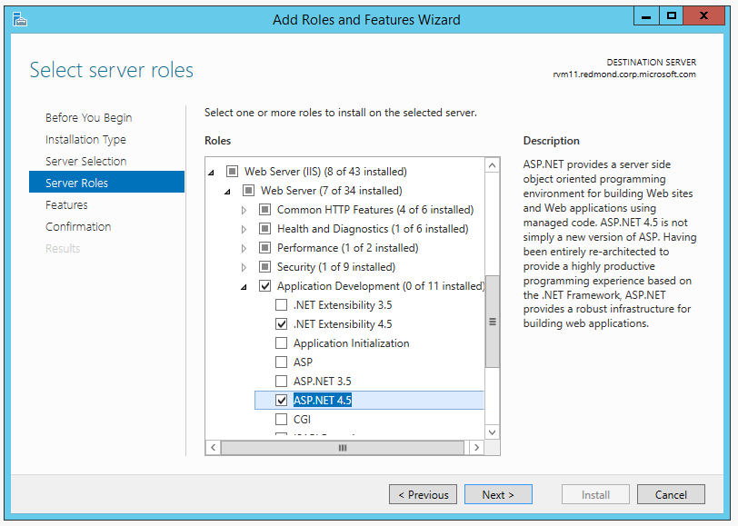
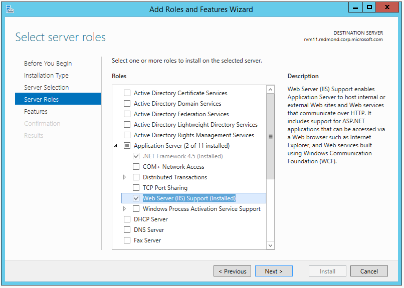

Publishing to IIS
=============================

By `Rick Anderson`_

In this article:
	- `Configure the IIS server`_
	- `Publish from Visual Studio`_
	- `Xcopy to IIS server`_
	- `Supported operating systems`_
	- `Common errors`_
	- `Additional Resources`_

Configure the IIS server
^^^^^^^^^^^^^^^^^^^^^^^^^^^^^^^^^

- Install the HTTP Platform Handler:

	- `64 bit HTTP Platform Handler <http://go.microsoft.com/fwlink/?LinkID=690721>`_
	- `32 bit HTTP Platform Handler <http://go.microsoft.com/fwlink/?LinkId=690722>`_

- Enable the **Web Server (IIS)** role and **Application Development** role services. Skip this step if you are on Windows 7 through Windows 10 (Client OSes), it's required only for servers.

- Enable the **Application Server** role and the **Web Server (IIS) Support** role service.

- Verify the ``IIS_IUSRS`` group has read, execute and list permissions in the deployment directory.

 .. image:: pubIIS/_static/iusrs.png

Publish from Visual Studio  
^^^^^^^^^^^^^^^^^^^^^^^^^^^^^^^^^^^^^^
1. Create an ASP.NET 5 app. In this sample, I'll create a MVC 6 app using the **Web Site** template under **ASP.NET 5 Preview Templates**.
2. In **Solution Explorer**, right-click on the project and select **Publish**.

.. image:: pubIIS/_static/p1.png

3. In the **Publish Web** dialog, on the **Profile** tab, select **File System**. 

.. image:: pubIIS/_static/fs.png

4. Enter a profile name. Click **Next**.
5. On the **Connection** tab you can change the publishing target path from the default *..\\..\\artifacts\\bin\\WebApp9\\Release\\Publish folder*. Click **Next**.
6. On the **Settings** tab you can select the configuration, target DNX version and publish options. Currently your deployment server must have .NET 4.5.1 or higher to use DNX core. We hope to have a native module in the future that will allow you to use DNX core in the app pool regardless of the full CLR. If you select **Precompile during publishing**, the *Publish\\approot\\src* directory and source files will not be created. If you don't check **Precompile during publishing**, your source files will be found in the  *Publish\\approot\\src* directory. Click **Next**.
7. The **Preview** tab shows you the publish path (by default, the same directory as the ".sln" solution file).

Xcopy to IIS server
^^^^^^^^^^^^^^^^^^^^^^^^^^^^^^^^^^^^^^

#. Navigate to the publish folder (*..\\..\\artifacts\\bin\\WebApp9\\Release\\Publish folder* in this sample). 
#. Copy the **approot** and **wwwroot** directories to the target IIS server.
#. In IIS manager, create a new web site and configure the app with application path to the **wwwroot** path. You can click on **Browse *.80(http)** to see your deployed app in the browser. Note, The HTTP Platform Handler currently does not support web apps in IIS.

.. image:: pubIIS/_static/b8.png

Supported operating systems
^^^^^^^^^^^^^^^^^^^^^^^^^^^^

The following operations systems are supported:

- Windows 7 and newer.
- Windows 2008 R2 and newer.

Common errors
^^^^^^^^^^^^^^^^

- HTTP 500.19 : You haven't enabled the proper roles. See `Configure the IIS server`_.

Additional Resources
^^^^^^^^^^^^^^^^^^^^^^^^^

- `Understanding ASP.NET 5 Web Apps <http://docs.asp.net/en/latest/conceptual-overview/understanding-aspnet5-apps.html>`_
- `Introducing .NET Core <http://docs.asp.net/en/latest/conceptual-overview/dotnetcore.html>`_
