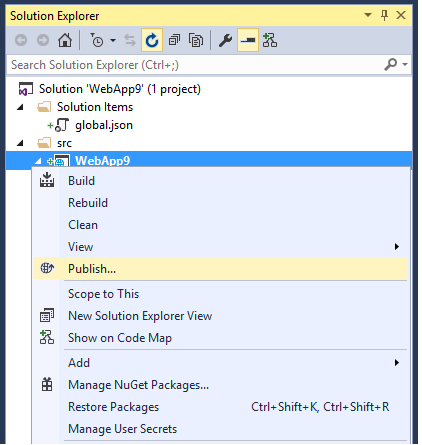
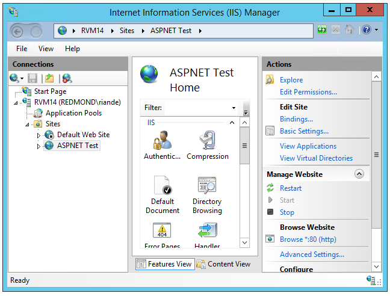
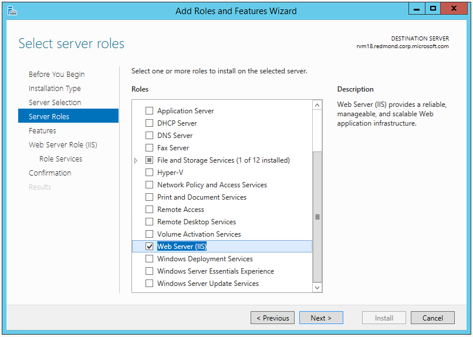
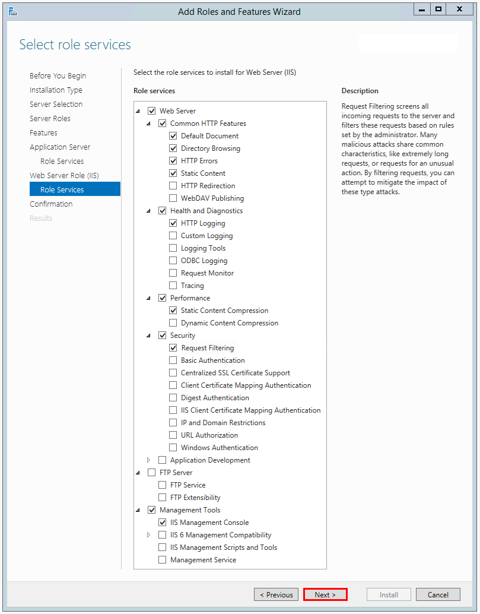
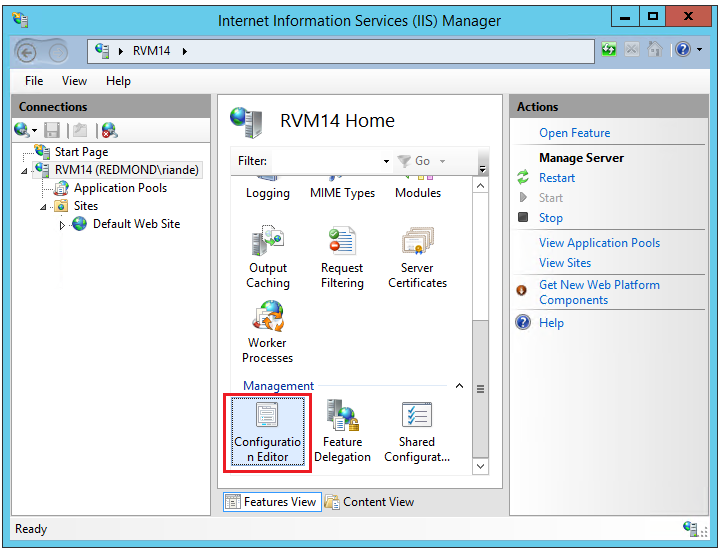
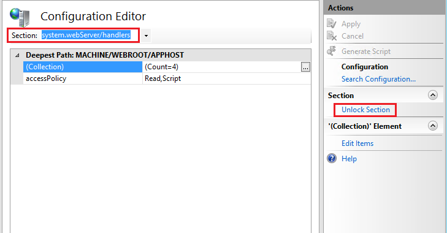

Publishing to IIS
=============================

By `Rick Anderson`_ and `Luke Latham <https://github.com/GuardRex>`_

	- `Install the HTTP Platform Handler`_
	- `Publish from Visual Studio`_
	- `Deploy to IIS server`_
	- `IIS server configuration`_
	- `Supported operating systems`_
	- `Common errors`_
	- `Additional Resources`_

Install the HTTP Platform Handler
^^^^^^^^^^^^^^^^^^^^^^^^^^^^^^^^^^^^

- Install the HTTP Platform Handler version 1.2 or higher:

	- `64 bit HTTP Platform Handler <http://go.microsoft.com/fwlink/?LinkID=690721>`_
	- `32 bit HTTP Platform Handler <http://go.microsoft.com/fwlink/?LinkId=690722>`_

If you need to enable IIS, see `IIS server configuration`_.

Create Data Protection Registry Hive
^^^^^^^^^^^^^^^^^^^^^^^^^^^^^^^^^^^^

To persist Data Protection keys you must create registry hives for each application pool to store the keys. You should use the
`Provisioning PowerShell script <https://github.com/aspnet/DataProtection/blob/dev/Provision-AutoGenKeys.ps1>`_ for each application pool you will be hosting ASP.NET 5 applications under.

For web farm scenarios developers can configure their applications to use a UNC path to store the data protection key ring. By default this does not encrypt the key ring. You can deploy an x509 certificate to each machine and use that to encrypt the keyring. See the :ref:`configuration APIs <data-protection-configuring>` for more details.

Publish from Visual Studio
^^^^^^^^^^^^^^^^^^^^^^^^^^^^^^^^^^^^^^
1. Create an ASP.NET 5 app. In this sample, I'll create an MVC 6 app using the **Web Site** template under **ASP.NET 5 Preview Templates**.
2. In **Solution Explorer**, right-click the project and select **Publish**.

3. In the **Publish Web** dialog, on the **Profile** tab, select **File System**.

.. image:: pubIIS/_static/fs.png

4. Enter a profile name. Click **Next**.
5. On the **Connection** tab, you can change the publishing target path from the default *..\\..\\artifacts\\bin\\WebApp9\\Release\\Publish* folder. Click **Next**.
6. On the **Settings** tab, you can select the configuration, target DNX version, and publish options. Click **Next**.

The **Preview** tab shows you the publish path (by default, the same directory as the ".sln" solution file).

Deploy to IIS server
^^^^^^^^^^^^^^^^^^^^^^^^^^^^^^^^^^^^^^

#. Navigate to the publish folder (*..\\..\\artifacts\\bin\\WebApp9\\Release\\Publish folder* in this sample).
#. Copy the **approot** and **wwwroot** directories to the target IIS server. Note: MSDeploy is the recommended mechanism for deployment, but you can use Xcopy, Robocopy or another approach. For information on using `Web Deploy` see :doc:`iis-with-msdeploy`.
#. In IIS Manager, create a new web site and set the physical path to **wwwroot**. You can click on **Browse *.80(http)** to see your deployed app in the browser. Note: The HTTP Platform Handler currently requires `this work-around <https://github.com/aspnet/Hosting/issues/416>`_ to support apps. If you get an HTTP error, see `IIS server configuration`_.

IIS server configuration
^^^^^^^^^^^^^^^^^^^^^^^^^^^^^^^^^

1. Enable the **Web Server (IIS)** server role. In client operating systems (Windows 7 through Windows 10) select **Control Panel > Programs > Programs and Features > Turn Windows features on or off**, and then select **Internet Information Services**.

2. On the **Role Services** step, remove any items you don't need. The defaults are shown below.

3. Unlock the configuration section.

	- Launch IIS Manager and select the server in the **Connections** pane on the left (see image below).
	- Double-click **Configuration Editor**.
	- In the **Section** drop-down, select **system.webServer/handlers**, and then click **Unlock Section**.

- Set the application pool to **No Managed Code**. ASP.NET 5 runs in a separate process and manages the runtime.

 .. image:: pubIIS/_static/appPool.PNG

Supported operating systems
^^^^^^^^^^^^^^^^^^^^^^^^^^^^

The following operations systems are supported:

- Windows 7 and newer
- Windows 2008 R2 and newer

Common errors
^^^^^^^^^^^^^^^^

The following is not a complete list of errors. Should you encounter an error not listed here, please leave a detailed error message in the DISQUS section below along with the reason for the error and how you fixed it.

- HTTP 500.19 : ** This configuration section cannot be used at this path.**

	- You haven't enabled the proper roles. See `IIS server configuration`_.

- HTTP 500.19 : The requested page cannot be accessed because the related configuration data for the page is invalid.

	- You haven't installed the correct HTTP Platform Handler. See `Install the HTTP Platform Handler`_
	- The *wwwroot* folder doesn't have the correct permissions. See `IIS server configuration`_.

- The IIS 7.0 CoreWebEngine and W3SVC features must be installed to use the Microsoft HTTP Platform Handler 1.x.

	- Enable IIS; see `IIS server configuration`_.

- HTTP 502.3 Bad Gateway

	- You haven't installed the correct HTTP Platform Handler. See `Install the HTTP Platform Handler`_

- HTTP 500.21 Internal Server Error.

	- No module installed. See `IIS server configuration`_.

Additional Resources
^^^^^^^^^^^^^^^^^^^^^^^^^

- `Understanding ASP.NET 5 Web Apps <http://docs.asp.net/en/latest/conceptual-overview/understanding-aspnet5-apps.html>`_
- `Introducing .NET Core <http://docs.asp.net/en/latest/conceptual-overview/dotnetcore.html>`_
