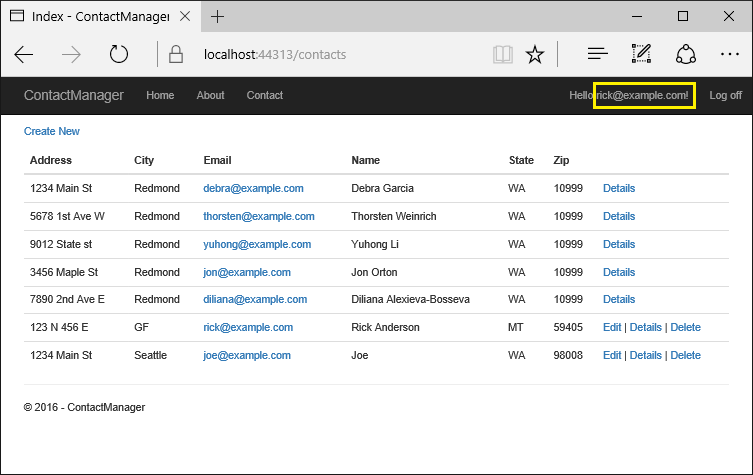

Create an app with secure user data
======================================

By `Barry Dorrans`_ and `Rick Anderson`_

.. contents:: Sections:
  :local:
  :depth: 1

This tutorial shows how to create a web app with secure user data. Authenticated users can read all the contacts but can only edit their own contacts.  A user in the administrator role can can delete any contact.

In the image below, user *rick@example.com* can edit and delete his contacts, and read other contacts.

In the image below, *test@example.com* is in the ``canDelete`` role, so she can edit her contacts and delete any contact.

.. image:: secure-data/_static/conTest.png

The app was created by scaffolding the following ``Contact`` model:

.. literalinclude::  secure-data/samples/starter/Models/Contact.cs
  :language: c#
  :lines: 5-16
  :dedent: 4
  :emphasize-lines: 3

The contact information properties (Address, Name, etc.) are displayed in the images above. ``ContactId`` is the primary key for the table.

A user authorization filter ensures only the logged in user can edit their data. A ``canDelete`` authorization filter allows users in the "canDelete" role to delete any data.

The starter app
^^^^^^^^^^^^^^^^^^^^^^^^^^^^^^^^^^

`Download <https://github.com/aspnet/Docs/tree/master/aspnet/security/authorization/secure-data/samples/starter>`__ and test the starter app. See :ref:`Create-Secure_data-starter-app-label` if you'd like to create the starter app.

Update the database:

.. code-block:: none

  dotnet ef database update

Run the app, tap the **ContactManager** link and verify you can create, edit and delete a contact.

Tie the contact data to the user
^^^^^^^^^^^^^^^^^^^^^^^^^^^^^^^^^^

We'll use the ASP.NET :doc:`Identity </security/authentication/identity>` user ID to ensure users can edit their data, but not other users data. Update the ``Contact`` model:

.. literalinclude::  secure-data/samples/final/Models/Contact.cs
  :language: c#
  :lines: 5-19
  :dedent: 4
  :emphasize-lines: 5-6

``OwnerID`` is the user's ID from the ``AspNetUser`` table in the :doc:`Identity </security/authentication/identity>` database.

Scaffold a new migration and update the database:

.. code-block:: none

  dotnet ef migrations add userID
  dotnet ef database update

.. _create-secure_data-require-ssl-label:

Require SSL and authenticated users
------------------------------------

In the ``ConfigureServices`` method of the *Startup.cs* file, add the :dn:cls:`~Microsoft.AspNetCore.Mvc.RequireHttpsAttribute` authorization filter that requires all requests are HTTPS:

.. literalinclude::  secure-data/samples/final/Startup.cs
  :language: c#
  :start-after:  // Require SSL.
  :end-before:  // Default authentication policy
  :dedent: 12

If you are using Visual Studio, see :ref:`Enable-ssl-visual-studio-label`.

Set the default authentication policy to require users to be authenticated. You can opt out of authentication at the controller or action method with the ``[AllowAnonymous]`` attribute. With this approach, any new controllers added will automatically require authentication, which is more fail safe than relying on new controllers to include the ``[Authorize]`` attribute. Add the following to  the ``ConfigureServices`` method of the *Startup.cs* file:

.. literalinclude::  secure-data/samples/final/Startup.cs
  :language: c#
  :start-after: // Default authentication policy will require authenticated user.
  :end-before:  // Authorization handlers.
  :dedent: 12

Add ``[AllowAnonymous]`` to the home controller so anonymous users can get information about the site before they register.

Configure the test account
^^^^^^^^^^^^^^^^^^^^^^^^^^^^^^^^^^^

The ``SeedData`` class creates a test user account. Use the  :doc:`Secret Manager tool </security/app-secrets>` to set a password for the account. Do this from the project directory (the directory containing *Program.cs*).

.. code-block:: none

  dotnet user-secrets set SeedUserPW <PW>

Update ``Configure`` to use the test password:

.. literalinclude::  secure-data/samples/final/Startup.cs
  :language: c#
  :start-after: // Set password with the Secret Manager tool.
  :end-before: // End
  :dedent: 12

Add the test accounts user ID to the seed data:

.. literalinclude::  secure-data/samples/final/Data/SeedData.cs
  :language: c#
  :start-after: context.Contact.AddRange(
  :end-before: // End
  :dedent: 12
  :emphasize-lines: 9

Delete all the records in the ``Contact`` table and seed the database. If you're using Visual Studio you might need to stop IIS Express to force the seed initializer to run.

Resource based authorization
-----------------------------

- Create an *Authorization* folder for the filters and classes we will create to implement authorization.
- Create a *ContactIsOwnerAuthorizationHandler* class we can invoke to verify the user acting on the resource owns the resource. Create this in the *Authorization* folder.

.. literalinclude:: secure-data/samples/final/Authorization/ContactIsOwnerAuthorizationHandler.cs
  :language: c#

The ``ContactIsOwnerAuthorizationHandler`` returns ``Succeed`` if the user is the contact owner. We're not checking the requirement; an owner can perform any requirement on data they own.

The ``ContactIsOwnerAuthorizationHandler`` uses ASP.NET Core Identity, which is built on Entity Framework Core, which requires we add this handler as scoped. Register the ``ContactIsOwner`` handler with the service collection so it will be available to the ``ContactsController`` through :ref:`dependency injection <fundamentals-dependency-injection>`. Add the following code to ``ConfigureServices``:

.. literalinclude::  secure-data/samples/final/Startup.cs
  :language: c#
  :start-after: // Authorization handlers.
  :end-before: // Add
  :dedent: 12

Update the ``ContactsController`` constructor to resolve the *ContactIsOwnerAuthorizationHandler* service. While we're at it we'll also get the ``Identity`` ``UserManager`` service:

.. literalinclude:: secure-data/samples/final/Controllers/ContactsController.cs
  :language: c#
  :start-after: //
  :end-before: // GET:
  :dedent: 4
  :emphasize-lines: 4,5,9,10,13,14

Add a ``ContactOperationsRequirements`` class to the *Authorization* folder to contain the requirements our app supports:

.. literalinclude:: secure-data/samples/final/Authorization/ContactOperationsRequirements.cs
  :language: c#

Update the ``HTTP POST Create`` method to add the user ID to the ``Contact`` model:

.. literalinclude:: secure-data/samples/final/Controllers/ContactsController.cs
  :language: c#
  :start-after: // POST: Contacts/Create
  :end-before: // GET:
  :dedent: 8
  :emphasize-lines: 7

Update both ``Edit`` methods to use the authorization filter to verify the user owns the contact. Add ``OwnerID`` to the ``Bind`` list:

.. literalinclude:: secure-data/samples/final/Controllers/ContactsController.cs
  :language: c#
  :start-after: // GET: Contacts/Edit/5
  :end-before: // GET: Contacts/Delete/5
  :dedent: 8
  :emphasize-lines: 14-19,35-40,28

Add the ``OwnerID`` as a hidden field so it will be available to the ``HTTP POST Edit`` method:

.. literalinclude:: secure-data/samples/final/Views/Contacts/Edit.cshtml
  :language: none
  :start-after: <h2>Edit</h2>
  :end-before: <label asp-for="Address"
  :emphasize-lines: 8

Update both ``Delete`` methods to use the authorization filter to verify the user owns the contact.

.. literalinclude:: secure-data/samples/final/Controllers/ContactsController.cs
  :language: c#
  :start-after: // GET: Contacts/Delete/5
  :end-before: private
  :dedent: 8
  :linenos:
  :emphasize-lines: 14-19,31-36

.. _update-access-denied--label:

Update the ``AccountController`` to display friendly access denied errors
^^^^^^^^^^^^^^^^^^^^^^^^^^^^^^^^^^^^^^^^^^^^^^^^^^^^^^^^^^^^^^^^^^^^^^^^^^

Add the ``AccessDenied`` method to the ``AccountController``. This method will be invoked when we call ``ChallengeResult``.

.. literalinclude:: secure-data/samples/final/Controllers/AccountController.cs
  :language: c#
  :start-after: // GET /Account/AccessDenied
  :end-before: //
  :dedent: 8

Add the *Views/Account/AccessDenied.cshtml* Razor view:

.. literalinclude:: secure-data/samples/final/Views/Account/AccessDenied.cshtml
  :language: html

Test the ``Edit``, ``Delete``, and ``Create`` methods
^^^^^^^^^^^^^^^^^^^^^^^^^^^^^^^^^^^^^^^^^^^^^^^^^^^^^^

An easy way to test the changes we made is to launch two different browsers (for example Edge and Internet Explorer). Log into one browser as user ``test@example.com``. In the other browser register a new user (for example ``rick@example.com``) and create a new contact.

Verify ``test@example.com`` can edit and delete the seed data and any contacts created with that account. Verify ``test@example.com`` cannot edit or delete a contact created by the second account.

Inject the authorization service into the views
^^^^^^^^^^^^^^^^^^^^^^^^^^^^^^^^^^^^^^^^^^^^^^^^

Currently the UI shows edit and delete links for data the user cannot modify. We'll fix that by applying the authorization filter to the views.

Inject the authorization service in the *Views/_ViewImports.cshtml* file so it will be available to all views:

.. literalinclude:: secure-data/samples/final/Views/_ViewImports.cshtml
  :language: none
  :emphasize-lines: 7,8

Update the *Views/Contacts/Index.cshtml* Razor view to show only display the edit and delete links for the users data:

.. literalinclude:: secure-data/samples/final/Views/Contacts/Index.cshtml
  :language: none
  :lines: 2

.. literalinclude:: secure-data/samples/final/Views/Contacts/Index.cshtml
  :language: none
  :emphasize-lines: 6-17
  :start-after: item.State)
  :end-before: </tr>
  :dedent: 16

Test the app with two different browsers and users to verify they cannot edit or delete contacts they didn't create.

.. warning:: Hiding links from users that do not have permission to edit or delete data does not secure that app, it makes the app more user friendly by displaying only valid links. Users can hack the generated URLs to invoke edit and delete operations on data they don't own, it's up to the controller to secure the data.

Adding an administrative role
------------------------------

Applications frequently support an administrator account with permissions to modify user data.  In this sample we'll create the "canDelete" role, and users in this role will be able to delete any contacts. A best practice is to name roles by the actions they can perform, so "canDelete" is preferred over a role called "admin". When your application evolves, you can add new roles such as "canDeleteMembers" rather than the less descriptive "superAdmin".

The "canDelete" requirement will have two handlers, one for the contact owner and one for administrative users in the "canDelete" role. Using multiple handlers for a requirement significantly simplifies your code, as the controller and UI code don't change, you simply add the administrative "canDelete" filter. See :ref:`security-authorization-policies-based-authorization-handler` for more information.

Log out of the "test@example.com" browser session so you don't have a stale authentication cookie.

Update ``SeedData`` to create the "canDelete" role:

.. literalinclude::  secure-data/samples/final/Data/SeedData.cs
  :language: c#
  :start-after:  // "canDelete" role
  :end-before: // End
  :dedent: 8

Add a role filter to validate the user is in the specified role:

.. literalinclude::  secure-data/samples/final/Authorization/ContactRoleAuthorizationHandler.cs
  :language: c#

Add the role authorization filter to the service container in ``ConfigureServices``.

.. literalinclude::  secure-data/samples/final/Startup.cs
  :language: c#
  :start-after:  Context parameter.
  :end-before:  // End
  :dedent: 12

The ``ContactRoleAuthorizationHandler`` is added as a singleton because all the information it needs is in the ``Context`` parameter.

Test the app and verify the "test@example.com" user can delete contacts created by other users. Verify that regular users can't edit or delete other users data. An easy way to test this is to tap on another users **Details** link and change the URL from /Contacts/Details/18 to /Contacts/Delete/18.

The ``ContactRoleAuthorizationHandler`` allowed us to add an administrator that can delete user data without changing the UI code or the controller code. We were able to do this because we wrote the filters to OR evaluate; any filter that succeeds allows the requirement to be met. This is typical for authorization handlers.

You could write a filter that fails the requirements, even if the other filters succeed. For example, consider the following filter that fails if the contact address doesn't contain "1":

.. literalinclude::  secure-data/samples/final/Authorization/ContactNotOneAuthorizationHandler.cs
  :language: c#

If you applied this filter to the **Details** link , addresses without a "1" would not display the **Details** link.

.. literalinclude:: secure-data/samples/final/Views/Contacts/Index2.cshtml
  :language: none
  :start-after:  1 filter *@
  :end-before:  <!--End-->  
  :dedent: 16

See :ref:`secure-data-add-resources-label` for more information.

.. _create-secure_data-starter-app-label:

Create the starter app
^^^^^^^^^^^^^^^^^^^^^^^^

- Create a new **ASP.NET Core Web Application** using `Visual Studio 2015 <https://www.visualstudio.com/en-us/visual-studio-homepage-vs.aspx>`__ named "ContactManager"

  - Create the app with **Individual User Accounts**
  - Name it "ContactManager" so your namespace will match the namespace use in the sample

- Add the following ``Contact`` model:

.. literalinclude::  secure-data/samples/starter/Models/Contact.cs
  :language: c#

- Scaffold the ``Contact`` model using Entity Framework Core and the ``ApplicationDbContext`` data context. Accept all the scaffolding defaults. Using ``ApplicationDbContext`` for the data context class  puts the contact table in the :doc:`Identity </security/authentication/identity>` database. See :doc:`/tutorials/first-mvc-app/adding-model` for more information.
- Update the **ContactManager** anchor in the *Views/Shared/_Layout.cshtml* file from ``asp-controller="Home"`` to ``asp-controller="Contacts"`` so tapping the **ContactManager** link will invoke the Contacts controller. The original markup:

.. code-block:: html

   <a asp-area="" asp-controller="Home" asp-action="Index" class="navbar-brand">ContactManager</a>

The updated markup:

.. code-block:: html

   <a asp-area="" asp-controller="Contacts" asp-action="Index" class="navbar-brand">ContactManager</a>

- Scaffold the initial migration and update the database

.. code-block:: none

  dotnet ef migrations add initial
  dotnet ef database update

- Test the app by creating, editing and deleting a contact

Seed the database
^^^^^^^^^^^^^^^^^^

Add the ``SeedData`` class to the *Data* folder. If you've downloaded the completed application, you can copy the *SeedData.cs* file to the *Data* folder.

.. literalinclude::  secure-data/samples/starter/Data/SeedData.cs
  :language: c#

Add the highlighted code to the end of the ``Configure`` method in the *Startup.cs* file:

.. literalinclude::  secure-data/samples/starter/Startup.cs
  :language: c#
  :start-after: // Add external authentication middleware below. To configure them please see http://go.microsoft.com/fwlink/?LinkID=532715
  :dedent: 12
  :emphasize-lines: 8-

Test that the app seeded the database. The seed method will not run if there are any rows in the contact DB.

.. _secure-data-add-resources-label:

Additional resources
--------------------

- :doc:`/security/authorization/index`
- :doc:`/security/authorization/policies`