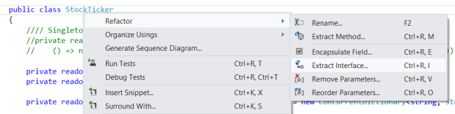
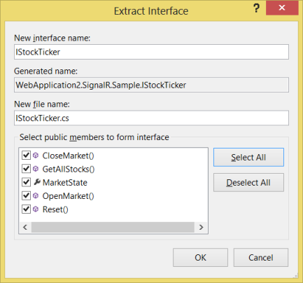

Dependency Injection in SignalR
====================
by [Mike Wasson](https://github.com/MikeWasson), [Patrick Fletcher](https://github.com/pfletcher)

> ## Software versions used in this topic
> 
> 
> - [Visual Studio 2013](https://www.microsoft.com/visualstudio/eng/2013-downloads)
> - .NET 4.5
> - SignalR version 2
>   
> 
> 
> ## Previous versions of this topic
> 
> For information about earlier versions of SignalR, see [SignalR Older Versions](../older-versions/index.md).
> 
> ## Questions and comments
> 
> Please leave feedback on how you liked this tutorial and what we could improve in the comments at the bottom of the page. If you have questions that are not directly related to the tutorial, you can post them to the [ASP.NET SignalR forum](https://forums.asp.net/1254.aspx/1?ASP+NET+SignalR) or [StackOverflow.com](http://stackoverflow.com/).

Dependency injection is a way to remove hard-coded dependencies between objects, making it easier to replace an object's dependencies, either for testing (using mock objects) or to change run-time behavior. This tutorial shows how to perform dependency injection on SignalR hubs. It also shows how to use IoC containers with SignalR. An IoC container is a general framework for dependency injection.

## What is Dependency Injection?

Skip this section if you are already familiar with dependency injection.

*Dependency injection* (DI) is a pattern where objects are not responsible for creating their own dependencies. Here is a simple example to motivate DI. Suppose you have an object that needs to log messages. You might define a logging interface:

[!code-csharp[Main](dependency-injection/samples/sample1.cs)]

In your object, you can create an `ILogger` to log messages:

[!code-csharp[Main](dependency-injection/samples/sample2.cs)]

This works, but it's not the best design. If you want to replace `FileLogger` with another `ILogger` implementation, you will have to modify `SomeComponent`. Supposing that a lot of other objects use `FileLogger`, you will need to change all of them. Or if you decide to make `FileLogger` a singleton, you'll also need to make changes throughout the application.

A better approach is to "inject" an `ILogger` into the object—for example, by using a constructor argument:

[!code-csharp[Main](dependency-injection/samples/sample3.cs)]

Now the object is not responsible for selecting which `ILogger` to use. You can swich `ILogger` implementations without changing the objects that depend on it.

[!code-csharp[Main](dependency-injection/samples/sample4.cs)]

This pattern is called [constructor injection](http://www.martinfowler.com/articles/injection.html#FormsOfDependencyInjection). Another pattern is setter injection, where you set the dependency through a setter method or property.

## Simple Dependency Injection in SignalR

Consider the Chat application from the tutorial [Getting Started with SignalR](../getting-started/tutorial-getting-started-with-signalr.md). Here is the hub class from that application:

[!code-csharp[Main](dependency-injection/samples/sample5.cs)]

Suppose that you want to store chat messages on the server before sending them. You might define an interface that abstracts this functionality, and use DI to inject the interface into the `ChatHub` class.

[!code-csharp[Main](dependency-injection/samples/sample6.cs)]

The only problem is that a SignalR application does not directly create hubs; SignalR creates them for you. By default, SignalR expects a hub class to have a parameterless constructor. However, you can easily register a function to create hub instances, and use this function to perform DI. Register the function by calling **GlobalHost.DependencyResolver.Register**.

[!code-csharp[Main](dependency-injection/samples/sample7.cs)]

Now SignalR will invoke this anonymous function whenever it needs to create a `ChatHub` instance.

## IoC Containers

The previous code is fine for simple cases. But you still had to write this:

[!code-csharp[Main](dependency-injection/samples/sample8.cs)]

In a complex application with many dependencies, you might need to write a lot of this "wiring" code. This code can be hard to maintain, especially if dependencies are nested. It is also hard to unit test.

One solution is to use an IoC container. An IoC container is a software component that is responsible for managing dependencies.You register types with the container, and then use the container to create objects. The container automatically figures out the dependency relations. Many IoC containers also allow you to control things like object lifetime and scope.

> [!NOTE]
> "IoC" stands for "inversion of control", which is a general pattern where a framework calls into application code. An IoC container constructs your objects for you, which "inverts" the usual flow of control.

## Using IoC Containers in SignalR

The Chat application is probably too simple to benefit from an IoC container. Instead, let's look at the [StockTicker](http://nuget.org/packages/microsoft.aspnet.signalr.sample) sample.

The StockTicker sample defines two main classes:

- `StockTickerHub`: The hub class, which manages client connections.
- `StockTicker`: A singleton that holds stock prices and periodically updates them.

`StockTickerHub` holds a reference to the `StockTicker` singleton, while `StockTicker` holds a reference to the **IHubConnectionContext** for the `StockTickerHub`. It uses this interface to communicate with `StockTickerHub` instances. (For more information, see [Server Broadcast with ASP.NET SignalR](../getting-started/tutorial-server-broadcast-with-signalr.md).)

We can use an IoC container to untangle these dependencies a bit. First, let's simplify the `StockTickerHub` and `StockTicker` classes. In the following code, I've commented out the parts that we don't need.

Remove the parameterless constructor from `StockTickerHub`. Instead, we will always use DI to create the hub.

[!code-csharp[Main](dependency-injection/samples/sample9.cs)]

For StockTicker, remove the singleton instance. Later, we'll use the IoC container to control the StockTicker lifetime. Also, make the constructor public.

[!code-csharp[Main](dependency-injection/samples/sample10.cs?highlight=7)]

Next, we can refactor the code by creating an interface for `StockTicker`. We'll use this interface to decouple the `StockTickerHub` from the `StockTicker` class.

Visual Studio makes this kind of refactoring easy. Open the file StockTicker.cs, right-click on the `StockTicker` class declaration, and select **Refactor** ... **Extract Interface**.

In the **Extract Interface** dialog, click **Select All**. Leave the other defaults. Click **OK**.

Visual Studio creates a new interface named `IStockTicker`, and also changes `StockTicker` to derive from `IStockTicker`.

Open the file IStockTicker.cs and change the interface to **public**.

[!code-csharp[Main](dependency-injection/samples/sample11.cs?highlight=1)]

In the `StockTickerHub` class, change the two instances of `StockTicker` to `IStockTicker`:

[!code-csharp[Main](dependency-injection/samples/sample12.cs?highlight=4,6)]

Creating an `IStockTicker` interface isn't strictly necessary, but I wanted to show how DI can help to reduce coupling between components in your application.

## Add the Ninject Library

There are many open-source IoC containers for .NET. For this tutorial, I'll use [Ninject](http://www.ninject.org/). (Other popular libraries include [Castle Windsor](http://www.castleproject.org/), [Spring.Net](http://www.springframework.net/), [Autofac](https://code.google.com/p/autofac/), [Unity](http://unity.codeplex.com/), and [StructureMap](http://docs.structuremap.net).)

Use NuGet Package Manager to install the [Ninject library](https://nuget.org/packages/Ninject/3.0.1.10). In Visual Studio, from the **Tools** menu select **Library Package Manager** | **Package Manager Console**. In the Package Manager Console window, enter the following command:

[!code-powershell[Main](dependency-injection/samples/sample13.ps1)]

## Replace the SignalR Dependency Resolver

To use Ninject within SignalR, create a class that derives from **DefaultDependencyResolver**.

[!code-csharp[Main](dependency-injection/samples/sample14.cs)]

This class overrides the **GetService** and **GetServices** methods of **DefaultDependencyResolver**. SignalR calls these methods to create various objects at runtime, including hub instances, as well as various services used internally by SignalR.

- The **GetService** method creates a single instance of a type. Override this method to call the Ninject kernel's **TryGet** method. If that method returns null, fall back to the default resolver.
- The **GetServices** method creates a collection of objects of a specified type. Override this method to concatenate the results from Ninject with the results from the default resolver.

## Configure Ninject Bindings

Now we'll use Ninject to declare type bindings.

Open your application's Startup.cs class (that you either created manually as per the package instructions in `readme.txt`, or that was created by adding authentication to your project). In the `Startup.Configuration` method, create the Ninject container, which Ninject calls the *kernel*.

[!code-csharp[Main](dependency-injection/samples/sample15.cs)]

Create an instance of our custom dependency resolver:

[!code-csharp[Main](dependency-injection/samples/sample16.cs)]

Create a binding for `IStockTicker` as follows:

[!code-csharp[Main](dependency-injection/samples/sample17.cs)]

This code is saying two things. First, whenever the application needs an `IStockTicker`, the kernel should create an instance of `StockTicker`. Second, the `StockTicker` class should be a created as a singleton object. Ninject will create one instance of the object, and return the same instance for each request.

Create a binding for **IHubConnectionContext** as follows:

[!code-csharp[Main](dependency-injection/samples/sample18.cs)]

This code creatres an anonymous function that returns an **IHubConnection**. The **WhenInjectedInto** method tells Ninject to use this function only when creating `IStockTicker` instances. The reason is that SignalR creates **IHubConnectionContext** instances internally, and we don't want to override how SignalR creates them. This function only applies to our `StockTicker` class.

Pass the dependency resolver into the **MapSignalR** method by adding a hub configuration:

[!code-csharp[Main](dependency-injection/samples/sample19.cs)]

Update the Startup.ConfigureSignalR method in the sample's Startup class with the new parameter:

[!code-csharp[Main](dependency-injection/samples/sample20.cs)]

Now SignalR will use the resolver specified in **MapSignalR**, instead of the default resolver.

Here is the complete code listing for `Startup.Configuration`.

[!code-csharp[Main](dependency-injection/samples/sample21.cs)]

To run the StockTicker application in Visual Studio, press F5. In the browser window, navigate to `http://localhost:*port*/SignalR.Sample/StockTicker.html`.

The application has exactly the same functionality as before. (For a description, see [Server Broadcast with ASP.NET SignalR](../getting-started/tutorial-server-broadcast-with-signalr.md).) We haven't changed the behavior; just made the code easier to test, maintain, and evolve.