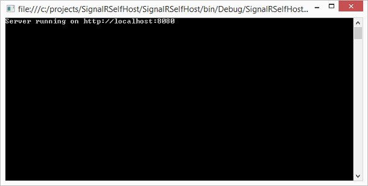
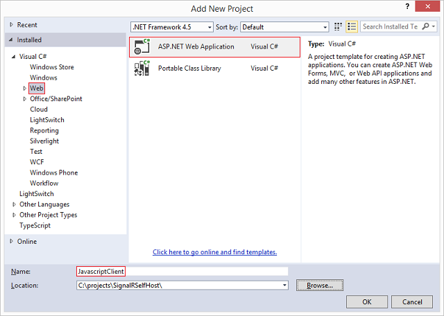
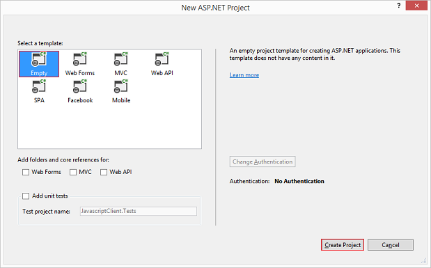
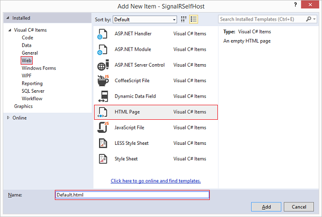
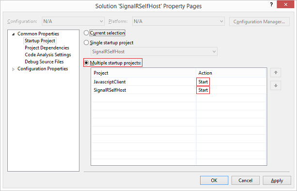

Tutorial: SignalR Self-Host
====================
by [Patrick Fletcher](https://github.com/pfletcher)

[Download Completed Project](http://code.msdn.microsoft.com/SignalR-Self-Host-Sample-6da0f383)

> This tutorial shows how to create a self-hosted SignalR 2 server, and how to connect to it with a JavaScript client.
> 
> ## Software versions used in the tutorial
> 
> 
> - [Visual Studio 2013](https://www.microsoft.com/visualstudio/eng/2013-downloads)
> - .NET 4.5
> - SignalR version 2
>   
> 
> 
> ## Using Visual Studio 2012 with this tutorial
> 
> 
> To use Visual Studio 2012 with this tutorial, do the following:
> 
> - Update your [Package Manager](http://docs.nuget.org/docs/start-here/installing-nuget) to the latest version.
> - Install the [Web Platform Installer](https://www.microsoft.com/web/downloads/platform.aspx).
> - In the Web Platform Installer, search for and install **ASP.NET and Web Tools 2013.1 for Visual Studio 2012**. This will install Visual Studio templates for SignalR classes such as **Hub**.
> - Some templates (such as **OWIN Startup Class**) will not be available; for these, use a Class file instead.
> 
> 
> ## Questions and comments
> 
> Please leave feedback on how you liked this tutorial and what we could improve in the comments at the bottom of the page. If you have questions that are not directly related to the tutorial, you can post them to the [ASP.NET SignalR forum](https://forums.asp.net/1254.aspx/1?ASP+NET+SignalR) or [StackOverflow.com](http://stackoverflow.com/).

## Overview

A SignalR server is usually hosted in an ASP.NET application in IIS, but it can also be self-hosted (such as in a console application or Windows service) using the self-host library. This library, like all of SignalR 2, is built on OWIN ([Open Web Interface for .NET](http://owin.org)). OWIN defines an abstraction between .NET web servers and web applications. OWIN decouples the web application from the server, which makes OWIN ideal for self-hosting a web application in your own process, outside of IIS.

Reasons for not hosting in IIS include:

- Environments where IIS is not available or desirable, such as an existing server farm without IIS.
- The performance overhead of IIS needs to be avoided.
- SignalR functionality is to be added to an exising application that runs in a Windows Service, Azure worker role, or other process.

If a solution is being developed as self-host for performance reasons, it's recommended to also test the application hosted in IIS to determine the performance benefit.

This tutorial contains the following sections:

- [Creating the server](#server)
- [Accessing the server with a JavaScript client](#js)

## Creating the server

In this tutorial, you'll create a server that's hosted in a console application, but the server can be hosted in any sort of process, such as a Windows service or Azure worker role. For sample code for hosting a SignalR server in a Windows Service, see [Self-Hosting SignalR in a Windows Service](https://code.msdn.microsoft.com/SignalR-self-hosted-in-6ff7e6c3).

1. Open Visual Studio 2013 with administrator privileges. Select **File**, **New Project**. Select **Windows** under the **Visual C#** node in the **Templates** pane, and select the **Console Application** template. Name the new project "SignalRSelfHost" and click **OK**.

    
2. Open the library package manager console by selecting **Tools**, **Library Package Manager**, **Package Manager Console**.
3. In the package manager console, enter the following command:

    [!code-powershell[Main](tutorial-signalr-self-host/samples/sample1.ps1)]

    This command adds the SignalR 2 Self-Host libraries to the project.
4. In the package manager console, enter the following command:

    [!code-powershell[Main](tutorial-signalr-self-host/samples/sample2.ps1)]

    This command adds the Microsoft.Owin.Cors library to the project. This library will be used for cross-domain support, which is required for applications that host SignalR and a web page client in different domains. Since you'll be hosting the SignalR server and the web client on different ports, this means that cross-domain must be enabled for communication between these components.
5. Replace the contents of Program.cs with the following code.

    [!code-csharp[Main](tutorial-signalr-self-host/samples/sample3.cs)]

    The above code includes three classes:

    - **Program**, including the **Main** method defining the primary path of execution. In this method, a web application of type **Startup** is started at the specified URL (`http://localhost:8080`). If security is required on the endpoint, SSL can be implemented. See [How to: Configure a Port with an SSL Certificate](https://msdn.microsoft.com/en-us/library/ms733791.aspx) for more information.
    - **Startup**, the class containing the configuration for the SignalR server (the only configuration this tutorial uses is the call to `UseCors`), and the call to `MapSignalR`, which creates routes for any Hub objects in the project.
    - **MyHub**, the SignalR Hub class that the application will provide to clients. This class has a single method, **Send**, that clients will call to broadcast a message to all other connected clients.
6. Compile and run the application. The address that the server is running should show in a console window.

    
7. If execution fails with the exception `System.Reflection.TargetInvocationException was unhandled`, you will need to restart Visual Studio with administrator privileges.
8. Stop the application before proceeding to the next section.

## Accessing the server with a JavaScript client

In this section, you'll use the same JavaScript client from the [Getting Started tutorial](../getting-started/tutorial-getting-started-with-signalr.md). We'll only make one modification to the client, which is to explicitly define the hub URL. With a self-hosted application, the server may not necessarily be at the same address as the connection URL (due to reverse proxies and load balancers), so the URL needs to be defined explicitly.

1. In **Solution Explorer**, right-click on the solution and select **Add**, **New Project**. Select the **Web** node, and select the **ASP.NET Web Application** template. Name the project "JavascriptClient" and click **OK**.

    
2. Select the **Empty** template, and leave the remaining options unselected. Select **Create Project**.

    
3. In the package manager console, select the "JavascriptClient" project in the **Default project** drop-down, and execute the following command:

    [!code-powershell[Main](tutorial-signalr-self-host/samples/sample4.ps1)]

    This command installs the SignalR and JQuery libraries that you'll need in the client.
4. Right-click on your project and select **Add**, **New Item**. Select the **Web** node, and select HTML Page. Name the page **Default.html**.

    
5. Replace the contents of the new HTML page with the following code. Verify that the script references here match the scripts in the Scripts folder of the project.

    [!code-html[Main](tutorial-signalr-self-host/samples/sample5.html?highlight=31-32)]

    The following code (highlighted in the code sample above) is the addition that you've made to the client used in the Getting Stared tutorial (in addition to upgrading the code to SignalR version 2 beta). This line of code explicitly sets the base connection URL for SignalR on the server.

    [!code-javascript[Main](tutorial-signalr-self-host/samples/sample6.js)]
6. Right-click on the solution, and select **Set Startup Projects...**. Select the **Multiple startup projects** radio button, and set both projects' **Action** to **Start**.

    
7. Right-click on "Default.html" and select **Set As Start Page**.
8. Run the application. The server and page will launch. You may need to reload the web page (or select **Continue** in the debugger) if the page loads before the server is started.
9. In the browser, provide a username when prompted. Copy the page's URL into another browser tab or window and provide a different username. You will be able to send messages from one browser pane to the other, as in the Getting Started tutorial.