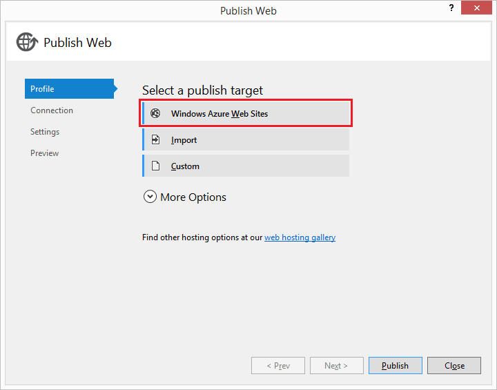
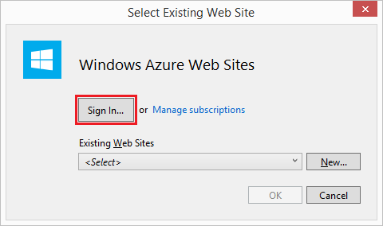
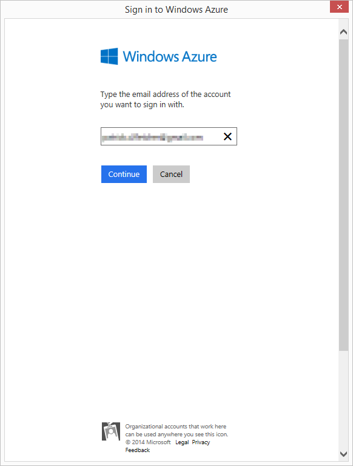
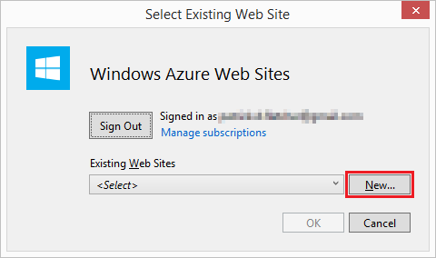
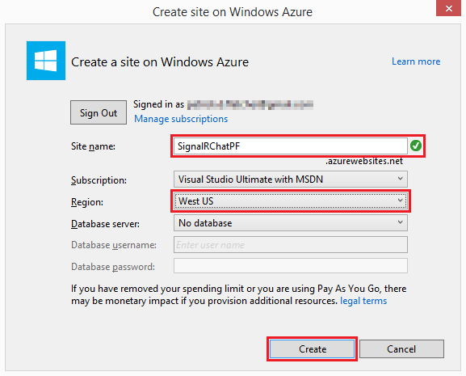
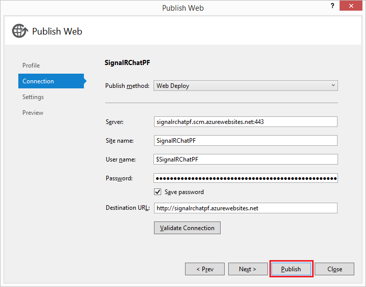
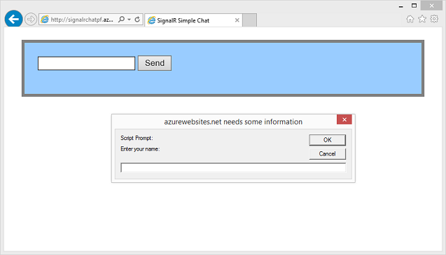
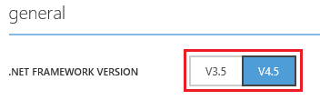
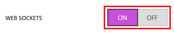

Using SignalR with Web Apps in Azure App Service
====================
by [Patrick Fletcher](https://github.com/pfletcher)

> This document describes how to configure a SignalR application that runs on Microsoft Azure.
> 
> ## Software versions used in the tutorial
> 
> 
> - [Visual Studio 2013](https://www.microsoft.com/visualstudio/eng/2013-downloads) or Visual Studio 2012
> - .NET 4.5
> - SignalR version 2
> - Azure SDK 2.3 for Visual Studio 2013 or 2012
>   
> 
> 
> ## Questions and comments
> 
> Please leave feedback on how you liked this tutorial and what we could improve in the comments at the bottom of the page. If you have questions that are not directly related to the tutorial, you can post them to the [ASP.NET SignalR forum](https://forums.asp.net/1254.aspx/1?ASP+NET+SignalR), [StackOverflow.com](http://stackoverflow.com/), or the [Microsoft Azure forums](https://social.msdn.microsoft.com/Forums/windowsazure/en-US/home?category=windowsazureplatform).

## Table of Contents

- [Introduction](#introduction)
- [Deploying a SignalR Web App to Azure App Service](#deploying)
- [Enabling WebSockets on Azure App Service](#websocket)
- [Using the Azure Redis Cache Backplane](#backplane)
- [Next Steps](#nextsteps)

## Introduction

ASP.NET SignalR can be used to bring a new level of interactivity between servers and web or .NET clients. When hosted in Azure, SignalR applications can take advantage of the highly available, scalable, and performant environment that running in the cloud provides.

## Deploying a SignalR Web App to Azure App Service

SignalR doesn't add any particular complications to deploying an application to Azure versus deploying to an on-premises server. An application that uses SignalR can be hosted in Azure without any changes in configuration or other settings (though for WebSockets support, see [Enabling WebSockets on Azure App Service](#websocket) below.) For this tutorial, you'll deploy the application created in the [Getting Started Tutorial](../getting-started/tutorial-getting-started-with-signalr.md) to Azure.

**Prerequisites**

- Visual Studio 2013. If you don't have Visual Studio, Visual Studio 2013 Express for Web is included in the install of the Azure SDK.
- [Azure SDK 2.3 for Visual Studio 2013](https://go.microsoft.com/fwlink/?linkid=324322&clcid=0x409) or [Azure SDK 2.3 for Visual Studio 2012](https://go.microsoft.com/fwlink/p/?linkid=323511).
- To complete this tutorial, you will need an Azure subscription. You can [activate your MSDN subscriber benefits](https://azure.microsoft.com/en-us/pricing/member-offers/msdn-benefits-details/), or [sign up for a trial subscription](https://azure.microsoft.com/en-us/pricing/free-trial/).

### Deploying a SignalR web app to Azure

1. Complete the [Getting Started Tutorial](../getting-started/tutorial-getting-started-with-signalr.md), or download the finished project from [Code Gallery](https://code.msdn.microsoft.com/SignalR-Getting-Started-b9d18aa9).
2. In Visual Studio, select **Build**, **Publish SignalR Chat**.
3. In the "Publish Web" dialog, select "Windows Azure Web Sites".

    
4. If you aren't signed in to your Microsoft account, click **Sign In...** in the "Select Existing Web Site" dialog, and sign in.

        
5. In the "Select Existing Web Site" dialog, click **New**.

    
6. In the "Create site on Windows Azure" dialog, enter a unique app name. Select the region closest to you in the Region dropdown. Click **Create**.

    
7. In the "Publish Web" dialog, click **Publish**.

    
8. When the app has completed publishing, the SignalR Chat application hosted in Azure App Service Web Apps will open in a browser.

    

### Enabling WebSockets on Azure App Service Web Apps

WebSockets needs to be explicitly enabled in your web app to be used in a SignalR application; otherwise, other protocols will be used (See [Transports and Fallbacks](../getting-started/introduction-to-signalr.md#transports) for details).

In order to use WebSockets on Azure App Service Web Apps, enable it in the configuration section of the web app. To do this, open your web app in the [Azure Management Portal](https://manage.windowsazure.com/), and select Configure.

At the top of the configuration page, ensure that .NET 4.5 is used for your web app.

On the configuration page, in the **WebSockets** setting, select **On**.

At the bottom of the Configuration page, select **Save** to save your changes.

## Using the Azure Redis Cache Backplane

If you use multiple instances for your web app, and the users of those instances need to interact with one another (so that, for instance, chat messages created in one instance can reach the users connected to other instances), the [Azure Redis Cache backplane](../performance/scaleout-with-redis.md) must be implemented in your application.

## Next Steps

For more information on Web Apps in Azure App Service, see [Web Apps overview](https://azure.microsoft.com/en-us/documentation/articles/app-service-web-overview/).