Hands On Lab: Real-Time Web Applications with SignalR
====================
by [Web Camps Team](https://twitter.com/webcamps)

[Download Web Camps Training Kit](http://aka.ms/webcamps-training-kit)

> Real-time Web applications feature the ability to push server-side content to the connected clients as it happens, in real-time. For ASP.NET developers, **ASP.NET SignalR** is a library to add real-time web functionality to their applications. It takes advantage of several transports, automatically selecting the best available transport given the client and server's best available transport. It takes advantage of **WebSocket**, an HTML5 API that enables bi-directional communication between the browser and server.
> 
> **SignalR** also provides a simple, high-level API for doing server to client RPC (call JavaScript functions in your clients' browsers from server-side .NET code) in your ASP.NET application, as well as adding useful hooks for connection management, such as connect/disconnect events, grouping connections, and authorization.
> 
> **SignalR** is an abstraction over some of the transports that are required to do real-time work between client and server. A **SignalR** connection starts as HTTP, and is then promoted to a **WebSocket** connection if available. **WebSocket** is the ideal transport for **SignalR**, since it makes the most efficient use of server memory, has the lowest latency, and has the most underlying features (such as full duplex communication between client and server), but it also has the most stringent requirements: **WebSocket** requires the server to be using **Windows Server 2012** or **Windows 8**, along with **.NET Framework 4.5**. If these requirements are not met, **SignalR** will attempt to use other transports to make its connections (like *Ajax long polling*).
> 
> The **SignalR** API contains two models for communicating between clients and servers: **Persistent Connections** and **Hubs**. A **Connection** represents a simple endpoint for sending single-recipient, grouped, or broadcast messages. A **Hub** is a more high-level pipeline built upon the Connection API that allows your client and server to call methods on each other directly.
> 
> 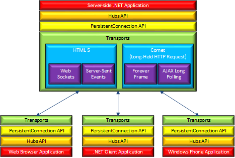
> 
> All sample code and snippets are included in the Web Camps Training Kit, available at [http://aka.ms/webcamps-training-kit](http://aka.ms/webcamps-training-kit).

## Overview

### Objectives

In this hands-on lab, you will learn how to:

- Send notifications from server to client using SignalR.
- Scale Out your SignalR application using **SQL Server**.

### Prerequisites

The following is required to complete this hands-on lab:

- [Visual Studio Express 2013 for Web](https://www.microsoft.com/visualstudio/) or greater

### Setup

In order to run the exercises in this hands-on lab, you will need to set up your environment first.

1. Open a Windows Explorer window and browse to the lab's **Source** folder.
2. Right-click **Setup.cmd** and select **Run as administrator** to launch the setup process that will configure your environment and install the Visual Studio code snippets for this lab.
3. If the User Account Control dialog box is shown, confirm the action to proceed.

> [!NOTE]
> Make sure you have checked all the dependencies for this lab before running the setup.

### Using the Code Snippets

Throughout the lab document, you will be instructed to insert code blocks. For your convenience, most of this code is provided as Visual Studio Code Snippets, which you can access from within Visual Studio 2013 to avoid having to add it manually.

> [!NOTE]
> Each exercise is accompanied by a starting solution located in the **Begin** folder of the exercise that allows you to follow each exercise independently of the others. Please be aware that the code snippets that are added during an exercise are missing from these starting solutions and may not work until you have completed the exercise. Inside the source code for an exercise, you will also find an **End** folder containing a Visual Studio solution with the code that results from completing the steps in the corresponding exercise. You can use these solutions as guidance if you need additional help as you work through this hands-on lab.

* * *

## Exercises

This hands-on lab includes the following exercises:

1. [Working with Real-Time Data Using SignalR](#Exercise1)
2. [Scaling Out Using SQL Server](#Exercise2)

Estimated time to complete this lab: **60 minutes**

> [!NOTE]
> When you first start Visual Studio, you must select one of the predefined settings collections. Each predefined collection is designed to match a particular development style and determines window layouts, editor behavior, IntelliSense code snippets, and dialog box options. The procedures in this lab describe the actions necessary to accomplish a given task in Visual Studio when using the **General Development Settings** collection. If you choose a different settings collection for your development environment, there may be differences in the steps that you should take into account.

### Exercise 1: Working with Real-Time Data Using SignalR

While chat is often used as an example, you can do a whole lot more with real-time Web functionality. Any time a user refreshes a web page to see new data or the page implements Ajax long polling to retrieve new data, you can use SignalR.

SignalR supports **server push** or **broadcasting** functionality; it handles connection management automatically. In classic HTTP connections for client-server communication, connection is re-established for each request, but SignalR provides persistent connection between the client and server. In SignalR the server code calls out to a client code in the browser using Remote Procedure Calls (RPC), rather than the request-response model we know today.

In this exercise, you will configure the **Geek Quiz** application to use SignalR to display the Statistics dashboard with the updated metrics without the need to refresh the entire page.

#### Task 1 – Exploring the Geek Quiz Statistics Page

In this task, you will go through the application and verify how the statistics page is shown and how you can improve the way the information is updated.

1. Open **Visual Studio Express 2013 for Web** and open the **GeekQuiz.sln** solution located in the **Source\Ex1-WorkingWithRealTimeData\Begin** folder.
2. Press **F5** to run the solution. The **Log in** page should appear in the browser.

    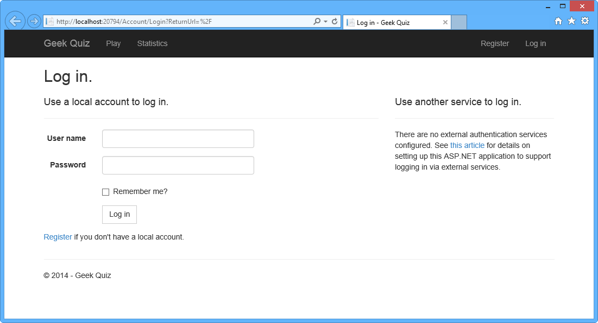

    *Running the solution*
3. Click **Register** in the upper-right corner of the page to create a new user in the application.

    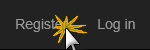

    *Register link*
4. In the **Register** page, enter a **User name** and **Password**, and then click **Register**.

    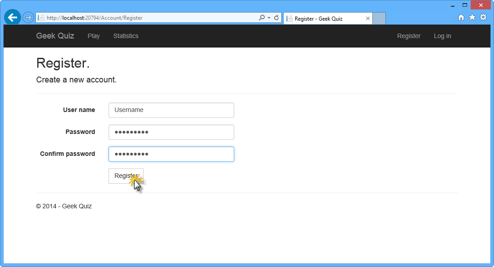

    *Registering a user*
5. The application registers the new account and the user is authenticated and redirected back to the home page showing the first quiz question.
6. Open the **Statistics** page in a new window and put the **Home** page and **Statistics** page side-by-side.

    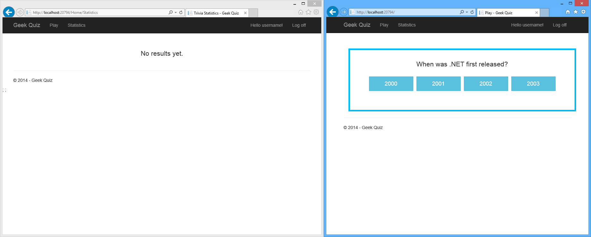

    *Side-by-side windows*
7. In the **Home** page, answer the question by clicking one of the options.

    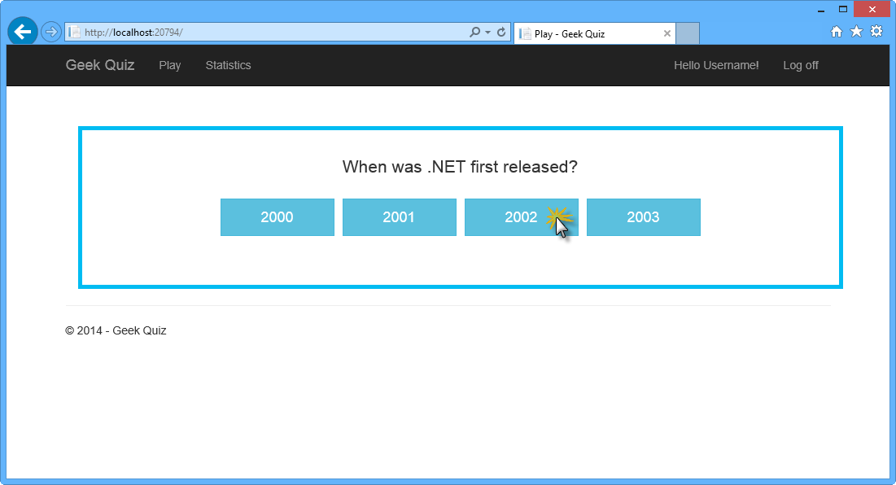

    *Answering a question*
8. After clicking one of the buttons, the answer should appear.

    

    *Question answered correctly*
9. Notice that the information provided in the Statistics page is outdated. Refresh the page in order to see the updated results.

    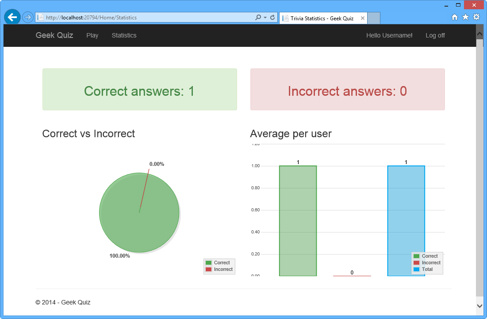

    *Statistics page*
10. Go back to Visual Studio and stop debugging.

#### Task 2 – Adding SignalR to Geek Quiz to Show Online Charts

In this task, you will add SignalR to the solution and send updates to the clients automatically when a new answer is sent to the server.

1. From the **Tools** menu in Visual Studio, select **Library Package Manager**, and then click **Package Manager Console**.
2. In the **Package Manager Console** window, execute the following command:

    [!code-powershell[Main](real-time-web-applications-with-signalr/samples/sample1.ps1)]

    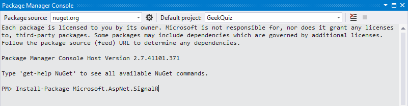

    *SignalR package installation*

    > [!NOTE]
    > When installing **SignalR** NuGet packages version 2.0.2 from a brand new MVC 5 application, you will need to manually update **OWIN** packages to version 2.0.1 (or higher) before installing SignalR. To do this, you can execute the following script in the **Package Manager Console**:
    > 
    > [!code-powershell[Main](real-time-web-applications-with-signalr/samples/sample2.ps1)]
    > 
    > In a future release of SignalR, OWIN dependencies will be automatically updated.
3. In **Solution Explorer**, expand the **Scripts** folder and notice that the SignalR *js* files were added to the solution.

    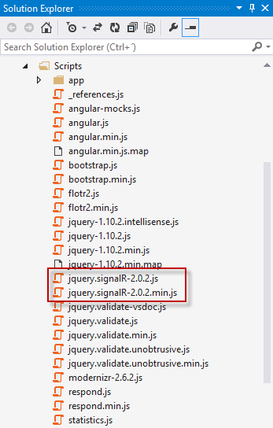

    *SignalR JavaScript references*
4. In **Solution Explorer**, right-click the **GeekQuiz** project, select **Add** | **New Folder**, and name it **Hubs**.
5. Right-click the **Hubs** folder and select **Add | New Item**.

    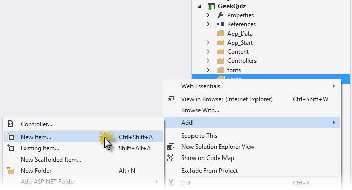

    *Add new item*
6. In the **Add New Item** dialog box, select the **Visual C# | Web | SignalR** node in the left pane, select **SignalR Hub Class (v2)** from the center pane, name the file **StatisticsHub.cs** and click **Add**.

    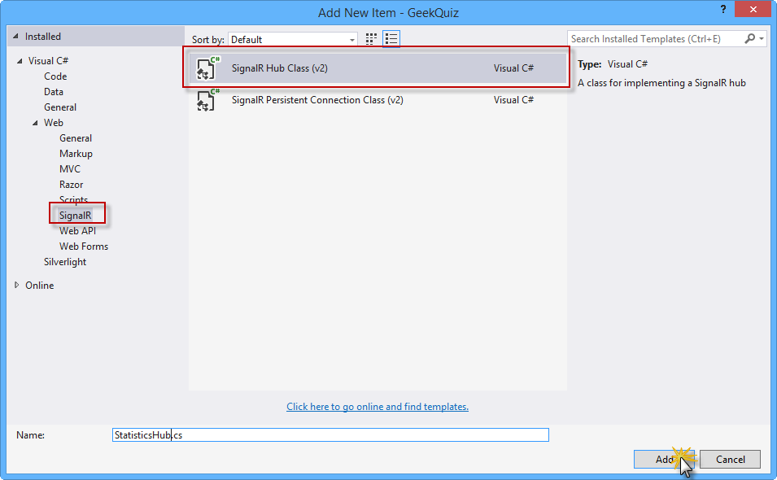

    *Add new item dialog box*
7. Replace the code in the **StatisticsHub** class with the following code.

    (Code Snippet - *RealTimeSignalR - Ex1 - StatisticsHubClass*)

    [!code-csharp[Main](real-time-web-applications-with-signalr/samples/sample3.cs)]
8. Open **Startup.cs** and add the following line at the end of the **Configuration** method.

    (Code Snippet - *RealTimeSignalR - Ex1 - MapSignalR*)

    [!code-csharp[Main](real-time-web-applications-with-signalr/samples/sample4.cs)]
9. Open the **StatisticsService.cs** page inside the **Services** folder and add the following using directives.

    (Code Snippet - *RealTimeSignalR - Ex1 - UsingDirectives*)

    [!code-csharp[Main](real-time-web-applications-with-signalr/samples/sample5.cs)]
10. To notify connected clients of updates, you first retrieve a **Context** object for the current connection. The **Hub** object contains methods to send messages to a single client or broadcast to all connected clients. Add the following method to the **StatisticsService** class to broadcast the statistics data.

    (Code Snippet - *RealTimeSignalR - Ex1 - NotifyUpdatesMethod*)

    [!code-csharp[Main](real-time-web-applications-with-signalr/samples/sample6.cs)]

    > [!NOTE]
    > In the code above, you are using an arbitrary method name to call a function on the client (i.e.: *updateStatistics*). The method name that you specify is interpreted as a dynamic object, which means there is no IntelliSense or compile-time validation for it. The expression is evaluated at run time. When the method call executes, SignalR sends the method name and the parameter values to the client. If the client has a method that matches the name, that method is called and the parameter values are passed to it. If no matching method is found on the client, no error is raised. For more information, refer to [ASP.NET SignalR Hubs API Guide](../guide-to-the-api/hubs-api-guide-server.md).
11. Open the **TriviaController.cs** page inside the **Controllers** folder and add the following using directives.

    [!code-csharp[Main](real-time-web-applications-with-signalr/samples/sample7.cs)]
12. Add the following highlighted code to the **Post** action method.

    (Code Snippet - *RealTimeSignalR - Ex1 - NotifyUpdatesCall*)

    [!code-csharp[Main](real-time-web-applications-with-signalr/samples/sample8.cs)]
13. Open the **Statistics.cshtml** page inside the **Views | Home** folder. Locate the **Scripts** section and add the following script references at the beginning of the section.

    (Code Snippet - *RealTimeSignalR - Ex1 - SignalRScriptReferences*)

    [!code-cshtml[Main](real-time-web-applications-with-signalr/samples/sample9.cshtml)]

    > [!NOTE]
    > When you add SignalR and other script libraries to your Visual Studio project, the Package Manager might install a version of the SignalR script file that is more recent than the version shown in this topic. Make sure that the script reference in your code matches the version of the script library installed in your project.
14. Add the following highlighted code to connect the client to the SignalR hub and update the statistics data when a new message is received from the hub.

    (Code Snippet - *RealTimeSignalR - Ex1 - SignalRClientCode*)

    [!code-cshtml[Main](real-time-web-applications-with-signalr/samples/sample10.cshtml)]

    In this code, you are creating a Hub Proxy and registering an event handler to listen for messages sent by the server. In this case, you listen for messages sent through the *updateStatistics* method.

#### Task 3 – Running the Solution

In this task, you will run the solution to verify that the statistics view is updated automatically using SignalR after answering a new question.

1. Press **F5** to run the solution.

    > [!NOTE]
    > If not already logged in to the application, log in with the user you created in Task 1.
2. Open the **Statistics** page in a new window and put the **Home** page and **Statistics** page side-by-side as you did in Task 1.
3. In the **Home** page, answer the question by clicking one of the options.

    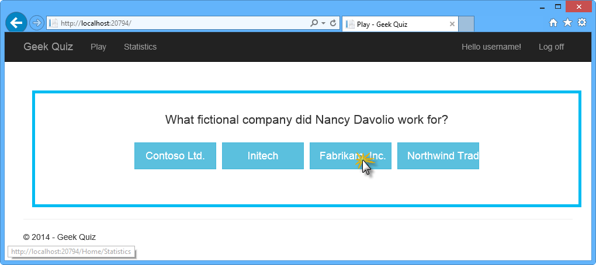

    *Answering another question*
4. After clicking one of the buttons, the answer should appear. Notice that the Statistics information on the page is updated automatically after answering the question with the updated information without the need to refresh the entire page.

    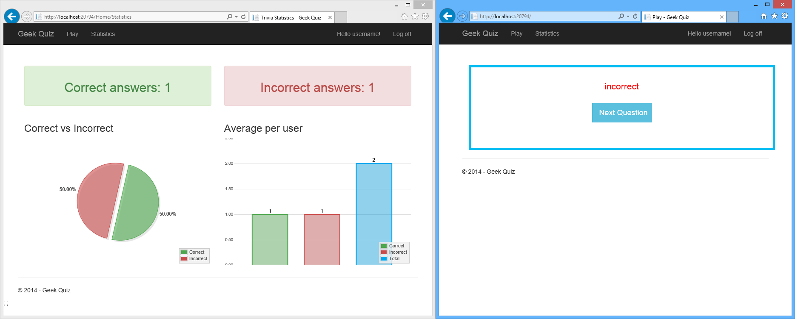

    *Statistics page refreshed after answer*

### Exercise 2: Scaling Out Using SQL Server

When scaling a web application, you can generally choose between *scaling up* and *scaling out* options. *Scale up* means using a larger server, with more resources (CPU, RAM, etc.) while *scale out* means adding more servers to handle the load. The problem with the latter is that the clients can get routed to different servers. A client that is connected to one server will not receive messages sent from another server.

You can solve these issues by using a component called *backplane*, to forward messages between servers. With a backplane enabled, each application instance sends messages to the backplane, and the backplane forwards them to the other application instances.

There are currently three types of backplanes for SignalR:

- **Windows Azure Service Bus**. Service Bus is a messaging infrastructure that allows components to send loosely coupled messages.
- **SQL Server**. The SQL Server backplane writes messages to SQL tables. The backplane uses Service Broker for efficient messaging. However, it also works if Service Broker is not enabled.
- **Redis**. Redis is an in-memory key-value store. Redis supports a publish/subscribe ("pub/sub") pattern for sending messages.

Every message is sent through a message bus. A message bus implements the [IMessageBus](https://msdn.microsoft.com/en-us/library/microsoft.aspnet.signalr.messaging.imessagebus(v=vs.100).aspx) interface, which provides a publish/subscribe abstraction. The backplanes work by replacing the default **IMessageBus** with a bus designed for that backplane.

Each server instance connects to the backplane through the bus. When a message is sent, it goes to the backplane, and the backplane sends it to every server. When a server receives a message from the backplane, it stores the message in its local cache. The server then delivers messages to clients from its local cache.

For more information about how the SignalR backplane works, read this [article](../performance/scaleout-in-signalr.md).

> [!NOTE]
> There are some scenarios where a backplane can become a bottleneck. Here are some typical SignalR scenarios:
> 
> - [Server broadcast](tutorial-server-broadcast-with-signalr.md) (e.g., stock ticker): Backplanes work well for this scenario, because the server controls the rate at which messages are sent.
> - [Client-to-client](tutorial-getting-started-with-signalr.md) (e.g., chat): In this scenario, the backplane might be a bottleneck if the number of messages scales with the number of clients; that is, if the rate of messages grows proportionally as more clients join.
> - [High-frequency realtime](tutorial-high-frequency-realtime-with-signalr.md) (e.g., real-time games): A backplane is not recommended for this scenario.

In this exercise, you will use **SQL Server** to distribute messages across the **Geek Quiz** application. You will run these tasks on a single test machine to learn how to set up the configuration, but in order to get the full effect, you will need to deploy the SignalR application to two or more servers. You must also install SQL Server on one of the servers, or on a separate dedicated server.

#### Task 1 - Understanding the Scenario

In this task, you will run 2 instances of **Geek Quiz** simulating multiple IIS instances on your local machine. In this scenario, when answering trivia questions on one application, update won't be notified on the statistics page of the second instance. This simulation resembles an environment where your application is deployed on multiple instances and using a load balancer to communicate with them.

1. Open the **Begin.sln** solution located in the **Source/Ex2-ScalingOutWithSQLServer/Begin** folder. Once loaded, you will notice on the **Server Explorer** that the solution has two projects with identical structures but different names. This will simulate running two instances of the same application on your local machine.

    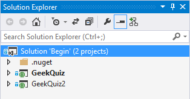

    *Begin Solution Simulating 2 Instances of Geek Quiz*
2. Open the properties page of the solution by right-clicking the solution node and selecting **Properties**. Under **Startup Project**, select **Multiple startup projects** and change the **Action** value for both projects to *Start*.

    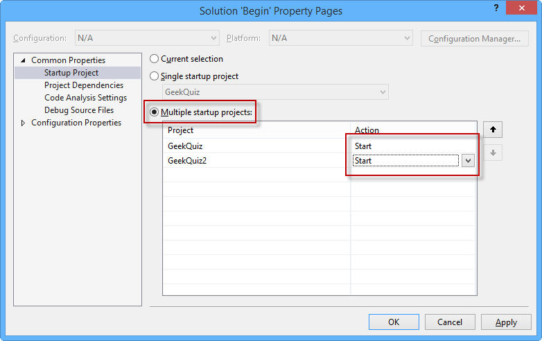

    *Starting Multiple Projects*
3. Press **F5** to run the solution. The application will launch two instances of **Geek Quiz** in different ports, simulating multiple instances of the same application. Pin one of the browsers on left and the other on the right of your screen. Log in with your credentials or register a new user. Once logged in, keep the Trivia page on the left and go to the **Statistics** page in the browser on the right.

    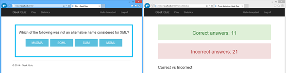

    *Geek Quiz Side by Side*

    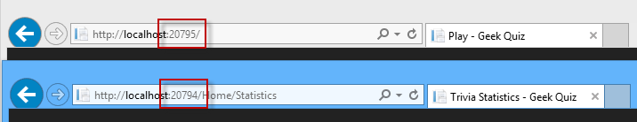

    *Geek Quiz in Different Ports*
4. Start answering questions in the left browser and you will notice that the **Statistics** page in the right browser is not being updated. This is because **SignalR** uses a local cache to distribute messages across their clients and this scenario is simulating multiple instances, therefore the cache is not shared between them. You can verify that **SignalR** is working by testing the same steps but using a single app. In the following tasks you will configure a backplane to replicate the messages across instances.
5. Go back to Visual Studio and stop debugging.

#### Task 2 – Creating the SQL Server Backplane

In this task, you will create a database that will serve as a backplane for the **Geek Quiz** application. You will use **SQL Server Object Explorer** to browse your server and initialize the database. Additionally, you will enable the **Service Broker**.

1. In **Visual Studio**, open menu **View** and select **SQL Server Object Explorer**.
2. Connect to your LocalDB instance by right-clicking the **SQL Server** node and selecting **Add SQL Server...** option.

    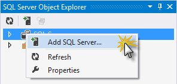

    *Adding a SQL Server instance to SQL Server Object Explorer*
3. Set the **server name** to *(localdb)\v11.0* and leave **Windows Authentication** as your authentication mode. Click **Connect** to continue.

    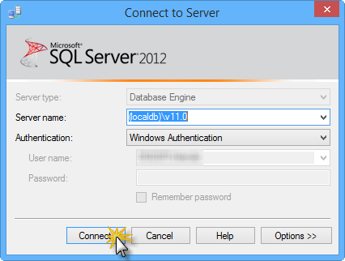

    *Connecting to LocalDB*
4. Now that you are connected to your LocalDB instance, you will need to create a database that will represent the SQL Server backplane for SignalR. To do this, right-click the **Databases** node and select **Add New Database**.

    

    *Adding a new database*
5. Set the database name to *SignalR* and click **OK** to create it.

    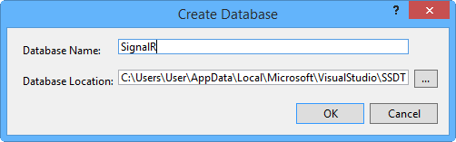

    *Creating the SignalR database*

    > [!NOTE]
    > You can choose any name for the database.
6. To receive updates more efficiently from the backplane, it is recommended to enable Service Broker for the database. Service Broker provides native support for messaging and queuing in SQL Server. The backplane also works without Service Broker. Open a new query by right-clicking the database and select **New Query**.

    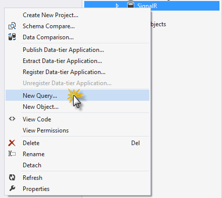

    *Opening a New Query*
7. To check whether Service Broker is enabled, query the **is\_broker\_enabled** column in the **sys.databases** catalog view. Execute the following script in the recently opened query window.

    [!code-sql[Main](real-time-web-applications-with-signalr/samples/sample11.sql)]

    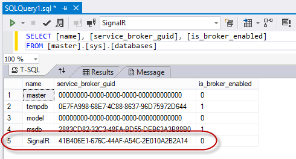

    *Querying the Service Broker Status*
8. If the value of the **is\_broker\_enabled** column in your database is &quot;0&quot;, use the following command to enable it. Replace **&lt;YOUR-DATABASE&gt;** with the name you set when creating the database (e.g.: SignalR).

    [!code-sql[Main](real-time-web-applications-with-signalr/samples/sample12.sql)]

    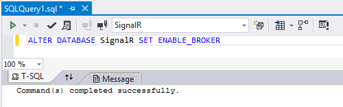

    *Enabling Service Broker*

    > [!NOTE]
    > If this query appears to deadlock, make sure there are no applications connected to the DB.

#### Task 3 – Configuring the SignalR Application

In this task, you will configure **Geek Quiz** to connect to the SQL Server backplane. You will first add the **SignalR.SqlServer** NuGet package and set the connection string to your backplane database.

1. Open the **Package Manager Console** from **Tools** | **Library Package Manager**. Make sure that **GeekQuiz** project is selected in the **Default project** drop-down list. Type the following command to install the **Microsoft.AspNet.SignalR.SqlServer** NuGet package.

    [!code-powershell[Main](real-time-web-applications-with-signalr/samples/sample13.ps1)]
2. Repeat the previous step but this time for project **GeekQuiz2**.
3. To configure the SQL Server backplane, open the **Startup.cs** file of the **GeekQuiz** project and add the following code to the **Configure** method. Replace **&lt;YOUR-DATABASE&gt;** with your database name you used when creating the SQL Server backplane. Repeat this step for the **GeekQuiz2** project.

    (Code Snippet - *RealTimeSignalR - Ex2 - StartupConfiguration*)

    [!code-csharp[Main](real-time-web-applications-with-signalr/samples/sample14.cs)]
4. Now that both projects are configured to use the SQL Server backplane, press **F5** to run them simultaneously.
5. Again, **Visual Studio** will launch two instances of **Geek Quiz** in different ports. Pin one of the browsers on the left and the other on the right of your screen and log in with your credentials. Keep the Trivia page on the left and go to **Statistics** pagein the right browser.
6. Start answering questions in the left browser. This time, the **Statistics** page is updated thanks to the backplane. Switch between applications (**Statistics** is now on the left, and **Trivia** is on the right) and repeat the test to validate that it is working for both instances. The backplane serves as a *shared cache* of messages for each connected server, and each server will store the messages in their own local cache to distribute to connected clients.
7. Go back to Visual Studio and stop debugging.
8. The SQL Server backplane component automatically generates the necessary tables on the specified database. In the **SQL Server Object Explorer** panel, open the database you created for the backplane (e.g.: SignalR) and expand its tables. You should see the following tables:

    

    *Backplane Generated Tables*
9. Right-click the **SignalR.Messages\_0** table and select **View Data**.

    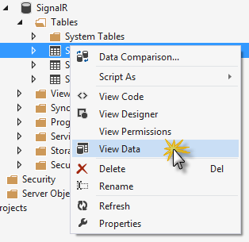

    *View SignalR Backplane Messages Table*
10. You can see the different messages sent to the **Hub** when answering the trivia questions. The backplane distributes these messages to any connected instance.

    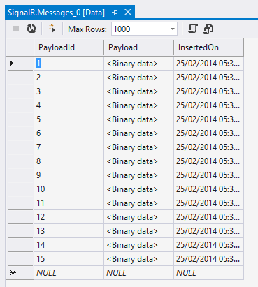

    *Backplane Messages Table*

* * *

## Summary

In this hands-on lab, you have learned how to add **SignalR** to your application and send notifications from the server to your connected clients using **Hubs**. Additionally, you learned how to scale out your application by using a *backplane* component when your application is deployed in multiple IIS instances.