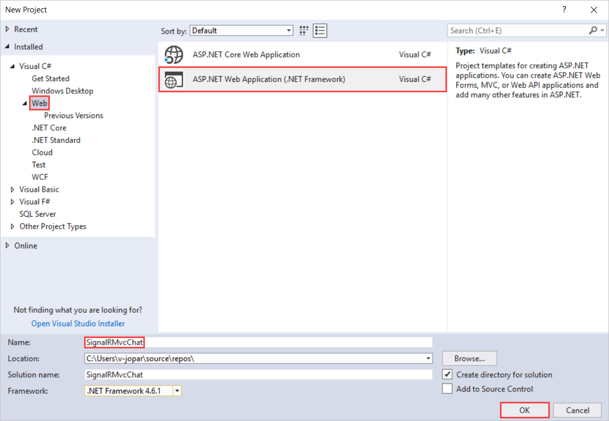
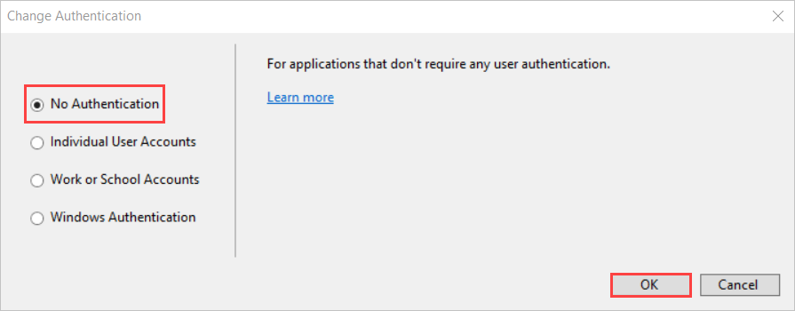
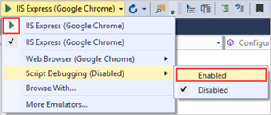
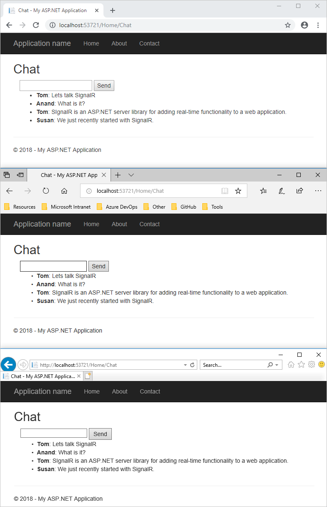
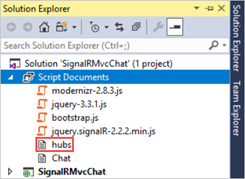
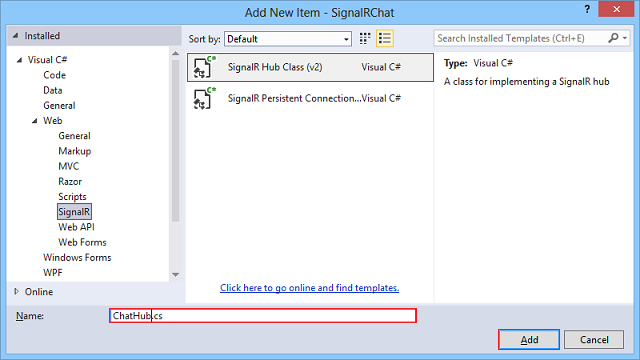
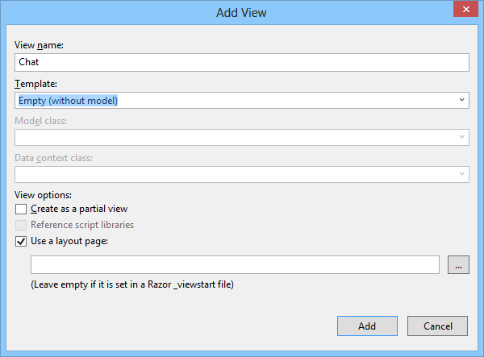
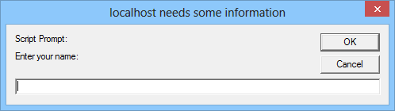
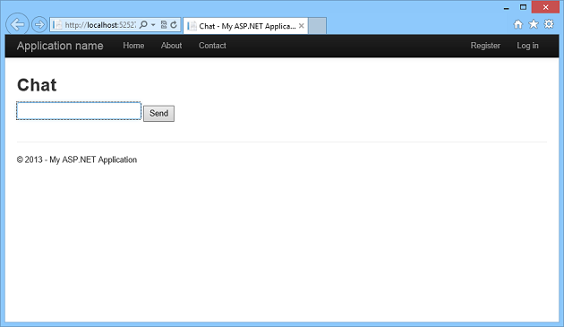

Tutorial: Getting Started with SignalR 2 and MVC 5
====================
by [Patrick Fletcher](https://github.com/pfletcher), [Tim Teebken](https://github.com/timlt)

[Download Completed Project](http://code.msdn.microsoft.com/Getting-Started-with-c366b2f3)

> This tutorial shows how to use ASP.NET SignalR 2 to create a real-time chat application. You will add SignalR to an MVC 5 application and create a chat view to send and display messages. 
> 
> ## Software versions used in the tutorial
> 
> 
> - [Visual Studio 2013](https://www.microsoft.com/visualstudio/eng/2013-downloads)
> - .NET 4.5
> - MVC 5
> - SignalR version 2
>   
> 
> 
> ## Using Visual Studio 2012 with this tutorial
> 
> 
> To use Visual Studio 2012 with this tutorial, do the following:
> 
> - Update your [Package Manager](http://docs.nuget.org/docs/start-here/installing-nuget) to the latest version.
> - Install the [Web Platform Installer](https://www.microsoft.com/web/downloads/platform.aspx).
> - In the Web Platform Installer, search for and install **ASP.NET and Web Tools 2013.1 for Visual Studio 2012**. This will install Visual Studio templates for SignalR classes such as **Hub**.
> - Some templates (such as **OWIN Startup Class**) will not be available; for these, use a Class file instead.
> 
> 
> ## Tutorial Versions
> 
> For information about earlier versions of SignalR, see [SignalR Older Versions](../older-versions/index.md).
> 
> ## Questions and comments
> 
> Please leave feedback on how you liked this tutorial and what we could improve in the comments at the bottom of the page. If you have questions that are not directly related to the tutorial, you can post them to the [ASP.NET SignalR forum](https://forums.asp.net/1254.aspx/1?ASP+NET+SignalR) or [StackOverflow.com](http://stackoverflow.com/).

## Overview

This tutorial introduces you to real-time web application development with ASP.NET SignalR 2 and ASP.NET MVC 5. The tutorial uses the same chat application code as the [SignalR Getting Started tutorial](tutorial-getting-started-with-signalr.md), but shows how to add it to an MVC 5 application.

In this topic you will learn the following SignalR development tasks:

- Adding the SignalR library to an MVC 5 application.
- Creating hub and OWIN startup classes to push content to clients.
- Using the SignalR jQuery library in a web page to send messages and display updates from the hub.

The following screen shot shows the completed chat application running in a browser.

Sections:

- [Set up the Project](#setup)
- [Run the Sample](#run)
- [Examine the Code](#code)
- [Next Steps](#next)

## Set up the Project

Prerequisites:

- Visual Studio 2013. If you do not have Visual Studio, see [ASP.NET Downloads](https://www.asp.net/downloads) to get the free Visual Studio 2013 Express Development Tool.

This section shows how to create an ASP.NET MVC 5 application, add the SignalR library, and create the chat application.

1. In Visual Studio, create a C# ASP.NET application that targets .NET Framework 4.5, name it SignalRChat, and click OK.

    
2. In the `New ASP.NET Project` dialog, and select **MVC**, and click **Change Authentication**.

    
3. Select **No Authentication** in the **Change Authentication** dialog, and click **OK**.

    

    > [!NOTE]
    > If you select a different authentication provider for your application, a `Startup.cs` class will be created for you; you will not need to create your own `Startup.cs` class in step 10 below.
4. Click **OK** in the **New ASP.NET Project** dialog.
5. Open the **Tools | Library Package Manager | Package Manager Console** and run the following command. This step adds to the project a set of script files and assembly references that enable SignalR functionality.

    `install-package Microsoft.AspNet.SignalR`
6. In **Solution Explorer**, expand the Scripts folder. Note that script libraries for SignalR have been added to the project.

    
7. In **Solution Explorer**, right-click the project, select **Add | New Folder**, and add a new folder named **Hubs**.
8. Right-click the **Hubs** folder, click **Add | New Item**, select the **Visual C# | Web | SignalR** node in the **Installed** pane, select **SignalR Hub Class (v2)** from the center pane, and create a new hub named **ChatHub.cs**. You will use this class as a SignalR server hub that sends messages to all clients.

    
9. Replace the code in the **ChatHub** class with the following code.

    [!code-csharp[Main](tutorial-getting-started-with-signalr-and-mvc/samples/sample1.cs)]
10. Create a new class called Startup.cs. Change the contents of the file to the following.

    [!code-csharp[Main](tutorial-getting-started-with-signalr-and-mvc/samples/sample2.cs)]
11. Edit the `HomeController` class found in **Controllers/HomeController.cs** and add the following method to the class. This method returns the **Chat** view that you will create in a later step.

    [!code-csharp[Main](tutorial-getting-started-with-signalr-and-mvc/samples/sample3.cs)]
12. Right-click the **Views/Home** folder, and select **Add... | View**.
13. In the **Add View** dialog, name the new view **Chat**.

    
14. Replace the contents of **Chat.cshtml** with the following code.

    > [!IMPORTANT]
    > When you add SignalR and other script libraries to your Visual Studio project, the Package Manager might install a version of the SignalR script file that is more recent than the version shown in this topic. Make sure that the script reference in your code matches the version of the script library installed in your project.

    [!code-cshtml[Main](tutorial-getting-started-with-signalr-and-mvc/samples/sample4.cshtml)]
15. **Save All** for the project.

## Run the Sample

1. Press F5 to run the project in debug mode.
2. In the browser address line, append **/home/chat** to the URL of the default page for the project. The Chat page loads in a browser instance and prompts for a user name.

    
3. Enter a user name.
4. Copy the URL from the address line of the browser and use it to open two more browser instances. In each browser instance, enter a unique user name.
5. In each browser instance, add a comment and click **Send**. The comments should display in all browser instances.

    > [!NOTE]
    > This simple chat application does not maintain the discussion context on the server. The hub broadcasts comments to all current users. Users who join the chat later will see messages added from the time they join.
6. The following screen shot shows the chat application running in a browser.

    
7. In **Solution Explorer**, inspect the **Script Documents** node for the running application. This node is visible in debug mode if you are using Internet Explorer as your browser. There is a script file named **hubs** that the SignalR library dynamically generates at runtime. This file manages the communication between jQuery script and server-side code. If you use a browser other than Internet Explorer, you can also access the dynamic **hubs** file by browsing to it directly, for example http://mywebsite/signalr/hubs.

## Examine the Code

The SignalR chat application demonstrates two basic SignalR development tasks: creating a hub as the main coordination object on the server, and using the SignalR jQuery library to send and receive messages.

### SignalR Hubs

In the code sample the **ChatHub** class derives from the **Microsoft.AspNet.SignalR.Hub** class. Deriving from the **Hub** class is a useful way to build a SignalR application. You can create public methods on your hub class and then access those methods by calling them from scripts in a web page.

In the chat code, clients call the **ChatHub.Send** method to send a new message. The hub in turn sends the message to all clients by calling **Clients.All.addNewMessageToPage**.

The **Send** method demonstrates several hub concepts :

- Declare public methods on a hub so that clients can call them.
- Use the **Microsoft.AspNet.SignalR.Hub.Clients** property to access all clients connected to this hub.
- Call a function on the client (such as the `addNewMessageToPage` function) to update clients.

    [!code-csharp[Main](tutorial-getting-started-with-signalr-and-mvc/samples/sample5.cs)]

### SignalR and jQuery

The **Chat.cshtml** view file in the code sample shows how to use the SignalR jQuery library to communicate with a SignalR hub. The essential tasks in the code are creating a reference to the auto-generated proxy for the hub, declaring a function that the server can call to push content to clients, and starting a connection to send messages to the hub.

The following code declares a reference to a hub proxy.

[!code-javascript[Main](tutorial-getting-started-with-signalr-and-mvc/samples/sample6.js)]

> [!NOTE]
> In JavaScript the reference to the server class and its members is in camel case. The code sample references the C# **ChatHub** class in JavaScript as **chatHub**. If you want to reference the `ChatHub` class in jQuery with conventional Pascal casing as you would in C#, edit the ChatHub.cs class file. Add a `using` statement to reference the `Microsoft.AspNet.SignalR.Hubs` namespace. Then add the `HubName` attribute to the `ChatHub` class, for example `[HubName("ChatHub")]`. Finally, update your jQuery reference to the `ChatHub` class.

The following code shows how to create a callback function in the script. The hub class on the server calls this function to push content updates to each client. The optional call to the `htmlEncode` function shows a way to HTML encode the message content before displaying it in the page, as a way to prevent script injection.

[!code-html[Main](tutorial-getting-started-with-signalr-and-mvc/samples/sample7.html)]

The following code shows how to open a connection with the hub. The code starts the connection and then passes it a function to handle the click event on the **Send** button in the Chat page.

> [!NOTE]
> This approach ensures that the connection is established before the event handler executes.

[!code-javascript[Main](tutorial-getting-started-with-signalr-and-mvc/samples/sample8.js)]

## Next Steps

You learned that SignalR is a framework for building real-time web applications. You also learned several SignalR development tasks: how to add SignalR to an ASP.NET application, how to create a hub class, and how to send and receive messages from the hub.

For a walkthrough on how to deploy the sample SignalR application to Azure, see [Using SignalR with Web Apps in Azure App Service](../deployment/using-signalr-with-azure-web-sites.md). For detailed information about how to deploy a Visual Studio web project to a Windows Azure Web Site, see [Create an ASP.NET web app in Azure App Service](https://azure.microsoft.com/en-us/documentation/articles/web-sites-dotnet-get-started/).

To learn more advanced SignalR developments concepts, visit the following sites for SignalR source code and resources :

- [SignalR Project](http://signalr.net)
- [SignalR Github and Samples](https://github.com/SignalR/SignalR)
- [SignalR Wiki](https://github.com/SignalR/SignalR/wiki)