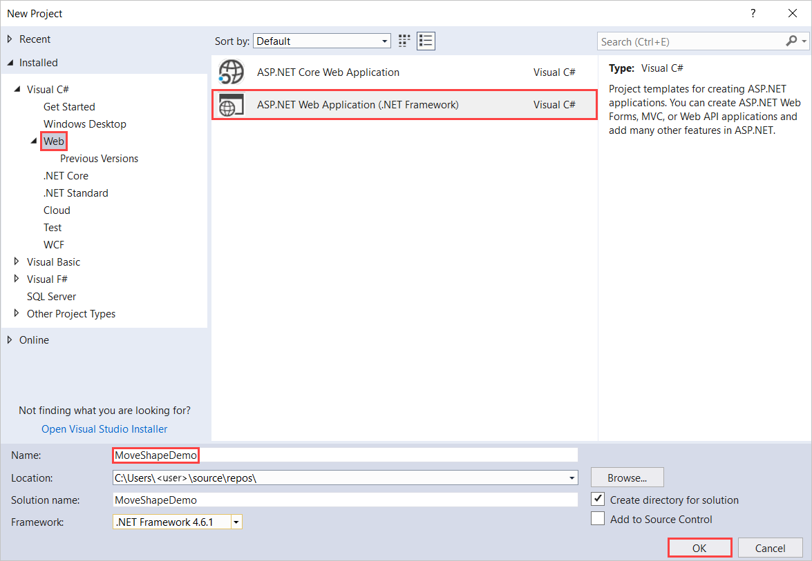
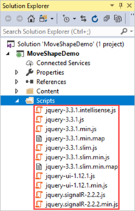
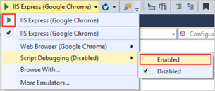
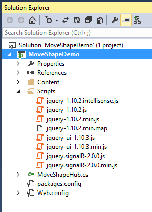

Tutorial: High-Frequency Realtime with SignalR 2
====================
by [Patrick Fletcher](https://github.com/pfletcher)

[Download Completed Project](http://code.msdn.microsoft.com/SignalR-20-MoveShape-Demo-6285b83a)

> This tutorial shows how to create a web application that uses ASP.NET SignalR 2 to provide high-frequency messaging functionality. High-frequency messaging in this case means updates that are sent at a fixed rate; in the case of this application, up to 10 messages a second.
> 
> The application you'll create in this tutorial displays a shape that users can drag. The position of the shape in all other connected browsers will then be updated to match the position of the dragged shape using timed updates.
> 
> Concepts introduced in this tutorial have applications in real-time gaming and other simulation applications.
> 
> ## Software versions used in the tutorial
> 
> 
> - [Visual Studio 2013](https://www.microsoft.com/visualstudio/eng/2013-downloads)
> - .NET 4.5
> - SignalR version 2
>   
> 
> 
> ## Using Visual Studio 2012 with this tutorial
> 
> 
> To use Visual Studio 2012 with this tutorial, do the following:
> 
> - Update your [Package Manager](http://docs.nuget.org/docs/start-here/installing-nuget) to the latest version.
> - Install the [Web Platform Installer](https://www.microsoft.com/web/downloads/platform.aspx).
> - In the Web Platform Installer, search for and install **ASP.NET and Web Tools 2013.1 for Visual Studio 2012**. This will install Visual Studio templates for SignalR classes such as **Hub**.
> - Some templates (such as **OWIN Startup Class**) will not be available; for these, use a Class file instead.
> 
> 
> ## Tutorial Versions
> 
> For information about earlier versions of SignalR, see [SignalR Older Versions](../older-versions/index.md).
> 
> ## Questions and comments
> 
> Please leave feedback on how you liked this tutorial and what we could improve in the comments at the bottom of the page. If you have questions that are not directly related to the tutorial, you can post them to the [ASP.NET SignalR forum](https://forums.asp.net/1254.aspx/1?ASP+NET+SignalR) or [StackOverflow.com](http://stackoverflow.com/).

## Overview

This tutorial demonstrates how to create an application that shares the state of an object with other browsers in real time. The application we'll create is called MoveShape. The MoveShape page will display an HTML Div element that the user can drag; when the user drags the Div, its new position will be sent to the server, which will then tell all other connected clients to update the shape's position to match.

The application created in this tutorial is based on a demo by Damian Edwards. A video containing this demo can be seen [here](https://channel9.msdn.com/Series/Building-Web-Apps-with-ASP-NET-Jump-Start/Building-Web-Apps-with-ASPNET-Jump-Start-08-Real-time-Communication-with-SignalR).

The tutorial will start by demonstrating how to send SignalR messages from each event that fires as the shape is dragged. Each connected client will then update the position of the local version of the shape each time a message is received.

While the application will function using this method, this is not a recommended programming model, since there would be no upper limit to the number of messages getting sent, so the clients and server could get overwhelmed with messages and performance would degrade. The displayed animation on the client would also be disjointed, as the shape would be moved instantly by each method, rather than moving smoothly to each new location. Later sections of the tutorial will demonstrate how to create a timer function that restricts the maximum rate at which messages are sent by either the client or server, and how to move the shape smoothly between locations. The final version of the application created in this tutorial can be downloaded from [Code Gallery](https://code.msdn.microsoft.com/SignalR-20-MoveShape-Demo-6285b83a).

This tutorial contains the following sections:

- [Prerequisites](#prerequisites)
- [Create the project and add the SignalR and JQuery.UI NuGet package](#createtheproject2013)
- [Create the base application](#baseapp)
- [Starting the hub when the application starts](#startup2013)
- [Add the client loop](#clientloop)
- [Add the server loop](#serverloop)
- [Add smooth animation on the client](#animation)
- [Further Steps](#furthersteps)

## Prerequisites

This tutorial requires Visual Studio 2013.

## Create the project and add the SignalR and JQuery.UI NuGet package

In this section, we'll create the project in Visual Studio 2013.

The following steps use Visual Studio 2013 to create an ASP.NET Empty Web Application and add the SignalR and jQuery.UI libraries:

1. In Visual Studio create an ASP.NET Web Application.

    
2. In the **New ASP.NET Project** window, leave **Empty** selected and click **Create Project**.

    
3. In **Solution Explorer**, right-click the project, select **Add | SignalR Hub Class (v2)**. Name the class **MoveShapeHub.cs** and add it to the project. This step creates the **MoveShapeHub** class and adds to the project a set of script files and assembly references that support SignalR.

    > [!NOTE]
    > You can also add SignalR to a project by clicking **Tools | Library Package Manager | Package Manager Console** and running a command:

    `install-package Microsoft.AspNet.SignalR`. 

    If you use the console to add SignalR, create the SignalR hub class as a separate step after you add SignalR.
4. Click **Tools | Library Package Manager | Package Manager Console**. In the package manager window, run the following command:

    `Install-Package jQuery.UI.Combined`

    This installs the jQuery UI library, which you'll use to animate the shape.
5. In **Solution Explorer** expand the Scripts node. Script libraries for jQuery, jQueryUI, and SignalR are visible in the project.

    

## Create the base application

In this section, we'll create a browser application that sends the location of the shape to the server during each mouse move event. The server then broadcasts this information to all other connected clients as it is received. We'll expand on this application in later sections.

1. If you haven't already created the MoveShapeHub.cs class, in **Solution Explorer**, right-click on the project and select **Add**, **Class...**. Name the class **MoveShapeHub** and click **Add**.
2. Replace the code in the new **MoveShapeHub** class with the following code.

    [!code-csharp[Main](tutorial-high-frequency-realtime-with-signalr/samples/sample1.cs)]

    The `MoveShapeHub` class above is an implementation of a SignalR hub. As in the [Getting Started with SignalR](tutorial-getting-started-with-signalr.md) tutorial, the hub has a method that the clients will call directly. In this case, the client will send an object containing the new X and Y coordinates of the shape to the server, which then gets broadcasted to all other connected clients. SignalR will automatically serialize this object using JSON.

    The object that will be sent to the client (`ShapeModel`) contains members to store the position of the shape. The version of the object on the server also contains a member to track which client's data is being stored, so that a given client won't be sent their own data. This member uses the `JsonIgnore` attribute to keep it from being serialized and sent to the client.

## Starting the hub when the application starts

1. Next, we'll set up mapping to the hub when the application starts. In SignalR 2, this is done by adding an OWIN startup class, which will call `MapSignalR` when the startup class' `Configuration` method is executed when OWIN starts. The class is added to OWIN's startup process using the `OwinStartup` assembly attribute.

    In **Solution Explorer**, right-click the project, then click **Add | OWIN Startup Class**. Name the class *Startup* and click **OK**.
2. Change the contents of Startup.cs to the following:

    [!code-csharp[Main](tutorial-high-frequency-realtime-with-signalr/samples/sample2.cs)]

## Adding the client

1. Next, we'll add the client. In **Solution Explorer**, right-click the project, then click **Add | New Item**. In the **Add New Item** dialog, select **Html Page**. Name the page **Default.html** and click **Add**.
2. In **Solution Explorer**, right-click the page you just created and click **Set as Start Page**.
3. Replace the default code in the HTML page with the following code snippet.

    > [!NOTE]
    > Verify that the script references below match the packages added to your project in the Scripts folder.

    [!code-html[Main](tutorial-high-frequency-realtime-with-signalr/samples/sample3.html)]

    The above HTML and JavaScript code creates a red Div called Shape, enables the shape's dragging behavior using the jQuery library, and uses the shape's `drag` event to send the shape's position to the server.
4. Start the application by pressing F5. Copy the page's URL, and paste it into a second browser window. Drag the shape in one of the browser windows; the shape in the other browser window should move.

    

## Add the client loop

Since sending the location of the shape on every mouse move event will create an unneccesary amount of network traffic, the messages from the client need to be throttled. We'll use the javascript `setInterval` function to set up a loop that sends new position information to the server at a fixed rate. This loop is a very basic representation of a "game loop", a repeatedly called function that drives all of the functionality of a game or other simulation.

1. Update the client code in the HTML page to match the following code snippet.

    [!code-html[Main](tutorial-high-frequency-realtime-with-signalr/samples/sample4.html)]

    The above update adds the `updateServerModel` function, which gets called on a fixed frequency. This function sends the position data to the server whenever the `moved` flag indicates that there is new position data to send.
2. Start the application by pressing F5. Copy the page's URL, and paste it into a second browser window. Drag the shape in one of the browser windows; the shape in the other browser window should move. Since the number of messages that get sent to the server will be throttled, the animation will not appear as smooth as in the previous section.

    

## Add the server loop

In the current application, messages sent from the server to the client go out as often as they are received. This presents a similar problem as was seen on the client; messages can be sent more often than they are needed, and the connection could become flooded as a result. This section describes how to update the server to implement a timer that throttles the rate of the outgoing messages.

1. Replace the contents of `MoveShapeHub.cs` with the following code snippet.

    [!code-csharp[Main](tutorial-high-frequency-realtime-with-signalr/samples/sample5.cs)]

    The above code expands the client to add the `Broadcaster` class, which throttles the outgoing messages using the `Timer` class from the .NET framework.

    Since the hub itself is transitory (it is created every time it is needed), the `Broadcaster` will be created as a singleton. Lazy initialization (introduced in .NET 4) is used to defer its creation until it is needed, ensuring that the first hub instance is completely created before the timer is started.

    The call to the clients' `UpdateShape` function is then moved out of the hub's `UpdateModel` method, so that it is no longer called immediately whenever incoming messages are received. Instead, the messages to the clients will be sent at a rate of 25 calls per second, managed by the `_broadcastLoop` timer from within the `Broadcaster` class.

    Lastly, instead of calling the client method from the hub directly, the `Broadcaster` class needs to obtain a reference to the currently operating hub (`_hubContext`) using the `GlobalHost`.
2. Start the application by pressing F5. Copy the page's URL, and paste it into a second browser window. Drag the shape in one of the browser windows; the shape in the other browser window should move. There will not be a visible difference in the browser from the previous section, but the number of messages that get sent to the client will be throttled.

    

## Add smooth animation on the client

The application is almost complete, but we could make one more improvement, in the motion of the shape on the client as it is moved in response to server messages. Rather than setting the position of the shape to the new location given by the server, we'll use the JQuery UI library's `animate` function to move the shape smoothly between its current and new position.

1. Update the client's `updateShape` method to look like the highlighted code below:

    [!code-html[Main](tutorial-high-frequency-realtime-with-signalr/samples/sample6.html?highlight=33-40)]

    The above code moves the shape from the old location to the new one given by the server over the course of the animation interval (in this case, 100 milliseconds). Any previous animation running on the shape is cleared before the new animation starts.
2. Start the application by pressing F5. Copy the page's URL, and paste it into a second browser window. Drag the shape in one of the browser windows; the shape in the other browser window should move. The movement of the shape in the other window should appear less jerky as its movement is interpolated over time rather than being set once per incoming message.

    

## Further Steps

In this tutorial, you've learned how to program a SignalR application that sends high-frequency messages between clients and servers. This communication paradigm is useful for developing online games and other simulations, such as [the ShootR game created with SignalR](http://shootr.signalr.net).

The complete application created in this tutorial can be downloaded from [Code Gallery](https://code.msdn.microsoft.com/SignalR-20-MoveShape-Demo-6285b83a).

To learn more about SignalR development concepts, visit the following sites for SignalR source code and resources:

- [SignalR Project](http://signalr.net)
- [SignalR Github and Samples](https://github.com/SignalR/SignalR)
- [SignalR Wiki](https://github.com/SignalR/SignalR/wiki)

For a walkthrough on how to deploy a SignalR application to Azure, see [Using SignalR with Web Apps in Azure App Service](../deployment/using-signalr-with-azure-web-sites.md). For detailed information about how to deploy a Visual Studio web project to a Windows Azure Web Site, see [Create an ASP.NET web app in Azure App Service](https://azure.microsoft.com/en-us/documentation/articles/web-sites-dotnet-get-started/).