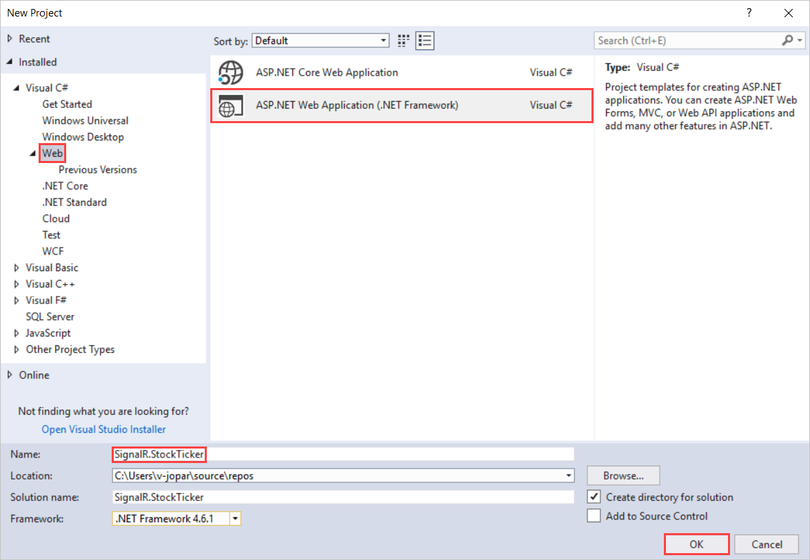
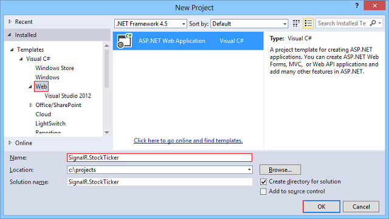
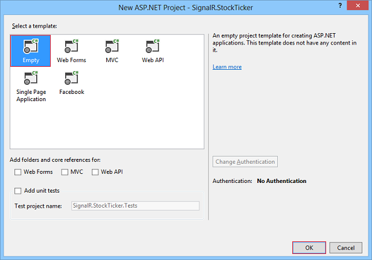
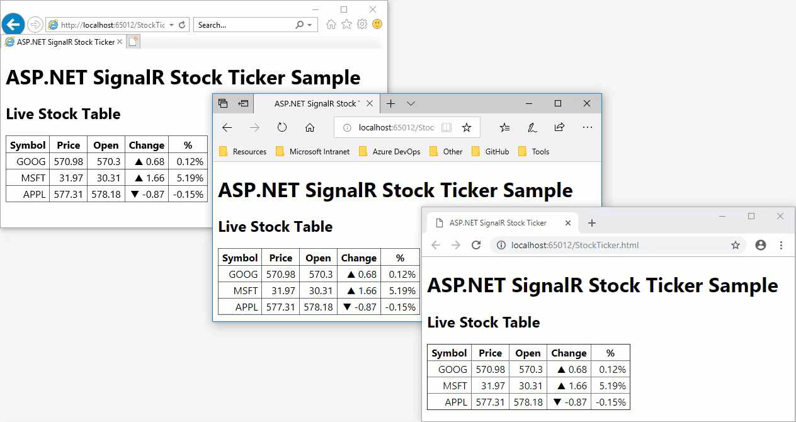
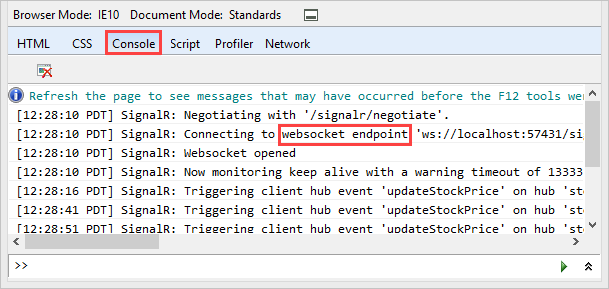
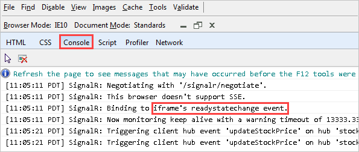
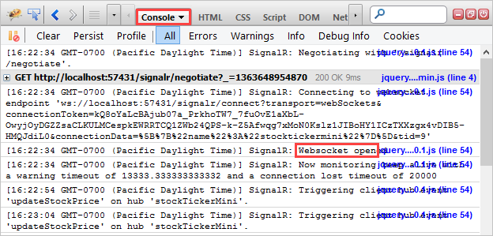
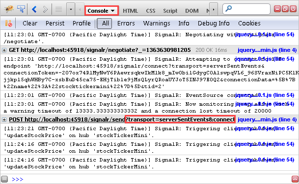
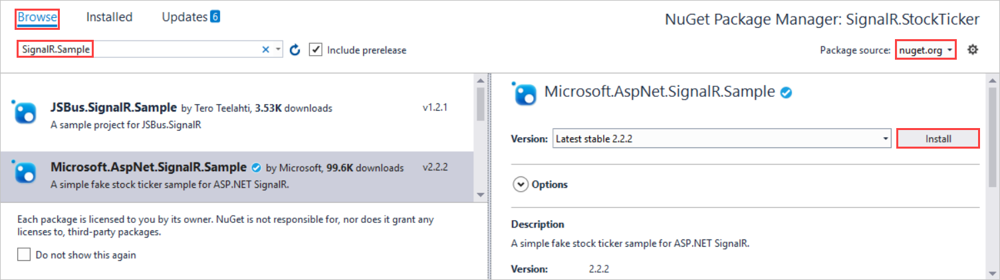
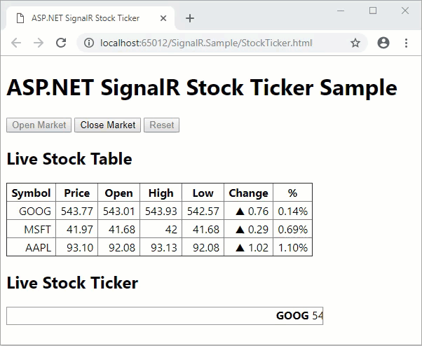

# Tutorial: Server Broadcast with SignalR 2

This tutorial shows how to create a web application that uses ASP.NET SignalR 2 to provide server broadcast functionality. Server broadcast means that the server initiates communications sent to clients.

The application that you'll create in this tutorial simulates a stock ticker, a typical scenario for server broadcast functionality. Periodically the server will randomly updates stock prices and broadcast the updates to all connected clients. In the browser the numbers and symbols in the **Change** and **%** columns dynamically change in response to notifications from the server. If you open additional browsers to the same URL, they all show the same data and the same changes to the data simultaneously.

> [!IMPORTANT]
> If you don't want to work through the steps of building the application, you can install the SignalR.Sample package in a new Empty ASP.NET Web Application project. If you install the NuGet package without performing the steps in this tutorial, you must follow the instructions in the *readme.txt* file. To run the package you need to add an OWIN startup class which calls the ConfigureSignalR method in the installed package. You will receive an error if you do not add the OWIN startup class.

In this tutorial, you:

> [!div class="checklist"]
> * Create the project
> * Set up the server code
> * Examine the server code
> * Set up the client code
> * Examine the client code
> * Test the application
> * Enable logging
> * Install and review the full StockTicker sample

[!INCLUDE [Consider ASP.NET Core SignalR](~/includes/signalr/signalr-version-disambiguation.md)]

## Prerequisites

### Visual Studio 2017

If you don't already have it, [download Visual Studio 2017](https://visualstudio.microsoft.com/downloads/) now.

### ASP.NET and web development workload

When Visual Studio Installer opens, make sure you install the **ASP.NET and web development** workload. It's under **Web & Cloud**.

### NuGet package source api

You'll need to set up the NuGet API to install the jQuery UI package.

1. When Visual Studio 2017 opens, select **Tools** > **Options**.

1. In **Options**, select **NuGet Package Manager** > **Package Sources**.

1. Next to **Available package sources**, select **+** and enter this information:

    | Setting | Value |
    | ------- | ----- |
    | Name | Enter *nuget.org* |
    | Source | Enter \*https://api.nuget.org/v3/index.json* |

1. Select **OK**.

## Create the project

This section shows how to use Visual Studio 2017 to create an empty ASP.NET Web Application.

1. In Visual Studio, create an ASP.NET Web Application.

    

1. In the **New ASP.NET Web Application - SignalR.StockTicker** window, leave **Empty** selected and select **OK**.

## Set up the server code

In this section you set up the code that runs on the server.

### Create the Stock class

You begin by creating the *Stock* model class that you'll use to store and transmit information about a stock.

1. In **Solution Explorer**, right-click the project and select **Add** > **Class**.

1. Name the class *Stock* and add it to the project.

1. Replace the code in the *Stock.cs* file with this code:

    [!code-csharp[Main](tutorial-server-broadcast-with-signalr/samples/sample1.cs)]

    The two properties that you'll set when you create stocks are `Symbol` (for example, MSFT for Microsoft) and `Price`. The other properties depend on how and when you set `Price`. The first time you set `Price`, the value gets propagated to `DayOpen`. Subsequent times when you set `Price`, the app calculates the `Change` and `PercentChange` property values based on the difference between `Price` and `DayOpen`.

### Create the StockTickerHub and StockTicker classes

You'll use the SignalR Hub API to handle server-to-client interaction. A `StockTickerHub` class that derives from the `SignalRHub` class will handle receiving connections and method calls from clients. You also need to maintain stock data and run a `Timer` object. The `Timer` object will periodically trigger price updates independent of client connections. You can't put these functions in a `Hub` class, because Hubs are transient. The app creates a `Hub` class instance for each operation on the hub, like connections and calls from the client to the server. So the mechanism that keeps stock data, updates prices, and broadcasts the price updates has to run in a separate class which you'll name `StockTicker`.

You only want one instance of the `StockTicker` class to run on the server, so you'll need to set up a reference from each `StockTickerHu`b instance to the singleton `StockTicker` instance. The `StockTicker` class has to be able to broadcast to clients because it has the stock data and triggers updates, but `StockTicker` is not a `Hub` class. Therefore, the `StockTicker` class has to get a reference to the SignalR Hub connection context object. It can then use the SignalR connection context object to broadcast to clients.

#### Create StockTickerHub.cs

1. In **Solution Explorer**, right-click the project and select **Add** > **New Item**.

1. In **Add New Item - SignalR.StockTicker**, select **Installed** > **Visual C#** > **Web** > **SignalR**  and then select **SignalR Hub Class (v2)**.

1. Name the class *StockTickerHub* and add it to the project.

    This step creates the *StockTickerHub.cs* class file. Simultaneously, it adds  a set of script files and assembly references that support SignalR to the project.

1. Replace the code in the *StockTickerHub.cs* file with this code:

    [!code-csharp[Main](tutorial-server-broadcast-with-signalr/samples/sample2.cs)]

1. Save the file.

The app uses the [Hub](https://msdn.microsoft.com/library/microsoft.aspnet.signalr.hub(v=vs.111).aspx) class to define methods the clients can call on the server. You are defining one method: `GetAllStocks()`. When a client initially connects to the server, it will call this method to get a list of all of the stocks with their current prices. The method can execute synchronously and return `IEnumerable<Stock>` because it is returning data from memory.

If the method had to get the data by doing something that would involve waiting, such as a database lookup or a web service call, you would specify `Task<IEnumerable<Stock>>` as the return value to enable asynchronous processing. For more information, see [ASP.NET SignalR Hubs API Guide - Server - When to execute asynchronously](../guide-to-the-api/hubs-api-guide-server.md#asyncmethods).

The `HubName` attribute specifies how the app will reference the Hub in JavaScript code on the client. The default name on the client if you don't use this attribute, is a camelCase version of the class name, which in this case would be `stockTickerHub`.

As you'll see later when you create the `StockTicker` class, the app creates a singleton instance of that class in its static `Instance` property. That singleton instance of `StockTicker` remains in memory no matter how many clients connect or disconnect. That instance is what the `GetAllStocks()` method uses to return current stock information.

#### Create StockTicker.cs

1. In **Solution Explorer**, right-click the project and select **Add** > **Class**.

1. Name the class *StockTicker* and add it to the project.

1. Replace the code in the *Stock.cs* file with this code:

    [!code-csharp[Main](tutorial-server-broadcast-with-signalr/samples/sample3.cs)]

Since multiple threads will be running the same instance of StockTicker code, the StockTicker class has to be thread-safe.

### Examine the server code

If you examine the server code, it will help you understand how the application works.

#### Storing the singleton instance in a static field

The code initializes the static `_instance` field that backs the `Instance` property with an instance of the class. Because the constructor is private, this is the only instance of the class that the app can create. The app sues [Lazy initialization](dotnet/framework/performance/lazy-initialization) for the `_instance` field. It's not for performance reasons but to ensure that the instance creation is thread-safe.

[!code-csharp[Main](tutorial-server-broadcast-with-signalr/samples/sample4.cs)]

Each time a client connects to the server, a new instance of the StockTickerHub class running in a separate thread gets the StockTicker singleton instance from the `StockTicker.Instance` static property, as you saw earlier in the `StockTickerHub` class.

#### Storing stock data in a ConcurrentDictionary

The constructor initializes the `_stocks` collection with some sample stock data, and `GetAllStocks` returns the stocks. As you saw earlier, this collection of stocks is in turn returned by `StockTickerHub.GetAllStocks` which is a server method in the `Hub` class that clients can call.

[!code-csharp[Main](tutorial-server-broadcast-with-signalr/samples/sample5.cs)]

[!code-csharp[Main](tutorial-server-broadcast-with-signalr/samples/sample6.cs)]

The stocks collection defined as a [ConcurrentDictionary](https://msdn.microsoft.com/library/dd287191.aspx) type for thread safety. As an alternative, you could use a [Dictionary](https://msdn.microsoft.com/library/xfhwa508.aspx) object and explicitly lock the dictionary when you make changes to it.

For this sample application, it's OK to store application data in memory and to lose the data when the app disposes of the  `StockTicker` instance. In a real application you would work with a back-end data store such as a database.

#### Periodically updating stock prices

The constructor starts up a `Timer` object that periodically calls methods that update stock prices on a random basis.

[!code-csharp[Main](tutorial-server-broadcast-with-signalr/samples/sample7.cs)]

 `Timer` calls `UpdateStockPrices`, which passes in null in the state parameter. Before updating prices, the app takes a lock on the `_updateStockPricesLock` object. The code checks if another thread is already updating prices, and then it calls `TryUpdateStockPrice` on each stock in the list. The `TryUpdateStockPrice` method decides whether to change the stock price, and how much to change it. If the stock price changes, the app calls `BroadcastStockPrice` to broadcast the stock price change to all connected clients.

The `_updatingStockPrices` flag designated [volatile](https://msdn.microsoft.com/library/x13ttww7.aspx) to ensure that access to it is thread-safe.

[!code-csharp[Main](tutorial-server-broadcast-with-signalr/samples/sample8.cs)]

In a real application, the `TryUpdateStockPrice` method would call a web service to look up the price. In this code it uses a random number generator to make changes randomly.

#### Getting the SignalR context so that the StockTicker class can broadcast to clients

Because the price changes originate here in the `StockTicker` object, this is the object that needs to call an `updateStockPrice` method on all connected clients. In a `Hub` class you have an API for calling client methods, but `StockTicker` does not derive from the `Hub` class and does not have a reference to any `Hub` object. Therefore, in order to broadcast to connected clients, the `StockTicker` class has to get the SignalR context instance for the `StockTickerHub` class and use that to call methods on clients.

The code gets a reference to the SignalR context when it creates the singleton class instance, passes that reference to the constructor, and the constructor puts it in the `Clients` property.

There are two reasons why you want to get the context just once: getting the context is an expensive operation, and getting it once ensures that the app preserves the intended order of messages sent to the clients.

[!code-csharp[Main](tutorial-server-broadcast-with-signalr/samples/sample9.cs)]

Getting the `Clients` property of the context and putting it in the `StockTickerClient` property lets you write code to call client methods that looks the same as it would in a `Hub` class. For instance, to broadcast to all clients you can write `Clients.All.updateStockPrice(stock)`.

The `updateStockPrice` method that you are calling in `BroadcastStockPric`e doesn't exist yet. You'll add it later when you write code that runs on the client. You can refer to `updateStockPric`e here because `Clients.All` is dynamic, which means the app will evaluated the expression at runtime. When this method call executes, SignalR will send the method name and the parameter value to the client, and if the client has a method named `updateStockPrice`, the app will call that method and pass the parameter value to it.

`Clients.All` means send to all clients. SignalR gives you other options to specify which clients or groups of clients to send to. For more information, see [HubConnectionContext](https://msdn.microsoft.com/library/microsoft.aspnet.signalr.hubs.hubconnectioncontext(v=vs.111).aspx).

### Register the SignalR route

The server needs to know which URL to intercept and direct to SignalR. To do that, add an OWIN startup class:

1. In **Solution Explorer**, right-click the project and select **Add** > **New Item**.

1. In **Add New Item - SignalR.StockTicker** select **Installed** > **Visual C#** > **Web** and then select **OWIN Startup Class**.

1. Name the class *Startup* and select **OK**.

1. Replace the default code in the *Startup.cs* file with this code:

    [!code-csharp[Main](tutorial-server-broadcast-with-signalr/samples/sample10.cs)]

You have now completed setting up the server code. In the next section you'll set up the client.

## Set up the client code

In this section, you set up the code that runs on the client.

### Create the HTML page and JavaScript file

The HTML page will display the data and the JavaScript file will organize the data.

#### Create StockTicker.html

First, you'll add the HTML client.

1. In **Solution Explorer**, right-click the project and select **Add** > **HTML Page**.

1. Name the file **StockTicker** and select **OK**.

1. Replace the default code in the *StockTicker.html* file with this code:

    [!code-html[Main](tutorial-server-broadcast-with-signalr/samples/sample11.html)?highlight=40-43]

    The HTML creates a table with 5 columns, a header row, and a data row with a single cell that spans all 5 columns. The data row displays "loading..." momentarily when the application starts. JavaScript code will remove that row and add in its place rows with stock data retrieved from the server.

    The script tags specify the jQuery script file, the SignalR core script file, the SignalR proxies script file, and a StockTicker script file that you'll create later. The SignalR proxies script file, which specifies the "/signalr/hubs" URL, is dynamically generated and defines proxy methods for the methods on the Hub class, in this case for StockTickerHub.GetAllStocks. If you prefer, you can generate this JavaScript file manually by using [SignalR Utilities](http://nuget.org/packages/Microsoft.AspNet.SignalR.Utils/) and disable dynamic file creation in the MapHubs method call.

1. In **Solution Explorer**, expand **Scripts**.

    Script libraries for jQuery and SignalR are visible in the project.

    > [!IMPORTANT]
    > The package manager will install a later version of the SignalR scripts.

1. Update the script references in the code block correspond to the versions of the script files in the project.

1. In **Solution Explorer**, right-click *StockTicker.html*, and then select **Set as Start Page**.

#### Create StockTicker.js

Now create the JavaScript file.

1. In **Solution Explorer**, right-click the project and select **Add** > *JavaScript File**.

1. Name the page **StockTicker** and select **OK**.

1. Add this code to the *StockTicker.js* file:

    [!code-javascript[Main](tutorial-server-broadcast-with-signalr/samples/sample12.js)]

### Examine the client code

If you examine the client code, it will help you understand how the client code interacts with the server code to make the application work.

#### Starting the connection

`$.connection` refers to the SignalR proxies. The code gets a reference to the proxy for the `StockTickerHub` class and puts it in the `ticker` variable. The proxy name is the name that was set by the `HubName` attribute:

[!code-javascript[Main](tutorial-server-broadcast-with-signalr/samples/sample13.js)]

[!code-csharp[Main](tutorial-server-broadcast-with-signalr/samples/sample14.cs)]

After you define all the variables and functions, the last line of code in the file initializes the SignalR connection by calling the SignalR `start` function. The `star`t function executes asynchronously and returns a [jQuery Deferred object](http://api.jquery.com/category/deferred-object/). This means you can call the done function to specify the function to call when the app completes the asynchronous operation.

[!code-javascript[Main](tutorial-server-broadcast-with-signalr/samples/sample15.js)]

#### Getting all the stocks

The `init` function calls the `getAllStocks` function on the server and uses the information that the server returns to update the stock table. Notice that, by default, you have to use camelCasing on the client even though the method name is pascal-cased on the server. The camelCasing rule only applies to methods, not objects. For example, you refer to `stock.Symbol` and `stock.Price`, not `stock.symbol` or `stock.price`.

[!code-javascript[Main](tutorial-server-broadcast-with-signalr/samples/sample16.js)]

[!code-csharp[Main](tutorial-server-broadcast-with-signalr/samples/sample17.cs)]

In the `init` method, the app creates HTML for a table row for each stock object received from the server by calling `formatStock` to format properties of the `stock` object, and then by calling `supplant` to replace placeholders in the `rowTemplate` variable with the `stock` object property values. The resulting HTML is then appended to the stock table.

> [!NOTE]
> You call `init` by passing it in as a `callback` function that executes after the asynchronous `start` function completes. If you called `init` as a separate JavaScript statement after calling `start`, the function would fail because it would execute immediately without waiting for the start function to finish establishing the connection. In that case, the `init` function would try to call the `getAllStocks` function before the app establishes a server connection.

#### Getting updated stock prices

When the server changes a stock's price, it calls the `updateStockPrice` on connected clients. The app adds the function to the client property of the `stockTicker` proxy in order to make it available to calls from the server.

[!code-javascript[Main](tutorial-server-broadcast-with-signalr/samples/sample18.js)]

The `updateStockPrice` function formats a stock object received from the server into a table row the same way as in the `init` function. However, instead of appending the row to the table, it finds the stock's current row in the table and replaces that row with the new one.

## Test the application

You can test the app to make sure it's working. You'll see multiple browser windows display the live stock table with stock prices fluctuating.

1. In the toolbar, turn on **Script Debugging** and then select the play button to run the application in Debug mode.

    

    A browser window will open displaying the **Live Stock Table**. The stock table initially displays the "loading..." line, then after a short delay the app displays the initial stock data, and then the stock prices start to change.

1. Copy the URL from the browser, open two other browsers, and paste the URLs into the address bars.

     

    The initial stock display is the same as the first browser and changes happen simultaneously.

1. Close all browsers, open a new browser, and go to the same URL.

    The StockTicker singleton object has continued to run in the server, so the stock table display shows that the stocks have continued to change. You don't see the initial table with zero change figures.

1. Close the browser.

## Enable logging

SignalR has a built-in logging function that you can enable on the client to aid in troubleshooting. In this section you enable logging and see examples that show how logs tell you which of the following transport methods SignalR is using:

* [WebSockets](http://en.wikipedia.org/wiki/WebSocket), supported by IIS 8 and current browsers.
* [Server-sent events](http://en.wikipedia.org/wiki/Server-sent_events), supported by browsers other than Internet Explorer.
* [Forever frame](http://en.wikipedia.org/wiki/Comet_(programming)#Hidden_iframe), supported by Internet Explorer.
* [Ajax long polling](http://en.wikipedia.org/wiki/Comet_(programming)#Ajax_with_long_polling), supported by all browsers.

For any given connection, SignalR chooses the best transport method that both the server and the client support.

1. Open *StockTicker.js*.

1. Add this highlighted line of code to enable logging immediately before the code that initializes the connection at the end of the file:

    [!code-javascript[Main](tutorial-server-broadcast-with-signalr/samples/sample19.js?highlight=2)]

1. Press **F5** to run the project.

1. Open your browser's developer tools window, and select the Console to see the logs. You might have to refresh the page to see the logs of Signalr negotiating the transport method for a new connection.

    If you are running Internet Explorer 10 on Windows 8 (IIS 8), the transport method is **WebSockets**.

    

    If you are running Internet Explorer 10 on Windows 7 (IIS 7.5), the transport method is **iframe**.

    

    In Firefox, install the Firebug add-in to get a Console window. If you are running Firefox 19 on Windows 8 (IIS 8), the transport method is **WebSockets**.

    

    If you are running Firefox 19 on Windows 7 (IIS 7.5), the transport method is **server-sent** events.

    

## Install and review the full StockTicker sample

The [Microsoft.AspNet.SignalR.Sample](http://nuget.org/packages/microsoft.aspnet.signalr.sample) installs the StockTicker application. The NuGet package includes more features than the simplified version that you just created from scratch. In this section of the tutorial, you install the NuGet package and review the new features and the code that implements them.

> [!IMPORTANT]
> If you install the package without performing the earlier steps of this tutorial, you must add an OWIN startup class to your project. This readme.txt file for the NuGet package explains this step.

### Install the SignalR.Sample NuGet package

1. In **Solution Explorer**, right-click the project and select **Manage NuGet Packages**.

1. In **NuGet Package manager: SignalR.StockTicker**, select **Browse**

1. From **Package source**, select **nuget.org**.

    > [!TIP]
    > If you don't have nuget.org configured, take a look at the **Prerequisites** section of this article.

1. Enter *SignalR.Sample* in the search box and, when it appears, select **Microsoft.AspNet.SignalR.Sample** > **Install**.

    

1. In **Solution Explorer**, expand the *SignalR.Sample* folder.

    Installing the SignalR.Sample package created the folder and its contents.

1. In the *SignalR.Sample* folder, right-click *StockTicker.html*, and then select **Set As Start Page**.

    > [!NOTE]
    > Installing The SignalR.Sample NuGet package might change the version of jQuery that you have in your *Scripts* folder. The new *StockTicker.html* file that the package installs in the *SignalR.Sample* folder will be in sync with the jQuery version that the package installs, but if you want to run your original *StockTicker.html* file again, you might have to update the jQuery reference in the script tag first.

### Run the application

 In addition to the grid that you saw earlier, the full stock ticker application shows a horizontally scrolling window that displays the same stock data.

1. Press **F5** to run the application.

     When you run the application for the first time, the "market" is "closed" and you see a static grid and a ticker window that isn't scrolling.

1. Select **Open Market**.

    

    * The **Live Stock Ticker** box starts to scroll horizontally, and the server starts to periodically broadcast stock price changes on a random basis.

    * Each time a stock price changes, the app updates both the **Live Stock Table** grid and the **Live Stock Ticker** box.

    * When a stock's price change is positive, the app shows the stock with a green background.

    * When the change is negative, the app shows the stock with a red background.

1. Select **Close Market**.

    * The changes to the grid stops.

    * The ticker stops scrolling.

1. Select **Reset**.

    * All stock data is reset.

    * The app restores the initial state before price changes started.

1. Copy the URL from the browser, open two other browsers, and paste the URLs into the address bars.

1. You see the same data dynamically updated at the same time in each browser.

1. When you select any of the controls, all browsers respond the same way at the same time.

### Live Stock Ticker display

The **Live Stock Ticker** display is an unordered list in a `
` element formatted into a single line by CSS styles. The app initializes and updates the ticker the same way as the table: by replacing placeholders in an `<li>` template string and dynamically adding the `<li>` elements to the `<ul>` element. The app performs the scrolling by using the jQuery `animate` function to vary the margin-left of the unordered list within the `
`.

#### SignalR.Sample StockTicker.html

The stock ticker HTML code:

[!code-html[Main](tutorial-server-broadcast-with-signalr/samples/sample20.html)]

#### SignalR.Sample StockTicker.css

The stock ticker CSS code:

[!code-html[Main](tutorial-server-broadcast-with-signalr/samples/sample21.html)]

#### SignalR.Sample SignalR.StockTicker.js

The jQuery code that makes it scroll:

[!code-javascript[Main](tutorial-server-broadcast-with-signalr/samples/sample22.js)]

### Additional methods on the server that the client can call

To add flexibility to the app, there are additional methods the app can call.

#### SignalR.Sample StockTickerHub.cs

The `StockTickerHub` class defines four additional methods that the client can call:

[!code-csharp[Main](tutorial-server-broadcast-with-signalr/samples/sample23.cs)]

Thw app calls `OpenMarket`, `CloseMarket`, and `Reset` in response to the buttons at the top of the page. They demonstrate the pattern of one client triggering a change in state immediately propagated to all clients. Each of these methods calls a method in the `StockTicker` class that effects the market state change and then broadcasts the new state.

#### SignalR.Sample StockTicker.cs

In the `StockTicker` class, the app maintains the state of the market with a `MarketState` property that returns a `MarketState` enum value:

[!code-csharp[Main](tutorial-server-broadcast-with-signalr/samples/sample24.cs)]

Each of the methods that change the market state do so inside a lock block because the `StockTicker` class has to be thread-safe:

[!code-csharp[Main](tutorial-server-broadcast-with-signalr/samples/sample25.cs)]

To ensure that this code is thread-safe, the `_marketState` field that backs the `MarketState` property designated `volatile`:

[!code-csharp[Main](tutorial-server-broadcast-with-signalr/samples/sample26.cs)]

The `BroadcastMarketStateChange` and `BroadcastMarketReset` methods are similar to the BroadcastStockPrice method that you already saw, except they call different methods defined at the client:

[!code-csharp[Main](tutorial-server-broadcast-with-signalr/samples/sample27.cs)]

### Additional functions on the client that the server can call

The `updateStockPrice` function now handles both the grid and the ticker display, and it uses `jQuery.Color` to flash red and green colors.

New functions in *SignalR.StockTicker.js* enable and disable the buttons based on market state, and they stop or start the ticker window horizontal scrolling. Since multiple functions are being added to ticker.client, th app uses the [jQuery extend function](http://api.jquery.com/jQuery.extend/) to add them.

[!code-javascript[Main](tutorial-server-broadcast-with-signalr/samples/sample28.js)]

### Additional client setup after establishing the connection

After the client establishes the connection, it has some additional work to do: find out if the market is open or closed in order to call the appropriate marketOpened or marketClosed function, and attach the server method calls to the buttons.

[!code-javascript[Main](tutorial-server-broadcast-with-signalr/samples/sample29.js)]

The server methods are not wired up to the buttons until after the app establishes the connection, so that the code can't try to call the server methods before they are available.

## Additional resources

In this tutorial you've learned how to program a SignalR application that broadcasts messages from the server to all connected clients, both on a periodic basis and in response to notifications from any client. The pattern of using a multi-threaded singleton instance to maintain server state can also be also used in multi-player online game scenarios. For an example, see [the ShootR game based on SignalR](https://github.com/NTaylorMullen/ShootR).

For tutorials that show peer-to-peer communication scenarios, see [Getting Started with SignalR](introduction-to-signalr.md) and [Real-Time Updating with SignalR](tutorial-high-frequency-realtime-with-signalr.md).

For more information, see the following resources:

* [ASP.NET SignalR](../../index.md)
* [SignalR Project](http://signalr.net/)
* [SignalR Github and Samples](https://github.com/SignalR/SignalR)
* [SignalR Wiki](https://github.com/SignalR/SignalR/wiki)

For a walkthrough on how to deploy a SignalR application to Azure, see [Using SignalR with Web Apps in Azure App Service](../deployment/using-signalr-with-azure-web-sites.md). For detailed information about how to deploy a Visual Studio web project to a Windows Azure Web Site, see [Create an ASP.NET web app in Azure App Service](https://azure.microsoft.com/documentation/articles/web-sites-dotnet-get-started/).

## Next steps

In this tutorial, you:

> [!div class="checklist"]
> * Created the project
> * Set up the server code
> * Examined the server code
> * Set up the client code
> * Examined the client code
> * Tested the application
> * Enable logging
> * Install and review the full StockTicker sample