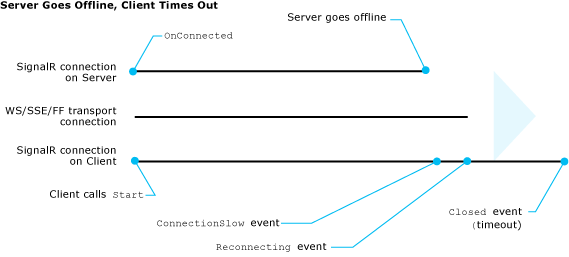

Understanding and Handling Connection Lifetime Events in SignalR 1.x
====================
by [Patrick Fletcher](https://github.com/pfletcher), [Tom Dykstra](https://github.com/tdykstra)

> This article provides an overview of the SignalR connection, reconnection, and disconnection events that you can handle, and timeout and keepalive settings that you can configure.
> 
> The article assumes you already have some knowledge of SignalR and connection lifetime events. For an introduction to SignalR, see [SignalR - Overview - Getting Started](index.md). For lists of connection lifetime events, see the following resources:
> 
> - [How to handle connection lifetime events in the Hub class](index.md)
> - [How to handle connection lifetime events in JavaScript clients](index.md)
> - [How to handle connection lifetime events in .NET clients](index.md)

## Overview

This article contains the following sections:

- [Connection lifetime terminology and scenarios](#terminology)

    - [SignalR connections, transport connections, and physical connections](#signalrvstransport)
    - [Transport disconnection scenarios](#transportdisconnect)
    - [Client disconnection scenarios](#clientdisconnect)
    - [Server disconnection scenarios](#serverdisconnect)
- [Timeout and keepalive settings](#timeoutkeepalive)

    - [ConnectionTimeout](#connectiontimeout)
    - [DisconnectTimeout](#disconnecttimeout)
    - [KeepAlive](#keepalive)
    - [How to change timeout and keepalive settings](#changetimeout)
- [How to notify the user about disconnections](#notifydisconnect)
- [How to continuously reconnect](#continuousreconnect)
- [How to disconnect a client in server code](#disconnectclientfromserver)

Links to API Reference topics are to the .NET 4.5 version of the API. If you're using .NET 4, see [the .NET 4 version of the API topics](https://msdn.microsoft.com/en-us/library/jj891075(v=vs.100).aspx).

## Connection lifetime terminology and scenarios

The `OnReconnected` event handler in a SignalR Hub can execute directly after `OnConnected` but not after `OnDisconnected` for a given client. The reason you can have a reconnection without a disconnection is that there are several ways in which the word "connection" is used in SignalR.

### SignalR connections, transport connections, and physical connections

This article will differentiate between *SignalR connections*, *transport connections*, and *physical connections*:

- **SignalR connection** refers to a logical relationship between a client and a server URL, maintained by the SignalR API and uniquely identified by a connection ID. The data about this relationship is maintained by SignalR and is used to establish a transport connection. The relationship ends and SignalR disposes of the data when the client calls the `Stop` method or a timeout limit is reached while SignalR is attempting to re-establish a lost transport connection.
- **Transport connection** refers to a logical relationship between a client and a server, maintained by one of the four transport APIs: WebSockets, server-sent events, forever frame, or long polling. SignalR uses the transport API to create a transport connection, and the transport API depends on the existence of a physical network connection to create the transport connection. The transport connection ends when SignalR terminates it or when the transport API detects that the physical connection is broken.
- **Physical connection** refers to the physical network links -- wires, wireless signals, routers, etc. -- that facilitate communication between a client computer and a server computer. The physical connection must be present in order to establish a transport connection, and a transport connection must be established in order to establish a SignalR connection. However, breaking the physical connection doesn't always immediately end the transport connection or the SignalR connection, as will be explained later in this topic.

In the following diagram, the SignalR connection is represented by the Hubs API and PersistentConnection API SignalR layer, the transport connection is represented by the Transports layer, and the physical connection is represented by the lines between the server and the clients.

When you call the `Start` method in a SignalR client, you are providing SignalR client code with all the information it needs in order to establish a physical connection to a server. SignalR client code uses this information to make an HTTP request and establish a physical connection that uses one of the four transport methods. If the transport connection fails or the server fails, the SignalR connection doesn't go away immediately because the client still has the information it needs to automatically re-establish a new transport connection to the same SignalR URL. In this scenario, no intervention from the user application is involved, and when the SignalR client code establishes a new transport connection, it does not start a new SignalR connection. The continuity of the SignalR connection is reflected in the fact that the connection ID, which is created when you call the `Start` method, does not change.

The `OnReconnected` event handler on the Hub executes when a transport connection is automatically re-established after having been lost. The `OnDisconnected` event handler executes at the end of a SignalR connection. A SignalR connection can end in any of the following ways:

- If the client calls the `Stop` method, a stop message is sent to the server, and both client and server end the SignalR connection immediately.
- After connectivity between client and server is lost, the client tries to reconnect and the server waits for the client to reconnect. If the attempts to reconnect are unsuccessful and the disconnect timeout period ends, both client and server end the SignalR connection. The client stops trying to reconnect, and the server disposes of its representation of the SignalR connection.
- If the client stops running without having a chance to call the `Stop` method, the server waits for the client to reconnect, and then ends the SignalR connection after the disconnect timeout period.
- If the server stops running, the client tries to reconnect (re-create the transport connection), and then ends the SignalR connection after the disconnect timeout period.

When there are no connection problems, and the user application ends the SignalR connection by calling the `Stop` method, the SignalR connection and the transport connection begin and end at about the same time. The following sections describe in more detail the other scenarios.

### Transport disconnection scenarios

Physical connections might be slow or there might be interruptions in connectivity. Depending on factors such as the length of the interruption, the transport connection might be dropped. SignalR then tries to re-establish the transport connection. Sometimes the transport connection API detects the interruption and drops the transport connection, and SignalR finds out immediately that the connection is lost. In other scenarios, neither the transport connection API nor SignalR becomes aware immediately that connectivity has been lost. For all transports except long polling, the SignalR client uses a function called *keepalive* to check for loss of connectivity that the transport API is unable to detect. For information about long polling connections, see [Timeout and keepalive settings](#timeoutkeepalive) later in this topic.

When a connection is inactive, periodically the server sends a keepalive packet to the client. As of the date this article is being written, the default frequency is every 10 seconds. By listening for these packets, clients can tell if there is a connection problem. If a keepalive packet is not received when expected, after a short time the client assumes that there are connection problems such as slowness or interruptions. If the keepalive is still not received after a longer time, the client assumes that the connection has been dropped, and it begins trying to reconnect.

The following diagram illustrates the client and server events that are raised in a typical scenario when there are problems with the physical connection that aren't immediately recognized by the transport API. The diagram applies to the following circumstances:

- The transport is WebSockets, forever frame, or server-sent events.
- There are varying periods of interruption in the physical network connection.
- The transport API does not become aware of the interruptions, so SignalR relies on the keepalive functionality to detect them.

If the client goes into reconnecting mode but can't establish a transport connection within the disconnect timeout limit, the server terminates the SignalR connection. When that happens, the server executes the Hub's `OnDisconnected` method and queues up a disconnect message to send to the client in case the client manages to connect later. If the client then does reconnect, it receives the disconnect command and calls the `Stop` method. In this scenario, `OnReconnected` is not executed when the client reconnects, and `OnDisconnected` is not executed when the client calls `Stop`. The following diagram illustrates this scenario.

The SignalR connection lifetime events that may be raised on the client are the following:

- `ConnectionSlow` client event.

    Raised when a preset proportion of the keepalive timeout period has passed since the last message or keepalive ping was received. The default keepalive timeout warning period is 2/3 of the keepalive timeout. The keepalive timeout is 20 seconds, so the warning occurs at about 13 seconds.

    By default, the server sends keepalive pings every 10 seconds, and the client checks for keepalive pings about every 2 seconds (one third of the difference between the keepalive timeout value and the keepalive timeout warning value).

    If the transport API becomes aware of a disconnection, SignalR might be informed of the disconnection before the keepalive timeout warning period passes. In that case, the `ConnectionSlow` event would not be raised, and SignalR would go directly to the `Reconnecting` event.
- `Reconnecting` client event.

    Raised when (a) the transport API detects that the connection is lost, or (b) the keepalive timeout period has passed since the last message or keepalive ping was received. The SignalR client code begins trying to reconnect. You can handle this event if you want your application to take some action when a transport connection is lost. The default keepalive timeout period is currently 20 seconds.

    If your client code tries to call a Hub method while SignalR is in reconnecting mode, SignalR will try to send the command. Most of the time, such attempts will fail, but in some circumstances they might succeed. For the server-sent events, forever frame, and long polling transports, SignalR uses two communication channels, one that the client uses to send messages and one that it uses to receive messages. The channel used for receiving is the permanently open one, and that's the one that is closed when the physical connection is interrupted. The channel used for sending remains available, so if physical connectivity is restored, a method call from client to server might be successful before the receive channel is re-established. The return value would not be received until SignalR re-opens the channel used for receiving.
- `Reconnected` client event.

    Raised when the transport connection is reestablished. The `OnReconnected` event handler in the Hub executes.
- `Closed` client event (`disconnected` event in JavaScript).

    Raised when the disconnect timeout period expires while the SignalR client code is trying to reconnect after losing the transport connection. The default disconnect timeout is 30 seconds. (This event is also raised when the connection ends because the `Stop` method is called.)

Transport connection interruptions that are not detected by the transport API and don't delay the reception of keepalive pings from the server for longer than the keepalive timeout warning period might not cause any connection lifetime events to be raised.

Some network environments deliberately close idle connections, and another function of the keepalive packets is to help prevent this by letting these networks know that a SignalR connection is in use. In extreme cases the default frequency of keepalive pings might not be enough to prevent closed connections. In that case you can configure keepalive pings to be sent more often. For more information, see [Timeout and keepalive settings](#timeoutkeepalive) later in this topic.

> [!NOTE] 
> 
> [!IMPORTANT]
> The sequence of events described here is not guaranteed. SignalR makes every attempt to raise connection lifetime events in a predictable manner according to this scheme, but there are many variations of network events and many ways in which underlying communications frameworks such as transport APIs handle them. For example, the `Reconnected` event might not be raised when the client reconnects, or the `OnConnected` handler on the server might run when the attempt to establish a connection is unsuccessful. This topic describes only the effects that would normally be produced by certain typical circumstances.

### Client disconnection scenarios

In a browser client, the SignalR client code that maintains a SignalR connection runs in the JavaScript context of a web page. That's why the SignalR connection has to end when you navigate from one page to another, and that's why you have multiple connections with multiple connection IDs if you connect from multiple browser windows or tabs. When the user closes a browser window or tab, or navigates to a new page or refreshes the page, the SignalR connection immediately ends because SignalR client code handles that browser event for you and calls the `Stop` method. In these scenarios, or in any client platform when your application calls the `Stop` method, the `OnDisconnected` event handler executes immediately on the server and the client raises the `Closed` event (the event is named `disconnected` in JavaScript).

If a client application or the computer that it's running on crashes or goes to sleep (for example, when the user closes the laptop), the server is not informed about what happened. As far as the server knows, the loss of the client might be due to connectivity interruption and the client might be trying to reconnect. Therefore, in these scenarios the server waits to give the client a chance to reconnect, and `OnDisconnected` does not execute until the disconnect timeout period expires (about 30 seconds by default). The following diagram illustrates this scenario.

### Server disconnection scenarios

When a server goes offline -- it reboots, fails, the app domain recycles, etc. -- the result might be similar to a lost connection, or the transport API and SignalR might know immediately that the server is gone, and SignalR might begin trying to reconnect without raising the `ConnectionSlow` event. If the client goes into reconnecting mode, and if the server recovers or restarts or a new server is brought online before the disconnect timeout period expires, the client will reconnect to the restored or new server. In that case, the SignalR connection continues on the client and the `Reconnected` event is raised. On the first server, `OnDisconnected` is never executed, and on the new server, `OnReconnected` is executed although `OnConnected` was never executed for that client on that server before. (The effect is the same if the client reconnects to the same server after a reboot or app domain recycle, because when the server restarts it has no memory of prior connection activity.) The following diagram assumes that the transport API becomes aware of the lost connection immediately, so the `ConnectionSlow` event is not raised.

If a server does not become available within the disconnect timeout period, the SignalR connection ends. In this scenario, the `Closed` event (`disconnected` in JavaScript clients) is raised on the client but `OnDisconnected` is never called on the server. The following diagram assumes that the transport API does not become aware of the lost connection, so it is detected by SignalR keepalive functionality and the `ConnectionSlow` event is raised.

## Timeout and keepalive settings

The default `ConnectionTimeout`, `DisconnectTimeout`, and `KeepAlive` values are appropriate for most scenarios but can be changed if your environment has special needs. For example, if your network environment closes connections that are idle for 5 seconds, you might have to decrease the keepalive value.

### ConnectionTimeout

This setting represents the amount of time to leave a transport connection open and waiting for a response before closing it and opening a new connection. The default value is 110 seconds.

This setting applies only when keepalive functionality is disabled, which normally applies only to the long polling transport. The following diagram illustrates the effect of this setting on a long polling transport connection.

### DisconnectTimeout

This setting represents the amount of time to wait after a transport connection is lost before raising the `Disconnected` event. The default value is 30 seconds. When you set `DisconnectTimeout`, `KeepAlive` is automatically set to 1/3 of the `DisconnectTimeout` value.

### KeepAlive

This setting represents the amount of time to wait before sending a keepalive packet over an idle connection. The default value is 10 seconds. This value must not be more than 1/3 of the `DisconnectTimeout` value.

If you want to set both `DisconnectTimeout` and `KeepAlive`, set `KeepAlive` after `DisconnectTimeout`. Otherwise your `KeepAlive` setting will be overwritten when `DisconnectTimeout` automatically sets `KeepAlive` to 1/3 of the timeout value.

If you want to disable keepalive functionality, set `KeepAlive` to null. Keepalive functionality is automatically disabled for the long polling transport.

### How to change timeout and keepalive settings

To change the default values for these settings, set them in `Application_Start` in your *Global.asax* file, as shown in the following example. The values shown in the sample code are the same as the default values.

[!code-csharp[Main](handling-connection-lifetime-events/samples/sample1.cs)]

## How to notify the user about disconnections

In some applications you might want to display a message to the user when there are connectivity problems. You have several options for how and when to do this. The following code samples are for a JavaScript client using the generated proxy.

- Handle the `connectionSlow` event to display a message as soon as SignalR is aware of connection problems, before it goes into reconnecting mode.

    [!code-javascript[Main](handling-connection-lifetime-events/samples/sample2.js)]
- Handle the `reconnecting` event to display a message when SignalR is aware of a disconnection and is going into reconnecting mode.

    [!code-javascript[Main](handling-connection-lifetime-events/samples/sample3.js)]
- Handle the `disconnected` event to display a message when an attempt to reconnect has timed out. In this scenario, the only way to re-establish a connection with the server again is to restart the SignalR connection by calling the `Start` method, which will create a new connection ID. The following code sample uses a flag to make sure that you issue the notification only after a reconnecting timeout, not after a normal end to the SignalR connection caused by calling the `Stop` method.

    [!code-javascript[Main](handling-connection-lifetime-events/samples/sample4.js)]

## How to continuously reconnect

In some applications you might want to automatically re-establish a connection after it has been lost and the attempt to reconnect has timed out. To do that, you can call the `Start` method from your `Closed` event handler (`disconnected` event handler on JavaScript clients). You might want to wait a period of time before calling `Start` in order to avoid doing this too frequently when the server or the physical connection are unavailable. The following code sample is for a JavaScript client using the generated proxy.

[!code-javascript[Main](handling-connection-lifetime-events/samples/sample5.js)]

A potential problem to be aware of in mobile clients is that continuous reconnection attempts when the server or physical connection isn't available could cause unnecessary battery drain.

## How to disconnect a client in server code

SignalR version 1.1.1 does not have a built-in server API for disconnecting clients. There are [plans for adding this functionality in the future](https://github.com/SignalR/SignalR/issues/2101). In the current SignalR release, the simplest way to disconnect a client from the server is to implement a disconnect method on the client and call that method from the server. The following code sample shows a disconnect method for a JavaScript client using the generated proxy.

[!code-javascript[Main](handling-connection-lifetime-events/samples/sample6.js)]

> [!WARNING]
> Security - Neither this method for disconnecting clients nor the proposed built-in API will address the scenario of hacked clients that are running malicious code, since the clients could reconnect or the hacked code might remove the `stopClient` method or change what it does. The appropriate place to implement stateful denial-of-service (DOS) protection is not in the framework or the server layer, but rather in front-end infrastructure.