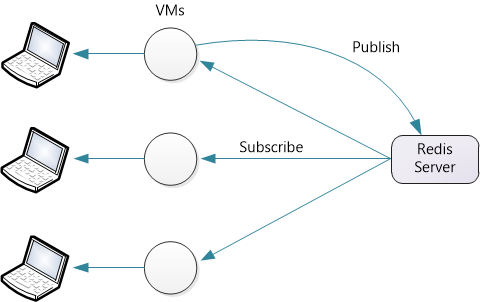
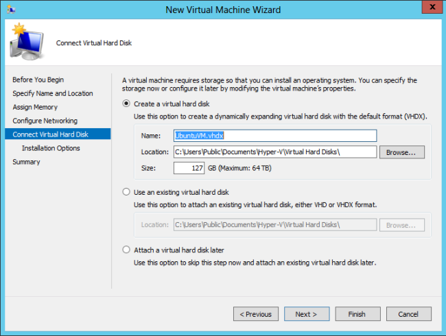
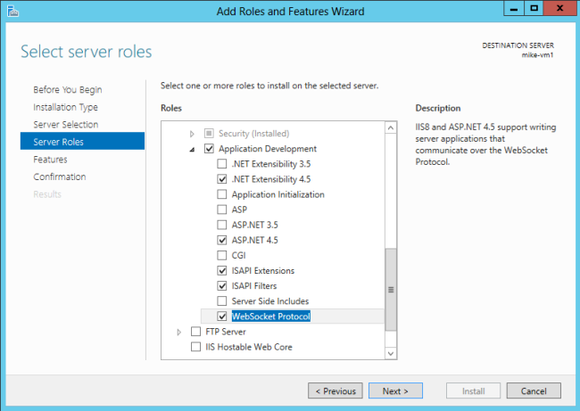
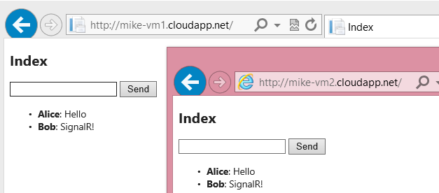

SignalR Scaleout with Redis (SignalR 1.x)
====================
by [Mike Wasson](https://github.com/MikeWasson), [Patrick Fletcher](https://github.com/pfletcher)

In this tutorial, you will use [Redis](http://redis.io/) to distribute messages across a SignalR application that is deployed on two separate IIS instances.

Redis is an in-memory key-value store. It also supports a messaging system with a publish/subscribe model. The SignalR Redis backplane uses the pub/sub feature to forward messages to other servers.

For this tutorial, you will use three servers:

- Two servers running Windows, which you will use to deploy a SignalR application.
- One server running Linux, which you will use to run Redis. For the screenshots in this tutorial, I used Ubuntu 12.04 TLS.

If you don't have three physical servers to use, you can create VMs on Hyper-V. Another option is to create VMs on Azure.

Although this tutorial uses the official Redis implementation, there is also a [Windows port of Redis](https://github.com/MSOpenTech/redis) from MSOpenTech. Setup and configuration are different, but otherwise the steps are the same.

> [!NOTE] 
> 
> SignalR scaleout with Redis does not support Redis clusters.

## Overview

Before we get to the detailed tutorial, here is a quick overview of what you will do.

1. Install Redis and start the Redis server.
2. Add these NuGet packages to your application: 

    - [Microsoft.AspNet.SignalR](http://nuget.org/packages/Microsoft.AspNet.SignalR)
    - [Microsoft.AspNet.SignalR.Redis](http://nuget.org/packages/Microsoft.AspNet.SignalR.Redis)
3. Create a SignalR application.
4. Add the following code to Global.asax to configure the backplane: 

    [!code-csharp[Main](scaleout-with-redis/samples/sample1.cs)]

## Ubuntu on Hyper-V

Using Windows Hyper-V, you can easily create an Ubuntu VM on Windows Server.

Download the Ubuntu ISO from [http://www.ubuntu.com](http://www.ubuntu.com/).

In Hyper-V, add a new VM. In the **Connect Virtual Hard Disk** step, select **Create a virtual hard disk**.

In the **Installation Options** step, select **Image file (.iso)**, click **Browse**, and browse to the Ubuntu installation ISO.

## Install Redis

Follow the steps at [http://redis.io/download](http://redis.io/download) to download and build Redis.

[!code-console[Main](scaleout-with-redis/samples/sample2.cmd)]

This builds the Redis binaries in the `src` directory.

By default, Redis does not require a password. To set a password, edit the `redis.conf` file, which is located in the root directory of the source code. (Make a backup copy of the file before you edit it!) Add the following directive to `redis.conf`:

[!code-powershell[Main](scaleout-with-redis/samples/sample3.ps1)]

Now start the Redis server:

[!code-css[Main](scaleout-with-redis/samples/sample4.css)]

Open port 6379, which is the default port that Redis listens on. (You can change the port number in the configuration file.)

## Create the SignalR Application

Create a SignalR application by following either of these tutorials:

- [Getting Started with SignalR](../getting-started/tutorial-getting-started-with-signalr.md)
- [Getting Started with SignalR and MVC 4](tutorial-getting-started-with-signalr-and-mvc-4.md)

Next, we'll modify the chat application to support scaleout with Redis. First, add the SignalR.Redis NuGet package to your project. In Visual Studio, from the **Tools** menu, select **Library Package Manager**, then select **Package Manager Console**. In the Package Manager Console window, enter the following command:

[!code-powershell[Main](scaleout-with-redis/samples/sample5.ps1)]

Next, open the Global.asax file. Add the following code to the **Application\_Start** method:

[!code-csharp[Main](scaleout-with-redis/samples/sample6.cs)]

- "server" is the name of the server that is running Redis.
- *port* is the port number
- "password" is the password that you defined in the redis.conf file.
- "AppName" is any string. SignalR creates a Redis pub/sub channel with this name.

For example:

[!code-csharp[Main](scaleout-with-redis/samples/sample7.cs)]

## Deploy and Run the Application

Prepare your Windows Server instances to deploy the SignalR application.

Add the IIS role. Include "Application Development" features, including the WebSocket Protocol.

Also include the Management Service (listed under "Management Tools").

**Install Web Deploy 3.0.** When you run IIS Manager, it will prompt you to install Microsoft Web Platform, or you can [download the intstaller](https://go.microsoft.com/fwlink/?LinkId=255386). In the Platform Installer, search for Web Deploy and install Web Deploy 3.0

Check that the Web Management Service is running. If not, start the service. (If you don't see Web Management Service in the list of Windows services, make sure that you installed the Management Service when you added the IIS role.)

By default, the Web Management Service listens on TCP port 8172. In Windows Firewall, create a new inbound rule to allow TCP traffic on port 8172. For more information, see [Configuring Firewall Rules](https://technet.microsoft.com/en-us/library/dd448559(WS.10).aspx). (If you are hosting the VMs on Azure, you can do this directly in the Azure portal. See [How to Set Up Endpoints to a Virtual Machine](https://azure.microsoft.com/en-us/documentation/articles/virtual-machines-set-up-endpoints/).)

Now you are ready to deploy the Visual Studio project from your development machine to the server. In Solution Explorer, right-click the solution and click **Publish**.

For more detailed documentation about web deployment, see [Web Deployment Content Map for Visual Studio and ASP.NET](../../../whitepapers/aspnet-web-deployment-content-map.md).

If you deploy the application to two servers, you can open each instance in a separate browser window and see that they each receive SignalR messages from the other. (Of course, in a production environment, the two servers would sit behind a load balancer.)

If you're curious to see the messages that are sent to Redis, you can use the **redis-cli** client, which installs with Redis.

[!code-xml[Main](scaleout-with-redis/samples/sample8.xml)]

