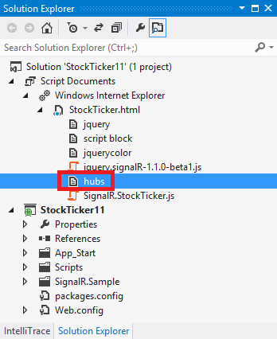

SignalR 1.x Hubs API Guide - JavaScript Client
====================
by [Patrick Fletcher](https://github.com/pfletcher), [Tom Dykstra](https://github.com/tdykstra)

> This document provides an introduction to using the Hubs API for SignalR version 1.1 in JavaScript clients, such as browsers and Windows Store (WinJS) applications.
> 
> The SignalR Hubs API enables you to make remote procedure calls (RPCs) from a server to connected clients and from clients to the server. In server code, you define methods that can be called by clients, and you call methods that run on the client. In client code, you define methods that can be called from the server, and you call methods that run on the server. SignalR takes care of all of the client-to-server plumbing for you.
> 
> SignalR also offers a lower-level API called Persistent Connections. For an introduction to SignalR, Hubs, and Persistent Connections, or for a tutorial that shows how to build a complete SignalR application, see [SignalR - Getting Started](../getting-started/index.md).

## Overview

This document contains the following sections:

- [The generated proxy and what it does for you](#genproxy)

    - [When to use the generated proxy](#cantusegenproxy)
- [Client Setup](#clientsetup)

    - [How to reference the dynamically generated proxy](#dynamicproxy)
    - [How to create a physical file for the SignalR generated proxy](#manualproxy)
- [How to establish a connection](#establishconnection)

    - [$.connection.hub is the same object that $.hubConnection() creates](#connequivalence)
    - [Asynchronous execution of the start method](#asyncstart)
- [How to establish a cross-domain connection](#crossdomain)
- [How to configure the connection](#configureconnection)

    - [How to specify query string parameters](#querystring)
    - [How to specify the transport method](#transport)
- [How to get a proxy for a Hub class](#getproxy)
- [How to define methods on the client that the server can call](#callclient)
- [How to call server methods from the client](#callserver)
- [How to handle connection lifetime events](#connectionlifetime)
- [How to handle errors](#handleerrors)
- [How to enable client-side logging](#logging)

For documentation on how to program the server or .NET clients, see the following resources:

- [SignalR Hubs API Guide - Server](../guide-to-the-api/hubs-api-guide-server.md)
- [SignalR Hubs API Guide - .NET Client](../guide-to-the-api/hubs-api-guide-net-client.md)

Links to API Reference topics are to the .NET 4.5 version of the API. If you're using .NET 4, see [the .NET 4 version of the API topics](https://msdn.microsoft.com/en-us/library/jj891075(v=vs.100).aspx).

## The generated proxy and what it does for you

You can program a JavaScript client to communicate with a SignalR service with or without a proxy that SignalR generates for you. What the proxy does for you is simplify the syntax of the code you use to connect, write methods that the server calls, and call methods on the server.

When you write code to call server methods, the generated proxy enables you to use syntax that looks as though you were executing a local function: you can write `serverMethod(arg1, arg2)` instead of `invoke('serverMethod', arg1, arg2)`. The generated proxy syntax also enables an immediate and intelligible client-side error if you mistype a server method name. And if you manually create the file that defines the proxies, you can also get IntelliSense support for writing code that calls server methods.

For example, suppose you have the following Hub class on the server:

[!code-csharp[Main](signalr-1x-hubs-api-guide-javascript-client/samples/sample1.cs?highlight=1,3,5)]

The following code examples show what JavaScript code looks like for invoking the `NewContosoChatMessage` method on the server and receiving invocations of the `addContosoChatMessageToPage` method from the server.

**With the generated proxy**

[!code-javascript[Main](signalr-1x-hubs-api-guide-javascript-client/samples/sample2.js?highlight=1-2,8)]

**Without the generated proxy**

[!code-javascript[Main](signalr-1x-hubs-api-guide-javascript-client/samples/sample3.js?highlight=2-3,9)]

### When to use the generated proxy

If you want to register multiple event handlers for a client method that the server calls, you can't use the generated proxy. Otherwise, you can choose to use the generated proxy or not based on your coding preference. If you choose not to use it, you don't have to reference the "signalr/hubs" URL in a `script` element in your client code.

## Client setup

A JavaScript client requires references to jQuery and the SignalR core JavaScript file. The jQuery version must be 1.6.4 or major later versions, such as 1.7.2, 1.8.2, or 1.9.1. If you decide to use the generated proxy, you also need a reference to the SignalR generated proxy JavaScript file. The following example shows what the references might look like in an HTML page that uses the generated proxy.

[!code-html[Main](signalr-1x-hubs-api-guide-javascript-client/samples/sample4.html)]

These references must be included in this order: jQuery first, SignalR core after that, and SignalR proxies last.

### How to reference the dynamically generated proxy

In the preceding example, the reference to the SignalR generated proxy is to dynamically generated JavaScript code, not to a physical file. SignalR creates the JavaScript code for the proxy on the fly and serves it to the client in response to the "/signalr/hubs" URL. If you specified a different base URL for SignalR connections on the server in your `MapHubs` method, the URL for the dynamically generated proxy file is your custom URL with "/hubs" appended to it.

> [!NOTE]
> For Windows 8 (Windows Store) JavaScript clients, use the physical proxy file instead of the dynamically generated one. For more information, see [How to create a physical file for the SignalR generated proxy](#manualproxy) later in this topic.

In an ASP.NET MVC 4 Razor view, use the tilde to refer to the application root in your proxy file reference:

[!code-html[Main](signalr-1x-hubs-api-guide-javascript-client/samples/sample5.html)]

For more information about using SignalR in MVC 4, see [Getting Started with SignalR and MVC 4](tutorial-getting-started-with-signalr-and-mvc-4.md).

In an ASP.NET MVC 3 Razor view, use `Url.Content` for your proxy file reference:

[!code-cshtml[Main](signalr-1x-hubs-api-guide-javascript-client/samples/sample6.cshtml)]

In an ASP.NET Web Forms application, use `ResolveClientUrl` for your proxies file reference or register it via the ScriptManager using an app root relative path (starting with a tilde):

[!code-aspx[Main](signalr-1x-hubs-api-guide-javascript-client/samples/sample7.aspx)]

As a general rule, use the same method for specifying the "/signalr/hubs" URL that you use for CSS or JavaScript files. If you specify a URL without using a tilde, in some scenarios your application will work correctly when you test in Visual Studio using IIS Express but will fail with a 404 error when you deploy to full IIS. For more information, see **Resolving References to Root-Level Resources** in [Web Servers in Visual Studio for ASP.NET Web Projects](https://msdn.microsoft.com/en-us/library/58wxa9w5.aspx) on the MSDN site.

When you run a web project in Visual Studio 2012 in debug mode, and if you use Internet Explorer as your browser, you can see the proxy file in **Solution Explorer** under **Script Documents**, as shown in the following illustration.

To see the contents of the file, double-click **hubs**. If you are not using Visual Studio 2012 and Internet Explorer, or if you are not in debug mode, you can also get the contents of the file by browsing to the "/signalR/hubs" URL. For example, if your site is running at `http://localhost:56699`, go to `http://localhost:56699/SignalR/hubs` in your browser.

### How to create a physical file for the SignalR generated proxy

As an alternative to the dynamically generated proxy, you can create a physical file that has the proxy code and reference that file. You might want to do that for control over caching or bundling behavior, or to get IntelliSense when you are coding calls to server methods.

To create a proxy file, perform the following steps:

1. Install the [Microsoft.AspNet.SignalR.Utils](https://nuget.org/packages/Microsoft.AspNet.SignalR.Utils/) NuGet package.
2. Open a command prompt and browse to the *tools* folder that contains the SignalR.exe file. The tools folder is at the following location:

    `[your solution folder]\packages\Microsoft.AspNet.SignalR.Utils.1.0.1\tools`
3. Enter the following command:

    `signalr ghp /path:[path to the .dll that contains your Hub class]`

    The path to your *.dll* is typically the *bin* folder in your project folder.

    This command creates a file named *server.js* in the same folder as *signalr.exe*.
4. Put the *server.js* file in an appropriate folder in your project, rename it as appropriate for your application, and add a reference to it in place of the "signalr/hubs" reference.

## How to establish a connection

Before you can establish a connection, you have to create a connection object, create a proxy, and register event handlers for methods that can be called from the server. When the proxy and event handlers are set up, establish the connection by calling the `start` method.

If you are using the generated proxy, you don't have to create the connection object in your own code because the generated proxy code does it for you.

**Establish a connection (with the generated proxy)**

[!code-javascript[Main](signalr-1x-hubs-api-guide-javascript-client/samples/sample8.js?highlight=5)]

**Establish a connection (without the generated proxy)**

[!code-javascript[Main](signalr-1x-hubs-api-guide-javascript-client/samples/sample9.js?highlight=1,6)]

The sample code uses the default "/signalr" URL to connect to your SignalR service. For information about how to specify a different base URL, see [ASP.NET SignalR Hubs API Guide - Server - The /signalr URL](../guide-to-the-api/hubs-api-guide-server.md#signalrurl).

> [!NOTE]
> Normally you register event handlers before calling the `start` method to establish the connection. If you want to register some event handlers after establishing the connection, you can do that, but you must register at least one of your event handler(s) before calling the `start` method. One reason for this is that there can be many Hubs in an application, but you wouldn't want to trigger the `OnConnected` event on every Hub if you are only going to use to one of them. When the connection is established, the presence of a client method on a Hub's proxy is what tells SignalR to trigger the `OnConnected` event. If you don't register any event handlers before calling the `start` method, you will be able to invoke methods on the Hub, but the Hub's `OnConnected` method won't be called and no client methods will be invoked from the server.

### $.connection.hub is the same object that $.hubConnection() creates

As you can see from the examples, when you use the generated proxy, `$.connection.hub` refers to the connection object. This is the same object that you get by calling `$.hubConnection()` when you aren't using the generated proxy. The generated proxy code creates the connection for you by executing the following statement:

When you're using the generated proxy, you can do anything with `$.connection.hub` that you can do with a connection object when you're not using the generated proxy.

### Asynchronous execution of the start method

The `start` method executes asynchronously. It returns a [jQuery Deferred object](http://api.jquery.com/category/deferred-object/), which means that you can add callback functions by calling methods such as `pipe`, `done`, and `fail`. If you have code that you want to execute after the connection is established, such as a call to a server method, put that code in a callback function or call it from a callback function. The `.done` callback method is executed after the connection has been established, and after any code that you have in your `OnConnected` event handler method on the server finishes executing.

If you put the "Now connected" statement from the preceding example as the next line of code after the `start` method call (not in a `.done` callback), the `console.log` line will execute before the connection is established, as shown in the following example:

## How to establish a cross-domain connection

Typically if the browser loads a page from `http://contoso.com`, the SignalR connection is in the same domain, at `http://contoso.com/signalr`. If the page from `http://contoso.com` makes a connection to `http://fabrikam.com/signalr`, that is a cross-domain connection. For security reasons, cross-domain connections are disabled by default. To establish a cross-domain connection, make sure that cross-domain connections are enabled on the server, and specify the connection URL when you create the connection object. SignalR will use the appropriate technology for cross-domain connections, such as [JSONP](http://en.wikipedia.org/wiki/JSONP) or [CORS](http://en.wikipedia.org/wiki/Cross-origin_resource_sharing).

On the server, enable cross-domain connections by selecting that option when you call the `MapHubs` method.

[!code-csharp[Main](signalr-1x-hubs-api-guide-javascript-client/samples/sample10.cs?highlight=2)]

On the client, specify the URL when you create the connection object (without the generated proxy) or before you call the start method (with the generated proxy).

**Client code that specifies a cross-domain connection (with the generated proxy)**

[!code-javascript[Main](signalr-1x-hubs-api-guide-javascript-client/samples/sample11.js?highlight=1)]

**Client code that specifies a cross-domain connection (without the generated proxy)**

[!code-javascript[Main](signalr-1x-hubs-api-guide-javascript-client/samples/sample12.js?highlight=1)]

When you use the `$.hubConnection` constructor, you don't have to include `signalr` in the URL because it is added automatically (unless you specify `useDefaultUrl` as `false`).

You can create multiple connections to different endpoints.

[!code-javascript[Main](signalr-1x-hubs-api-guide-javascript-client/samples/sample13.js)]

> [!NOTE] 
> 
> - Don't set `jQuery.support.cors` to true in your code.
> 
>     
> 
>     SignalR handles the use of JSONP or CORS. Setting `jQuery.support.cors` to true disables JSONP because it causes SignalR to assume the browser supports CORS.
> - When you're connecting to a localhost URL, Internet Explorer 10 won't consider it a cross-domain connection, so the application will work locally with IE 10 even if you haven't enabled cross-domain connections on the server.
> - For information about using cross-domain connections with Internet Explorer 9, see [this StackOverflow thread](http://stackoverflow.com/questions/13573397/siganlr-ie9-cross-domain-request-dont-work).
> - For information about using cross-domain connections with Chrome, see [this StackOverflow thread](http://stackoverflow.com/questions/15467373/signalr-1-0-1-cross-domain-request-cors-with-chrome).
> - The sample code uses the default "/signalr" URL to connect to your SignalR service. For information about how to specify a different base URL, see [ASP.NET SignalR Hubs API Guide - Server - The /signalr URL](../guide-to-the-api/hubs-api-guide-server.md#signalrurl).

## How to configure the connection

Before you establish a connection, you can specify query string parameters or specify the transport method.

### How to specify query string parameters

If you want to send data to the server when the client connects, you can add query string parameters to the connection object. The following examples show how to set a query string parameter in client code.

**Set a query string value before calling the start method (with the generated proxy)**

[!code-javascript[Main](signalr-1x-hubs-api-guide-javascript-client/samples/sample14.js?highlight=1)]

**Set a query string value before calling the start method (without the generated proxy)**

[!code-javascript[Main](signalr-1x-hubs-api-guide-javascript-client/samples/sample15.js?highlight=2)]

The following example shows how to read a query string parameter in server code.

[!code-csharp[Main](signalr-1x-hubs-api-guide-javascript-client/samples/sample16.cs?highlight=5)]

### How to specify the transport method

As part of the process of connecting, a SignalR client normally negotiates with the server to determine the best transport that is supported by both server and client. If you already know which transport you want to use, you can bypass this negotiation process by specifying the transport method when you call the `start` method.

**Client code that specifies the transport method (with the generated proxy)**

[!code-javascript[Main](signalr-1x-hubs-api-guide-javascript-client/samples/sample17.js?highlight=1)]

**Client code that specifies the transport method (without the generated proxy)**

[!code-javascript[Main](signalr-1x-hubs-api-guide-javascript-client/samples/sample18.js?highlight=2)]

As an alternative, you can specify multiple transport methods in the order in which you want SignalR to try them:

**Client code that specifies a custom transport fallback scheme (with the generated proxy)**

[!code-javascript[Main](signalr-1x-hubs-api-guide-javascript-client/samples/sample19.js?highlight=1)]

**Client code that specifies a custom transport fallback scheme (without the generated proxy)**

[!code-javascript[Main](signalr-1x-hubs-api-guide-javascript-client/samples/sample20.js?highlight=2)]

You can use the following values for specifying the transport method:

- "webSockets"
- "foreverFrame"
- "serverSentEvents"
- "longPolling"

The following examples show how to find out which transport method is being used by a connection.

**Client code that displays the transport method used by a connection (with the generated proxy)**

[!code-javascript[Main](signalr-1x-hubs-api-guide-javascript-client/samples/sample21.js?highlight=2)]

**Client code that displays the transport method used by a connection (without the generated proxy)**

[!code-javascript[Main](signalr-1x-hubs-api-guide-javascript-client/samples/sample22.js?highlight=3)]

For information about how to check the transport method in server code, see [ASP.NET SignalR Hubs API Guide - Server - How to get information about the client from the Context property](../guide-to-the-api/hubs-api-guide-server.md#contextproperty). For more information about transports and fallbacks, see [Introduction to SignalR - Transports and Fallbacks](../getting-started/introduction-to-signalr.md#transports).

## How to get a proxy for a Hub class

Each connection object that you create encapsulates information about a connection to a SignalR service that contains one or more Hub classes. To communicate with a Hub class, you use a proxy object which you create yourself (if you're not using the generated proxy) or which is generated for you.

On the client the proxy name is a camel-cased version of the Hub class name. SignalR automatically makes this change so that JavaScript code can conform to JavaScript conventions.

**Hub class on server**

[!code-csharp[Main](signalr-1x-hubs-api-guide-javascript-client/samples/sample23.cs?highlight=1)]

**Get a reference to the generated client proxy for the Hub**

[!code-javascript[Main](signalr-1x-hubs-api-guide-javascript-client/samples/sample24.js?highlight=1)]

**Create client proxy for the Hub class (without generated proxy)**

[!code-csharp[Main](signalr-1x-hubs-api-guide-javascript-client/samples/sample25.cs?highlight=1)]

If you decorate your Hub class with a `HubName` attribute, use the exact name without changing case.

**Hub class on server with HubName attribute**

[!code-csharp[Main](signalr-1x-hubs-api-guide-javascript-client/samples/sample26.cs?highlight=1)]

**Get a reference to the generated client proxy for the Hub**

[!code-javascript[Main](signalr-1x-hubs-api-guide-javascript-client/samples/sample27.js?highlight=1)]

**Create client proxy for the Hub class (without generated proxy)**

[!code-csharp[Main](signalr-1x-hubs-api-guide-javascript-client/samples/sample28.cs?highlight=1)]

## How to define methods on the client that the server can call

To define a method that the server can call from a Hub, add an event handler to the Hub proxy by using the `client` property of the generated proxy, or call the `on` method if you aren't using the generated proxy. The parameters can be complex objects.

Add the event handler before you call the `start` method to establish the connection. (If you want to add event handlers after calling the `start` method, see the note in [How to establish a connection](#establishconnection) earlier in this document, and use the syntax shown for defining a method without using the generated proxy.)

Method name matching is case-insensitive. For example, `Clients.All.addContosoChatMessageToPage` on the server will execute `AddContosoChatMessageToPage`, `addContosoChatMessageToPage`, or `addcontosochatmessagetopage` on the client.

**Define method on client (with the generated proxy)**

[!code-javascript[Main](signalr-1x-hubs-api-guide-javascript-client/samples/sample29.js?highlight=2)]

**Alternate way to define method on client (with the generated proxy)**

[!code-javascript[Main](signalr-1x-hubs-api-guide-javascript-client/samples/sample30.js?highlight=1-2)]

**Define method on client (without the generated proxy, or when adding after calling the start method)**

[!code-javascript[Main](signalr-1x-hubs-api-guide-javascript-client/samples/sample31.js?highlight=3)]

**Server code that calls the client method**

[!code-csharp[Main](signalr-1x-hubs-api-guide-javascript-client/samples/sample32.cs?highlight=5)]

The following examples include a complex object as a method parameter.

**Define method on client that takes a complex object (with the generated proxy)**

[!code-javascript[Main](signalr-1x-hubs-api-guide-javascript-client/samples/sample33.js?highlight=2-3)]

**Define method on client that takes a complex object (without the generated proxy)**

[!code-javascript[Main](signalr-1x-hubs-api-guide-javascript-client/samples/sample34.js?highlight=3-4)]

**Server code that defines the complex object**

[!code-csharp[Main](signalr-1x-hubs-api-guide-javascript-client/samples/sample35.cs?highlight=1)]

**Server code that calls the client method using a complex object**

[!code-csharp[Main](signalr-1x-hubs-api-guide-javascript-client/samples/sample36.cs?highlight=3)]

## How to call server methods from the client

To call a server method from the client, use the `server` property of the generated proxy or the `invoke` method on the Hub proxy if you aren't using the generated proxy. The return value or parameters can be complex objects.

Pass in a camel-case version of the method name on the Hub. SignalR automatically makes this change so that JavaScript code can conform to JavaScript conventions.

The following examples show how to call a server method that doesn't have a return value and how to call a server method that does have a return value.

**Server method with no HubMethodName attribute**

[!code-csharp[Main](signalr-1x-hubs-api-guide-javascript-client/samples/sample37.cs?highlight=3)]

**Server code that defines the complex object passed in a parameter**

[!code-csharp[Main](signalr-1x-hubs-api-guide-javascript-client/samples/sample38.cs)]

**Client code that invokes the server method (with the generated proxy)**

[!code-javascript[Main](signalr-1x-hubs-api-guide-javascript-client/samples/sample39.js?highlight=1)]

**Client code that invokes the server method (without the generated proxy)**

[!code-javascript[Main](signalr-1x-hubs-api-guide-javascript-client/samples/sample40.js?highlight=1)]

If you decorated the Hub method with a `HubMethodName` attribute, use that name without changing case.

**Server method** with a HubMethodName attribute

[!code-csharp[Main](signalr-1x-hubs-api-guide-javascript-client/samples/sample41.cs?highlight=3)]

**Client code that invokes the server method (with the generated proxy)**

[!code-javascript[Main](signalr-1x-hubs-api-guide-javascript-client/samples/sample42.js?highlight=1)]

**Client code that invokes the server method (without the generated proxy)**

[!code-javascript[Main](signalr-1x-hubs-api-guide-javascript-client/samples/sample43.js?highlight=1)]

The preceding examples show how to call a server method that has no return value. The following examples show how to call a server method that has a return value.

**Server code for a method that has a return value**

[!code-csharp[Main](signalr-1x-hubs-api-guide-javascript-client/samples/sample44.cs?highlight=3)]

**The Stock class used for the** return value

[!code-csharp[Main](signalr-1x-hubs-api-guide-javascript-client/samples/sample45.cs?highlight=1)]

**Client code that invokes the server method (with the generated proxy)**

[!code-javascript[Main](signalr-1x-hubs-api-guide-javascript-client/samples/sample46.js?highlight=2,4-5)]

**Client code that invokes the server method (without the generated proxy)**

[!code-javascript[Main](signalr-1x-hubs-api-guide-javascript-client/samples/sample47.js?highlight=2,4-5)]

## How to handle connection lifetime events

SignalR provides the following connection lifetime events that you can handle:

- `starting`: Raised before any data is sent over the connection.
- `received`: Raised when any data is received on the connection. Provides the received data.
- `connectionSlow`: Raised when the client detects a slow or frequently dropping connection.
- `reconnecting`: Raised when the underlying transport begins reconnecting.
- `reconnected`: Raised when the underlying transport has reconnected.
- `stateChanged`: Raised when the connection state changes. Provides the old state and the new state (Connecting, Connected, Reconnecting, or Disconnected).
- `disconnected`: Raised when the connection has disconnected.

For example, if you want to display warning messages when there are connection problems that might cause noticeable delays, handle the `connectionSlow` event.

**Handle the connectionSlow event (with the generated proxy)**

[!code-javascript[Main](signalr-1x-hubs-api-guide-javascript-client/samples/sample48.js?highlight=1)]

**Handle the connectionSlow event (without the generated proxy)**

[!code-javascript[Main](signalr-1x-hubs-api-guide-javascript-client/samples/sample49.js?highlight=2)]

For more information, see [Understanding and Handling Connection Lifetime Events in SignalR](index.md).

## How to handle errors

The SignalR JavaScript client provides an `error` event that you can add a handler for. You can also use the fail method to add a handler for errors that result from a server method invocation.

If you don't explicitly enable detailed error messages on the server, the exception object that SignalR returns after an error contains minimal information about the error. For example, if a call to `newContosoChatMessage` fails, the error message in the error object contains "`There was an error invoking Hub method 'contosoChatHub.newContosoChatMessage'.`" Sending detailed error messages to clients in production is not recommended for security reasons, but if you want to enable detailed error messages for troubleshooting purposes, use the following code on the server.

[!code-csharp[Main](signalr-1x-hubs-api-guide-javascript-client/samples/sample50.cs?highlight=2)]

The following example shows how to add a handler for the error event.

**Add an error handler (with the generated proxy)**

[!code-javascript[Main](signalr-1x-hubs-api-guide-javascript-client/samples/sample51.js?highlight=1)]

**Add an error handler (without the generated proxy)**

[!code-javascript[Main](signalr-1x-hubs-api-guide-javascript-client/samples/sample52.js?highlight=2)]

The following example shows how to handle an error from a method invocation.

**Handle an error from a method invocation (with the generated proxy)**

[!code-javascript[Main](signalr-1x-hubs-api-guide-javascript-client/samples/sample53.js?highlight=2)]

**Handle an error from a method invocation (without the generated proxy)**

[!code-javascript[Main](signalr-1x-hubs-api-guide-javascript-client/samples/sample54.js?highlight=2)]

If a method invocation fails, the `error` event is also raised, so your code in the `error` method handler and in the `.fail` method callback would execute.

## How to enable client-side logging

To enable client-side logging on a connection, set the `logging` property on the connection object before you call the `start` method to establish the connection.

**Enable logging (with the generated proxy)**

[!code-javascript[Main](signalr-1x-hubs-api-guide-javascript-client/samples/sample55.js?highlight=1)]

**Enable logging (without the generated proxy)**

[!code-javascript[Main](signalr-1x-hubs-api-guide-javascript-client/samples/sample56.js?highlight=2)]

To see the logs, open your browser's developer tools and go to the Console tab. For a tutorial that shows step-by-step instructions and screen shots that show how to do this, see [Server Broadcast with ASP.NET Signalr - Enable Logging](index.md).