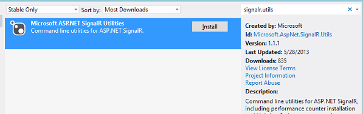

SignalR Performance (SignalR 1.x)
====================
by [Patrick Fletcher](https://github.com/pfletcher)

> This topic describes how to design for, measure, and improve performance in a SignalR application.

For a recent presentation on SignalR performance and scaling, see [Scaling the Real-time Web with ASP.NET SignalR](https://channel9.msdn.com/Events/Build/2013/3-502).

This topic contains the following sections:

- [Design considerations](#design)
- [Tuning your SignalR server for performance](#tuning)
- [Troubleshooting performance issues](#troubleshooting)
- [Using SignalR performance counters](#perfcounters)
- [Using other performance counters](#othercounters)
- [Other resources](#otherresources)

## Design considerations

This section describes patterns that can be implemented during the design of a SignalR application, to ensure that performance is not being hindered by generating unnecessary network traffic.

### Throttling message frequency

Even in an application that sends out messages at a high frequency (such as a realtime gaming application), most applications don't need to send more than a few messages a second. To reduce the amount of traffic that each client generates, a message loop can be implemented that queues and sends out messages no more frequently than a fixed rate (that is, up to a certain number of messages will be sent every second, if there are messages in that time interval to be sent). For a sample application that throttles messages to a certain rate (from both client and server), see [High-Frequency Realtime with SignalR](../getting-started/tutorial-high-frequency-realtime-with-signalr.md).

### Reducing message size

You can reduce the size of a SignalR message by reducing the size of your serialized objects. In server code, if you're sending an object that contains properties that don't need to be transmitted, prevent those properties from being serialized by using the `JsonIgnore` attribute. The names of properties are also stored in the message; the names of properties can be shortened using the `JsonProperty` attribute. The following code sample demonstrates how to exclude a property from being sent to the client, and how to shorten property names:

**.NET server code that demonstrates the JsonIgnore attribute to exclude data from being sent to the client, and the JsonProperty attribute to reduce message size**

[!code-csharp[Main](signalr-performance/samples/sample1.cs?highlight=5,7,10)]

In order to retain readability/ maintainability in the client code, the abbreviated property names can be remapped to human-friendly names after the message is received. The following code sample demonstrates one possible way of remapping shortened names to longer ones, by defining a message contract (mapping), and using the `reMap` function to apply the contract to the optimized message class:

**Client-side JavaScript code that remaps shortened property names to human-readable names**

[!code-javascript[Main](signalr-performance/samples/sample2.js)]

Names can be shortened in messages from the client to the server as well, using the same method.

Reducing the memory footprint (that is, the amount of memory used for the message) of the message object can also improve performance. For example, if the full range of an `int` is not needed, a `short` or `byte` can be used instead.

Since messages are stored in the message bus in server memory, reducing the size of messages can also address server memory issues.

### Tuning your SignalR server for performance

The following configuration settings can be used to tune your server for better performance in a SignalR application. For general information on how to improve performance in an ASP.NET application, see [Improving ASP.NET Performance](https://msdn.microsoft.com/en-us/library/ff647787.aspx).

**SignalR configuration settings**

- **DefaultMessageBufferSize**: By default, SignalR retains 1000 messages in memory per hub per connection. If large messages are being used, this may create memory issues which can be alleviated by reducing this value. This setting can be set in the `Application_Start` event handler in an ASP.NET application, or in the `Configuration` method of an OWIN startup class in a self-hosted application. The following sample demonstrates how to reduce this value in order to reduce the memory footprint of your application in order to reduce the amount of server memory used:

    **.NET server code in Global.asax for decreasing default message buffer size**

    [!code-csharp[Main](signalr-performance/samples/sample3.cs)]

**IIS configuration settings**

- **Max concurrent requests per application**: Increasing the number of concurrent IIS requests will increase server resources available for serving requests. The default value is 5000; to increase this setting, execute the following commands in an elevated command prompt:

    [!code-console[Main](signalr-performance/samples/sample4.cmd)]

**ASP.NET configuration settings**

This section includes configuration settings that can be set in the `aspnet.config` file. This file is found in one of two locations, depending on platform:

- `%windir%\Microsoft.NET\Framework\v4.0.30319\aspnet.config`
- `%windir%\Microsoft.NET\Framework64\v4.0.30319\aspnet.config`

ASP.NET settings that may improve SignalR performance include the following:

- **Maximum concurrent requests per CPU**: Increasing this setting may alleviate performance bottlenecks. To increase this setting, add the following configuration setting to the `aspnet.config` file:

    [!code-xml[Main](signalr-performance/samples/sample5.xml?highlight=4)]
- **Request Queue Limit**: When the total number of connections exceeds the `maxConcurrentRequestsPerCPU` setting, ASP.NET will start throttling requests using a queue. To increase the size of the queue, you can increase the `requestQueueLimit` setting. To do this, add the following configuration setting to the `processModel` node in `config/machine.config` (rather than `aspnet.config`):

    [!code-xml[Main](signalr-performance/samples/sample6.xml)]

## Troubleshooting performance issues

This section describes ways to find performance bottlenecks in your application.

### Verifying that WebSocket is being used

While SignalR can use a variety of transports for communication between client and server, WebSocket offers a significant performance advantage, and should be used if the client and server support it. To determine if your client and server meet the requirements for WebSocket, see [Transports and Fallbacks](../getting-started/introduction-to-signalr.md#transports). To determine what transport is being used in your application, you can use the browser developer tools, and examine the logs to see what transport is being used for the connection. For information on using the browser development tools in Internet Explorer and Chrome, see [Transports and Fallbacks](../getting-started/introduction-to-signalr.md#transports).

## Using SignalR performance counters

This section describes how to enable and use SignalR performance counters, found in the `Microsoft.AspNet.SignalR.Utils` package.

### Installing signalr.exe

Peformance counters can be added to the server using a utility called SignalR.exe. To install this utility, follow these steps:

1. In your Visual Studio application, select **Tools**, **Library Package Manager**, **Manage NuGet Packages for Solution...**
2. Search for **signalr.utils**, and select Install.

    
3. Accept the license agreement to install the package.
4. SignalR.exe will be installed to `<project folder>/packages/Microsoft.AspNet.SignalR.Utils.<version>/tools`.

### Installing performance counters with SignalR.exe

To install SignalR performance counters, run SignalR.exe in an elevated command prompt with the following parameter:

[!code-console[Main](signalr-performance/samples/sample7.cmd)]

To remove SignalR performance counters, run SignalR.exe in an elevated command prompt with the following parameter:

[!code-console[Main](signalr-performance/samples/sample8.cmd)]

### SignalR Performance counters

The utilites package installs the following performance counters. The "Total" counters measure the number of events since the last application pool or server restart.

**Connection metrics**

The following metrics measure the connection lifetime events that occur. For more information, see [Understanding and Handling Connection Lifetime Events](../guide-to-the-api/handling-connection-lifetime-events.md).

- **Connections Connected**
- **Connections Reconnected**
- **Connections Disonnected**
- **Connections Current**

**Message metrics**

The following metrics measure the message traffic generated by SignalR.

- **Connection Messages Received Total**
- **Connection Messages Sent Total**
- **Connection Messages Received/Sec**
- **Connection Messages Sent/Sec**

**Message bus metrics**

The following metrics measure traffic through the internal SignalR message bus, the queue in which all incoming and outgoing SignalR messages are placed. A message is **Published** when it is sent or broadcast. A **Subscriber** in this context is a subscription on the message bus; this should equal the number of clients plus the server itself. An **Allocated Worker** is a component that sends data to active connections; a **Busy Worker** is one that is actively sending a message.

- **Message Bus Messages Received Total**
- **Message Bus Messages Received/Sec**
- **Message Bus Messages Published Total**
- **Message Bus Messages Published/Sec**
- **Message Bus Subscribers Current**
- **Message Bus Subscribers Total**
- **Message Bus Subscribers/Sec**
- **Message Bus Allocated Workers**
- **Message Bus Busy Workers**
- **Message Bus Topics Current**

**Error metrics**

The following metrics measure errors generated by SignalR message traffic. **Hub Resolution** errors occur when a hub or hub method cannot be resolved. **Hub Invocation** errors are exceptions thrown while invoking a hub method. **Transport** errors are connection errors thrown during an HTTP request or response.

- **Errors: All Total**
- **Errors: All/Sec**
- **Errors: Hub Resolution Total**
- **Errors: Hub Resolution/Sec**
- **Errors: Hub Invocation Total**
- **Errors: Hub Invocation/Sec**
- **Errors: Transport Total**
- **Errors: Transport/Sec**

**Scaleout metrics**

The following metrics measure traffic and errors generated by the scaleout provider. A **Stream** in this context is a scale unit used by the scaleout provider; this is a table if SQL Server is used, a Topic if Service Bus is used, and a Subscription if Redis is used. By default, only one stream is used, but this can be increased through configuration on SQL Server and Service Bus. A **Buffering** stream is one that has entered a faulted state; when the stream is in the faulted state, all messages sent to the backplane will fail immediately until the stream is no longer faulting. The **Send Queue Length** is the number of messages that have been posted but not yet sent.

- **Scaleout Message Bus Messages Received/Sec**
- **Scaleout Streams Total**
- **Scaleout Streams Open**
- **Scaleout Streams Buffering**
- **Scaleout Errors Total**
- **Scaleout Errors/Sec**
- **Scaleout Send Queue Length**

For more information on what these counters are measuring, see [SignalR Scaleout with Azure Service Bus](scaleout-with-windows-azure-service-bus.md).

## Using other performance counters

The following performance counters may also be useful in monitoring your application's performance.

**Memory**

- .NET CLR Memory# bytes in all Heaps (for w3wp)

**ASP.NET**

- ASP.NET\Requests Current
- ASP.NET\Queued
- ASP.NET\Rejected

**CPU**

- Processor Information\Processor Time

**TCP/IP**

- TCPv6/Connections Established
- TCPv4/Connections Established

**Web Service**

- Web Service\Current Connections
- Web Service\Maximum Connections

**Threading**

- .NET CLR LocksAndThreads\# of current logical Threads
- .NET CLR LocksAnd Threads\# of current physical Threads

## Other Resources

For more information on ASP.NET performance monitoring and tuning, see the following topics:

- [ASP.NET Performance Overview](https://msdn.microsoft.com/en-us/library/cc668225(v=vs.100).aspx)
- [ASP.NET Thread Usage on IIS 7.5, IIS 7.0, and IIS 6.0](https://blogs.msdn.com/b/tmarq/archive/2007/07/21/asp-net-thread-usage-on-iis-7-0-and-6-0.aspx)
- [&lt;applicationPool&gt; Element (Web Settings)](https://msdn.microsoft.com/en-us/library/dd560842.aspx)