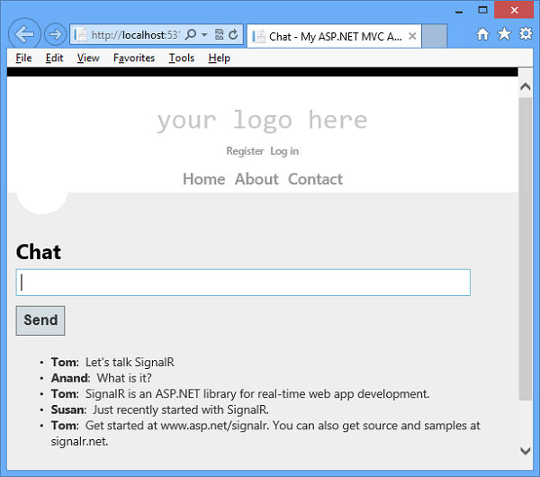
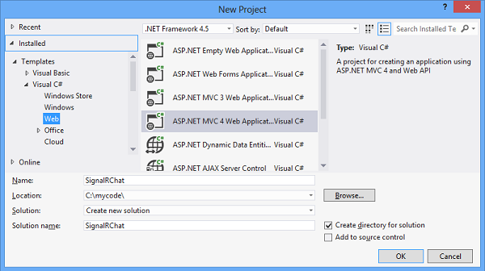
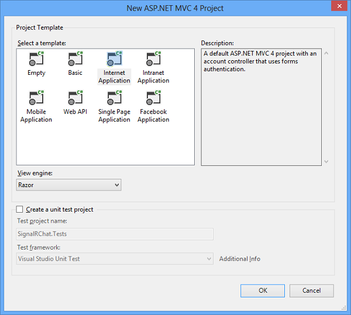
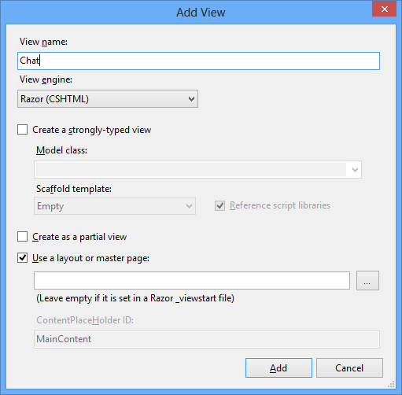
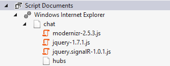

Tutorial: Getting Started with SignalR 1.x and MVC 4
====================
by [Patrick Fletcher](https://github.com/pfletcher), [Tim Teebken](https://github.com/timlt)

> This tutorial shows how to use ASP.NET SignalR to create a real-time chat application. You will add SignalR to an MVC 4 application and create a chat view to send and display messages.

## Overview

This tutorial introduces you to real-time web application development with ASP.NET SignalR and ASP.NET MVC 4. The tutorial uses the same chat application code as the [SignalR Getting Started tutorial](tutorial-getting-started-with-signalr.md), but shows how to add it to an MVC 4 application based on the Internet template.

In this topic you will learn the following SignalR development tasks:

- Adding the SignalR library to an MVC 4 application.
- Creating a hub class to push content to clients.
- Using the SignalR jQuery library in a web page to send messages and display updates from the hub.

The following screen shot shows the completed chat application running in a browser.

Sections:

- [Set up the Project](#setup)
- [Run the Sample](#run)
- [Examine the Code](#code)
- [Next Steps](#next)

## Set up the Project

Prerequisites:

- Visual Studio 2010 SP1, Visual Studio 2012, or Visual Studio 2012 Express. If you do not have Visual Studio, see [ASP.NET Downloads](https://www.asp.net/downloads) to get the free Visual Studio 2012 Express Development Tool.
- For Visual Studio 2010, install [ASP.NET MVC 4](https://www.microsoft.com/en-us/download/details.aspx?id=30683).

This section shows how to create an ASP.NET MVC 4 application, add the SignalR library, and create the chat application.

1. 1. In Visual Studio create an ASP.NET MVC 4 application, name it SignalRChat, and click OK.

        > [!NOTE]
        > In VS 2010, select **.NET Framework 4** in the Framework version dropdown control. SignalR code runs on .NET Framework versions 4 and 4.5.

        
    2. Select the Internet Application template, clear the option to **Create a unit test project**, and click OK.

        
    3. Open the **Tools | Library Package Manager | Package Manager Console** and run the following command. This step adds to the project a set of script files and assembly references that enable SignalR functionality.

        `install-package Microsoft.AspNet.SignalR -Version 1.1.3`
    4. In **Solution Explorer** expand the Scripts folder. Note that script libraries for SignalR have been added to the project.

        
    5. In **Solution Explorer**, right-click the project, select **Add | New Folder**, and add a new folder named **Hubs**.
    6. Right-click the **Hubs** folder, click **Add | Class**, and create a new C# class named **ChatHub.cs**. You will use this class as a SignalR server hub that sends messages to all clients.

> [!NOTE]
> If you use Visual Studio 2012 and have installed the [ASP.NET and Web Tools 2012.2 update](../../../visual-studio/overview/2012/aspnet-and-web-tools-20122-release-notes-rtw.md#_Installation), you can use the new SignalR item template to create the hub class. To do that, right-click the **Hubs** folder, click **Add | New Item**, select **SignalR Hub Class (v1)**, and name the class **ChatHub.cs**.

1. Replace the code in the **ChatHub** class with the following code.

    [!code-csharp[Main](tutorial-getting-started-with-signalr-and-mvc-4/samples/sample1.cs)]
2. Open the **Global.asax** file for the project, and add a call to the method `RouteTable.Routes.MapHubs();` as the first line of code in the `Application_Start` method. This code registers the default route for SignalR hubs and must be called before you register any other routes. The completed `Application_Start` method looks like the following example.

    [!code-csharp[Main](tutorial-getting-started-with-signalr-and-mvc-4/samples/sample2.cs)]
3. Edit the `HomeController` class found in **Controllers/HomeController.cs** and add the following method to the class. This method returns the **Chat** view that you will create in a later step.

    [!code-csharp[Main](tutorial-getting-started-with-signalr-and-mvc-4/samples/sample3.cs)]
4. Right-click within the `Chat` method you just created, and click **Add View** to create a new view file.
5. In the **Add View** dialog, make sure the check box is selected to **Use a layout or master page** (clear the other check boxes), and then click **Add**.

    
6. Edit the new view file named **Chat.cshtml**. After the &lt;h2&gt; tag, paste the following &lt;div&gt; section and `@section scripts` code block into the page. This script enables the page to send chat messages and display messages from the server. The complete code for the chat view appears in the following code block.

    > [!IMPORTANT]
    > When you add SignalR and other script libraries to your Visual Studio project, the Package Manager might install versions of the scripts that are more recent than the versions shown in this topic. Make sure that the script references in your code match the versions of the script libraries installed in your project.

    [!code-cshtml[Main](tutorial-getting-started-with-signalr-and-mvc-4/samples/sample4.cshtml)]
7. **Save All** for the project.

## Run the Sample

1. Press F5 to run the project in debug mode.
2. In the browser address line, append **/home/chat** to the URL of the default page for the project. The Chat page loads in a browser instance and prompts for a user name.

    
3. Enter a user name.
4. Copy the URL from the address line of the browser and use it to open two more browser instances. In each browser instance, enter a unique user name.
5. In each browser instance, add a comment and click **Send**. The comments should display in all browser instances.

    > [!NOTE]
    > This simple chat application does not maintain the discussion context on the server. The hub broadcasts comments to all current users. Users who join the chat later will see messages added from the time they join.
6. The following screen shot shows the chat application running in a browser.

    
7. In **Solution Explorer**, inspect the **Script Documents** node for the running application. This node is visible in debug mode if you are using Internet Explorer as your browser. There is a script file named **hubs** that the SignalR library dynamically generates at runtime. This file manages the communication between jQuery script and server-side code. If you use a browser other than Internet Explorer, you can also access the dynamic **hubs** file by browsing to it directly, for example http://mywebsite/signalr/hubs.

    

## Examine the Code

The SignalR chat application demonstrates two basic SignalR development tasks: creating a hub as the main coordination object on the server, and using the SignalR jQuery library to send and receive messages.

### SignalR Hubs

In the code sample the **ChatHub** class derives from the **Microsoft.AspNet.SignalR.Hub** class. Deriving from the **Hub** class is a useful way to build a SignalR application. You can create public methods on your hub class and then access those methods by calling them from jQuery scripts in a web page.

In the chat code, clients call the **ChatHub.Send** method to send a new message. The hub in turn sends the message to all clients by calling **Clients.All.addNewMessageToPage**.

The **Send** method demonstrates several hub concepts :

- Declare public methods on a hub so that clients can call them.
- Use the **Microsoft.AspNet.SignalR.Hub.Clients** property to access all clients connected to this hub.
- Call a jQuery function on the client (such as the `addNewMessageToPage` function) to update clients.

    [!code-csharp[Main](tutorial-getting-started-with-signalr-and-mvc-4/samples/sample5.cs)]

### SignalR and jQuery

The **Chat.cshtml** view file in the code sample shows how to use the SignalR jQuery library to communicate with a SignalR hub. The essential tasks in the code are creating a reference to the auto-generated proxy for the hub, declaring a function that the server can call to push content to clients, and starting a connection to send messages to the hub.

The following code declares a proxy for a hub.

[!code-javascript[Main](tutorial-getting-started-with-signalr-and-mvc-4/samples/sample6.js)]

> [!NOTE]
> In jQuery the reference to the server class and its members is in camel case. The code sample references the C# **ChatHub** class in jQuery as **chatHub**. If you want to reference the `ChatHub` class in jQuery with conventional Pascal casing as you would in C#, edit the ChatHub.cs class file. Add a `using` statement to reference the `Microsoft.AspNet.SignalR.Hubs` namespace. Then add the `HubName` attribute to the `ChatHub` class, for example `[HubName("ChatHub")]`. Finally, update your jQuery reference to the `ChatHub` class.

The following code shows how to create a callback function in the script. The hub class on the server calls this function to push content updates to each client. The optional call to the `htmlEncode` function shows a way to HTML encode the message content before displaying it in the page, as a way to prevent script injection.

[!code-html[Main](tutorial-getting-started-with-signalr-and-mvc-4/samples/sample7.html)]

The following code shows how to open a connection with the hub. The code starts the connection and then passes it a function to handle the click event on the **Send** button in the Chat page.

> [!NOTE]
> This approach ensures that the connection is established before the event handler executes.

[!code-javascript[Main](tutorial-getting-started-with-signalr-and-mvc-4/samples/sample8.js)]

## Next Steps

You learned that SignalR is a framework for building real-time web applications. You also learned several SignalR development tasks: how to add SignalR to an ASP.NET application, how to create a hub class, and how to send and receive messages from the hub.

To learn more advanced SignalR developments concepts, visit the following sites for SignalR source code and resources :

- [SignalR Project](http://signalr.net)
- [SignalR Github and Samples](https://github.com/SignalR/SignalR)
- [SignalR Wiki](https://github.com/SignalR/SignalR/wiki)