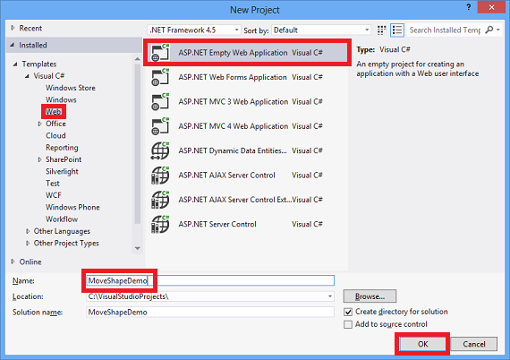
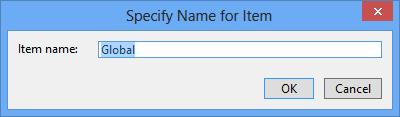
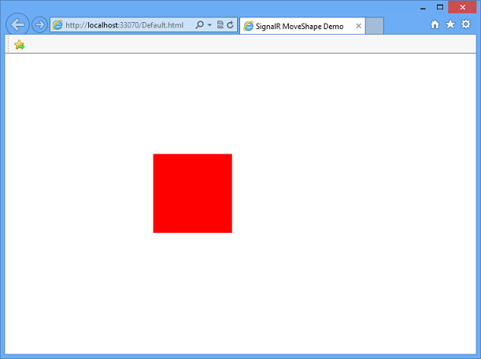

High-Frequency Realtime with SignalR 1.x
====================
by [Patrick Fletcher](https://github.com/pfletcher)

> This tutorial shows how to create a web application that uses ASP.NET SignalR to provide high-frequency messaging functionality. High-frequency messaging in this case means updates that are sent at a fixed rate; in the case of this application, up to 10 messages a second.
> 
> The application you'll create in this tutorial displays a shape that users can drag. The position of the shape in all other connected browsers will then be updated to match the position of the dragged shape using timed updates.
> 
> Concepts introduced in this tutorial have applications in real-time gaming and other simulation applications.
> 
> Comments on the tutorial are welcome. If you have questions that are not directly related to the tutorial, you can post them to the [ASP.NET SignalR forum](https://forums.asp.net/1254.aspx/1?ASP+NET+SignalR) or [StackOverflow.com](http://stackoverflow.com).

## Overview

This tutorial demonstrates how to create an application that shares the state of an object with other browsers in real time. The application we'll create is called MoveShape. The MoveShape page will display an HTML Div element that the user can drag; when the user drags the Div, its new position will be sent to the server, which will then tell all other connected clients to update the shape's position to match.

The application created in this tutorial is based on a demo by Damian Edwards. A video containing this demo can be seen [here](https://channel9.msdn.com/Series/Building-Web-Apps-with-ASP-NET-Jump-Start/Building-Web-Apps-with-ASPNET-Jump-Start-08-Real-time-Communication-with-SignalR).

The tutorial will start by demonstrating how to send SignalR messages from each event that fires as the shape is dragged. Each connected client will then update the position of the local version of the shape each time a message is received.

While the application will function using this method, this is not a recommended programming model, since there would be no upper limit to the number of messages getting sent, so the clients and server could get overwhelmed with messages and performance would degrade. The displayed animation on the client would also be disjointed, as the shape would be moved instantly by each method, rather than moving smoothly to each new location. Later sections of the tutorial will demonstrate how to create a timer function that restricts the maximum rate at which messages are sent by either the client or server, and how to move the shape smoothly between locations. The final version of the application created in this tutorial can be downloaded from [Code Gallery](https://code.msdn.microsoft.com/SignalR-MoveShape-demo-3366dac6).

This tutorial contains the following sections:

- [Prerequisites](#prerequisites)
- [Create the project](#createtheproject)
- [Add the ASP.NET SignalR and JQuery.UI NuGet packages](#nugetpackages)
- [Create the base application](#baseapp)
- [Add the client loop](#clientloop)
- [Add the server loop](#serverloop)
- [Add smooth animation on the client](#animation)
- [Further Steps](#furthersteps)

## Prerequisites

This tutorial requires Visual Studio 2012 or Visual Studio 2010. If Visual Studio 2010 is used, the project will use .NET Framework 4 rather than .NET Framework 4.5.

If you are using Visual Studio 2012, it's recommended that you install the [ASP.NET and Web Tools 2012.2 update](https://go.microsoft.com/fwlink/?LinkId=282650). This update contains new features such as enhancements to publishing, new functionality, and new templates.

If you have Visual Studio 2010, make sure that [NuGet](https://visualstudiogallery.msdn.microsoft.com/27077b70-9dad-4c64-adcf-c7cf6bc9970c) is installed.

## Create the project

In this section, we'll create the project in Visual Studio.

1. From the **File** menu click **New Project**.
2. In the **New Project** dialog box, expand **C#** under **Templates** and select **Web**.
3. Select the **ASP.NET Empty Web Application** template, name the project *MoveShapeDemo*, and click **OK**.

    

## Add the SignalR and JQuery.UI NuGet Packages

You can add SignalR functionality to a project by installing a NuGet package. This tutorial will also use the JQuery.UI package for allowing the shape to be dragged and animated.

1. Click **Tools | Library Package Manager | Package Manager Console**.
2. Enter the following command in the package manager.

    [!code-powershell[Main](tutorial-high-frequency-realtime-with-signalr/samples/sample1.ps1)]

    The SignalR package installs a number of other NuGet packages as dependencies. When the installation is finished you have all of the server and client components required to use SignalR in an ASP.NET application.
3. Enter the following command into the package manager console to install the JQuery and JQuery.UI packages.

    [!code-powershell[Main](tutorial-high-frequency-realtime-with-signalr/samples/sample2.ps1)]

## Create the base application

In this section, we'll create a browser application that sends the location of the shape to the server during each mouse move event. The server then broadcasts this information to all other connected clients as it is received. We'll expand on this application in later sections.

1. In **Solution Explorer**, right-click on the project and select **Add**, **Class...**. Name the class **MoveShapeHub** and click **Add**.
2. Replace the code in the new **MoveShapeHub** class with the following code.

    [!code-csharp[Main](tutorial-high-frequency-realtime-with-signalr/samples/sample3.cs)]

    The `MoveShapeHub` class above is an implementation of a SignalR hub. As in the [Getting Started with SignalR](index.md) tutorial, the hub has a method that the clients will call directly. In this case, the client will send an object containing the new X and Y coordinates of the shape to the server, which then gets broadcasted to all other connected clients. SignalR will automatically serialize this object using JSON.

    The object that will be sent to the client (`ShapeModel`) contains members to store the position of the shape. The version of the object on the server also contains a member to track which client's data is being stored, so that a given client won't be sent their own data. This member uses the `JsonIgnore` attribute to keep it from being serialized and sent to the client.
3. Next, we'll set up the hub when the application starts. In **Solution Explorer**, right-click the project, then click **Add | Global Application Class**. Accept the default name of *Global* and click **OK**.

    
4. Add the following `using` statement after the provided **using** statements in the Global.asax.cs class.

    [!code-csharp[Main](tutorial-high-frequency-realtime-with-signalr/samples/sample4.cs)]
5. Add the following line of code in the `Application_Start` method of the Global class to register the default route for SignalR.

    [!code-csharp[Main](tutorial-high-frequency-realtime-with-signalr/samples/sample5.cs)]

    Your global.asax file should look like the following:

    [!code-csharp[Main](tutorial-high-frequency-realtime-with-signalr/samples/sample6.cs)]
6. Next, we'll add the client. In **Solution Explorer**, right-click the project, then click **Add | New Item**. In the **Add New Item** dialog, select **Html Page**. Give the page an appropriate name (like **Default.html**) and click **Add**.
7. In **Solution Explorer**, right-click the page you just created and click **Set as Start Page**.
8. Replace the default code in the HTML page with the following code snippet.

    > [!NOTE]
    > Verify that the script references below match the packages added to your project in the Scripts folder. In Visual Studio 2010, the version of JQuery and SignalR added to the project may not match the version numbers below.

    [!code-html[Main](tutorial-high-frequency-realtime-with-signalr/samples/sample7.html)]

    The above HTML and JavaScript code creates a red Div called Shape, enables the shape's dragging behavior using the jQuery library, and uses the shape's `drag` event to send the shape's position to the server.
9. Start the application by pressing F5. Copy the page's URL, and paste it into a second browser window. Drag the shape in one of the browser windows; the shape in the other browser window should move.

    

## Add the client loop

Since sending the location of the shape on every mouse move event will create an unneccesary amount of network traffic, the messages from the client need to be throttled. We'll use the javascript `setInterval` function to set up a loop that sends new position information to the server at a fixed rate. This loop is a very basic representation of a "game loop", a repeatedly called function that drives all of the functionality of a game or other simulation.

1. Update the client code in the HTML page to match the following code snippet.

    [!code-html[Main](tutorial-high-frequency-realtime-with-signalr/samples/sample8.html)]

    The above update adds the `updateServerModel` function, which gets called on a fixed frequency. This function sends the position data to the server whenever the `moved` flag indicates that there is new position data to send.
2. Start the application by pressing F5. Copy the page's URL, and paste it into a second browser window. Drag the shape in one of the browser windows; the shape in the other browser window should move. Since the number of messages that get sent to the server will be throttled, the animation will not appear as smooth as in the previous section.

    

## Add the server loop

In the current application, messages sent from the server to the client go out as often as they are received. This presents a similar problem as was seen on the client; messages can be sent more often than they are needed, and the connection could become flooded as a result. This section describes how to update the server to implement a timer that throttles the rate of the outgoing messages.

1. Replace the contents of `MoveShapeHub.cs` with the following code snippet.

    [!code-csharp[Main](tutorial-high-frequency-realtime-with-signalr/samples/sample9.cs)]

    The above code expands the client to add the `Broadcaster` class, which throttles the outgoing messages using the `Timer` class from the .NET framework.

    Since the hub itself is transitory (it is created every time it is needed), the `Broadcaster` will be created as a singleton. Lazy initialization (introduced in .NET 4) is used to defer its creation until it is needed, ensuring that the first hub instance is completely created before the timer is started.

    The call to the clients' `UpdateShape` function is then moved out of the hub's `UpdateModel` method, so that it is no longer called immediately whenever incoming messages are received. Instead, the messages to the clients will be sent at a rate of 25 calls per second, managed by the `_broadcastLoop` timer from within the `Broadcaster` class.

    Lastly, instead of calling the client method from the hub directly, the `Broadcaster` class needs to obtain a reference to the currently operating hub (`_hubContext`) using the `GlobalHost`.
2. Start the application by pressing F5. Copy the page's URL, and paste it into a second browser window. Drag the shape in one of the browser windows; the shape in the other browser window should move. There will not be a visible difference in the browser from the previous section, but the number of messages that get sent to the client will be throttled.

    

## Add smooth animation on the client

The application is almost complete, but we could make one more improvement, in the motion of the shape on the client as it is moved in response to server messages. Rather than setting the position of the shape to the new location given by the server, we'll use the JQuery UI library's `animate` function to move the shape smoothly between its current and new position.

1. Update the client's `updateShape` method to look like the highlighted code below:

    [!code-html[Main](tutorial-high-frequency-realtime-with-signalr/samples/sample10.html?highlight=35-42)]

    The above code moves the shape from the old location to the new one given by the server over the course of the animation interval (in this case, 100 milliseconds). Any previous animation running on the shape is cleared before the new animation starts.
2. Start the application by pressing F5. Copy the page's URL, and paste it into a second browser window. Drag the shape in one of the browser windows; the shape in the other browser window should move. The movement of the shape in the other window should appear less jerky as its movement is interpolated over time rather than being set once per incoming message.

    

## Further Steps

In this tutorial, you've learned how to program a SignalR application that sends high-frequency messages between clients and servers. This communication paradigm is useful for developing online games and other simulations, such as [the ShootR game created with SignalR](http://shootr.signalr.net).

The complete application created in this tutorial can be downloaded from [Code Gallery](https://code.msdn.microsoft.com/SignalR-MoveShape-demo-3366dac6).

To learn more about SignalR development concepts, visit the following sites for SignalR source code and resources:

- [SignalR Project](http://signalr.net)
- [SignalR Github and Samples](https://github.com/SignalR/SignalR)
- [SignalR Wiki](https://github.com/SignalR/SignalR/wiki)