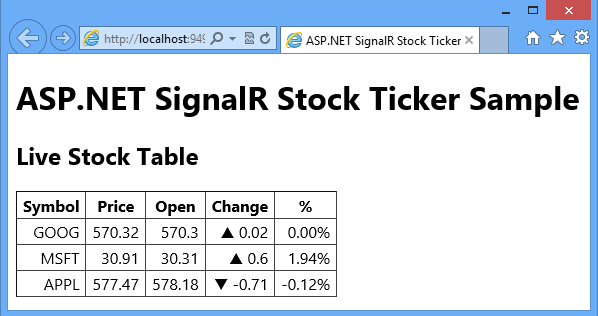
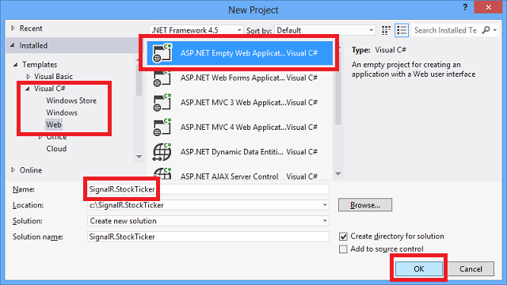
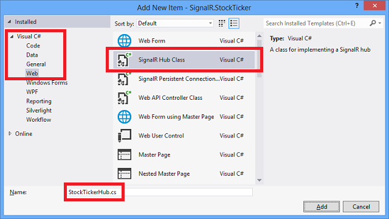
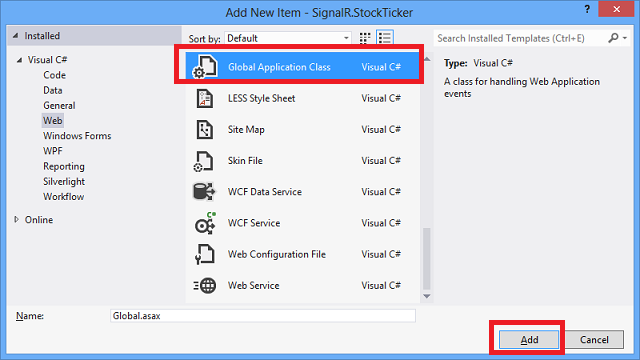
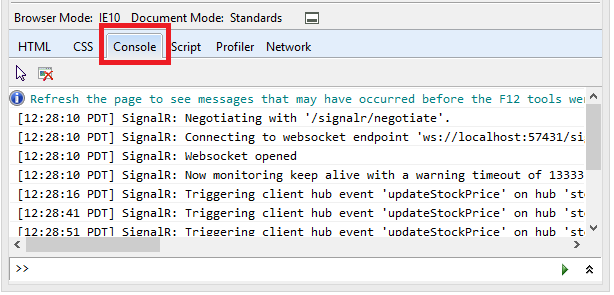
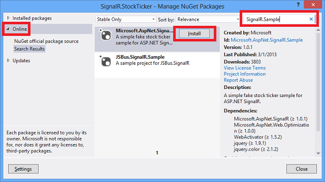
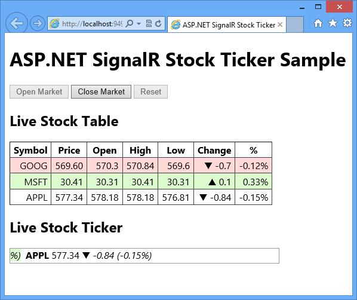

Tutorial: Server Broadcast with ASP.NET SignalR 1.x
====================
by [Patrick Fletcher](https://github.com/pfletcher), [Tom Dykstra](https://github.com/tdykstra)

> This tutorial shows how to create a web application that uses ASP.NET SignalR to provide server broadcast functionality. Server broadcast means that communications sent to clients are initiated by the server. This scenario requires a different programming approach than peer-to-peer scenarios such as chat applications, in which communications sent to clients are initiated by one or more of the clients.
> 
> The application that you'll create in this tutorial simulates a stock ticker, a typical scenario for server broadcast functionality.
> 
> Comments on the tutorial are welcome. If you have questions that are not directly related to the tutorial, you can post them to the [ASP.NET SignalR forum](https://forums.asp.net/1254.aspx/1?ASP+NET+SignalR) or [StackOverflow.com](http://stackoverflow.com).

## Overview

The [Microsoft.AspNet.SignalR.Sample](http://nuget.org/packages/microsoft.aspnet.signalr.sample) NuGet package installs a sample simulated stock ticker application in a Visual Studio project. In the first part of this tutorial, you'll create a simplified version of that application from scratch. In the remainder of the tutorial, you'll install the NuGet package and review the additional features and code that it creates.

The stock ticker application is a representative of a kind of real-time application in which you want to periodically "push," or broadcast, notifications from the server to all connected clients.

The application that you'll build in the first part of this tutorial displays a grid with stock data.

Periodically the server randomly updates stock prices and pushes the updates to all connected clients. In the browser the numbers and symbols in the **Change** and **%** columns dynamically change in response to notifications from the server. If you open additional browsers to the same URL, they all show the same data and the same changes to the data simultaneously.

This tutorial contains the following sections:

- [Prerequisites](#prerequisites)
- [Create the project](#createproject)
- [Add the SignalR NuGet packages](#nugetpackages)
- [Set up the server code](#server)
- [Set up the client code](#client)
- [Test the application](#test)
- [Enable logging](#enablelogging)
- [Install and review the full StockTicker sample](#fullsample)
- [Next steps](#nextsteps)

> [!NOTE]
> If you don't want to work through the steps of building the application, you can install the SignalR.Sample package in a new **Empty ASP.NET Web Application** project, and read through these steps to get explanations of the code. The first part of the tutorial covers a subset of the SignalR.Sample code, and the second part explains key features of the additional functionality in the SignalR.Sample package.

## Prerequisites

Before you start, make sure that you have Visual Studio 2012 or 2010 SP1 installed on your computer. If you don't have Visual Studio, see [ASP.NET Downloads](https://www.asp.net/downloads) to get the free Visual Studio 2012 Express for Web.

If you have Visual Studio 2010, make sure that [NuGet](https://visualstudiogallery.msdn.microsoft.com/27077b70-9dad-4c64-adcf-c7cf6bc9970c) is installed.

## Create the project

1. From the **File** menu click **New Project**.
2. In the **New Project** dialog box, expand **C#** under **Templates** and select **Web**.
3. Select the **ASP.NET Empty Web Application** template, name the project *SignalR.StockTicker*, and click **OK**.

    

## Add the SignalR NuGet Packages

### Add the SignalR and JQuery NuGet Packages

You can add SignalR functionality to a project by installing a NuGet package.

1. Click **Tools | Library Package Manager | Package Manager Console**.
2. Enter the following command in the package manager.

    [!code-powershell[Main](tutorial-server-broadcast-with-aspnet-signalr/samples/sample1.ps1)]

    The SignalR package installs a number of other NuGet packages as dependencies. When the installation is finished you have all of the server and client components required to use SignalR in an ASP.NET application.

## Set up the server code

In this section you set up the code that runs on the server.

### Create the Stock class

You begin by creating the Stock model class that you'll use to store and transmit information about a stock.

1. Create a new class file in the project folder, name it *Stock.cs*, and then replace the template code with the following code:

    [!code-csharp[Main](tutorial-server-broadcast-with-aspnet-signalr/samples/sample2.cs)]

    The two properties that you'll set when you create stocks are the Symbol (for example, MSFT for Microsoft) and the Price. The other properties depend on how and when you set Price. The first time you set Price, the value gets propagated to DayOpen. Subsequent times when you set Price, the Change and PercentChange property values are calculated based on the difference between Price and DayOpen.

### Create the StockTicker and StockTickerHub classes

You'll use the SignalR Hub API to handle server-to-client interaction. A StockTickerHub class that derives from the SignalR Hub class will handle receiving connections and method calls from clients. You also need to maintain stock data and run a Timer object to periodically trigger price updates, independently of client connections. You can't put these functions in a Hub class, because Hub instances are transient. A Hub class instance is created for each operation on the hub, such as connections and calls from the client to the server. So the mechanism that keeps stock data, updates prices, and broadcasts the price updates has to run in a separate class, which you'll name StockTicker.

You only want one instance of the StockTicker class to run on the server, so you'll need to set up a reference from each StockTickerHub instance to the singleton StockTicker instance. The StockTicker class has to be able to broadcast to clients because it has the stock data and triggers updates, but StockTicker is not a Hub class. Therefore, the StockTicker class has to get a reference to the SignalR Hub connection context object. It can then use the SignalR connection context object to broadcast to clients.

1. In **Solution Explorer**, right-click the project and click **Add New Item**.
2. If you have Visual Studio 2012 with the [ASP.NET and Web Tools 2012.2 Update](https://go.microsoft.com/fwlink/?LinkId=279941), click **Web** under **Visual C#** and select the **SignalR Hub Class** item template. Otherwise, select the **Class** template.
3. Name the new class *StockTickerHub.cs*, and then click **Add**.

    
4. Replace the template code with the following code:

    [!code-csharp[Main](tutorial-server-broadcast-with-aspnet-signalr/samples/sample3.cs)]

    The [Hub](https://msdn.microsoft.com/en-us/library/microsoft.aspnet.signalr.hub(v=vs.111).aspx) class is used to define methods the clients can call on the server. You are defining one method: `GetAllStocks()`. When a client initially connects to the server, it will call this method to get a list of all of the stocks with their current prices. The method can execute synchronously and return `IEnumerable<Stock>` because it is returning data from memory. If the method had to get the data by doing something that would involve waiting, such as a database lookup or a web service call, you would specify `Task<IEnumerable<Stock>>` as the return value to enable asynchronous processing. For more information, see [ASP.NET SignalR Hubs API Guide - Server - When to execute asynchronously](index.md).

    The HubName attribute specifies how the Hub will be referenced in JavaScript code on the client. The default name on the client if you don't use this attribute is a camel-cased version of the class name, which in this case would be stockTickerHub.

    As you'll see later when you create the StockTicker class, a singleton instance of that class is created in its static Instance property. That singleton instance of StockTicker remains in memory no matter how many clients connect or disconnect, and that instance is what the GetAllStocks method uses to return current stock information.
5. Create a new class file in the project folder, name it *StockTicker.cs*, and then replace the template code with the following code:

    [!code-csharp[Main](tutorial-server-broadcast-with-aspnet-signalr/samples/sample4.cs)]

    Since multiple threads will be running the same instance of StockTicker code, the StockTicker class has to be threadsafe.

    ### Storing the singleton instance in a static field

    The code initializes the static \_instance field that backs the Instance property with an instance of the class, and this is the only instance of the class that can be created, because the constructor is marked as private. [Lazy initialization](https://msdn.microsoft.com/en-us/library/dd997286.aspx) is used for the \_instance field, not for performance reasons but to ensure that the instance creation is threadsafe.

    [!code-csharp[Main](tutorial-server-broadcast-with-aspnet-signalr/samples/sample5.cs)]

    Each time a client connects to the server, a new instance of the StockTickerHub class running in a separate thread gets the StockTicker singleton instance from the StockTicker.Instance static property, as you saw earlier in the StockTickerHub class.

    ### Storing stock data in a ConcurrentDictionary

    The constructor initializes the \_stocks collection with some sample stock data, and GetAllStocks returns the stocks. As you saw earlier, this collection of stocks is in turn returned by StockTickerHub.GetAllStocks which is a server method in the Hub class that clients can call.

    [!code-csharp[Main](tutorial-server-broadcast-with-aspnet-signalr/samples/sample6.cs)]

    [!code-csharp[Main](tutorial-server-broadcast-with-aspnet-signalr/samples/sample7.cs)]

    The stocks collection is defined as a [ConcurrentDictionary](https://msdn.microsoft.com/en-us/library/dd287191.aspx) type for thread safety. As an alternative, you could use a [Dictionary](https://msdn.microsoft.com/en-us/library/xfhwa508.aspx) object and explicitly lock the dictionary when you make changes to it.

    For this sample application, it's OK to store application data in memory and to lose the data when the StockTicker instance is disposed. In a real application you would work with a back-end data store such as a database.

    ### Periodically updating stock prices

    The constructor starts up a Timer object that periodically calls methods that update stock prices on a random basis.

    [!code-csharp[Main](tutorial-server-broadcast-with-aspnet-signalr/samples/sample8.cs)]

    UpdateStockPrices is called by the Timer, which passes in null in the state parameter. Before updating prices, a lock is taken on the \_updateStockPricesLock object. The code checks if another thread is already updating prices, and then it calls TryUpdateStockPrice on each stock in the list. The TryUpdateStockPrice method decides whether to change the stock price, and how much to change it. If the stock price is changed, BroadcastStockPrice is called to broadcast the stock price change to all connected clients.

    The \_updatingStockPrices flag is marked as [volatile](https://msdn.microsoft.com/en-us/library/x13ttww7.aspx) to ensure that access to it is threadsafe.

    [!code-csharp[Main](tutorial-server-broadcast-with-aspnet-signalr/samples/sample9.cs)]

    In a real application, the TryUpdateStockPrice method would call a web service to look up the price; in this code it uses a random number generator to make changes randomly.

    ### Getting the SignalR context so that the StockTicker class can broadcast to clients

    Because the price changes originate here in the StockTicker object, this is the object that needs to call an updateStockPrice method on all connected clients. In a Hub class you have an API for calling client methods, but StockTicker does not derive from the Hub class and does not have a reference to any Hub object. Therefore, in order to broadcast to connected clients, the StockTicker class has to get the SignalR context instance for the StockTickerHub class and use that to call methods on clients.

    The code gets a reference to the SignalR context when it creates the singleton class instance, passes that reference to the constructor, and the constructor puts it in the Clients property.

    There are two reasons why you want to get the context just once: getting the context is an expensive operation, and getting it once ensures that the intended order of messages sent to clients is preserved.

    [!code-csharp[Main](tutorial-server-broadcast-with-aspnet-signalr/samples/sample10.cs)]

    Getting the Clients property of the context and putting it in the StockTickerClient property lets you write code to call client methods that looks the same as it would in a Hub class. For instance, to broadcast to all clients you can write Clients.All.updateStockPrice(stock).

    The updateStockPrice method that you are calling in BroadcastStockPrice doesn't exist yet; you'll add it later when you write code that runs on the client. You can refer to updateStockPrice here because Clients.All is dynamic, which means the expression will be evaluated at runtime. When this method call executes, SignalR will send the method name and the parameter value to the client, and if the client has a method named updateStockPrice, that method will be called and the parameter value will be passed to it.

    Clients.All means send to all clients. SignalR gives you other options to specify which clients or groups of clients to send to. For more information, see [HubConnectionContext](https://msdn.microsoft.com/en-us/library/microsoft.aspnet.signalr.hubs.hubconnectioncontext(v=vs.111).aspx).

### Register the SignalR route

The server needs to know which URL to intercept and direct to SignalR. To do that you'll add some code to the *Global.asax* file.

1. In **Solution Explorer**, right-click the project, and then click **Add New Item**.
2. Select the **Global Application Class** item template, and then click **Add**.

    
3. Add the SignalR route registration code to the Application\_Start method:

    [!code-csharp[Main](tutorial-server-broadcast-with-aspnet-signalr/samples/sample11.cs)]

    By default, the base URL for all SignalR traffic is "/signalr", and "/signalr/hubs" is used to retrieve a dynamically generated JavaScript file that defines proxies for all the Hubs you have in your application. The MapHubs method includes overloads that let you specify a different base URL and certain SignalR options in an instance of the [HubConfiguration](https://msdn.microsoft.com/en-us/library/microsoft.aspnet.signalr.hubconfiguration(v=vs.111).aspx) class.
4. Add a using statement at the top of the file:

    [!code-csharp[Main](tutorial-server-broadcast-with-aspnet-signalr/samples/sample12.cs)]
5. Save and close the *Global.asax* file, and build the project.

You have now completed setting up the server code. In the next section you'll set up the client.

## Set up the client code

1. Create a new HTML file in the project folder, and name it *StockTicker.html*.
2. Replace the template code with the following code:

    [!code-html[Main](tutorial-server-broadcast-with-aspnet-signalr/samples/sample13.html)]

    The HTML creates a table with 5 columns, a header row, and a data row with a single cell that spans all 5 columns. The data row displays "loading..." and will only be shown momentarily when the application starts. JavaScript code will remove that row and add in its place rows with stock data retrieved from the server.

    The script tags specify the jQuery script file, the SignalR core script file, the SignalR proxies script file, and a StockTicker script file that you'll create later. The SignalR proxies script file, which specifies the "/signalr/hubs" URL, is dynamically generated and defines proxy methods for the methods on the Hub class, in this case for StockTickerHub.GetAllStocks. If you prefer, you can generate this JavaScript file manually by using [SignalR Utilities](http://nuget.org/packages/Microsoft.AspNet.SignalR.Utils/) and disable dynamic file creation in the MapHubs method call.
3. > [!IMPORTANT]
 > Make sure that the JavaScript file references in *StockTicker.html* are correct. That is, make sure that the jQuery version in your script tag (1.8.2 in the example) is the same as the jQuery version in your project's *Scripts* folder, and make sure that the SignalR version in your script tag is the same as the SignalR version in your project's *Scripts* folder. Change the file names in the script tags if necessary.
4. In **Solution Explorer**, right-click *StockTicker.html*, and then click **Set as Start Page**.
5. Create a new JavaScript file in the project folder and name it *StockTicker.js*..
6. Replace the template code with the following code:

    [!code-javascript[Main](tutorial-server-broadcast-with-aspnet-signalr/samples/sample14.js)]

    $.connection refers to the SignalR proxies. The code gets a reference to the proxy for the StockTickerHub class and puts it in the ticker variable. The proxy name is the name that was set by the [HubName] attribute:

    [!code-javascript[Main](tutorial-server-broadcast-with-aspnet-signalr/samples/sample15.js)]

    [!code-csharp[Main](tutorial-server-broadcast-with-aspnet-signalr/samples/sample16.cs)]

    After all the variables and functions are defined, the last line of code in the file initializes the SignalR connection by calling the SignalR start function. The start function executes asynchronously and returns a [jQuery Deferred object](http://api.jquery.com/category/deferred-object/), which means you can call the done function to specify the function to call when the asynchronous operation is completed..

    [!code-javascript[Main](tutorial-server-broadcast-with-aspnet-signalr/samples/sample17.js)]

    The init function calls the getAllStocks function on the server and uses the information that the server returns to update the stock table. Notice that by default, you have to use camel casing on the client although the method name is pascal-cased on the server. The camel-casing rule only applies to methods, not objects. For example, you refer to stock.Symbol and stock.Price, not stock.symbol or stock.price.

    [!code-javascript[Main](tutorial-server-broadcast-with-aspnet-signalr/samples/sample18.js)]

    [!code-csharp[Main](tutorial-server-broadcast-with-aspnet-signalr/samples/sample19.cs)]

    If you wanted to use pascal casing on the client, or if you wanted to use a completely different method name, you could decorate the Hub method with the HubMethodName attribute the same way you decorated the Hub class itself with the HubName attribute.

    In the init method, HTML for a table row is created for each stock object received from the server by calling formatStock to format properties of the stock object, and then by calling supplant (which is defined at the top of *StockTicker.js*) to replace placeholders in the rowTemplate variable with the stock object property values. The resulting HTML is then appended to the stock table.

    You call init by passing it in as a callback function that executes after the asynchronous start function completes. If you called init as a separate JavaScript statement after calling start, the function would fail because it would execute immediately without waiting for the start function to finish establishing the connection. In that case, the init function would try to call the getAllStocks function before the server connection is established.

    When the server changes a stock's price, it calls the updateStockPrice on connected clients. The function is added to the client property of the stockTicker proxy in order to make it available to calls from the server.

    [!code-javascript[Main](tutorial-server-broadcast-with-aspnet-signalr/samples/sample20.js)]

    The updateStockPrice function formats a stock object received from the server into a table row the same way as in the init function. However, instead of appending the row to the table, it finds the stock's current row in the table and replaces that row with the new one.

## Test the application

1. Press F5 to run the application in debug mode.

    The stock table initially displays the "loading..." line, then after a short delay the initial stock data is displayed, and then the stock prices start to change.

    

    

    
2. Copy the URL from the browser address bar and paste it into one or more new browser window(s).

    The initial stock display is the same as the first browser and changes happen simultaneously.
3. Close all browsers and open a new browser, then go to the same URL.

    The StockTicker singleton object has continued to run in the server, so the stock table display shows that the stocks have continued to change. (You don't see the initial table with zero change figures.)
4. Close the browser.

## Enable logging

SignalR has a built-in logging function that you can enable on the client to aid in troubleshooting. In this section you enable logging and see examples that show how logs tell you which of the following transport methods SignalR is using:

- [WebSockets](http://en.wikipedia.org/wiki/WebSocket), supported by IIS 8 and current browsers.
- [Server-sent events](http://en.wikipedia.org/wiki/Server-sent_events), supported by browsers other than Internet Explorer.
- [Forever frame](http://en.wikipedia.org/wiki/Comet_(programming)#Hidden_iframe), supported by Internet Explorer.
- [Ajax long polling](http://en.wikipedia.org/wiki/Comet_(programming)#Ajax_with_long_polling), supported by all browsers.

For any given connection, SignalR chooses the best transport method that both the server and the client support.

1. Open *StockTicker.js* and add a line of code to enable logging immediately before the code that initializes the connection at the end of the file:

    [!code-javascript[Main](tutorial-server-broadcast-with-aspnet-signalr/samples/sample21.js)]
2. Press F5 to run the project.
3. Open your browser's developer tools window, and select the Console to see the logs. You might have to refresh the page to see the logs of Signalr negotiating the transport method for a new connection.

    If you are running Internet Explorer 10 on Windows 8 (IIS 8), the transport method is WebSockets.

    

    If you are running Internet Explorer 10 on Windows 7 (IIS 7.5), the transport method is iframe.

    

    In Firefox, install the Firebug add-in to get a Console window. If you are running Firefox 19 on Windows 8 (IIS 8), the transport method is WebSockets.

    

    If you are running Firefox 19 on Windows 7 (IIS 7.5), the transport method is server-sent events.

    

## Install and review the full StockTicker sample

The StockTicker application that is installed by the [Microsoft.AspNet.SignalR.Sample](http://nuget.org/packages/microsoft.aspnet.signalr.sample) NuGet package includes more features than the simplified version that you just created from scratch. In this section of the tutorial, you install the NuGet package and review the new features and the code that implements them.

### Install the SignalR.Sample NuGet package

1. In **Solution Explorer**, right-click the project and click **Manage NuGet Packages**.
2. In the **Manage NuGet Packages** dialog box, click **Online**, enter *SignalR.Sample* in the **Search Online** box, and then click **Install** in the **SignalR.Sample** package.

    
3. In the *Global.asax* file, comment out the RouteTable.Routes.MapHubs(); line that you added earlier in the Application\_Start method.

    The code in *Global.asax* is no longer needed because the SignalR.Sample package registers the SignalR route in the *App\_Start/RegisterHubs.cs* file:

    [!code-csharp[Main](tutorial-server-broadcast-with-aspnet-signalr/samples/sample22.cs)]

    The WebActivator class that is referenced by the assembly attribute is included in the WebActivatorEx NuGet package, which is installed as a dependency of the SignalR.Sample package.
4. In **Solution Explorer**, expand the *SignalR.Sample* folder which was created by installing the SignalR.Sample package.
5. In the *SignalR.Sample* folder, right-click *StockTicker.html*, and then click **Set As Start Page**.

    > [!NOTE]
    > Installing The SignalR.Sample NuGet package might change the version of jQuery that you have in your *Scripts* folder. The new *StockTicker.html* file that the package installs in the *SignalR.Sample* folder will be in sync with the jQuery version that the package installs, but if you want to run your original *StockTicker.html* file again, you might have to update the jQuery reference in the script tag first.

### Run the application

1. Press F5 to run the application.

    In addition to the grid that you saw earlier, the full stock ticker application shows a horizontally scrolling window that displays the same stock data. When you run the application for the first time, the "market" is "closed" and you see a static grid and a ticker window that isn't scrolling.

    

    When you click **Open Market**, the **Live Stock Ticker** box starts to scroll horizontally, and the server starts to periodically broadcast stock price changes on a random basis. Each time a stock price changes, both the **Live Stock Table** grid and the **Live Stock Ticker** box are updated. When a stock's price change is positive, the stock is shown with a green background, and when the change is negative, the stock is shown with a red background.

    

    The **Close Market** button stops the changes and stops the ticker scrolling, and the **Reset** button resets all stock data to the initial state before price changes started. If you open more browser windows and go to the same URL, you see the same data dynamically updated at the same time in each browser. When you click one of the buttons, all browsers respond the same way at the same time.

### Live Stock Ticker display

The **Live Stock Ticker** display is an unordered list in a div element that is formatted into a single line by CSS styles. The ticker is initialized and updated the same way as the table: by replacing placeholders in a &lt;li&gt; template string and dynamically adding the &lt;li&gt; elements to the &lt;ul&gt; element. The scrolling is performed by using the jQuery animate function to vary the margin-left of the unordered list within the div.

The stock ticker HTML:

[!code-html[Main](tutorial-server-broadcast-with-aspnet-signalr/samples/sample23.html)]

The stock ticker CSS:

[!code-html[Main](tutorial-server-broadcast-with-aspnet-signalr/samples/sample24.html)]

The jQuery code that makes it scroll:

[!code-javascript[Main](tutorial-server-broadcast-with-aspnet-signalr/samples/sample25.js)]

### Additional methods on the server that the client can call

The StockTickerHub class defines four additional methods that the client can call:

[!code-csharp[Main](tutorial-server-broadcast-with-aspnet-signalr/samples/sample26.cs)]

OpenMarket, CloseMarket, and Reset are called in response to the buttons at the top of the page. They demonstrate the pattern of one client triggering a change in state that is immediately propagated to all clients. Each of these methods calls a method in the StockTicker class that effects the market state change and then broadcasts the new state.

In the StockTicker class, the state of the market is maintained by a MarketState property that returns a MarketState enum value:

[!code-csharp[Main](tutorial-server-broadcast-with-aspnet-signalr/samples/sample27.cs)]

Each of the methods that change the market state do so inside a lock block because the StockTicker class has to be threadsafe:

[!code-csharp[Main](tutorial-server-broadcast-with-aspnet-signalr/samples/sample28.cs)]

To ensure that this code is threadsafe, the \_marketState field that backs the MarketState property is marked as volatile,

[!code-csharp[Main](tutorial-server-broadcast-with-aspnet-signalr/samples/sample29.cs)]

The BroadcastMarketStateChange and BroadcastMarketReset methods are similar to the BroadcastStockPrice method that you already saw, except they call different methods defined at the client:

[!code-csharp[Main](tutorial-server-broadcast-with-aspnet-signalr/samples/sample30.cs)]

### Additional functions on the client that the server can call

The updateStockPrice function now handles both the grid and the ticker display, and it uses jQuery.Color to flash red and green colors.

New functions in *SignalR.StockTicker.js* enable and disable the buttons based on market state, and they stop or start the ticker window horizontal scrolling. Since multiple functions are being added to ticker.client, the [jQuery extend function](http://api.jquery.com/jQuery.extend/) is used to add them.

[!code-javascript[Main](tutorial-server-broadcast-with-aspnet-signalr/samples/sample31.js)]

### Additional client setup after establishing the connection

After the client establishes the connection, it has some additional work to do: find out if the market is open or closed in order to call the appropriate marketOpened or marketClosed function, and attach the server method calls to the buttons.

[!code-javascript[Main](tutorial-server-broadcast-with-aspnet-signalr/samples/sample32.js)]

The server methods are not wired up to the buttons until after the connection is established, so that the code can't try to call the server methods before they are available.

## Next steps

In this tutorial you've learned how to program a SignalR application that broadcasts messages from the server to all connected clients, both on a periodic basis and in response to notifications from any client. The pattern of using a multi-threaded singleton instance to maintain server state can also be also used in multi-player online game scenarios. For an example, see [the ShootR game that is based on SignalR](https://github.com/NTaylorMullen/ShootR).

For tutorials that show peer-to-peer communication scenarios, see [Getting Started with SignalR](index.md) and [Real-Time Updating with SignalR](index.md).

To learn more advanced SignalR development concepts, visit the following sites for SignalR source code and resources:

- [ASP.NET SignalR](https://asp.net/signalr/)
- [SignalR Project](http://signalr.net/)
- [SignalR Github and Samples](https://github.com/SignalR/SignalR)
- [SignalR Wiki](https://github.com/SignalR/SignalR/wiki)