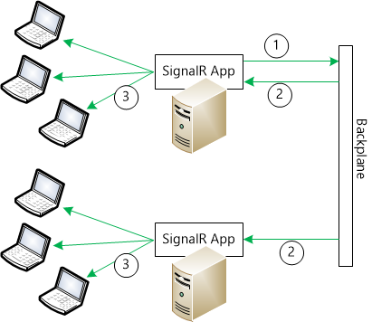

Introduction to Scaleout in SignalR
====================
by [Mike Wasson](https://github.com/MikeWasson), [Patrick Fletcher](https://github.com/pfletcher)

> ## Software versions used in this topic
> 
> 
> - [Visual Studio 2013](https://www.microsoft.com/visualstudio/eng/2013-downloads)
> - .NET 4.5
> - SignalR version 2
>   
> 
> 
> ## Previous versions of this topic
> 
> For information about earlier versions of SignalR, see [SignalR Older Versions](../older-versions/index.md).
> 
> ## Questions and comments
> 
> Please leave feedback on how you liked this tutorial and what we could improve in the comments at the bottom of the page. If you have questions that are not directly related to the tutorial, you can post them to the [ASP.NET SignalR forum](https://forums.asp.net/1254.aspx/1?ASP+NET+SignalR) or [StackOverflow.com](http://stackoverflow.com/).

In general, there are two ways to scale a web application: *scale up* and *scale out*.

- Scale up means using a larger server (or a larger VM) with more RAM, CPUs, etc.
- Scale out means adding more servers to handle the load.

The problem with scaling up is that you quickly hit a limit on the size of the machine. Beyond that, you need to scale out. However, when you scale out, clients can get routed to different servers. A client that is connected to one server will not receive messages sent from another server.

One solution is to forward messages between servers, using a component called a *backplane*. With a backplane enabled, each application instance sends messages to the backplane, and the backplane forwards them to the other application instances. (In electronics, a backplane is a group of parallel connectors. By analogy, a SignalR backplane connects multiple servers.)

SignalR currently provides three backplanes:

- **Azure Service Bus**. Service Bus is a messaging infrastructure that allows components to send messages in a loosely coupled way.
- **Redis**. Redis is an in-memory key-value store. Redis supports a publish/subscribe ("pub/sub") pattern for sending messages.
- **SQL Server**. The SQL Server backplane writes messages to SQL tables. The backplane uses Service Broker for efficient messaging. However, it also works if Service Broker is not enabled.

If you deploy your application on Azure, consider using the Redis backplane using [Azure Redis Cache](https://azure.microsoft.com/en-us/services/cache/). If you are deploying to your own server farm, consider the SQL Server or Redis backplanes.

The following topics contain step-by-step tutorials for each backplane:

- [SignalR Scaleout with Azure Service Bus](scaleout-with-windows-azure-service-bus.md)
- [SignalR Scaleout with Redis](scaleout-with-redis.md)
- [SignalR Scaleout with SQL Server](scaleout-with-sql-server.md)

## Implementation

In SignalR, every message is sent through a message bus. A message bus implements the [IMessageBus](https://msdn.microsoft.com/en-us/library/microsoft.aspnet.signalr.messaging.imessagebus(v=vs.100).aspx) interface, which provides a publish/subscribe abstraction. The backplanes work by replacing the default **IMessageBus** with a bus designed for that backplane. For example, the message bus for Redis is [RedisMessageBus](https://msdn.microsoft.com/en-us/library/microsoft.aspnet.signalr.redis.redismessagebus(v=vs.100).aspx), and it uses the Redis [pub/sub](http://redis.io/topics/pubsub) mechanism to send and receive messages.

Each server instance connects to the backplane through the bus. When a message is sent, it goes to the backplane, and the backplane sends it to every server. When a server gets a message from the backplane, it puts the message in its local cache. The server then delivers messages to clients from its local cache.

For each client connection, the client's progress in reading the message stream is tracked using a cursor. (A cursor represents a position in the message stream.) If a client disconnects and then reconnects, it asks the bus for any messages that arrived after the client's cursor value. The same thing happens when a connection uses [long polling](../getting-started/introduction-to-signalr.md#transports). After a long poll request completes, the client opens a new connection and asks for messages that arrived after the cursor.

The cursor mechanism works even if a client is routed to a different server on reconnect. The backplane is aware of all the servers, and it doesn't matter which server a client connects to.

## Limitations

Using a backplane, the maximum message throughput is lower than it is when clients talk directly to a single server node. That's because the backplane forwards every message to every node, so the backplane can become a bottleneck. Whether this limitation is a problem depends on the application. For example, here are some typical SignalR scenarios:

- [Server broadcast](../getting-started/tutorial-server-broadcast-with-signalr.md) (e.g., stock ticker): Backplanes work well for this scenario, because the server controls the rate at which messages are sent.
- [Client-to-client](../getting-started/tutorial-getting-started-with-signalr.md) (e.g., chat): In this scenario, the backplane might be a bottleneck if the number of messages scales with the number of clients; that is, if the rate of messages grows proportionally as more clients join.
- [High-frequency realtime](../getting-started/tutorial-high-frequency-realtime-with-signalr.md) (e.g., real-time games): A backplane is not recommended for this scenario.

## Enabling Tracing For SignalR Scaleout

To enable tracing for the backplanes, add the following sections to the web.config file, under the root **configuration** element:

[!code-html[Main](scaleout-in-signalr/samples/sample1.html)]