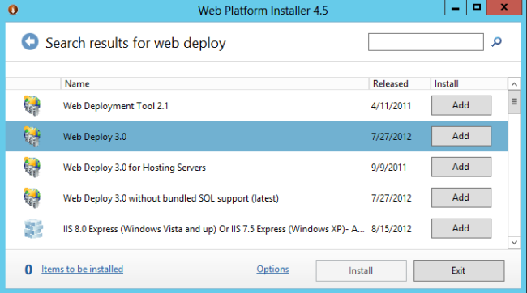

SignalR Scaleout with SQL Server
====================
by [Mike Wasson](https://github.com/MikeWasson), [Patrick Fletcher](https://github.com/pfletcher)

> ## Software versions used in this topic
> 
> 
> - [Visual Studio 2013](https://www.microsoft.com/visualstudio/eng/2013-downloads)
> - .NET 4.5
> - SignalR version 2
>   
> 
> 
> ## Previous versions of this topic
> 
> For information about earlier versions of SignalR, see [SignalR Older Versions](../older-versions/index.md).
> 
> ## Questions and comments
> 
> Please leave feedback on how you liked this tutorial and what we could improve in the comments at the bottom of the page. If you have questions that are not directly related to the tutorial, you can post them to the [ASP.NET SignalR forum](https://forums.asp.net/1254.aspx/1?ASP+NET+SignalR) or [StackOverflow.com](http://stackoverflow.com/).

In this tutorial, you will use SQL Server to distribute messages across a SignalR application that is deployed in two separate IIS instances. You can also run this tutorial on a single test machine, but to get the full effect, you need to deploy the SignalR application to two or more servers. You must also install SQL Server on one of the servers, or on a separate dedicated server. Another option is to run the tutorial using VMs on Azure.

## Prerequisites

Microsoft SQL Server 2005 or later. The backplane supports both desktop and server editions of SQL Server. It does not support SQL Server Compact Edition or Azure SQL Database. (If your application is hosted on Azure, consider the Service Bus backplane instead.)

## Overview

Before we get to the detailed tutorial, here is a quick overview of what you will do.

1. Create a new empty database. The backplane will create the necessary tables in this database.
2. Add these NuGet packages to your application: 

    - [Microsoft.AspNet.SignalR](http://nuget.org/packages/Microsoft.AspNet.SignalR)
    - [Microsoft.AspNet.SignalR.SqlServer](http://nuget.org/packages/Microsoft.AspNet.SignalR.SqlServer)
3. Create a SignalR application.
4. Add the following code to Startup.cs to configure the backplane: 

    [!code-csharp[Main](scaleout-with-sql-server/samples/sample1.cs)]

 This code configures the backplane with the default values for [TableCount](https://msdn.microsoft.com/en-us/library/microsoft.aspnet.signalr.sqlscaleoutconfiguration.tablecount(v=vs.118).aspx) and [MaxQueueLength](https://msdn.microsoft.com/en-us/library/microsoft.aspnet.signalr.messaging.scaleoutconfiguration.maxqueuelength(v=vs.118).aspx). For information on changing these values, see [SignalR Performance: Scaleout Metrics](signalr-performance.md#scaleout_metrics). 

## Configure the Database

Decide whether the application will use Windows authentication or SQL Server authentication to access the database. Regardless, make sure the database user has permissions to log in, create schemas, and create tables.

Create a new database for the backplane to use. You can give the database any name. You don't need to create any tables in the database; the backplane will create the necessary tables.

## Enable Service Broker

It is recommended to enable Service Broker for the backplane database. Service Broker provides native support for messaging and queuing in SQL Server, which lets the backplane receive updates more efficiently. (However, the backplane also works without Service Broker.)

To check whether Service Broker is enabled, query the **is\_broker\_enabled** column in the **sys.databases** catalog view.

[!code-sql[Main](scaleout-with-sql-server/samples/sample2.sql)]

To enable Service Broker, use the following SQL query:

[!code-sql[Main](scaleout-with-sql-server/samples/sample3.sql)]

> [!NOTE]
> If this query appears to deadlock, make sure there are no applications connected to the DB.

If you have enabled tracing, the traces will also show whether Service Broker is enabled.

## Create a SignalR Application

Create a SignalR application by following either of these tutorials:

- [Getting Started with SignalR 2.0](../getting-started/tutorial-getting-started-with-signalr.md)
- [Getting Started with SignalR 2.0 and MVC 5](../getting-started/tutorial-getting-started-with-signalr-and-mvc.md)

Next, we'll modify the chat application to support scaleout with SQL Server. First, add the SignalR.SqlServer NuGet package to your project. In Visual Studio, from the **Tools** menu, select **Library Package Manager**, then select **Package Manager Console**. In the Package Manager Console window, enter the following command:

[!code-powershell[Main](scaleout-with-sql-server/samples/sample4.ps1)]

Next, open the Startup.cs file. Add the following code to the **Configure** method:

[!code-csharp[Main](scaleout-with-sql-server/samples/sample5.cs)]

## Deploy and Run the Application

Prepare your Windows Server instances to deploy the SignalR application.

Add the IIS role. Include "Application Development" features, including the WebSocket Protocol.

Also include the Management Service (listed under "Management Tools").

**Install Web Deploy 3.0.** When you run IIS Manager, it will prompt you to install Microsoft Web Platform, or you can [download the intstaller](https://go.microsoft.com/fwlink/?LinkId=255386). In the Platform Installer, search for Web Deploy and install Web Deploy 3.0

Check that the Web Management Service is running. If not, start the service. (If you don't see Web Management Service in the list of Windows services, make sure that you installed the Management Service when you added the IIS role.)

Finally, open port 8172 for TCP. This is the port that the Web Deploy tool uses.

Now you are ready to deploy the Visual Studio project from your development machine to the server. In Solution Explorer, right-click the solution and click **Publish**.

For more detailed documentation about web deployment, see [Web Deployment Content Map for Visual Studio and ASP.NET](../../../whitepapers/aspnet-web-deployment-content-map.md).

If you deploy the application to two servers, you can open each instance in a separate browser window and see that they each receive SignalR messages from the other. (Of course, in a production environment, the two servers would sit behind a load balancer.)

After you run the application, you can see that SignalR has automatically created tables in the database:

SignalR manages the tables. As long as your application is deployed, don't delete rows, modify the table, and so forth.