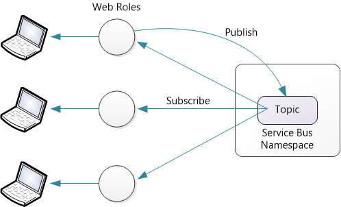
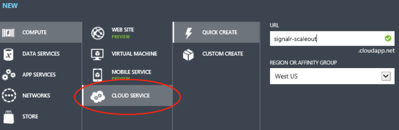
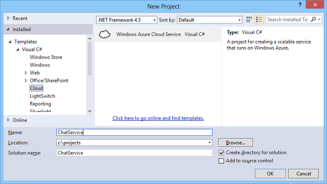
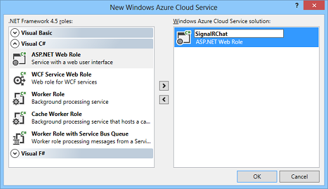
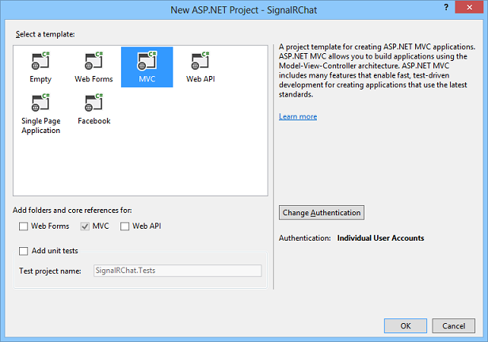
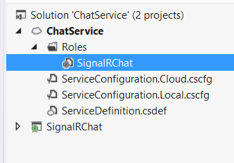
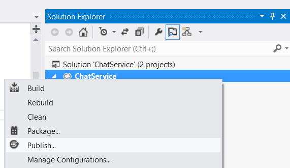
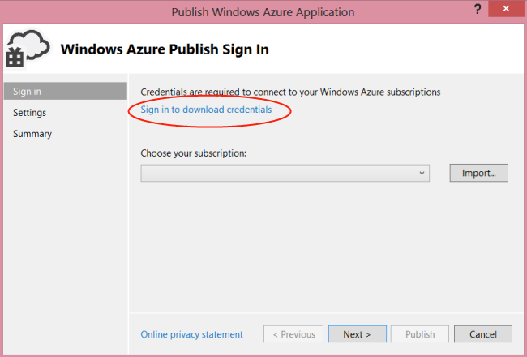
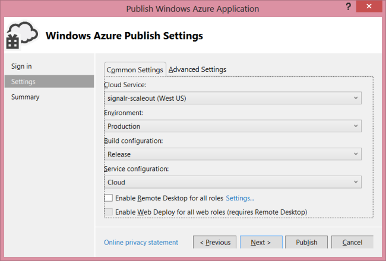
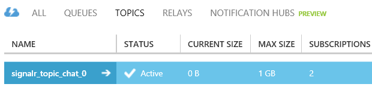

SignalR Scaleout with Azure Service Bus
====================
by [Mike Wasson](https://github.com/MikeWasson), [Patrick Fletcher](https://github.com/pfletcher)

In this tutorial, you will deploy a SignalR application to a Windows Azure Web Role, using the Service Bus backplane to distribute messages to each role instance. (You can also use the Service Bus backplane with [web apps in Azure App Service](https://www.windowsazure.com/en-us/manage/services/web-sites).)

Prerequisites:

- A Windows Azure account.
- The [Windows Azure SDK](https://go.microsoft.com/fwlink/?linkid=254364&amp;clcid=0x409).
- Visual Studio 2012 or 2013.

The service bus backplane is also compatible with [Service Bus for Windows Server](https://msdn.microsoft.com/en-us/library/windowsazure/dn282144.aspx), version 1.1. However, it is not compatible with version 1.0 of Service Bus for Windows Server.

## Pricing

The Service Bus backplane uses topics to send messages. For the latest pricing information, see [Service Bus](https://www.windowsazure.com/en-us/pricing/details/service-bus/). At the time of this writing, you can send 1,000,000 messages per month for less than $1. The backplane sends a service bus message for each invocation of a SignalR hub method. There are also some control messages for connections, disconnections, joining or leaving groups, and so forth. In most applications, the majority of the message traffic will be hub method invocations.

## Overview

Before we get to the detailed tutorial, here is a quick overview of what you will do.

1. Use the Windows Azure portal to create a new Service Bus namespace.
2. Add these NuGet packages to your application: 

    - [Microsoft.AspNet.SignalR](http://nuget.org/packages/Microsoft.AspNet.SignalR)
    - [Microsoft.AspNet.SignalR.ServiceBus](http://www.nuget.org/packages/SignalR.WindowsAzureServiceBus)
3. Create a SignalR application.
4. Add the following code to Startup.cs to configure the backplane: 

    [!code-csharp[Main](scaleout-with-windows-azure-service-bus/samples/sample1.cs)]

This code configures the backplane with the default values for [TopicCount](https://msdn.microsoft.com/en-us/library/microsoft.aspnet.signalr.servicebusscaleoutconfiguration.topiccount(v=vs.118).aspx) and [MaxQueueLength](https://msdn.microsoft.com/en-us/library/microsoft.aspnet.signalr.messaging.scaleoutconfiguration.maxqueuelength(v=vs.118).aspx). For information on changing these values, see [SignalR Performance: Scaleout Metrics](signalr-performance.md#scaleout_metrics).

For each application, pick a different value for "YourAppName". Do not use the same value across multiple applications.

## Create the Azure Services

Create a Cloud Service, as described in [How to Create and Deploy a Cloud Service](https://www.windowsazure.com/en-us/manage/services/cloud-services/how-to-create-and-deploy-a-cloud-service/#quick). Follow the steps in the section "How to: Create a cloud service using Quick Create". For this tutorial, you do not need to upload a certificate.

Create a new Service Bus namespace, as described in [How to Use Service Bus Topics/Subscriptions](https://www.windowsazure.com/en-us/develop/net/how-to-guides/service-bus-topics/ "How to Use Service Bus Topics/Subscriptions"). Follow the steps in the section "Create a Service Namespace".

> [!NOTE]
> Make sure to select the same region for the cloud service and the Service Bus namespace.

## Create the Visual Studio Project

Start Visual Studio. From the **File** menu, click **New Project**.

In the **New Project** dialog box, expand **Visual C#**. Under **Installed Templates**, select **Cloud** and then select **Windows Azure Cloud Service**. Keep the default .NET Framework 4.5. Name the application ChatService and click **OK**.

In the **New Windows Azure Cloud Service** dialog, select ASP.NET Web Role. Click the right-arrow button (**&gt;**) to add the role to your solution.

Hover the mouse over the new role, so the pencil icon visible. Click this icon to rename the role. Name the role "SignalRChat" and click **OK**.

In the **New ASP.NET Project** dialog, select **MVC**, and click OK.

The project wizard creates two projects:

- ChatService: This project is the Windows Azure application. It defines the Azure roles and other configuration options.
- SignalRChat: This project is your ASP.NET MVC 5 project.

## Create the SignalR Chat Application

To create the chat application, follow the steps in the tutorial [Getting Started with SignalR and MVC 5](../getting-started/tutorial-getting-started-with-signalr-and-mvc.md).

Use NuGet to install the required libraries. From the **Tools** menu, select **Library Package Manager**, then select **Package Manager Console**. In the **Package Manager Console** window, enter the following commands:

[!code-powershell[Main](scaleout-with-windows-azure-service-bus/samples/sample2.ps1)]

Use the `-ProjectName` option to install the packages to the ASP.NET MVC project, rather than the Windows Azure project.

## Configure the Backplane

In your application's Startup.cs file, add the following code:

[!code-csharp[Main](scaleout-with-windows-azure-service-bus/samples/sample3.cs)]

Now you need to get your service bus connection string. In the Azure portal, select the service bus namespace that you created and click the Access Key icon.

Copy the connection string to the clipboard, then paste it into the *connectionString* variable.

[!code-csharp[Main](scaleout-with-windows-azure-service-bus/samples/sample4.cs)]

## Deploy to Azure

In Solution Explorer, expand the **Roles** folder inside the ChatService project.

Right-click the SignalRChat role and select **Properties**. Select the **Configuration** tab. Under **Instances** select 2. You can also set the VM size to **Extra Small**.

Save the changes.

In Solution Explorer, right-click the ChatService project. Select **Publish**.

If this is your first time publishing to Windows Azure, you must download your credentials. In the **Publish** wizard, click "Sign in to download credentials". This will prompt you to sign into the Windows Azure portal and download a publish settings file.

Click **Import** and select the publish settings file that you downloaded.

Click **Next**. In the **Publish Settings** dialog, under **Cloud Service**, select the cloud service that you created earlier.

Click **Publish**. It can take a few minutes to deploy the application and start the VMs.

Now when you run the chat application, the role instances communicate through Azure Service Bus, using a Service Bus topic. A topic is a message queue that allows multiple subscribers.

The backplane automatically creates the topic and the subscriptions. To see the subscriptions and message activity, open the Azure portal, select the Service Bus namespace, and click on "Topics".

It make take a few minutes for the message activity to show up in the dashboard.

SignalR manages the topic lifetime. As long as your application is deployed, don't try to manually delete topics or change settings on the topic.

## Troubleshooting

**System.InvalidOperationException "The only supported IsolationLevel is 'IsolationLevel.Serializable'."**

This error can occur if the transaction level for an operation is set to something other than `Serializable`. Verify that no operations are being performed with other transaction levels.