Using SignalR Performance Counters in an Azure Web Role
====================
by [Tom FitzMacken](https://github.com/tfitzmac)

> This article describes how to install and use SignalR performance counters in an Azure Web Role.

SignalR performance counters can be used to monitor performance in an Azure Web Role. The resulting counters will be captured by Windows Azure Diagnostics. Installing SignalR performance counters on Azure is done with SignalR.exe, the same tool that is used for standalone or on-premises applications. However, since Azure roles are transient, the application must be configured to install and register SignalR performance counters upon startup.

This tutorial demonstrates how to create an Azure Web Role application that uses SignalR 2 performance counters.

**Prerequisites**

- [Visual Studio 2013](https://www.visualstudio.com/products/visual-studio-express-vs)
- [Windows Azure SDK for Visual Studio 2013](https://www.windowsazure.com/en-us/downloads/)
- A Microsoft Azure subscription. To sign up for a free Azure trial account, see [Azure Free Trial](https://azure.microsoft.com/en-us/pricing/free-trial/).

## Creating an Azure Web Role application that exposes SignalR performance counters

1. Open Visual Studio 2013 with Administrator privileges.
2. In Visual Studio 2013, select **File**, **New**, **Project**.
3. In the **Templates** pane of the **New Project** window, under the **Visual C#** node, select the **Cloud** node, and select the **Windows Azure Cloud Service** template. Name the application **SignalRPerfCounters** and click **OK**.

    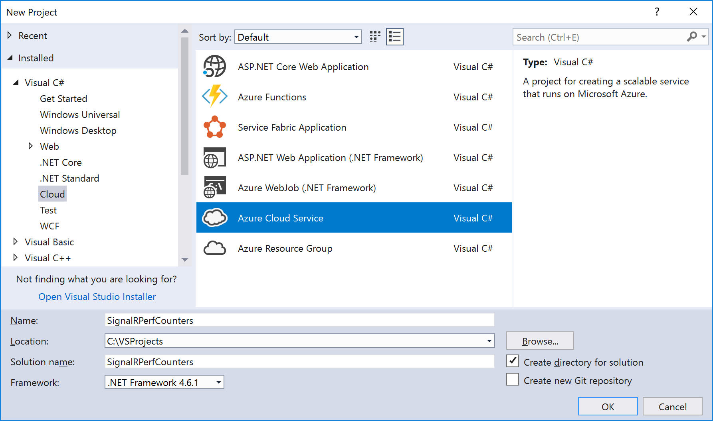
4. In the **New Windows Azure Cloud Service** dialog, select **ASP.NET Web Role** and click the **&gt;** button to add the role to the project. Click **OK**.

    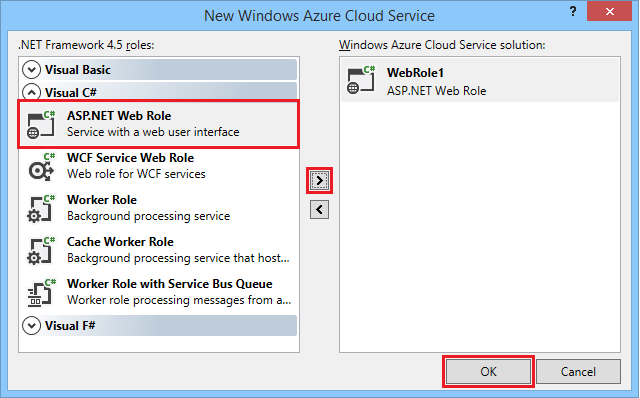
5. In the **New ASP.NET Project - WebRole1** dialog, select the **MVC** template, and select **OK**.

    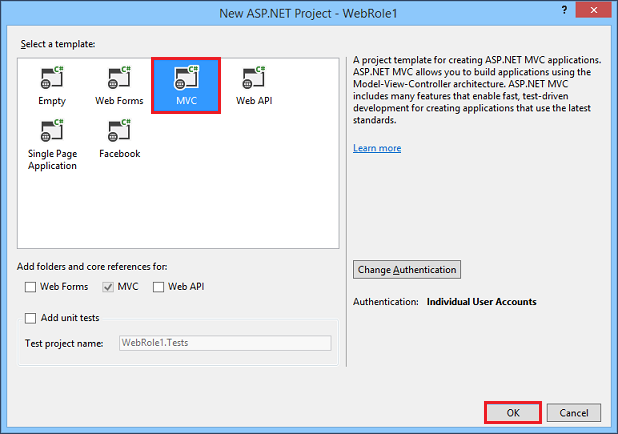
6. In **Solution Explorer**, open the `diagnostics.wadcfg` file under **WebRole1**.

    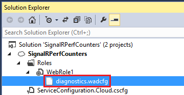
7. Replace the contents of the file with the following code.

    [!code-xml[Main](using-signalr-performance-counters-in-an-azure-web-role/samples/sample1.xml)]
8. Open the Library Package Manager Console from **Tools/Library Package Manager**. Enter the following commands to install the latest version of SignalR and the SignalR utilities package:

    [!code-powershell[Main](using-signalr-performance-counters-in-an-azure-web-role/samples/sample2.ps1)]
9. Next, we'll configure the application to install the SignalR performance counters to the role instance when it starts up or recycles. In **Solution Explorer**, right-click on the **WebRole1** project and select **Add...**, **New Folder**. Name the new folder **Startup**.

    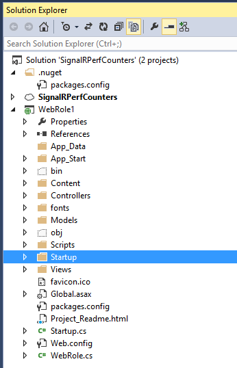
10. Copy the **SignalR.exe** file (added with the **Microsoft.AspNet.SignalR.Utils** package) from **&lt;project folder&gt;\SignalRPerfCounters\packages\Microsoft.AspNet.SignalR.Utils.2.0.2\tools** to the new Startup folder.
- In **Solution Explorer**, right-click the **Startup** folder and select **Add...**, **Existing Item**. In the dialog that appears, select **SignalR.exe** and click **Add**.

    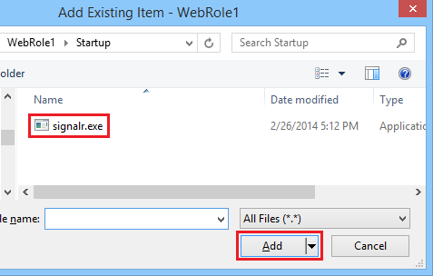
- Right-click on the **Startup** folder you created. Select **Add**, **New Item**. Select the **General** node, select **Text File**, name the new item `SignalRPerfCounterInstall.cmd`. This command file will install the SignalR performance counters to the web role.

    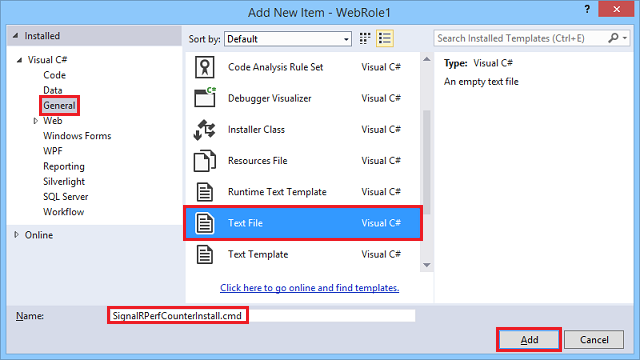
- Right-click the **SignalR.exe** file, and select **Properties**. Set **Copy to Output Directory** to **Copy Always**.

    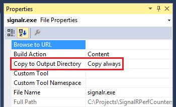
- Repeat the previous step for the **SignalRPerfCounterInstall.cmd** file.
- Open **SignalRPerfCounterInstall.cmd** and enter the following script, then save and close the file. This script executes SignalR.exe, which adds the SignalR performance counters to the role instance.

    [!code-console[Main](using-signalr-performance-counters-in-an-azure-web-role/samples/sample3.cmd)]
- Right-click on the **SignalRPerfCounterInstall.cmd** file and select **Open With...** In the dialog that appears, select **Binary Editor** and click **OK**.

    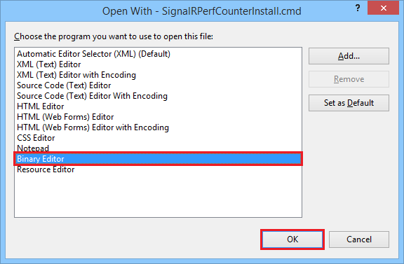
- In the binary editor, select any leading bytes in the file and delete them. Save and close the file.

    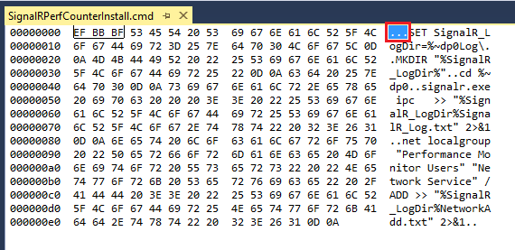
- Open `ServiceDefinition.csdef` and add a startup task that executes the `SignalrPerfCounterInstall.cmd` file when the service starts up:

    [!code-xml[Main](using-signalr-performance-counters-in-an-azure-web-role/samples/sample4.xml?highlight=4-7)]
- Open `Views/Shared/_Layout.cshtml` and remove the jquery bundle script from the end of the file.

    [!code-cshtml[Main](using-signalr-performance-counters-in-an-azure-web-role/samples/sample5.cshtml)]
- Open `Views/Home/Index.cshtml`, and replace the contents with the following code. This adds a JavaScript client that continuously calls the `increment` method on the server.

    [!code-cshtml[Main](using-signalr-performance-counters-in-an-azure-web-role/samples/sample6.cshtml)]
- Create a new folder in the **WebRole1** project called Hubs. Right-click this folder, and select **Add...**, **SignalR Hub Class (v2)**. Name the new hub **MyHub** and click **Add**.
- Open **MyHub.cs** and replace the contents with the following code.

    [!code-csharp[Main](using-signalr-performance-counters-in-an-azure-web-role/samples/sample7.cs)]
- **[Crank.exe](signalr-connection-density-testing-with-crank.md)** is a connection density testing tool provided with the SignalR codebase. Since Crank requires a **PersistentConnection**, we'll add one to the site to test. Add a new folder to the **WebRole1** project called **PersistentConnections**. Right-click this folder and select **Add...**, **Class**. Name the new class **MyPersistentConnection** and click **Add**.
- Open **MyPersistentConnection.cs** and replace the contents with the following code.

    [!code-csharp[Main](using-signalr-performance-counters-in-an-azure-web-role/samples/sample8.cs)]
- Next, we'll start the SignalR objects when OWIN starts up, using the `Startup.cs` class. Your project already contains a **Startup.cs** class, unless you changed the authentication method when creating the project, in which case you'll need to create it. Open or create **Startup.cs** and replace the contents with the following code.

    [!code-csharp[Main](using-signalr-performance-counters-in-an-azure-web-role/samples/sample9.cs)]
- Since in Windows Azure, diagnostics is started before the role starts, the performance counters need to be dynamically added. To do this, create a new folder in the **WebRole1** project called **SignalRHelper**; in this folder, create a new class called **SignalRDiagnosticHelper**. Open this new class and replace the contents with the following code.

    [!code-csharp[Main](using-signalr-performance-counters-in-an-azure-web-role/samples/sample10.cs)]
- To register the performance counters when the application starts, add the following line to **Global.asax.cs**:

    [!code-csharp[Main](using-signalr-performance-counters-in-an-azure-web-role/samples/sample11.cs?highlight=11)]
- Test your application in the Windows Azure Emulator by pressing **F5**.

    > [!NOTE]
    > If you encounter a **FileLoadException** at **MapSignalR()**, change the binding redirects in Web.Config to the following:

    [!code-xml[Main](using-signalr-performance-counters-in-an-azure-web-role/samples/sample12.xml?highlight=3,7)]
- To test your application in the cloud, deploy the application to your Azure subscription. For details on how to deploy an application to Azure, see [How to Create and Deploy a Cloud Service](https://www.windowsazure.com/en-us/documentation/articles/cloud-services-how-to-create-deploy/). To monitor performance counters in Azure, you can connect to the role instance using Server Manager and Remote Desktop Connection, and run Peformance Monitor in the role instance. For details on how to enable Remote Desktop Connection on an Azure role during deployment, see [Using Remote Desktop with Windows Azure Roles](https://msdn.microsoft.com/en-us/library/windowsazure/gg443832.aspx).
- When connected to the role instance with Remote Desktop Connection, open Server Manager from the taskbar, and select **Tools**, **Performance Monitor**.

    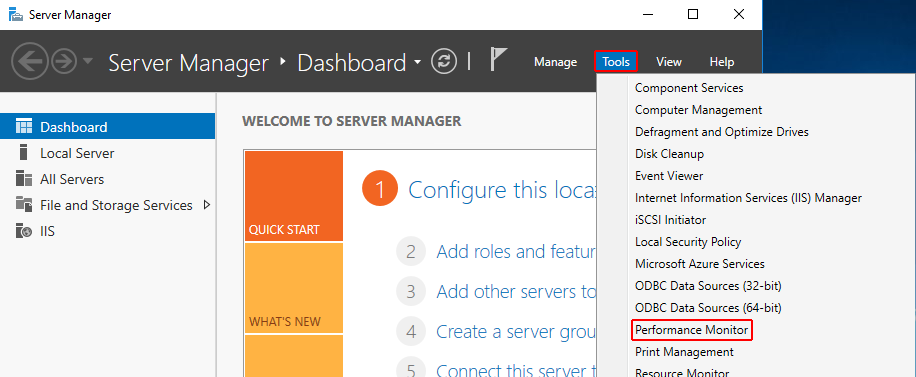
- The following image shows Performance Monitor running in a cloud instance during a connection density test using Crank.

    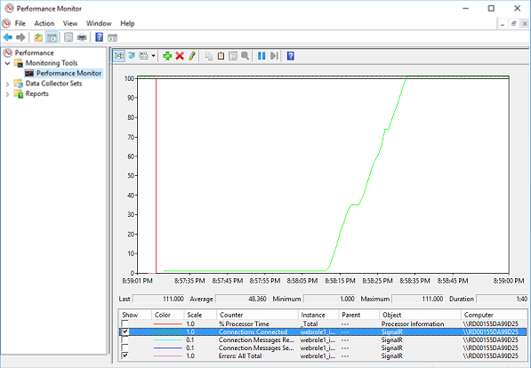

 Special thanks to Martin Richard for the [original content](https://blogs.msdn.com/b/mgrichard/archive/2014/01/21/capturing-signalr-2-0-performance-counters-in-azure-using-windows-azure-diagnostics-wad.aspx) for this tutorial.