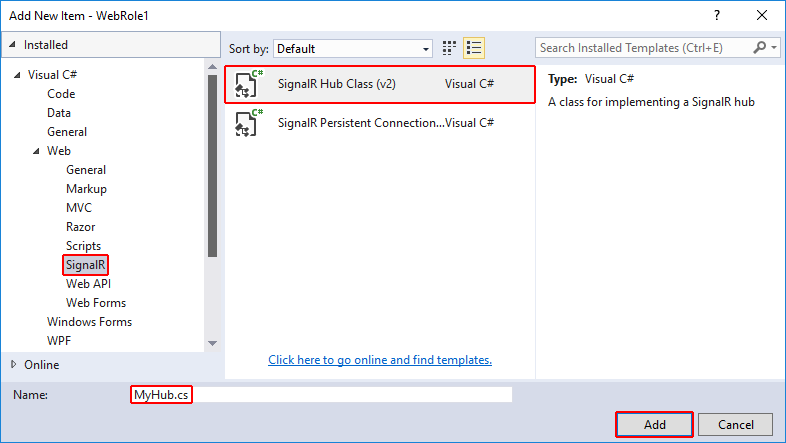

# Using SignalR performance counters in an Azure Web Role

By [Tom FitzMacken](https://github.com/tfitzmac)

SignalR performance counters are used to monitor your application's performance in an Azure Web Role. The counters are captured by Microsoft Azure Diagnostics. You install SignalR performance counters on Azure with *signalr.exe*, the same tool used for standalone or on-premises applications. Since Azure roles are transient, you configure an app to install and register SignalR performance counters upon startup.

## Prerequisites

* [Visual Studio 2015](https://www.visualstudio.com/vs/visual-studio-express/)
* [Microsoft Azure SDK for Visual Studio 2015 (VS2015)](https://azure.microsoft.com/downloads/) **Note: Restart your dev machine after installing the SDK.**
* Microsoft Azure subscription: To sign up for a free Azure trial account, see [Azure Free Trial](https://azure.microsoft.com/free/).

## Creating an Azure Web Role application that exposes SignalR performance counters

1. Open Visual Studio 2015.

2. In Visual Studio 2015, select **File &gt; New &gt; Project...**.

3. In the **Templates** pane of the **New Project** window under the **Visual C#** node, select the **Cloud** node and select the **Azure Cloud Service** template. Name the application **SignalRPerfCounters** and click **OK**.

   
    
4. In the **New Microsoft Azure Cloud Service** dialog, select **ASP.NET Web Role** and click the **&gt;** button to add the role to the project. Click **OK**.

   
    
5. In the **New ASP.NET Web Application - WebRole1** dialog, select the **MVC** template and click **OK**.

   
    
6. In **Solution Explorer**, open the *diagnostics.wadcfgx* file under **WebRole1**.

   
    
7. Replace the contents of the file with the following configuration and save the file:

   [!code-xml[Main](using-signalr-performance-counters-in-an-azure-web-role/samples/sample1.xml)]
    
8. Open the **Package Manager Console** from **Tools &gt; NuGet Package Manager**. Enter the following commands to install the latest version of SignalR and the SignalR utilities package:

   [!code-powershell[Main](using-signalr-performance-counters-in-an-azure-web-role/samples/sample2.ps1)]
    
9. Configure the application to install the SignalR performance counters into the role instance when it starts up or recycles. In **Solution Explorer**, right-click on the **WebRole1** project and select **Add &gt; New Folder**. Name the new folder *Startup*.

   
    
10. Copy the *signalr.exe* file (added with the **Microsoft.AspNet.SignalR.Utils** package) from **&lt;project folder&gt;\SignalRPerfCounters\packages\Microsoft.AspNet.SignalR.Utils.&lt;version&gt;\tools** to the *Startup* folder you created in the previous step.

11. In **Solution Explorer**, right-click the *Startup* folder and select **Add &gt; Existing Item...**. In the dialog that appears, select *signalr.exe* and click **Add**.

    
    
12. Right-click on the *Startup* folder you created. Select **Add &gt; New Item...**. Select the **General** node, select **Text File**, and name the new item *SignalRPerfCounterInstall.cmd*. This command file will install the SignalR performance counters into the web role.

    
     
13. When Visual Studio creates the *SignalRPerfCounterInstall.cmd* file, it will automatically open in the main window. Replace the contents of the file with the following script, then save and close the file. This script executes *signalr.exe*, which adds the SignalR performance counters to the role instance.

    [!code-console[Main](using-signalr-performance-counters-in-an-azure-web-role/samples/sample3.cmd)]
    
14. Click the *signalr.exe* file in **Solution Explorer**. In the file's **Properties**, set **Copy to Output Directory** to **Copy Always**.

    
    
15. Repeat the previous step for the *SignalRPerfCounterInstall.cmd* file.

    
16. Right-click on the *SignalRPerfCounterInstall.cmd* file and select **Open With...**. In the dialog that appears, select **Binary Editor** and click **OK**.

    
    
17. In the binary editor, select any leading bytes in the file and delete them. Save and close the file.

    
    
18. Open *ServiceDefinition.csdef* and add a startup task that executes the *SignalrPerfCounterInstall.cmd* file when the service starts up:

    [!code-xml[Main](using-signalr-performance-counters-in-an-azure-web-role/samples/sample4.xml?highlight=4-7)]
    
19. Open `Views/Shared/_Layout.cshtml` and remove the jQuery bundle script from the end of the file.

    [!code-cshtml[Main](using-signalr-performance-counters-in-an-azure-web-role/samples/sample5.cshtml&highlight=9)]
    
20. Add a JavaScript client that continuously calls the `increment` method on the server. Open `Views/Home/Index.cshtml` and replace the contents with the following code:

    [!code-cshtml[Main](using-signalr-performance-counters-in-an-azure-web-role/samples/sample6.cshtml)]
    
21. Create a new folder in the **WebRole1** project named *Hubs*. Right-click the *Hubs* folder in **Solution Explorer**, select **Web &gt; SignalR**, and select **SignalR Hub Class (v2)**. Name the new hub *MyHub.cs* and click **Add**.

    

22. *MyHub.cs* will automatically open in the main window. Replace the contents with the following code, then save and close the file:

    [!code-csharp[Main](using-signalr-performance-counters-in-an-azure-web-role/samples/sample7.cs)]
    
23. *[Crank.exe](signalr-connection-density-testing-with-crank.md)* is a connection density testing tool provided with the SignalR codebase. Since Crank requires a persistent connection, you add one to your site for use when testing. Add a new folder to the **WebRole1** project called *PersistentConnections*. Right-click this folder and select **Add &gt; Class...**. Name the new class file *MyPersistentConnections.cs* and click **Add**.

24. Visual Studio will open the *MyPersistentConnections.cs* file in the main window. Replace the contents with the following code, then save and close the file:

    [!code-csharp[Main](using-signalr-performance-counters-in-an-azure-web-role/samples/sample8.cs)]
    
25. Using the `Startup` class, the SignalR objects start when OWIN starts up. Your project already contains a `Startup` class, unless you changed the authentication method when creating the project, in which case you need to create a `Startup` class. Open or create *Startup.cs* and replace the contents with the following code:

    [!code-csharp[Main](using-signalr-performance-counters-in-an-azure-web-role/samples/sample9.cs)]
    
26. Since you're using Microsoft Azure, where diagnostics is started before the role starts, you add the performance counters dynamically. To do this, create a new folder in the **WebRole1** project called *SignalRHelper*. In this folder, create a new class file called *SignalRDiagnosticHelper.cs*. When Visual Studio creates and opens the file, replace the contents with the following code:

    [!code-csharp[Main](using-signalr-performance-counters-in-an-azure-web-role/samples/sample10.cs)]
    
27. To register the performance counters when the application starts, add the following line to *Global.asax.cs*:

    [!code-csharp[Main](using-signalr-performance-counters-in-an-azure-web-role/samples/sample11.cs?highlight=11)]
    
28. Test your application in the Microsoft Azure Emulator by pressing **F5**.

    > [!NOTE]
    > If you encounter a **FileLoadException** at **MapSignalR()**, change the binding redirects in *web.config* to the following:

    [!code-xml[Main](using-signalr-performance-counters-in-an-azure-web-role/samples/sample12.xml?highlight=3,7)]
    
29. To test your application in the cloud, deploy the application to your Azure subscription. For details on how to deploy an application to Azure, see [How to Create and Deploy a Cloud Service](https://www.windowsazure.com/documentation/articles/cloud-services-how-to-create-deploy/).

30. When connected to the Azure role instance with Remote Desktop Connection, open Server Manager from the taskbar and select **Tools**, **Performance Monitor**.

    
    
31. The following image shows Performance Monitor running in a cloud instance during a connection density test using Crank:

    

Special thanks to Martin Richard for the [original content](https://blogs.msdn.com/b/mgrichard/archive/2014/01/21/capturing-signalr-2-0-performance-counters-in-azure-using-windows-azure-diagnostics-wad.aspx) for this tutorial.
