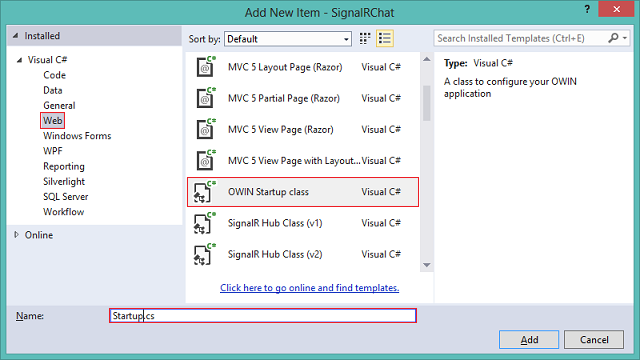

Upgrading SignalR 1.x Projects to version 2
====================
by [Patrick Fletcher](https://github.com/pfletcher)

> This topic describes how to upgrade an existing SignalR 1.x project to SignalR 2.x, and how to troubleshoot issues that may arise during the upgrade process.
> 
> ## Software versions used in the tutorial
> 
> 
> - [Visual Studio 2013](https://www.microsoft.com/visualstudio/eng/2013-downloads)
> - .NET 4.5
> - SignalR versions 1 and 2
>   
> 
> 
> ## Using Visual Studio 2012 with this tutorial
> 
> 
> To use Visual Studio 2012 with this tutorial, do the following:
> 
> - Update your [Package Manager](http://docs.nuget.org/docs/start-here/installing-nuget) to the latest version.
> - Install the [Web Platform Installer](https://www.microsoft.com/web/downloads/platform.aspx).
> - In the Web Platform Installer, search for and install **ASP.NET and Web Tools 2013.1 for Visual Studio 2012**. This will install Visual Studio templates for SignalR classes such as **Hub**.
> - Some templates (such as **OWIN Startup Class**) will not be available; for these, use a Class file instead.
> 
> 
> ## Questions and comments
> 
> Please leave feedback on how you liked this tutorial and what we could improve in the comments at the bottom of the page. If you have questions that are not directly related to the tutorial, you can post them to the [ASP.NET SignalR forum](https://forums.asp.net/1254.aspx/1?ASP+NET+SignalR) or [StackOverflow.com](http://stackoverflow.com/).

SignalR 2 offers a consistent development experience across server platforms using [OWIN](http://owin.org). This article describes the few steps that are needed to update a SignalR 1.x application to version 2.

While it is encouraged to upgrade applications to SignalR 2, SignalR 1.x will still be supported.

This tutorial describes how to upgrade a web-hosted application to SignalR 2. Self-hosted applications (those that host a server in a console application, Windows service, or other process) are now supported under SignalR 2. For information on how to get started creating a self-hosted application with SignalR 2, see [Tutorial: SignalR Self-Host](../deployment/tutorial-signalr-self-host.md).

## Contents

The following sections describe tasks involved with upgrading SignalR projects, and how to troubleshoot issues that may arise.

- [Example: Upgrading the Getting Started tutorial to SignalR 2](#example)
- [Troubleshooting errors encountered during upgrading](#troubleshooting)

## Example: Upgrading the Getting Started tutorial application to SignalR 2

In this section, you'll update the application created in the [SignalR 1.x version of the Getting Started Tutorial](../older-versions/index.md) to use SignalR 2.

1. Once you've finished the Getting Started tutorial, right-click on the project, and select **Properties**. Verify that the **Target framework** is set to **.NET Framework 4.5.**
2. Open the Package Manager Console. Remove SignalR 1.x from the project using the following command:

    [!code-powershell[Main](upgrading-signalr-1x-projects-to-20/samples/sample1.ps1)]
3. Install SignalR 2 using the following command:

    [!code-powershell[Main](upgrading-signalr-1x-projects-to-20/samples/sample2.ps1)]
4. In the HTML page, update the script reference for SignalR to match the version of the script now included in the project.

    [!code-html[Main](upgrading-signalr-1x-projects-to-20/samples/sample3.html)]
5. In the global application class, remove the call to MapHubs.

    [!code-csharp[Main](upgrading-signalr-1x-projects-to-20/samples/sample4.cs)]
6. Right-click the solution, and select **Add**, **New Item...**. In the dialog, select **Owin Startup Class**. Name the new class **Startup.cs**.

    
7. Replace the contents of Startup.cs with the following code:

    [!code-csharp[Main](upgrading-signalr-1x-projects-to-20/samples/sample5.cs)]

    The assembly attribute adds the class to Owin's startup process, which executes the `Configuration` method when Owin starts up. This in turn calls the `MapSignalR` method, which creates routes for all SignalR hubs in the application.
8. Run the project, and copy the URL of the main page into another browser or browser pane, as before. Each page will ask for a username, and messages sent from each page should be visible in both browser panes.

## Troubleshooting errors encountered during upgrading

This section describes issues that may arise during upgrading. For a more comprehensive list of errors and issues that may occur with a SignalR application, see [SignalR Troubleshooting](../testing-and-debugging/troubleshooting.md).

### 'The call is ambiguous between the following methods or properties'

This error will occur if a reference to `Microsoft.AspNet.SignalR.Owin` is not removed. This package is deprecated; the reference must be removed and the 1.x version of the SelfHost package must be uninstalled.

### Hub methods fail silently

Verify that the script references in your client are up to date, and that the `OwinStartup` attribute for your Startup class has the correct class and assembly names for your project. Also, try opening up the hubs address (/signalr/hubs) in your browser; any error that appears will offer more information about what's going wrong.