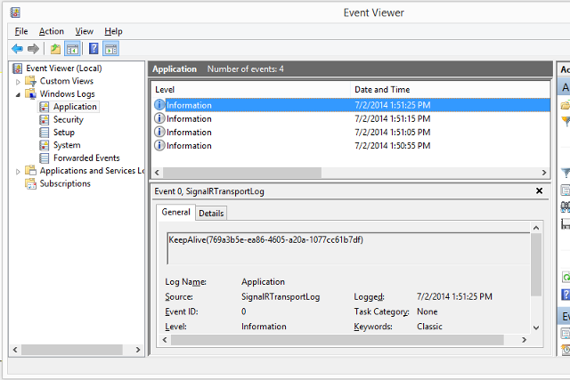
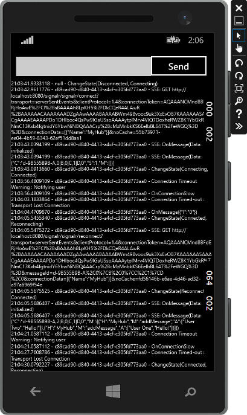
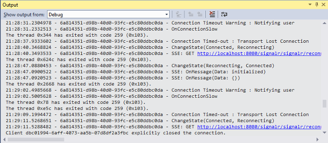
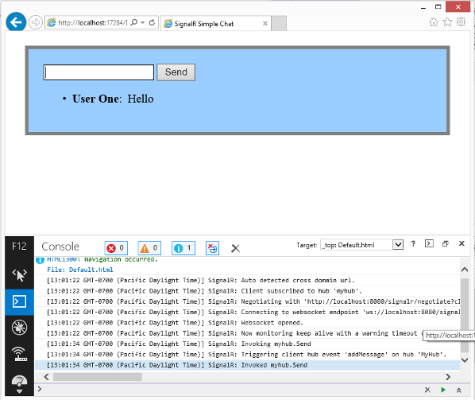

Enabling SignalR Tracing
====================
by [Tom FitzMacken](https://github.com/tfitzmac)

> This document describes how to enable and configure tracing for SignalR servers and clients. Tracing enables you to view diagnostic information about events in your SignalR application.
> 
> This topic was originally written by Patrick Fletcher.
> 
> ## Software versions used in the tutorial
> 
> 
> - [Visual Studio 2013](https://www.microsoft.com/visualstudio/eng/2013-downloads)
> - .NET 4.5
> - SignalR version 2
>   
> 
> 
> ## Questions and comments
> 
> Please leave feedback on how you liked this tutorial and what we could improve in the comments at the bottom of the page. If you have questions that are not directly related to the tutorial, you can post them to the [ASP.NET SignalR forum](https://forums.asp.net/1254.aspx/1?ASP+NET+SignalR) or [StackOverflow.com](http://stackoverflow.com/).

When tracing is enabled, a SignalR application creates log entries for events. You can log events from both the client and the server. Tracing on the server logs connection, scaleout provider, and message bus events. Tracing on the client logs connection events. In SignalR 2.1 and later, tracing on the client logs the full content of hub invocation messages.

## Contents

- [Enabling tracing on the server](#server)

    - [Logging server events to text files](#server_text)
    - [Logging server events to the event log](#server_eventlog)
- [Enabling tracing in the .NET client (Windows Desktop apps)](#net_client)

    - [Logging Desktop client events to the console](#desktop_console)
    - [Logging Desktop client events to a text file](#desktop_text)
- [Enabling tracing in Windows Phone 8 clients](#phone)

    - [Logging Windows Phone client events to the UI](#phone_ui)
    - [Logging Windows Phone client events to the debug console](#phone_debug)
- [Enabling tracing in the JavaScript client](#javascript)

## Enabling tracing on the server

You enable tracing on the server within the application's configuration file (either App.config or Web.config depending on the type of project.) You specify which categories of events you want to log. In the configuration file, you also specify whether to log the events to a text file, the Windows event log, or a custom log using an implementation of [TraceListener](https://msdn.microsoft.com/en-us/library/system.diagnostics.tracelistener(v=vs.110).aspx).

The server event categories include the following sorts of messages:

| Source | Messages |
| --- | --- |
| SignalR.SqlMessageBus | SQL Message Bus scaleout provider setup, database operation, error, and timeout events |
| SignalR.ServiceBusMessageBus | Service bus scaleout provider topic creation and subscription, error, and messaging events |
| SignalR.RedisMessageBus | Redis scaleout provider connection, disconnection, and error events |
| SignalR.ScaleoutMessageBus | Scaleout messaging events |
| SignalR.Transports.WebSocketTransport | WebSocket transport connection, disconnection, messaging, and error events |
| SignalR.Transports.ServerSentEventsTransport | ServerSentEvents transport connection, disconnection, messaging, and error events |
| SignalR.Transports.ForeverFrameTransport | ForeverFrame transport connection, disconnection, messaging, and error events |
| SignalR.Transports.LongPollingTransport | LongPolling transport connection, disconnection, messaging, and error events |
| SignalR.Transports.TransportHeartBeat | Transport connection, disconnection, and keepalive events |
| SignalR.ReflectedHubDescriptorProvider | Hub discovery events |

### Logging server events to text files

The following code shows how to enable tracing for each category of event. This sample configures the application to log events to text files.

**XML server code for enabling tracing**

[!code-html[Main](enabling-signalr-tracing/samples/sample1.html)]

In the code above, the `SignalRSwitch` entry specifies the [TraceLevel](https://msdn.microsoft.com/en-us/library/system.diagnostics.tracelevel(v=vs.110).aspx) used for events sent to the specified log. In this case, it is set to `Verbose` which means all debugging and tracing messages are logged.

The following output shows entries from the `transports.log.txt` file for an application using the above configuration file. It shows a new connection, a removed connection, and transport heartbeat events.

[!code-console[Main](enabling-signalr-tracing/samples/sample2.cmd)]

### Logging server events to the event log

To log events to the event log rather than a text file, change the values for the entries in the `sharedListeners` node. The following code shows how to log server events to the event log:

**XML server code for logging events to the event log**

[!code-xml[Main](enabling-signalr-tracing/samples/sample3.xml)]

The events are logged in the Application log, and are available through the Event Viewer, as shown below:

> [!NOTE]
> When using the event log, set the **TraceLevel** to **Error** to keep the number of messages manageable.

## Enabling tracing in the .NET client (Windows Desktop apps)

The .NET client can log events to the console, a text file, or to a custom log using an implementation of [TextWriter](https://msdn.microsoft.com/en-us/library/system.io.textwriter.aspx).

To enable logging in the .NET client, set the connection's `TraceLevel` property to a [TraceLevels](https://msdn.microsoft.com/en-us/library/microsoft.aspnet.signalr.client.tracelevels(v=vs.118).aspx) value, and the `TraceWriter` property to a valid [TextWriter](https://msdn.microsoft.com/en-us/library/system.io.textwriter.aspx) instance.

### Logging Desktop client events to the console

The following C# code shows how to log events in the .NET client to the console:

[!code-csharp[Main](enabling-signalr-tracing/samples/sample4.cs?highlight=2-3)]

### Logging Desktop client events to a text file

The following C# code shows how to log events in the .NET client to a text file:

[!code-csharp[Main](enabling-signalr-tracing/samples/sample5.cs?highlight=4-5)]

The following output shows entries from the `ClientLog.txt` file for an application using the above configuration file. It shows the client connecting to the server, and the hub invoking a client method called `addMessage`:

[!code-console[Main](enabling-signalr-tracing/samples/sample6.cmd)]

## Enabling tracing in Windows Phone 8 clients

SignalR applications for Windows Phone apps use the same .NET client as desktop apps, but [Console.Out](https://msdn.microsoft.com/en-us/library/system.console.out(v=vs.110).aspx) and writing to a file with [StreamWriter](https://msdn.microsoft.com/en-us/library/system.io.streamwriter(v=vs.110).aspx) are not available. Instead, you need to create a custom implementation of [TextWriter](https://msdn.microsoft.com/en-us/library/system.io.textwriter(v=vs.110).aspx) for tracing. 

### Logging Windows Phone client events to the UI

The [SignalR codebase](https://github.com/SignalR/SignalR/archive/master.zip) includes a Windows Phone sample that writes trace output to a [TextBlock](https://msdn.microsoft.com/library/windows/apps/windows.ui.xaml.controls.textblock.aspx) using a custom [TextWriter](https://msdn.microsoft.com/en-us/library/system.io.textwriter(v=vs.110).aspx) implementation called `TextBlockWriter`. This class can be found in the **samples/Microsoft.AspNet.SignalR.Client.WP8.Samples** project. When creating an instance of `TextBlockWriter`, pass in the current [SynchronizationContext](https://msdn.microsoft.com/en-us/library/system.threading.synchronizationcontext(v=vs.110).aspx), and a [StackPanel](https://msdn.microsoft.com/en-us/library/windows/apps/windows.ui.xaml.controls.stackpanel.aspx) where it will create a [TextBlock](https://msdn.microsoft.com/library/windows/apps/windows.ui.xaml.controls.textblock.aspx) to use for trace output:

[!code-csharp[Main](enabling-signalr-tracing/samples/sample7.cs)]

The trace output will then be written to a new [TextBlock](https://msdn.microsoft.com/library/windows/apps/windows.ui.xaml.controls.textblock.aspx) created in the [StackPanel](https://msdn.microsoft.com/en-us/library/windows/apps/windows.ui.xaml.controls.stackpanel.aspx) you passed in:

### Logging Windows Phone client events to the debug console

To send output to the debug console rather than the UI, create an implementation of [TextWriter](https://msdn.microsoft.com/en-us/library/system.io.textwriter(v=vs.110).aspx) that writes to the debug window, and assign it to your connection's [TraceWriter](https://msdn.microsoft.com/en-us/library/microsoft.aspnet.signalr.client.connection.tracewriter(v=vs.118).aspx) property:

[!code-csharp[Main](enabling-signalr-tracing/samples/sample8.cs)]

Trace information will then be written to the debug window in Visual Studio:

## Enabling tracing in the JavaScript client

To enable client-side logging on a connection, set the `logging` property on the connection object before you call the `start` method to establish the connection.

**Client JavaScript code for enabling tracing to the browser console (with the generated proxy)**

[!code-javascript[Main](enabling-signalr-tracing/samples/sample9.js?highlight=1)]

**Client JavaScript code for enabling tracing to the browser console (without the generated proxy)**

[!code-javascript[Main](enabling-signalr-tracing/samples/sample10.js?highlight=2)]

When tracing is enabled, the JavaScript client logs events to the browser console. To access the browser console, see [Monitoring Transports](../getting-started/introduction-to-signalr.md#MonitoringTransports).

The following screenshot shows a SignalR JavaScript client with tracing enabled. It shows connection and hub invocation events in the browser console:

