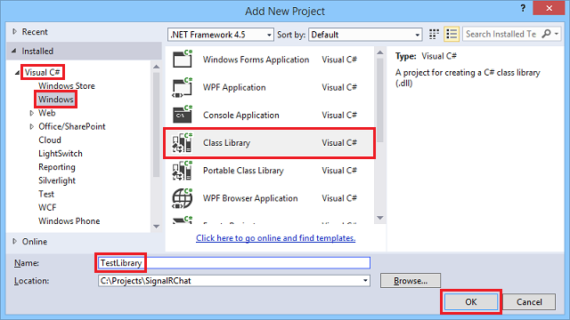
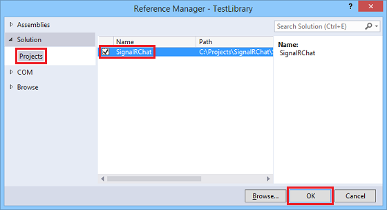
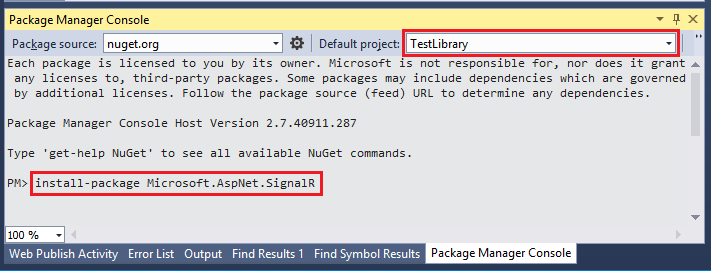
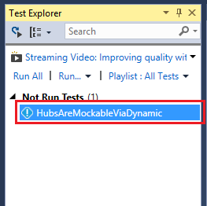
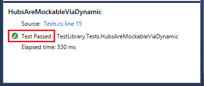
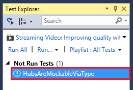
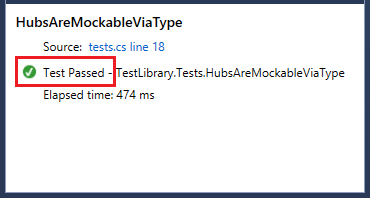

Unit Testing SignalR Applications
====================
by [Patrick Fletcher](https://github.com/pfletcher)

> This article describes using the Unit Testing features of SignalR 2. 
> 
> ## Software versions used in this topic
> 
> 
> - [Visual Studio 2013](https://www.microsoft.com/visualstudio/eng/2013-downloads)
> - .NET 4.5
> - SignalR version 2
>   
> 
> 
> ## Questions and comments
> 
> Please leave feedback on how you liked this tutorial and what we could improve in the comments at the bottom of the page. If you have questions that are not directly related to the tutorial, you can post them to the [ASP.NET SignalR forum](https://forums.asp.net/1254.aspx/1?ASP+NET+SignalR) or [StackOverflow.com](http://stackoverflow.com/).

## Unit testing SignalR applications

You can use the unit test features in SignalR 2 to create unit tests for your SignalR application. SignalR 2 includes the [IHubCallerConnectionContext](https://msdn.microsoft.com/en-us/library/microsoft.aspnet.signalr.hubs.ihubcallerconnectioncontext(v=vs.118).aspx) interface, which can be used to create a mock object to simulate your hub methods for testing.

In this section, you'll add unit tests for the application created in the [Getting Started tutorial](../getting-started/tutorial-getting-started-with-signalr.md) using [XUnit.net](http://xunit.codeplex.com/) and [Moq](https://github.com/Moq/moq4).

XUnit.net will be used to control the test; Moq will be used to create a [mock](http://en.wikipedia.org/wiki/Mock_object) object for testing. Other mocking frameworks can be used if desired; [NSubstitute](http://nsubstitute.github.io/) is also a good choice. This tutorial demonstrates how to set up the mock object in two ways: First, using a `dynamic` object (introduced in .NET Framework 4), and second, using an interface.

### Contents

This tutorial contains the following sections.

- [Unit testing with Dynamic](#dynamic)
- [Unit testing by type](#type)

### Unit testing with Dynamic

In this section, you'll add a unit test for the application created in the [Getting Started tutorial](../getting-started/tutorial-getting-started-with-signalr.md) using a dynamic object.

1. Install the [XUnit Runner extension](https://visualstudiogallery.msdn.microsoft.com/463c5987-f82b-46c8-a97e-b1cde42b9099) for Visual Studio 2013.
2. Either complete the [Getting Started tutorial](../getting-started/tutorial-getting-started-with-signalr.md), or download the completed application from [MSDN Code Gallery](https://code.msdn.microsoft.com/SignalR-Getting-Started-b9d18aa9).
3. If you are using the download version of the Getting Started application, open **Package Manager Console** and click **Restore** to add the SignalR package to the project.

    
4. Add a project to the solution for the unit test. Right-click your solution in **Solution Explorer** and select **Add**, **New Project...**. Under the **C#** node, select the **Windows** node. Select **Class Library**. Name the new project **TestLibrary** and click **OK**.

    
5. Add a reference in the test library project to the SignalRChat project. Right-click the **TestLibrary** project and select **Add**, **Reference...**. Select the **Projects** node under the **Solution** node, and check **SignalRChat**. Click **OK**.

    
6. Add the SignalR, Moq, and XUnit packages to the **TestLibrary** project. In the **Package Manager Console**, set the **Default Project** dropdown to **TestLibrary**. Run the following commands in the console window:

    - `Install-Package Microsoft.AspNet.SignalR`
    - `Install-Package Moq`
    - `Install-Package XUnit`

    
7. Create the test file. Right-click the **TestLibrary** project and click **Add...**, **Class**. Name the new class **Tests.cs**.
8. Replace the contents of Tests.cs with the following code.

    [!code-csharp[Main](unit-testing-signalr-applications/samples/sample1.cs)]

    In the code above, a test client is created using the `Mock` object from the [Moq](https://github.com/Moq/moq4) library, of type [IHubCallerConnectionContext](https://msdn.microsoft.com/en-us/library/microsoft.aspnet.signalr.hubs.ihubcallerconnectioncontext(v=vs.118).aspx) (in SignalR 2.1, assign `dynamic` for the type parameter.) The `IHubCallerConnectionContext` interface is the proxy object with which you invoke methods on the client. The `broadcastMessage` function is then defined for the mock client so that it can be called by the `ChatHub` class. The test engine then calls the `Send` method of the `ChatHub` class, which in turn calls the mocked `broadcastMessage` function.
9. Build the solution by pressing **F6**.
10. Run the unit test. In Visual Studio, select **Test**, **Windows**, **Test Explorer**. In the Test Explorer window, right-click **HubsAreMockableViaDynamic** and select **Run Selected Tests**.

    
11. Verify that the test passed by checking the lower pane in the Test Explorer window. The window will show that the test passed.

    

### Unit testing by type

In this section, you'll add a test for the application created in the [Getting Started tutorial](../getting-started/tutorial-getting-started-with-signalr.md) using an interface that contains the method to be tested.

1. Complete steps 1-7 in the [Unit testing with Dynamic](#dynamic) tutorial above.
2. Replace the contents of Tests.cs with the following code.

    [!code-csharp[Main](unit-testing-signalr-applications/samples/sample2.cs)]

    In the code above, an interface is created defining the signature of the `broadcastMessage` method for which the test engine will create a mock client. A mock client is then created using the `Mock` object, of type [IHubCallerConnectionContext](https://msdn.microsoft.com/en-us/library/microsoft.aspnet.signalr.hubs.ihubcallerconnectioncontext(v=vs.118).aspx) (in SignalR 2.1, assign `dynamic` for the type parameter.) The `IHubCallerConnectionContext` interface is the proxy object with which you invoke methods on the client.

    The test then creates an instance of `ChatHub`, and then creates a mock version of the `broadcastMessage` method, which in turn is invoked by calling the `Send` method on the hub.
3. Build the solution by pressing **F6**.
4. Run the unit test. In Visual Studio, select **Test**, **Windows**, **Test Explorer**. In the Test Explorer window, right-click **HubsAreMockableViaDynamic** and select **Run Selected Tests**.

    
5. Verify that the test passed by checking the lower pane in the Test Explorer window. The window will show that the test passed.

    