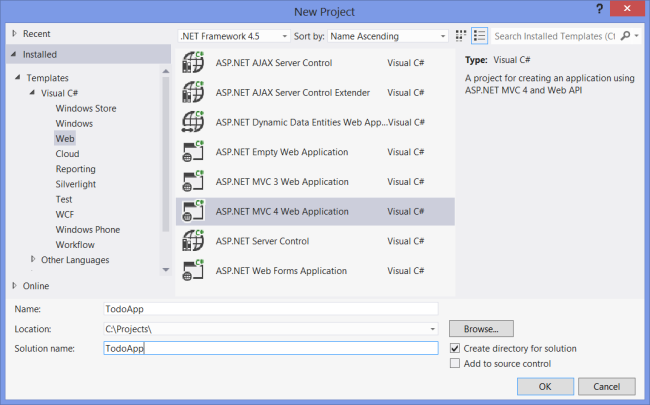
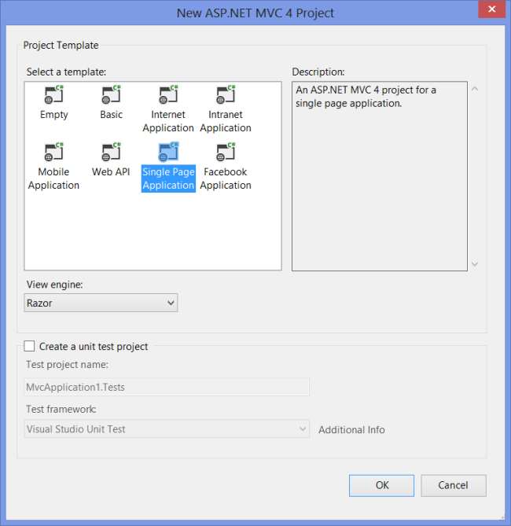
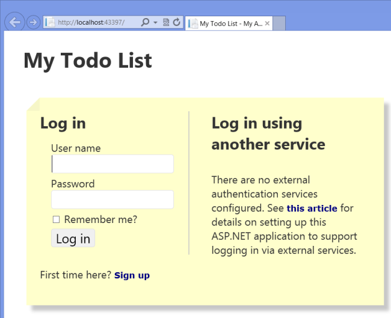
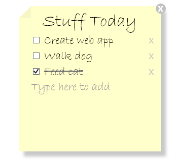
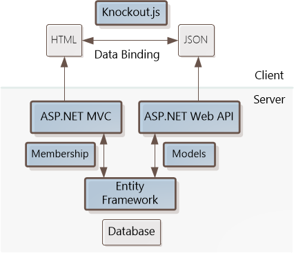
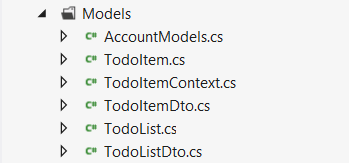
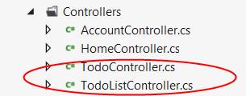
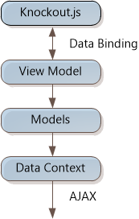

Single Page Application: KnockoutJS template
====================
by [Mike Wasson](https://github.com/MikeWasson)

> The Knockout MVC Template is part of ASP.NET and Web Tools 2012.2
> 
> [Download ASP.NET and Web Tools 2012.2](https://go.microsoft.com/fwlink/?LinkId=282650)

The ASP.NET and Web Tools 2012.2 update includes a Single-Page Application (SPA) template for ASP.NET MVC 4. This template is designed to get you started quickly building interactive client-side web apps.

"Single-page application" (SPA) is the general term for a web application that loads a single HTML page and then updates the page dynamically, instead of loading new pages. After the initial page load, the SPA talks with the server through AJAX requests.

AJAX is nothing new, but today there are JavaScript frameworks that make it easier to build and maintain a large sophisticated SPA application. Also, HTML 5 and CSS3 are making it easier to create rich UIs.

To get you started, the SPA template creates a sample "To-do list" application. In this tutorial, we'll take a guided tour of the template. First we'll look at the To-do list application itself, then examine the technology pieces that make it work.

## Create a New SPA Template Project

Requirements:

- Visual Studio 2012 or Visual Studio Express 2012 for Web
- ASP.NET Web Tools 2012.2 update. You can install the update [here](https://www.microsoft.com/web/handlers/webpi.ashx?command=getinstallerredirect&appid=ASPDOTNETandWebTools2012_2).

Start Visual Studio and select **New Project** from the Start page. Or, from the **File** menu, select **New** and then **Project**.

In the **Templates** pane, select **Installed Templates** and expand the **Visual C#** node. Under **Visual C#**, select **Web**. In the list of project templates, select **ASP.NET MVC 4 Web Application**. Name the project and click **OK**.

In the **New Project** wizard, select **Single Page Application**.

Press F5 to build and run the application. When the application first runs, it displays a login screen.

Click the &quot;Sign up&quot; link and create a new user.

After you log in, the application creates a default Todo list with two items. You can click "Add Todo list" to add a new list.

Rename the list, add items to the list, and check them off. You can also delete items or delete an entire list. The changes are automatically persisted to a database on the server (actually LocalDB at this point, because you are running the application locally).

## Architecture of the SPA Template

This diagram shows the main building blocks for the application.

On the server side, ASP.NET MVC serves the HTML and also handles forms-based authentication.

ASP.NET Web API handles all requests that relate to the ToDoLists and ToDoItems, including getting, creating, updating and deleting. The client exchanges data with Web API in JSON format.

Entity Framework (EF) is the O/RM layer. It mediates between the object-oriented world of ASP.NET and the underlying database. The database uses LocalDB but you can change this in the Web.config file. Typically you would use LocalDB for local development and then deploy to a SQL database on the server, using EF code-first migration.

On the client side, the Knockout.js library handles page updates from AJAX requests. Knockout uses data binding to synchronize the page with the latest data. That way, you don't have to write any of the code that walks through the JSON data and updates the DOM. Instead, you put declarative attributes in the HTML that tell Knockout how to present the data.

A big advantage of this architecture is that it separates the presentation layer from the application logic. You can create the Web API portion without knowing anything about how your web page will look. On the client side, you create a "view model" to represent that data, and the view model uses Knockout to bind to the HTML. That lets you easily change the HTML without changing the view model. (We'll look at Knockout a bit later.)

## Models

In the Visual Studio project, the Models folder contains the models that are used on the server side. (There are also models on the client side; we'll get to those.)

**TodoItem, TodoList**

These are the database models for Entity Framework Code First. Notice that these models have properties that point to each other. `ToDoList` contains a collection of ToDoItems, and each `ToDoItem` has a reference back to its parent ToDoList. These properties are called navigation properties, and they represent the one-to-many relation a to-do list and its to-do items.

The `ToDoItem` class also uses the **[ForeignKey]** attribute to specify that `ToDoListId` is a foreign key into the `ToDoList` table. This tells EF to add a foreign-key constraint to the database.

[!code-csharp[Main](knockoutjs-template/samples/sample1.cs)]

**TodoItemDto, TodoListDto**

These classes define the data that will be sent to the client. "DTO" stands for "data transfer object." The DTO defines how the entities will be serialized into JSON. In general, there are several reasons to use DTOs:

- To control which properties are serialized. The DTO can contain a subset of the properties from the domain model. You might do this for security reasons (to hide sensitive data) or simply to reduce the amount of data that you send.
- To change the shape of the data – e.g. to flatten a more complex data structure.
- To keep any business logic out of the DTO (separation of concerns).
- If your domain models cannot be serialized for some reason. For example, circular references can cause problems when you serialize an object There are ways to handle this problem in Web API (see [Handling Circular Object References](../../../web-api/overview/formats-and-model-binding/json-and-xml-serialization.md#handling_circular_object_references)); but using a DTO simply avoids the problem altogether.

In the SPA template, the DTOs contains the same data as the domain models. However, they are still useful because they avoid circular references from the navigation properties, and they demonstrate the general DTO pattern.

**AccountModels.cs**

This file contains models for site membership. The `UserProfile` class defines the schema for user profiles in the membership DB. (In this case, the only information is the user ID and the user name.) The other model classes in this file are used to create the user registration and login forms.

## Entity Framework

The SPA template uses EF Code First. In Code First development, you define the models first in code, and then EF uses the model to create the database. You can also use EF with an existing database ([Database First](https://msdn.microsoft.com/en-us/data/jj206878.aspx)).

The `TodoItemContext` class in the Models folder derives from **DbContext**. This class provides the "glue" between the models and EF. The `TodoItemContext` holds a `ToDoItem` collection and a `TodoList` collection. To query the database, you simply write a LINQ query against these collections. For example, here is how you can select all of the to-do lists for user "Alice":

[!code-csharp[Main](knockoutjs-template/samples/sample2.cs)]

You can also add new items to the collection, update items, or delete items from the collection, and persist the changes to the database.

## ASP.NET Web API Controllers

In ASP.NET Web API, controllers are objects that handle HTTP requests. As mentioned, the SPA template uses Web API to enable CRUD operations on `ToDoList` and `ToDoItem` instances. The controllers are located in the Controllers folder of the solution.

- `TodoController`: Handles HTTP requests for to-do items
- `TodoListController`: Handles HTTP requests for to-do lists.

These names are significant, because Web API matches the URI path to the controller name. (To learn how Web API routes HTTP requests to controllers, see [Routing in ASP.NET Web API](../../../web-api/overview/web-api-routing-and-actions/routing-in-aspnet-web-api.md).)

Let's look at the `ToDoListController` class. It contains a single data member:

[!code-csharp[Main](knockoutjs-template/samples/sample3.cs)]

The `TodoItemContext` is used to communicate with EF, as described earlier. The methods on the controller implement the CRUD operations. Web API maps HTTP requests from the client to controller methods, as follows:

| HTTP Request | Controller Method | Description |
| --- | --- | --- |
| GET /api/todo | `GetTodoLists` | Gets a collection of to-do lists. |
| GET /api/todo/*id* | `GetTodoList` | Gets a to-do list by ID |
| PUT /api/todo/*id* | `PutTodoList` | Updates a to-do list. |
| POST /api/todo | `PostTodoList` | Creates a new to-do list. |
| DELETE /api/todo/*id* | `DeleteTodoList` | Deletes a TODO list. |

Notice that the URIs for some operations contain placeholders for the ID value. For example, to delete a to-list with an ID of 42, the URI is `/api/todo/42`.

To learn more about using Web API for CRUD operations, see [Creating a Web API that Supports CRUD Operations](../../../web-api/overview/older-versions/creating-a-web-api-that-supports-crud-operations.md). The code for this controller is fairly straightforward. Here are some interesting points:

- The `GetTodoLists` method uses a LINQ query to filter the results by the ID of the logged-in user. That way, a user only sees the data that belongs to him or her. Also, notice that a Select statement is used to convert the `ToDoList` instances into `TodoListDto` instances.
- The PUT and POST methods check the model state before modifying the database. If **ModelState.IsValid** is false, these methods return HTTP 400, Bad Request. Read more about model validation in Web API at [Model Validation](../../../web-api/overview/formats-and-model-binding/model-validation-in-aspnet-web-api.md).
- The controller class is also decorated with the **[Authorize]** attribute. This attribute checks whether the HTTP request is authenticated. If the request is not authenticated, the client receives HTTP 401, Unauthorized. Read more about authentication at [Authentication and Authorization in ASP.NET Web API](../../../web-api/overview/security/authentication-and-authorization-in-aspnet-web-api.md).

The `TodoController` class is very similar to `TodoListController`. The biggest difference is that it does not define any GET methods, because the client will get the to-do items along with each to-do list.

## MVC Controllers and Views

The MVC controllers are also located in the Controllers folder of the solution. `HomeController` renders the main HTML for the application. The view for the Home controller is defined in Views/Home/Index.cshtml. The Home view renders different content depending on whether the user is logged in:

[!code-cshtml[Main](knockoutjs-template/samples/sample4.cshtml)]

When users are logged in, they see the main UI. Otherwise, they see the login panel. Note that this conditional rendering happens on the server side. Never try to hide sensitive content on the client side&#8212anything that you send in an HTTP response is visible to someone who is watching the raw HTTP messages.

## Client-Side JavaScript and Knockout.js

Now let's turn from the server side of the application to the client. The SPA template uses a combination of jQuery and Knockout.js to create a smooth, interactive UI. Knockout.js is a JavaScript library that makes it easy to bind HTML to data. Knockout.js uses a pattern called "Model-View-ViewModel."

- The model is the domain data (ToDo lists and ToDo items).
- The view is the HTML document.
- The view-model is a JavaScript object that holds the model data. The view-model is a code abstraction of the UI. It has no knowledge of the HTML representation. Instead, it represents abstract features of the view, such as "a list of ToDo items".

The view is data-bound to the view-model. Updates to the view-model are automatically reflected in the view. Bindings work the other direction as well. Events in the DOM (such as clicks) are data-bound to functions on the view model, which trigger AJAX calls.

The SPA template organizes the client-side JavaScript into three layers:

- todo.datacontext.js: Sends AJAX requests.
- todo.model.js: Defines the models.
- todo.viewmodel.js: Defines the view model.

These script files are located in the Scripts/app folder of the solution.

**todo.datacontext** handles all AJAX calls to the Web API controllers. (The AJAX calls for logging in are defined elsewhere, in ajaxlogin.js.)

**todo.model.js** defines the client-side (browser) models for the to-do lists. There are two model classes: todoItem and todoList.

Many of the properties in the model classes are of type "ko.observable". Observables are how Knockout does its magic. From the [Knockout documentation](http://knockoutjs.com/documentation/introduction.html): An observable is a "JavaScript object that can notify subscribers about changes." When the value of an observable changes, Knockout updates any HTML elements that are bound to those observables. For example, todoItem has observables for the title and isDone properties:

[!code-javascript[Main](knockoutjs-template/samples/sample5.js)]

You can also subscribe to an observable in code. For example, the todoItem class subscribes to changes in the "isDone" and "title" properties:

[!code-javascript[Main](knockoutjs-template/samples/sample6.js)]

**View Model**

The view model is defined in todo.viewmodel.js. The view model is the central point where the application binds the HTML page elements to the domain data. In the SPA template, the view model contains an observable array of todoLists. The following code in the view model tells Knockout to apply the bindings:

[!code-javascript[Main](knockoutjs-template/samples/sample7.js)]

## HTML and Data Binding

The main HTML for the page is defined in Views/Home/Index.cshtml. Because we are using data-binding, the HTML is only a template for what actually gets rendered. Knockout uses *declarative* bindings. You bind page elements to data by adding a "data-bind" attribute to the element. Here is a very simple example, taken from the Knockout documentation:

[!code-html[Main](knockoutjs-template/samples/sample8.html)]

In this example, Knockout updates the contents of the **&lt;span&gt;** element with the value of `myItems.count()`. Whenever this value changes, Knockout updates the document.

Knockout provides a number of different binding types. Here are some of the bindings used in the SPA template:

- **foreach**: Lets you iterate through a loop and apply the same markup to each item in the list. This is used to render the to-do lists and to-do items. Within the **foreach**, the bindings are applied to the elements of the list.
- **visible**: Used to toggle visibility. Hide markup when a collection is empty, or make the error message visible.
- **value**: Used to populate form values.
- **click**: Binds a click event to a function on the view model.

## Anti-CSRF Protection

Cross-Site Request Forgery (CSRF) is an attack where a malicious site sends a request to a vulnerable site where the user is currently logged in. To help prevent CSRF attacks, ASP.NET MVC uses *anti-forgery tokens*, also called request verification tokens. The idea is that the server puts a randomly generated token into a web page. When the client submits data to the server, it must include this value in the request message.

Anti-forgery tokens work because the malicious page cannot read the user's tokens, due to same-origin policies. (Same-origin policies prevent documents hosted on two different sites from accessing each other's content.)

ASP.NET MVC provides built-in support for anti-forgery tokens, through the [AntiForgery](https://msdn.microsoft.com/en-us/library/system.web.helpers.antiforgery.aspx) class and the [[ValidateAntiForgeryToken]](https://msdn.microsoft.com/en-us/library/system.web.mvc.validateantiforgerytokenattribute.aspx) attribute. Currently, this functionality is not built into Web API. However, the SPA template includes a custom implementation for Web API. This code is defined in the `ValidateHttpAntiForgeryTokenAttribute` class, which is located in the Filters folder of the solution. To learn more about anti-CSRF in Web API, see [Preventing Cross-Site Request Forgery (CSRF) Attacks](../../../web-api/overview/security/preventing-cross-site-request-forgery-csrf-attacks.md).

## Conclusion

The SPA template is designed to get you started quickly writing modern, interactive web applications. It uses the Knockout.js library to separate presentation (HTML markup) from the data and application logic. But Knockout is not the only JavaScript library you can use to create a SPA. If you want to explore some other options, take a look at the [community-created SPA templates](../templates/index.md).