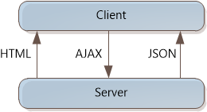

EmberJS template
====================
by [Xinyang Qiu](https://github.com/xqiu)

> The EmberJS MVC Template is written by Nathan Totten, Thiago Santos, and Xinyang Qiu.
> 
> [Download the EmberJS MVC Template](https://go.microsoft.com/fwlink/?LinkId=282647)

The EmberJS SPA template is designed to get you started quickly building interactive client-side web apps using EmberJS.

"Single-page application" (SPA) is the general term for a web application that loads a single HTML page and then updates the page dynamically, instead of loading new pages. After the initial page load, the SPA talks with the server through AJAX requests.

AJAX is nothing new, but today there are JavaScript frameworks that make it easier to build and maintain a large sophisticated SPA application. Also, HTML 5 and CSS3 are making it easier to create rich UIs.

The EmberJS SPA Template uses the [Ember](http://emberjs.com/) JavaScript library to handle page updates from AJAX requests. Ember.js uses data binding to synchronize the page with the latest data. That way, you don't have to write any of the code that walks through the JSON data and updates the DOM. Instead, you put declarative attributes in the HTML that tell Ember.js how to present the data.

On the server side, the EmberJS template is almost identical to the [KnockoutJS SPA template](../introduction/knockoutjs-template.md). It uses ASP.NET MVC to serve HTML documents, and ASP.NET Web API to handle AJAX requests from the client. For more information about those aspects of the template, refer to the [KnockoutJS template](../introduction/knockoutjs-template.md) documentation. This topic focuses on the differences between the Knockout template and the EmberJS template.

## Create an EmberJS SPA Template Project

Download and install the template by clicking the Download button above. You might need to restart Visual Studio.

In the **Templates** pane, select **Installed Templates** and expand the **Visual C#** node. Under **Visual C#**, select **Web**. In the list of project templates, select **ASP.NET MVC 4 Web Application**. Name the project and click **OK**.

In the **New Project** wizard, select **Ember.js SPA Project**.

## EmberJS SPA Template Overview

The EmberJS template uses a combination of jQuery, Ember.js, Handlebars.js to create a smooth, interactive UI.

Ember.js is a JavaScript library that uses a client-side MVC pattern.

- A *template*, written in the Handlebars templating language, describes the application user interface. In release mode, the [Handlebars compiler](https://github.com/Myslik/csharp-ember-handlebars) is used to bundle and compile the handlebars template.
- A *model* stores the application data that it gets from the server (ToDo lists and ToDo items).
- A *controller* stores application state. Controllers often present model data to the corresponding templates.
- A *view* translates primitive events from the application and passes these to the controller.
- A *router* manages application state, keeping URLs and templates in sync.

In addition, the Ember Data library can be used to synchronize JSON objects (obtained from the server through a RESTful API) and the client models.

The EmberJS SPA template organizes the scripts into eight layers:

- webapi\_adapter.js, webapi\_serializer.js: Extends the Ember Data library to work with ASP.NET Web API.
- Scripts/helpers.js: Defines new Ember Handlebars helpers.
- Scripts/app.js: Creates the app and configures the adapter and serializer.
- Scripts/app/models/\*.js: Defines the models.
- Scripts/app/views/\*.js: Defines the views.
- Scripts/app/controllers/\*.js: Defines the controllers.
- Scripts/app/routes, Scripts/app/router.js: Defines the routes.
- Templates/\*.hbs: Defines the handlebars templates.

Let's look at some of these scripts in more detail.

## Models

The models are defined in the Scripts/app/models folder. There are two model files: todoItem.js and todoList.js.

**todo.model.js** defines the client-side (browser) models for the to-do lists. There are two model classes: todoItem and todoList. In Ember, models are subclasses of DS.Model. A model can have properties with attributes:

[!code-javascript[Main](emberjs-template/samples/sample1.js)]

Models can define relationships to other models:

[!code-css[Main](emberjs-template/samples/sample2.css)]

Models can have computed properties that bind to other properties:

[!code-javascript[Main](emberjs-template/samples/sample3.js)]

Models can have observer functions, which are invoked when an observed property changes:

[!code-javascript[Main](emberjs-template/samples/sample4.js)]

## Views

The views are defined in the Scripts/app/views folder. A view translates events from the application UI. An event handler can call back to controller functions, or simply call the data context directly.

For example, the following code is from views/TodoItemEditView.js. It defines the event handling for an input text field.

[!code-javascript[Main](emberjs-template/samples/sample5.js)]

## Controller

The controllers are defined in the Scripts/app/controllers folder. To represent a single model, extend `Ember.ObjectController`:

[!code-javascript[Main](emberjs-template/samples/sample6.js)]

A controller can also represent a collection of models by extending `Ember.ArrayController`. For example, the TodoListController represents an array of `todoList` objects. The controller sorts by todoList ID, in descending order:

[!code-javascript[Main](emberjs-template/samples/sample7.js)]

The controller defines a function named `addTodoList`, which creates a new todoList and adds it to the array. To see how this function gets called, open the template file named todoListTemplate.html, in the Templates folder. The following template code binds a button to the `addTodoList` function:

[!code-html[Main](emberjs-template/samples/sample8.html)]

The controller also contains an `error` property, which holds an error message. Here is the template code to display the error message (also in todoListTemplate.html):

[!code-html[Main](emberjs-template/samples/sample9.html)]

## Routes

Router.js defines the routes and the default template to display, sets up application state, and matches URLs to routes:

[!code-javascript[Main](emberjs-template/samples/sample10.js)]

TodoListRoute.js loads data for the TodoListRoute by overriding the setupController function:

[!code-javascript[Main](emberjs-template/samples/sample11.js)]

Ember uses naming conventions to match URLs, route names, controllers, and templates. For more information, see [http://emberjs.com/guides/routing/defining-your-routes/](http://emberjs.com/guides/routing/defining-your-routes/) at the EmberJS documentation.

## Templates

The Templates folder contains four templates:

- application.hbs: The default template that is rendered when the application is started.
- about.hbs: The template for the "/about" route.
- index.hbs: The template for the root "/" route.
- todoList.hbs: The template for the "/todo" route.
- \_navbar.hbs: The template defines the navigation menu.

The application template acts like a master page. It contains a header, a footer, and an "{{outlet}}" to insert other templates in depending on the route. For more information about application templates in Ember, see [http://guides.emberjs.com/v1.10.0/templates/the-application-template//](http://guides.emberjs.com/v1.10.0/templates/the-application-template/).

The "/todoList" template contains two loop expressions. The outside loop is `{{#each controller}}`, and the inside loop is `{{#each todos}}`. The following code shows a built-in `Ember.Checkbox` view, a customized `App.TodoItemEditView`, and a link with a `deleteTodo` action.

[!code-html[Main](emberjs-template/samples/sample12.html)]

The `HtmlHelperExtensions` class, defined in Controllers/HtmlHelperExensions.cs, defines a helper function to cache and insert template files when **debug** is set to **true** in the Web.config file. This function is called from the ASP.NET MVC view file defined in Views/Home/App.cshtml:

[!code-cshtml[Main](emberjs-template/samples/sample13.cshtml)]

Called with no arguments, the function renders all of the template files in the Templates folder. You can also specify a subfolder or a specific template file.

When **debug** is **false** in Web.config, the application includes the bundle item "~/bundles/templates". This bundle item is added in BundleConfig.cs, using the Handlebars compiler library:

[!code-csharp[Main](emberjs-template/samples/sample14.cs)]