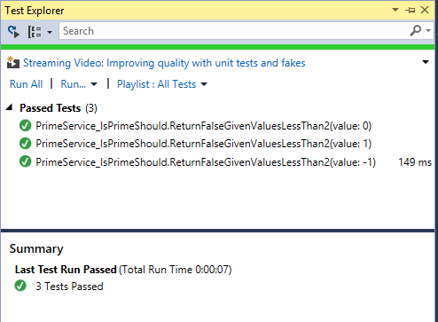
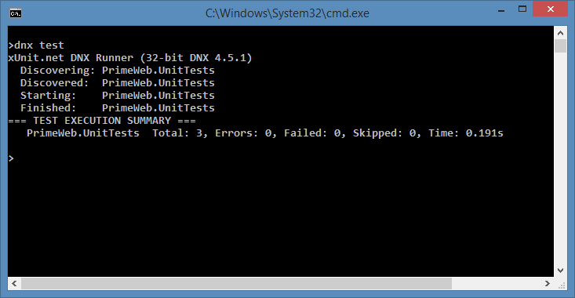
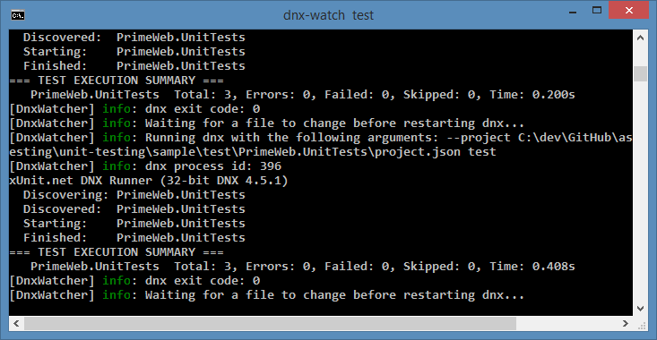

Unit Testing
============
By `Steve Smith`_

ASP.NET 5 has been designed with testability in mind, so that creating unit tests for your applications is easier than ever before. This article briefly introduces unit tests (and how they differ from other kinds of tests) and demonstrates how to add a test project to your solution and then run unit tests using either the command line or Visual Studio.

.. contents:: In this article:
  :local:
  :depth: 1

`Download sample from GitHub <https://github.com/aspnet/docs/tree/1.0.0-beta8/aspnet/testing/unit-testing/sample>`_. 

Getting Started with Testing
----------------------------

Having a suite of automated tests is one of the best ways to ensure a software application does what its authors intended it to do. There are many different kinds of tests for software applications, including :doc:`integration tests <integration-testing>`, web tests, load tests, and many others. At the lowest level are unit tests, which test individual software components or methods. Unit tests should only test code within the developer's control, and should not test infrastructure concerns, like databases, file systems, or network resources. Unit tests may be written using `Test Driven Development (TDD) <http://deviq.com/test-driven-development/>`_, or they can be added to existing code to confirm its correctness. In either case, they should be small, well-named, and fast, since ideally you will want to be able to run hundreds of them before pushing your changes into the project's shared code repository.

.. note:: Developers often struggle with coming up with good names for their test classes and methods. As a starting point, the ASP.NET product team follows `these conventions <https://github.com/aspnet/Home/wiki/Engineering-guidelines#unit-tests-and-functional-tests>`_

When writing unit tests, be careful you don't accidentally introduce dependencies on infrastructure. These tend to make tests slower and more brittle, and thus should be reserved for integration tests. You can avoid these hidden dependencies in your application code by following the `Explicit Dependencies Principle <http://deviq.com/explicit-dependencies-principle/>`_ and using :doc:`/fundamentals/dependency-injection` to request your dependencies from the framework. You can also keep your unit tests in a separate project from your integration tests, and ensure your unit test project doesn't have references to or dependencies on infrastructure packages.

Creating Test Projects
----------------------

A test project is just a class library with references to a test runner and the project being tested (also referred to as the System Under Test or SUT). It's a good idea to organize your test projects in a separate folder from your SUT projects, and the recommended convention for ASP.NET Core projects is something like this::

  global.json
  PrimeWeb.sln
  src/
    PrimeWeb/
      project.json
      Startup.cs
      Services/
        PrimeService.cs
  test/
    PrimeWeb.UnitTests/
      project.json
      Services/
        PrimeService_IsPrimeShould.cs

It is important that there be a folder/directory with the name of the project you are testing (PrimeWeb above), since the file system is used to find your project.

Configuring the Test project.json
^^^^^^^^^^^^^^^^^^^^^^^^^^^^^^^^^

The test project's ``project.json`` file should add dependencies on the test framework being used and the SUT project. For example, to work with the `xUnit test framework <http://xunit.github.io/>`_, you would configure the dependencies as follows:

.. literalinclude:: unit-testing/sample/test/PrimeWeb.UnitTests/project.json
  :language: json
  :lines: 20-24
  :linenos:
  :dedent: 2

As other test frameworks release support for .NET Core, we will link to them here. We are simply using xUnit as one example of the many different testing frameworks that are available for .NET development.

In addition to adding dependencies, we also want to be able to run the tests using the ``dotnet test``. To do so, add the following commands section to ``project.json``:

.. literalinclude:: unit-testing/sample/test/PrimeWeb.UnitTests/project.json
  :language: json
  :lines: 25-27
  :linenos:
  :dedent: 2

Running Tests
-------------

Before you can run your tests, you'll need to write some. For this demo, I've created a simple service that checks whether numbers are prime. One of the tests is shown here:

.. literalinclude:: unit-testing/sample/test/PrimeWeb.UnitTests/Services/PrimeService_IsPrimeShould.cs
  :language: c#
  :lines: 18-27
  :linenos:
  :dedent: 8

This test will check the values -1, 0, and 1 using the ``IsPrime`` method in each of three separate tests. Each test will pass if ``IsPrime`` returns false, and will otherwise fail.

You can run tests from the command line or using Visual Studio, whichever you prefer.

Visual Studio
^^^^^^^^^^^^^

To run tests in Visual Studio, first open the Test Explorer tab, then build the solution to have it discover all available tests. Once you have done so, you should see all of your tests in the Test Explorer window. Click Run All to run the tests and see the results.

If you click the icon in the top-left, Visual Studio will run tests after every build, providing immediate feedback as you work on your application.

Command Line
^^^^^^^^^^^^

To run tests from the command line, navigate to your unit test project folder. Next, run::

  dotnet test

You should see output similar to the following:

dotnet watch
^^^^^^^^^^^^

You can use the ``dotnet watch`` tool to automatically execute a command whenever the contents of the folder change. This can be used to automatically run tests whenever files are saved in the project. Note that it will detect changes to both the SUT project and the test project, even when run from the test project folder.

To use ``dotnet watch``, simply run it and pass it the command argument you would otherwise have passed to ``dotnet``. In this case::

  dotnet watch test

With ``dotnet watch`` running, you can make updates to your tests and/or your application, and upon saving your changes you should see the tests run again, as shown here:

One of the major benefits of automated testing is the rapid feedback tests provide, reducing the time between the introduction of a bug and its discovery. With continuously running tests, whether using ``dotnet watch`` or Visual Studio, developers can almost immediately discover when they've introduced behavior that breaks existing expectations about how the application should behave.

.. tip:: View the `sample <https://github.com/aspnet/docs/tree/1.0.0-rc1/aspnet/testing/unit-testing/sample>`_ to see the complete set of tests and service behavior. You can run the web application and navigate to ``/checkprime?5`` to test whether numbers are prime. You can learn more about testing and refactoring this checkprime web behavior in :doc:`integration-testing`.

Additional Resources
--------------------

- :doc:`integration-testing`
- :doc:`/fundamentals/dependency-injection`

