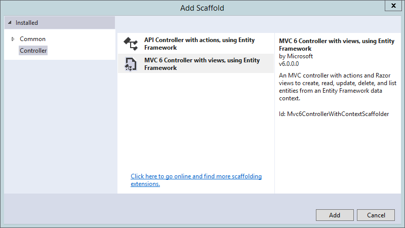
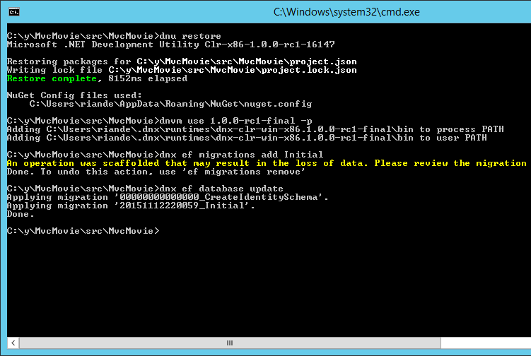
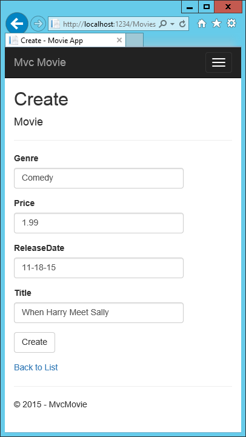
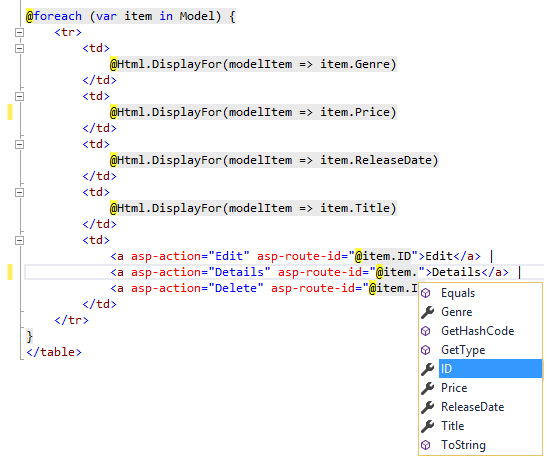

Adding a model
==================================================

By `Rick Anderson`_

In this section you'll add some classes for managing movies in a database. These classes will be the "**M**\odel" part of the **M**\VC app.

You’ll use a .NET Framework data-access technology known as the `Entity Framework <http://ef.readthedocs.org/>`__ to define and work with these model classes. The Entity Framework (often referred to as EF) supports a development paradigm called *Code First*. Code First allows you to create model objects by writing simple classes. (These are also known as POCO classes, from "plain-old CLR objects.") You can then have the database created on the fly from your classes, which enables a very clean and rapid development workflow. If you are required to create the database first, you can still follow this tutorial to learn about MVC and EF app development. 

Adding Model Classes
--------------------------

In Solution Explorer, right click the *Models* folder > **Add** > **Class**.

.. literalinclude:: start-mvc/sample/src/MvcMovie/Models/MovieNoEF.cs
  :language: c#
  :lines: 3-12
  :dedent: 0
  :linenos:
  :emphasize-lines: 5

In addition to the properties you'd expect to model a movie, the ``ID`` field is required by the DB for the primary key.

Build the project. If you don't build the app, you'll get an error in the next section. We've finally added a **M**\odel to our **M**\VC app.

Scaffolding a controller
-------------------------

In **Solution Explorer**, right-click the *Controllers* folder **> Add > Controller**.

.. image:: adding-model/_static/add_controller.png

In the **Add Scaffold** dialog, tap **MVC Controller with views, using Entity Framework > Add**.

- Complete the **Add Controller** dialog

  - **Model class:** *Movie(MvcMovie.Models)*
  - **Data context class:** *ApplicationDbContext(MvcMovie.Models)*
  - **Controller name:** Keep the default MoviesController
  - **Views:**: Keep the default of each option checked
  - **Controller name:** Keep the default *MoviesController*
  - Tap **Add**

.. image:: adding-model/_static/add_controller2.png

The Visual Studio scaffolding engine creates the following:

- A movies controller (MoviesController.cs)
- Create, Delete, Details, Edit and Index Razor view files
- Migrations classes

  - The ``CreateIdentitySchema`` class creates the :doc:`membership database </security/authentication/identity>` tables. The Identity database stores user login information that is needed for authentication. We won't cover authentication in this tutorial, for that you can follow `Additional resources`_ at the end of this tutorial.
  - The ``ApplicationDbContextModelSnapshot`` class creates the EF entities used to access the Identity database. We'll talk more about EF entities later in the tutorial.

Visual Studio automatically created the CRUD (create, read, update, and delete) action methods and views for you (the automatic creation of CRUD action methods and views is known as *scaffolding*). You'll soon have a fully functional web application that lets you create, list, edit, and delete movie entries.

Use data migrations to create the database
--------------------------------------------

- Open a command prompt in the project directory (MvcMovie/src/MvcMovie). Follow these instructions for a quick way to open a folder in the project directory.

  - Open a file in the root of the project (for this example, use *Startup.cs*.)
  - Right click on *Startup.cs*  **> Open Containing Folder**.

  .. image:: adding-model/_static/quick.png

  - Shift + right click a folder > **Open command window here**

  .. image:: adding-model/_static/folder.png

  - Run ``cd ..`` to move back up to the project directory

- Run the following commands in the command prompt:

.. code-block:: PHP

  dotnet restore
  dotnet ef migrations add Initial
  dotnet ef database update

- The ``ef`` command is specified in the *project.json* file:

.. literalinclude:: start-mvc/sample/src/MvcMovie/project.json
  :language: JSON
  :lines: 30-34
  :dedent: 0
  :linenos:
  :emphasize-lines: 3

- ``dotnet ef migrations add Initial`` Creates a class named ``Initial``

.. code-block:: c#

  public partial class Initial : Migration

The parameter "Initial" is arbitrary, but customary for the first (*initial*) database migration. You can safely ignore the warning ``may result in the loss of data``, it is dropping foreign key constraints and not any data. The warning is a result of the initial create migration for the ``Identity`` model not being up-to-date.  This will be fixed in the next version.

- ``dotnet ef database update`` Updates the database, that is, applies the migrations.

Test the app
------------------

- Run the app and tap the **Mvc Movie** link
- Tap the **Create New** link and create a movie

.. note:: You may not be able to enter decimal points or commas in the ``Price`` field. To support `jQuery validation <http://jqueryvalidation.org/>`__ for non-English locales that use a comma (",") for a decimal point, and non US-English date formats, you must take steps to globalize your app. See `Additional resources`_ for more information. For now, just enter whole numbers like 10.

Tapping **Create** causes the form to be posted to the server, where the movie information is saved in a database. You are then redirected to the `/Movies` URL, where you can see the newly created movie in the listing.

.. image:: adding-model/_static/h.png

Create a couple more movie entries. Try the **Edit**, **Details**, and **Delete** links, which are all functional.

Examining the Generated Code
---------------------------------

Open the *Controllers/MoviesController.cs* file and examine the generated ``Index`` method. A portion of the movie controller with the ``Index`` method is shown below:

.. literalinclude:: start-mvc/sample/src/MvcMovie/Controllers/MoviesController1.cs
 :language: c#
 :lines: 14-26
 :dedent: 4

The constructor uses :doc:`Dependency Injection </fundamentals/dependency-injection>` to inject the database context into the controller. The database context is used in each of the `CRUD <https://en.wikipedia.org/wiki/Create,_read,_update_and_delete>`__ methods in the controller.

A request to the Movies controller returns all the entries in the ``Movies`` table and then passes the data to the ``Index`` view.
 
Strongly typed models and the @model keyword
^^^^^^^^^^^^^^^^^^^^^^^^^^^^^^^^^^^^^^^^^^^^^^^^

Earlier in this tutorial, you saw how a controller can pass data or objects to a view template using the ``ViewData`` dictionary. The ``ViewData`` dictionary is a dynamic object that provides a convenient late-bound way to pass information to a view.

MVC also provides the ability to pass strongly typed objects to a view template. This strongly typed approach enables better compile-time checking of your code and richer `IntelliSense <https://msdn.microsoft.com/en-us/library/hcw1s69b.aspx>`__ in the Visual Studio editor. The scaffolding mechanism in Visual Studio used this approach (that is, passing a strongly typed model) with the ``MoviesController`` class and view templates when it created the methods and views.

Examine the generated ``Details`` method in the *Controllers/MoviesController.cs* file. The ``Details`` method is shown below.

.. literalinclude:: start-mvc/sample/src/MvcMovie/Controllers/MoviesController.cs
 :language: c#
 :lines: 24-40
 :dedent: 8

The ``id`` parameter is generally passed as route data, for example ``http://localhost:1234/movies/details/1`` sets:

- The controller to the ``movies`` controller (the first URL segment)
- The action to ``details`` (the second URL segment)
- The id to 1 (the last URL segment)

You could also pass in the ``id`` with a query string as follows:

``http://localhost:1234/movies/details?id=1``

If a Movie is found, an instance of the ``Movie`` model is passed to the ``Details`` view:

.. code-block:: c#

  return View(movie);

Examine the contents of the *Views/Movies/Details.cshtml* file:

.. literalinclude:: start-mvc/sample/src/MvcMovie/Views/Movies/Details.cshtml
 :language: HTML
 :emphasize-lines: 1
 
By including a ``@model`` statement at the top of the view template file, you can specify the type of object that the view expects. When you created the movie controller, Visual Studio automatically included the following ``@model`` statement at the top of the *Details.cshtml* file:

.. code-block:: HTML

  @model MvcMovie.Models.Movie

This ``@model`` directive allows you to access the movie that the controller passed to the view by using a ``Model`` object that's strongly typed. For example, in the *Details.cshtml* template, the code passes each movie field to the ``DisplayNameFor`` and ``DisplayFor`` HTML Helpers with the strongly typed ``Model`` object. The ``Create`` and ``Edit`` methods and view templates also pass a ``Movie`` model object.

Examine the *Index.cshtml* view template and the ``Index`` method in the Movies controller. Notice how the code creates a ``List`` object when it calls the View helper method in the ``Index`` action method. The code then passes this ``Movies`` list from the ``Index`` action method to the view:

.. code-block:: c#

 public IActionResult Index()
 {
  return View(_context.Movie.ToList());
 }
 
When you created the movies controller, Visual Studio automatically included the following ``@model`` statement at the top of the *Index.cshtml* file:

.. literalinclude:: start-mvc/sample/src/MvcMovie/Views/Movies/Index.cshtml
 :language: HTML
 :lines: 1

The ``@model`` directive allows you to access the list of movies that the controller passed to the view by using a ``Model`` object that's strongly typed. For example, in the *Index.cshtml* template, the code loops through the movies with a ``foreach`` statement over the strongly typed ``Model`` object:
 
.. literalinclude:: start-mvc/sample/src/MvcMovie/Views/Movies/Index.cshtml
  :language: HTML 
  :linenos:
  :emphasize-lines: 29, 32, 35, 38, 41, 44-46
 
Because the ``Model`` object is strongly typed (as an ``IEnumerable<Movie>`` object), each item in the loop is typed as ``Movie``. Among other benefits, this means that you get compile-time checking of the code and full `IntelliSense <https://msdn.microsoft.com/en-us/library/hcw1s69b.aspx>`__ support in the code editor:

.. note:: The RC1 version of the scaffolding engine generates HTML Helpers to display fields (``@Html.DisplayNameFor(model => model.Genre)``). The next version will use :doc:`/mvc/views/tag-helpers/index` to render fields.

You now have a database and pages to display, edit, update and delete data. In the next tutorial, we'll work with the database.
  
Additional resources
------------------------

- :doc:`/mvc/views/tag-helpers/index` 
- `Create a secure ASP.NET MVC app and deploy to Azure <https://azure.microsoft.com/en-us/documentation/articles/web-sites-dotnet-deploy-aspnet-mvc-app-membership-oauth-sql-database/>`__

