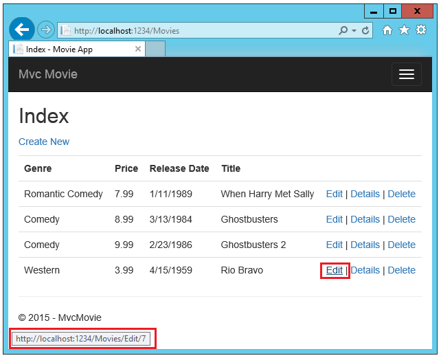

Controller methods and views
==================================================

By `Rick Anderson`_

We have a good start to the movie app, but the presentation is not ideal. We don't want to see the time on the release date and **ReleaseDate** should be two words.

.. image:: working-with-sql/_static/m55.png

Open the *Models/Movie.cs* file and add the highlighted lines shown below: 

.. literalinclude:: start-mvc/sample/src/MvcMovie/Models/MovieDate.cs
	:language: c#
	:lines: 7-18
	:dedent: 4
	:linenos:
	:emphasize-lines: 6-7 
 
- Right click on a red squiggly line **> Quick Actions**.
 
 .. image:: controller-methods-views/_static/qa.png
 
- Tap ``using System.ComponentModel.DataAnnotations;``
 
 .. image:: controller-methods-views/_static/da.png
 
Visual studio adds ``using System.ComponentModel.DataAnnotations;``.

Let's remove the ``using`` statements that are not needed. They show up by default in a light grey font. Right click anywhere in the *Movie.cs* file **> Organize Usings > Remove Unnecessary Usings**.

.. image:: controller-methods-views/_static/rm.png

The completed is shown below:

.. literalinclude:: start-mvc/sample/src/MvcMovie/Models/MovieDate.cs
	:language: c#
	:lines: 2-19
	:dedent: 0
	:linenos:
	:emphasize-lines: 2,11-12

.. TODO next version replace DataAnnotations links below with ASP.NET 5 version

We'll cover `DataAnnotations <http://msdn.microsoft.com/en-us/library/system.componentmodel.dataannotations.aspx>`__ in the next tutorial. The `Display <https://msdn.microsoft.com/en-us/library/system.componentmodel.dataannotations.displayattribute.aspx>`__ attribute specifies what to display for the name of a field (in this case "Release Date" instead of "ReleaseDate"). The `DataType <https://msdn.microsoft.com/en-us/library/system.componentmodel.dataannotations.datatypeattribute.aspx>`__ attribute specifies the type of the data, in this case it's a date, so the time information stored in the field is not displayed.

Browse to the ``Movies`` controller and hold the mouse pointer over an **Edit** link to see the target URL.

.. TODO move dave's A TH article to docs.asp.net - DP has agreed

The **Edit**, **Details**, and **Delete** links are generated by the `MVC 6 Anchor Tag Helper <http://www.davepaquette.com/archive/2015/06/01/mvc-6-anchor-tag-helper.aspx>`__ in the *Views/Movies/Index.cshtml* file.

.. literalinclude:: start-mvc/sample/src/MvcMovie/Views/Movies/Index.cshtml
	:language: HTML
	:lines: 43-47
	:dedent: 8
	:linenos:
	:emphasize-lines: 2-4

:doc:`Tag Helpers </mvc/views/tag-helpers/intro>` enable server-side code to participate in creating and rendering HTML elements in Razor files. In the code above, the `AnchorTagHelper <https://docs.asp.net/projects/api/en/latest/autoapi/Microsoft/AspNet/Mvc/TagHelpers/AnchorTagHelper/index.html>`__ dynamically generates the HTML ``href`` attribute value from the controller action method and route id. You use **View Source** from your favorite browser or use the **F12** tools to examine the generated markup. The **F12** tools are shown below.

.. image:: controller-methods-views/_static/f12.png

Recall the format for routing set in the *Startup.cs* file.

.. literalinclude:: start-mvc/sample/src/MvcMovie/Startup.cs
	:language: c#
	:linenos: 
	:lines: 83-88
	:dedent: 8
	:emphasize-lines: 5
	
ASP.NET translates ``http://localhost:1234/Movies/Edit/4`` into a request to the ``Edit`` action method of the ``Movies`` controller with the parameter ``ID`` of 4. (Controller methods are also known as `action methods <http://rachelappel.com/asp.net-mvc-actionresults-explained>`__.) 

:doc:`/mvc/views/tag-helpers/index` are one of the most popular new features in ASP.NET 5. See `Additional resources`_ for more information.
	
Open the ``Movies`` controller and examine the two ``Edit`` action methods:

.. image:: controller-methods-views/_static/1.png

.. literalinclude:: start-mvc/sample/src/MvcMovie/Controllers/MoviesController.cs
 :language: c#
 :lines: 62-89
 :dedent: 8
 :linenos:

.. note:: The scaffolding engine generated code above has a serious `over-posting security vulnerability <http://www.asp.net/mvc/overview/getting-started/getting-started-with-ef-using-mvc/implementing-basic-crud-functionality-with-the-entity-framework-in-asp-net-mvc-application#overpost>`__. Be sure you understand how to protect from over-posting before you publish your app. This security vulnerability should be fixed in the next release. 

Replace the ``HTTP POST Edit`` action method with the following:

.. literalinclude:: start-mvc/sample/src/MvcMovie/Controllers/MoviesController.cs
 :language: c#
 :lines: 109-122
 :dedent: 8
 :linenos:
 :emphasize-lines: 5

The ``[Bind]`` attribute is one way to protect against `over-posting <http://www.asp.net/mvc/overview/getting-started/getting-started-with-ef-using-mvc/implementing-basic-crud-functionality-with-the-entity-framework-in-asp-net-mvc-application#overpost>`__. You should only include properties in the ``[Bind]`` attribute that you want to change. Apply the ``[Bind]`` attribute to each of the ``[HttpPost]`` action methods. See `Protect your controller from over-posting <http://www.asp.net/mvc/overview/getting-started/getting-started-with-ef-using-mvc/implementing-basic-crud-functionality-with-the-entity-framework-in-asp-net-mvc-application#overpost>`__ for more information.

Notice the second ``Edit`` action method is preceded by the ``[HttpPost]`` attribute. 

.. literalinclude:: start-mvc/sample/src/MvcMovie/Controllers/MoviesController.cs
 :language: c#
 :lines: 109-122
 :dedent: 8
 :linenos:
 :emphasize-lines: 1-2
 
The ``[HttpPost]`` attribute specifies that this ``Edit`` method can be invoked *only* for ``POST`` requests. You could apply the ``[HttpGet]`` attribute to the first edit method, but that's not necessary because ``[HttpGet]`` is the default. 

The ``[ValidateAntiForgeryToken]`` attribute is used to prevent forgery of a request and is paired up with an anti-forgery token generated in the edit view file (*Views/Movies/Edit.cshtml*). The edit view file generates the anti-forgery token in the `Form Tag Helper <http://www.davepaquette.com/archive/2015/05/18/mvc-6-form-tag-helper.aspx>`__. 

.. code-block:: HTML

	<form asp-action="Edit">

The `Form Tag Helper <http://www.davepaquette.com/archive/2015/05/18/mvc-6-form-tag-helper.aspx>`__ generates a hidden anti-forgery token that must match the ``[ValidateAntiForgeryToken]`` generated anti-forgery token in the ``Edit`` method of the Movies controller. For more information, see :doc:`../../security/anti-request-forgery`.

The ``HttpGet Edit`` method takes the movie ``ID`` parameter, looks up the movie using the Entity Framework ``Single`` method, and returns the selected movie to the Edit view. If a movie cannot be found, ``HttpNotFound`` is returned. 

.. literalinclude:: start-mvc/sample/src/MvcMovie/Controllers/MoviesController.cs
 :language: c#
 :lines: 93-108
 :dedent: 8
 :linenos:

When the scaffolding system created the Edit view, it examined the ``Movie`` class and created code to render ``<label>`` and ``<input>`` elements for each property of the class. The following example shows the Edit view that was generated by the visual studio scaffolding system:

.. literalinclude:: start-mvc/sample/src/MvcMovie/Views/Movies/EditCopy.cshtml 
	:language: HTML
	:emphasize-lines: 1

Notice how the view template has a ``@model MvcMovie.Models.Movie`` statement at the top of the file — this specifies that the view expects the model for the view template to be of type ``Movie``.

The scaffolded code uses several Tag Helper methods to streamline the HTML markup. The `Label Tag Helper <http://www.davepaquette.com/archive/2015/05/18/mvc-6-label-tag-helper.aspx>`__ displays the name of the field ("Title", "ReleaseDate", "Genre", or "Price"). The `Input Tag Helper <http://www.davepaquette.com/archive/2015/05/13/mvc6-input-tag-helper-deep-dive.aspx>`__ renders an HTML ``<input>`` element. The `Validation Tag Helpers <http://www.davepaquette.com/archive/2015/05/14/mvc6-validation-tag-helpers-deep-dive.aspx>`__ displays any validation messages associated with that property.

Run the application and navigate to the ``/Movies`` URL. Click an **Edit** link. In the browser, view the source for the page. The generated HTML for the ``<form>`` element is shown below.

.. literalinclude:: start-mvc/sample/src/MvcMovie/Views/Shared/edit_view_source.html
	:language: HTML
	:emphasize-lines: 1,6,10,17,24, 28

The ``<input>`` elements are in an ``HTML <form>`` element whose ``action`` attribute is set to post to the ``/Movies/Edit/id`` URL. The form data will be posted to the server when the ``Save`` button is clicked. The last line before the closing ``</form>`` element shows the hidden `XSRF <:doc:/security/anti-request-forgery>`__ token generated by the `Form Tag Helper <http://www.davepaquette.com/archive/2015/05/18/mvc-6-form-tag-helper.aspx>`__.

Processing the POST Request
--------------------------------------

The following listing shows the ``[HttpPost]`` version of the ``Edit`` action method.

.. literalinclude:: start-mvc/sample/src/MvcMovie/Controllers/MoviesController.cs
 :language: c#
 :lines: 109-122
 :dedent: 8
	
The ``[ValidateAntiForgeryToken]`` attribute validates the hidden `XSRF <:doc:/security/anti-request-forgery>`__ token generated by the anti-forgery token generator in the `Form Tag Helper <http://www.davepaquette.com/archive/2015/05/18/mvc-6-form-tag-helper.aspx>`__.

The :doc:`model binding </mvc/models/model-binding>` system takes the posted form values and creates a ``Movie`` object that's passed as the ``movie`` parameter. The ``ModelState.IsValid`` method verifies that the data submitted in the form can be used to modify (edit or update) a ``Movie`` object. If the data is valid, the movie data is saved to the ``Movies`` collection of the database(``ApplicationDbContext`` instance). The new movie data is saved to the database by calling the ``SaveChanges`` method of ``ApplicationDbContext``. After saving the data, the code redirects the user to the ``Index`` action method of the ``MoviesController`` class, which displays the movie collection, including the changes just made.

As soon as the client side validation determines the values of a field are not valid, an error message is displayed. If you disable JavaScript, you won't have client side validation but the server will detect the posted values that are not valid, and the form values will be redisplayed with error messages. Later in the tutorial we examine validation in more detail.

The `Validation Tag Helper <http://www.davepaquette.com/archive/2015/05/14/mvc6-validation-tag-helpers-deep-dive.aspx>`__ in the *Views/Book/Edit.cshtml* view template takes care of displaying appropriate error messages.
	
.. image:: controller-methods-views/_static/val.png

All the ``HttpGet`` methods follow a similar pattern. They get a movie object (or list of objects, in the case of ``Index``), and pass the model to the view. The ``Create`` method passes an empty movie object to the ``Create`` view. All the methods that create, edit, delete, or otherwise modify data do so in the ``[HttpPost]`` overload of the method. Modifying data in an HTTP GET method is a security risk, as described in the blog post `ASP.NET MVC Tip #46 – Don’t use Delete Links because they create Security Holes <http://stephenwalther.com/blog/archive/2009/01/21/asp.net-mvc-tip-46-ndash-donrsquot-use-delete-links-because.aspx>`__. Modifying data in a ``HTTP GET`` method also violates HTTP best practices and the architectural `REST <http://rest.elkstein.org/>`__ pattern, which specifies that GET requests should not change the state of your application. In other words, performing a GET operation should be a safe operation that has no side effects and doesn't modify your persisted data.

Additional resources
------------------------
- `Globalization and localization <http://docs.asp.net/en/latest/fundamentals/localization.html>`__ 
- :doc:`/mvc/views/tag-helpers/intro`
- :doc:`/mvc/views/tag-helpers/authoring`
- :doc:`/security/anti-request-forgery`
- Protect your controller from `over-posting <http://www.asp.net/mvc/overview/getting-started/getting-started-with-ef-using-mvc/implementing-basic-crud-functionality-with-the-entity-framework-in-asp-net-mvc-application#overpost>`__ 
- `Form Tag Helper <http://www.davepaquette.com/archive/2015/05/18/mvc-6-form-tag-helper.aspx>`__
- `Label Tag Helper <http://www.davepaquette.com/archive/2015/05/18/mvc-6-label-tag-helper.aspx>`__
- `Input Tag Helper <http://www.davepaquette.com/archive/2015/05/13/mvc6-input-tag-helper-deep-dive.aspx>`__
- `Validation Tag Helpers <http://www.davepaquette.com/archive/2015/05/14/mvc6-validation-tag-helpers-deep-dive.aspx>`__
- `Anchor Tag Helper <http://www.davepaquette.com/archive/2015/06/01/mvc-6-anchor-tag-helper.aspx>`__
- `Select Tag Helper <http://www.davepaquette.com/archive/2015/05/18/mvc6-select-tag-helper.aspx>`__