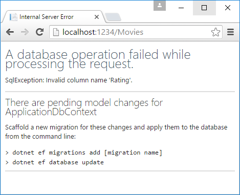

Adding a New Field
==================================================

By `Rick Anderson`_

In this section you'll use `Entity Framework <http://ef.readthedocs.org/en/latest/getting-started/index.html>`__ Code First Migrations to migrate some changes to the model classes so the change is applied to the database.

By default, when you use Entity Framework Code First to automatically create a database, as you did earlier in this tutorial, Code First adds a table to the database to help track whether the schema of the database is in sync with the model classes it was generated from. If they aren't in sync, the Entity Framework throws an error. This makes it easier to track down issues at development time that you might otherwise only find (by obscure errors) at run time.

Adding a Rating Property to the Movie Model
---------------------------------------------

Open the *Models/Movie.cs* file and add a ``Rating`` property:

.. literalinclude:: start-mvc/sample/src/MvcMovie/Models/MovieDateRating.cs 
  :language: c#
  :lines: 7-18
  :dedent: 4
  :linenos:
  :emphasize-lines: 11

Build the app (Ctrl+Shift+B).

Because you've added a new field to the ``Movie`` class, you also need to update the binding white list so this new property will be included. Update the ``[Bind]`` attribute for ``Create`` and ``Edit`` action methods to include the ``Rating`` property:

.. code-block:: c#

 [Bind("ID,Title,ReleaseDate,Genre,Price,Rating")]
 
You also need to update the view templates in order to display, create and edit the new ``Rating`` property in the browser view.

Edit the */Views/Movies/Index.cshtml* file and add a ``Rating`` field:
 
.. literalinclude:: start-mvc/sample/src/MvcMovie/Views/Movies/IndexGenreRating.cshtml
  :language: HTML
  :emphasize-lines: 16,36
  :linenos:
  :lines: 24-61

Update the */Views/Movies/Create.cshtml* with a ``Rating`` field. You can copy/paste the previous "form group" and let intelliSense help you update the fields. IntelliSense works with :doc:`Tag Helpers </mvc/views/tag-helpers/intro>`.

.. image:: new-field/_static/cr.png

The changed are highlighted below:

.. literalinclude:: start-mvc/sample/src/MvcMovie/Views/Movies/CreateRatingBrevity.cshtml
  :language: HTML
  :emphasize-lines: 13-20
  :linenos:
  :lines: 16-42

The app won't work until we update the DB to include the new field. If you run it now, you'll get the following ``SqlException``:

You're seeing this error because the updated Movie model class in the application is now different than the schema of the Movie table of the existing database. (There's no Rating column in the database table.) 

There are a few approaches to resolving the error:

#. Have the Entity Framework automatically drop and re-create the database based on the new model class schema. This approach is very convenient early in the development cycle when you are doing active development on a test database; it allows you to quickly evolve the model and database schema together. The downside, though, is that you lose existing data in the database — so you don't want to use this approach on a production database! Using an initializer to automatically seed a database with test data is often a productive way to develop an application. 

#. Explicitly modify the schema of the existing database so that it matches the model classes. The advantage of this approach is that you keep your data. You can make this change either manually or by creating a database change script.

#. Use Code First Migrations to update the database schema.

For this tutorial, we'll use Code First Migrations.

Update the ``SeedData`` class so that it provides a value for the new column. A sample change is shown below, but you'll want to make this change for each ``new Movie``.

.. literalinclude:: start-mvc/sample/src/MvcMovie/Models/SeedDataRating.cs
  :language: c#
  :linenos: 
  :lines: 38-45
  :dedent: 8
  :emphasize-lines: 6

Build the solution then open a command prompt. Enter the following commands:

.. code-block:: PHP

  dotnet ef migrations add Rating
  dotnet ef database update

The ``migrations add`` command tells the migration framework to examine the current ``Movie`` model with the current ``Movie`` DB schema and create the necessary code to migrate the DB to the new model. The name "Rating"" is arbitrary and is used to name the migration file. It's helpful to use a meaningful name for the migration step. 

If you delete all the records in the DB, the initialize will seed the DB and include the ``Rating`` field. You can do this with the delete links in the browser or from SSOX.

Run the app and verify you can create/edit/display movies with a ``Rating`` field. You should also add the ``Rating`` field to the ``Edit``, ``Details``, and ``Delete`` view templates.