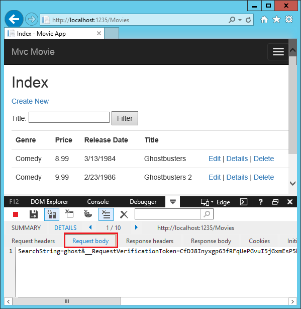
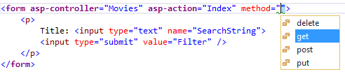
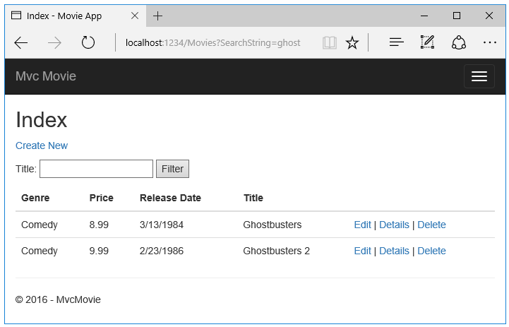

Adding Search
==================================================

By `Rick Anderson`_

Adding a Search Method and Search View

In this section you'll add search capability to the Index action method that lets you search movies by genre or name.

Updating Index 
-----------------------------------

Start by updating the ``Index`` action method to enable search. Here's the code:

.. literalinclude:: start-mvc/sample/src/MvcMovie/Controllers/MoviesController.cs
 :language: c#
 :lines: 154-166
 :emphasize-lines: 1, 6-9
 :dedent: 4
 :linenos:
 
The first line of the ``Index`` action method creates a `LINQ <http://msdn.microsoft.com/en-us/library/bb397926.aspx>`__ query to select the movies: 

.. literalinclude:: start-mvc/sample/src/MvcMovie/Controllers/MoviesController.cs
 :language: c#
 :lines: 156-157
 :dedent: 12
 
The query is *only* defined at this point, it *has not* been run against the database.

If the ``searchString`` parameter contains a string, the movies query is modified to filter on the value of the search string, using the following code:

.. literalinclude:: start-mvc/sample/src/MvcMovie/Controllers/MoviesController.cs
 :language: c#
 :lines: 159-163
 :dedent: 12
 
The ``s => s.Title`` code above is a `Lambda Expression <http://msdn.microsoft.com/en-us/library/bb397687.aspx>`__. Lambdas are used in method-based `LINQ <http://msdn.microsoft.com/en-us/library/bb397926.aspx>`__ queries as arguments to standard query operator methods such as the `Where <http://msdn.microsoft.com/en-us/library/system.linq.enumerable.where.aspx>`__ method used in the above code. LINQ queries are not executed when they are defined or when they are modified by calling a method such as ``Where`` or ``OrderBy``. Instead, query execution is deferred, which means that the evaluation of an expression is delayed until its realized value is actually iterated over or the ``ToList`` method is called. In the Search sample, the query is executed in the *Index.cshtml* view. For more information about deferred query execution, see `Query Execution <http://msdn.microsoft.com/en-us/library/bb738633.aspx>`__. **Note:** The `Contains <http://msdn.microsoft.com/en-us/library/bb155125.aspx>`__ method is run on the database, not the c# code above. On the database, `Contains <http://msdn.microsoft.com/en-us/library/bb155125.aspx>`__ maps to `SQL LIKE <http://msdn.microsoft.com/en-us/library/ms179859.aspx>`__, which is case insensitive.

Now you can update the ``Index`` view that will display the form to the user.

Navigate to ``/Movies/Index``. Append a query string such as ``?searchString=ghost`` to the URL. The filtered movies are displayed.

.. image:: search/_static/ghost.png

If you change the signature of the ``Index`` method to have a parameter named ``id``, the ``id`` parameter will match the optional ``{id}`` placeholder for the default routes set in *Startup.cs*.

.. code-block:: c#

	template: "{controller=Home}/{action=Index}/{id?}");

You can quickly rename the ``searchString`` parameter to ``id`` with the **rename** command. Right click on ``searchString`` **> Rename**.

.. image:: search/_static/rename.png

The rename targets are highlighted.

.. image:: search/_static/rename2.png

Change the parameter to ``id`` and all occurrences of ``searchString`` change to ``id``.

.. image:: search/_static/rename3.png

The previous ``Index`` method:

.. literalinclude:: start-mvc/sample/src/MvcMovie/Controllers/MoviesController.cs
 :language: c#
 :lines: 154-166
 :emphasize-lines: 1, 6,8
 :dedent: 8
 :linenos:
 
The updated ``Index`` method:

.. literalinclude:: start-mvc/sample/src/MvcMovie/Controllers/MoviesController.cs
 :language: c#
 :lines: 173-185
 :emphasize-lines: 1, 6,8
 :dedent: 8
 :linenos:

You can now pass the search title as route data (a URL segment) instead of as a query string value.

.. image:: search/_static/g2.png

However, you can't expect users to modify the URL every time they want to search for a movie. So now you you'll add UI to help them filter movies. If you changed the signature of the ``Index`` method to test how to pass the route-bound ``ID`` parameter, change it back so that it takes a parameter named ``searchString``:

.. literalinclude:: start-mvc/sample/src/MvcMovie/Controllers/MoviesController.cs
 :language: c#
 :lines: 154-166
 :emphasize-lines: 1, 6,8
 :dedent: 8

Open the *Views/Movies/Index.cshtml* file, and add the ``<form>`` markup highlighted below: 
 	
.. literalinclude:: start-mvc/sample/src/MvcMovie/Views/Movies/Index2.cshtml
	:language: HTML
	:lines: 1-21
	:emphasize-lines: 13-18
	:linenos:

The HTML ``<form>`` tag is super-charged by the `Form Tag Helper <http://www.davepaquette.com/archive/2015/05/18/mvc-6-form-tag-helper.aspx>`__, so when you submit the form, the filter string is posted to the ``Index`` action of the movies controller. Save your changes and then test the filter.

.. image:: search/_static/filter.png

There's no ``[HttpPost]`` overload of the ``Index`` method. You don't need it, because the method isn't changing the state of the app, just filtering data.

You could add the following ``[HttpPost] Index`` method. 

.. literalinclude:: start-mvc/sample/src/MvcMovie/Controllers/MoviesController.cs
 :language: c#
 :lines: 214-218
 :dedent: 8

If you did, the action invoker would match the ``[HttpPost] Index`` method, and the ``[HttpPost] Index`` method would run as shown in the image below.

.. image:: search/_static/fo.png

However, even if you add this ``[HttpPost]`` version of the ``Index`` method, there's a limitation in how this has all been implemented. Imagine that you want to bookmark a particular search or you want to send a link to friends that they can click in order to see the same filtered list of movies. Notice that the URL for the HTTP POST request is the same as the URL for the GET request (localhost:xxxxx/Movies/Index) -- there's no search information in the URL itself. Right now, the search string information is sent to the server as a form field value. You can verify that with the `F12 Developer tools <https://dev.windows.com/en-us/microsoft-edge/platform/documentation/f12-devtools-guide/>`__ or the excellent `Fiddler tool <http://www.telerik.com/fiddler>`__. Start the `F12 tool <https://dev.windows.com/en-us/microsoft-edge/platform/documentation/f12-devtools-guide/>`__ and tap the **Enable network traffic capturing** icon. 

.. image:: search/_static/f12.png

Double tap the **http://localhost:1235/Movies	HTTP POST 200** line and then tap **Request body**. 

You can see the search parameter and `XSRF <:doc:../../security/anti-request-forgery>`__ token in the request body. Note, as mentioned in the previous tutorial, the `Form Tag Helper <http://www.davepaquette.com/archive/2015/05/18/mvc-6-form-tag-helper.aspx>`__ generates an `XSRF <:doc:../../security/anti-request-forgery>`__ anti-forgery token. We're not modifying data, so we don't need to validate the token in the controller method.

Because the search parameter is in the request body and not the URL, you can't capture that search information to bookmark or share with others. We'll fix this by specifying the request should be ``HTTP GET``. Notice how intelliSense helps us update the markup.

.. image:: search/_static/int_m.png

Notice the distinctive font in the ``<form>`` tag. That distinctive font indicates the tag is supported by :doc:`Tag Helpers </mvc/views/tag-helpers/intro>`. 

Now when you submit a search, the URL contains the search query string. Searching will also go to the ``HttpGet Index`` action method, even if you have a ``HttpPost Index`` method.

The `XSRF <:doc:../../security/anti-request-forgery>`__ token and any other posted form elements will also be added to the URL.

Adding Search by Genre
--------------------------

Replace the ``Index`` method with the following code:

.. literalinclude:: start-mvc/sample/src/MvcMovie/Controllers/MoviesController.cs
 :language: c#
 :lines: 223-251
 :dedent: 8

This version of the ``Index`` method takes a ``movieGenre`` parameter. The first few lines of code create a ``List`` object to hold movie genres from the database.

The following code is a ``LINQ`` query that retrieves all the genres from the database.

.. literalinclude:: start-mvc/sample/src/MvcMovie/Controllers/MoviesController.cs
 :language: c#
 :lines: 226-228
 :dedent: 12
 
The code uses the `AddRange <http://msdn.microsoft.com/en-us/library/z883w3dc.aspx>`__ method of the generic `List <http://msdn.microsoft.com/en-us/library/6sh2ey19.aspx>`__ collection to add all the distinct genres to the list. (Without the ``Distinct`` modifier, duplicate genres would be added — for example, comedy would be added twice in our sample). The code then stores the list of genres in a ``ViewData`` dictionary. Storing category data (such a movie genre's) as a ``SelectList`` object in a ``ViewData`` dictionary, then accessing the category data in a dropdown list box is a typical approach for MVC apps.

The following code shows how to check the ``movieGenre`` parameter. If it's not empty, the code further constrains the movies query to limit the selected movies to the specified genre.

.. literalinclude:: start-mvc/sample/src/MvcMovie/Controllers/MoviesController.cs
 :language: c#
 :lines: 243-246
 :dedent: 12

As stated previously, the query is not run on the data base until the movie list is iterated over (which happens in the View, after the Index action method returns).
 
Adding search by genre to the Index view
--------------------------------------------

Add an ``Html.DropDownList`` helper to the *Views/Movies/Index.cshtml* file. The completed markup is shown below:

.. literalinclude:: start-mvc/sample/src/MvcMovie/Views/Movies/IndexGenre.cshtml
	:language: HTML
	:lines: 12-21
	:emphasize-lines: 3
	:linenos:
	
.. note:: The next version of this tutorial will replace the ``Html.DropDownList`` helper with the `Select Tag Helper <http://www.davepaquette.com/archive/2015/05/18/mvc6-select-tag-helper.aspx>`__.

Test the app by searching by genre, by movie title, and by both.