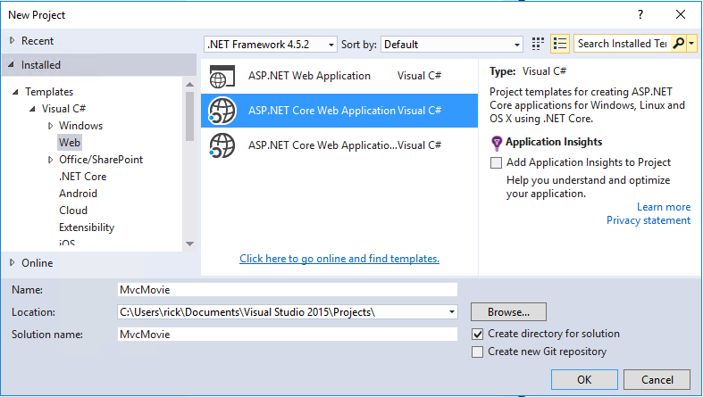
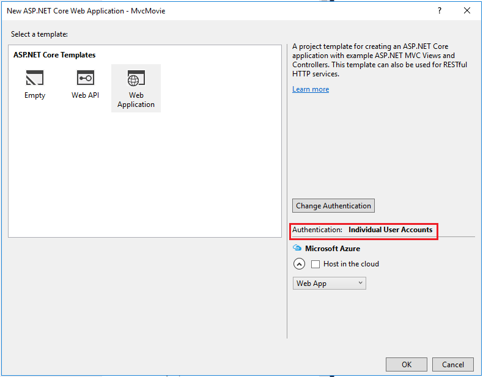
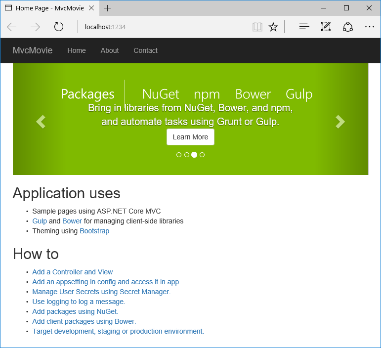
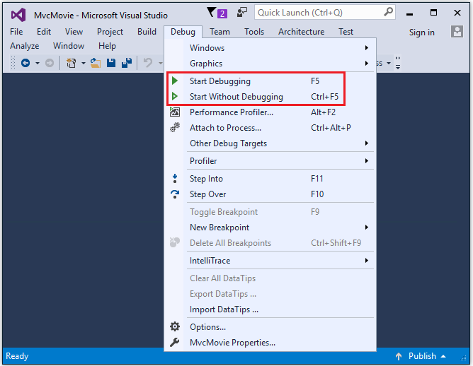

Getting started with ASP.NET Core MVC and Visual Studio
=======================================================

By `Rick Anderson`_

This tutorial will teach you the basics of building an ASP.NET Core MVC  web app using `Visual Studio 2015 <https://www.visualstudio.com/en-us/visual-studio-homepage-vs.aspx>`__. 

Install Visual Studio and .NET Core
----------------------------------------

- Install Visual Studio Community 2015. Select the Community download and the default installation. Skip this step if you have Visual Studio 2015 installed.

  - `Visual Studio 2015 Home page installer  <https://www.visualstudio.com/en-us/visual-studio-homepage-vs.aspx>`__

- Install `.NET Core + Visual Studio tooling <http://go.microsoft.com/fwlink/?LinkID=798306>`__

Create a web app
-----------------------------------

From the Visual Studio **Start** page, tap **New Project**.

.. image:: start-mvc/_static/new_project.png

Alternatively, you can use the menus to create a new project. Tap **File > New > Project**.

.. image:: start-mvc/_static/alt_new_project.png

Complete the **New Project** dialog:

- In the left pane, tap **Web**
- In the center pane, tap **ASP.NET Core Web Application (.NET Core)**
- Name the project "MvcMovie" (It's important to name the project "MvcMovie" so when you copy code, the namespace will match. )
- Tap **OK**

In the **New ASP.NET Core Web Application - MvcMovie** dialog, tap **Web Application**, and then tap **OK**.

Visual Studio used a default template for the MVC project you just created, so you have a working app right now by entering a project name and selecting a few options. This is a simple "Hello World!" project, and it's a good place to start,

Tap **F5** to run the app in debug mode or **Ctl-F5** in non-debug mode.

- Visual Studio starts `IIS Express <http://www.iis.net/learn/extensions/introduction-to-iis-express/iis-express-overview>`__ and runs your app. Notice that the address bar shows ``localhost:port#`` and not something like ``example.com``. That's because ``localhost`` always points to your own local computer, which in this case is running the app you just created. When Visual Studio creates a web project, a random port is used for the web server. In the image above, the port number is 1234. When you run the app, you'll see a different port number.
- Launching the app with **Ctrl+F5** (non-debug mode) allows you to make code changes, save the file, refresh the browser, and see the code changes. Many developers prefer to use non-debug mode to quickly launch the app and view changes.
- You can launch the app in debug or non-debug mode from the **Debug** menu item:

- You can debug the app by tapping the **IIS Express** button

.. image:: start-mvc/_static/iis_express.png

The default template gives you working **Home, Contact, About, Register** and **Log in** links. The browser image above doesn't show these links. Depending on the size of your browser, you might need to click the navigation icon to show them. 

.. image:: start-mvc/_static/2.png

In the next part of this tutorial, we'll learn about MVC and start writing some code.
