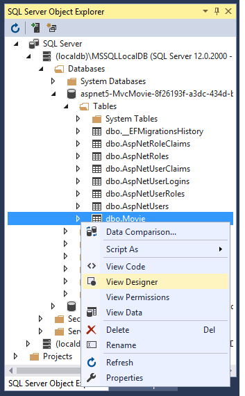
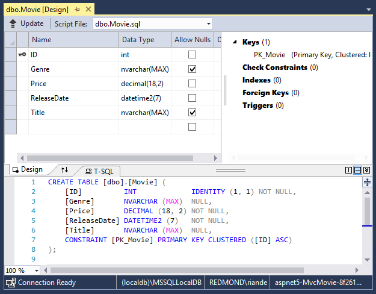
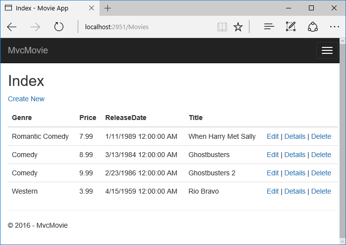

Working with SQL Server LocalDB
=============================================

By `Rick Anderson`_

The ``ApplicationDbContext`` class handles the task of connecting to the database and mapping ``Movie`` objects to database records. The database context is registered with the :doc:`Dependency Injection  </fundamentals/dependency-injection>` container in the ``ConfigureServices`` method in the *Startup.cs* file:

.. literalinclude:: start-mvc/sample2/src/MvcMovie/Startup.cs
  :language: c#
  :start-after: // This method gets called by the runtime. Use this method to add services to the container.
  :end-before: services.AddIdentity<ApplicationUser, IdentityRole>()
  :dedent: 8

The ASP.NET Core :doc:`Configuration </fundamentals/configuration>` system reads the ``ConnectionString``. For local development, it gets the connection string from the *appsettings.json* file:

.. literalinclude:: start-mvc/sample2/src/MvcMovie/appsettings.json
  :language: javascript
  :lines: 1-6
  :emphasize-lines: 3

When you deploy the app to a test or production server, you can use an environment variable or another approach to set the connection string to a real SQL Server. See :doc:`Configuration </fundamentals/configuration>` .

SQL Server Express LocalDB
--------------------------------

LocalDB is a lightweight version of the SQL Server Express Database Engine that is targeted for program development. LocalDB starts on demand and runs in user mode, so there is no complex configuration. By default, LocalDB database creates "\*.mdf" files in the *C:/Users/<user>* directory.

- From the **View** menu, open **SQL Server Object Explorer** (SSOX).

.. image:: working-with-sql/_static/ssox.png

- Right click on the ``Movie`` table **> View Designer**

Note the key icon next to ``ID``. By default, EF will make a property named ``ID`` the primary key.

.. comment: add this when we have it for MVC 6: For more information on EF and MVC, see Tom Dykstra's excellent tutorial on MVC and EF.

- Right click on the ``Movie`` table **> View Data**

.. image:: working-with-sql/_static/ssox2.png

.. image:: working-with-sql/_static/vd22.png

Seed the database
--------------------------

Create a new class named ``SeedData`` in the *Models* folder. Replace the generated code with the following:

.. literalinclude:: start-mvc/sample2/src/MvcMovie/Models/SeedData.cs
  :language: c#
  :start-after: // Seed without Rating
  :end-before: #endif

Notice if there are any movies in the DB, the seed initializer returns.

.. literalinclude:: start-mvc/sample2/src/MvcMovie/Models/SeedData.cs
  :language: c#
  :start-after: // Look for any movies.
  :end-before: context.Movie.AddRange(
  :dedent: 16

Add the seed initializer to the end of the ``Configure`` method in the *Startup.cs* file:

.. literalinclude:: start-mvc/sample2/src/MvcMovie/Startup.cs
  :dedent: 8
  :emphasize-lines: 9
  :start-after: app.UseIdentity();
  :end-before: // End of Configure.

Test the app

- Delete all the records in the DB. You can do this with the delete links in the browser or from SSOX.
- Force the app to initialize (call the methods in the ``Startup`` class) so the seed method runs. To force initialization, IIS Express must be stopped and restarted. You can do this with any of the following approaches:

  - Right click the IIS Express system tray icon in the notification area and tap **Exit** or **Stop Site**

|

.. image:: working-with-sql/_static/iisExIcon.png
  :height: 100px
  :width: 200 px

|

.. image:: working-with-sql/_static/stopIIS.png

|

  - If you were running VS in non-debug mode, press F5 to run in debug mode
  - If you were running VS in debug mode, stop the debugger and press ^F5

.. Note:: If the database doesn't initialize, put a break point on the line ``if (context.Movie.Any())`` and start debugging.

.. image:: working-with-sql/_static/dbg.png

The app shows the seeded data.

