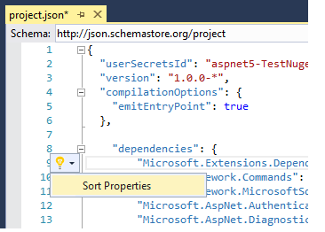

Working with SQL Server LocalDB
==================================================

By `Rick Anderson`_

The ``ApplicationDbContext`` class handles the task of connecting to the database and mapping ``Movie`` objects to database records. The database context is registered in the ``ConfigureServices`` method in the *Startup.cs* file:

.. literalinclude:: start-mvc/sample/src/MvcMovie/Startup.cs
  :language: c#
  :linenos: 
  :lines: 39-45
  :dedent: 8
  :emphasize-lines: 7

The :doc:`configuration </fundamentals/configuration>` system reads the ``Data:DefaultConnection:ConnectionString``. For local development, it gets the connection string from the *appsettings.json* file:

.. literalinclude:: start-mvc/sample/src/MvcMovie/appsettings.json
  :language: javascript
  :linenos: 
  :lines: 1-6
  :dedent: 0
  :emphasize-lines: 4

When you deploy the app to a test or production server, you can use the :doc:`configuration </fundamentals/configuration>` system to read an environment variable to set the connection string to a real SQL Server.

SQL Server Express LocalDB
--------------------------------

LocalDB is a lightweight version of the SQL Server Express Database Engine that is targeted for program development. LocalDB starts on demand and runs in user mode, so there is no complex configuration. By default, LocalDB database creates "\*.mdf" files in the *C:/Users/<user>* directory.

- From the **View** menu, open **SQL Server Object Explorer** (SSOX). 

.. image:: working-with-sql/_static/ssox.png

- Right click on the ``Movie`` table **> View Designer**

.. image:: working-with-sql/_static/design.png

.. image:: working-with-sql/_static/dv.png

Note the key icon next to ``ID``. By default, EF will make a property named ``ID`` the primary key. 

- Right click on the ``Movie`` table **> View Data**

.. image:: working-with-sql/_static/ssox2.png

.. image:: working-with-sql/_static/vd22.png

Seed the database
--------------------------

We'll take advantage of :doc:`Dependency Injection </fundamentals/dependency-injection>` (DI) to seed the database. You add server side dependencies to ASP.NET Core projects in the *project.json* file. Open *project.json* and add the DI package. IntelliSense helps us add the package.

.. image:: working-with-sql/_static/di_intel.png

The DI package is highlighted below:

.. literalinclude:: start-mvc/sample/src/MvcMovie/project.json
  :language: javascript
  :lines: 1-11
  :dedent: 0
  :emphasize-lines: 9

Optional: Tap the *quick actions* light bulb icon and select **Sort Properties**.

Create a new class named ``SeedData`` in the *Models* folder. Replace the generated code with the following:

.. literalinclude:: start-mvc/sample/src/MvcMovie/Models/SeedData.cs
  :language: c#

The ``GetService`` method comes from the DI package we just added. Notice if there are any movies in the DB, the seed initializer returns.

.. literalinclude:: start-mvc/sample/src/MvcMovie/Models/SeedData.cs
  :language: c#
  :linenos: 
  :lines: 18-21
  :dedent: 8
  :emphasize-lines: 3

Add the seed initializer to the end of the ``Configure`` method in the *Startup.cs* file:

.. literalinclude:: start-mvc/sample/src/MvcMovie/Startup.cs
  :language: c#
  :linenos: 
  :lines: 83-91
  :dedent: 8
  :emphasize-lines: 8

Test the app

- Delete all the records in the DB. You can do this with the delete links in the browser or from SSOX.
- Force the app to initialize so the seed method runs. You can do this by setting a break point on the first line of the ``SeedData`` ``Initialize`` method, and launching the debugger (Tap F5 or tap the **IIS Express** button).

.. image:: working-with-sql/_static/dbg.png

The app shows the seeded data.

.. image:: working-with-sql/_static/m55.png
