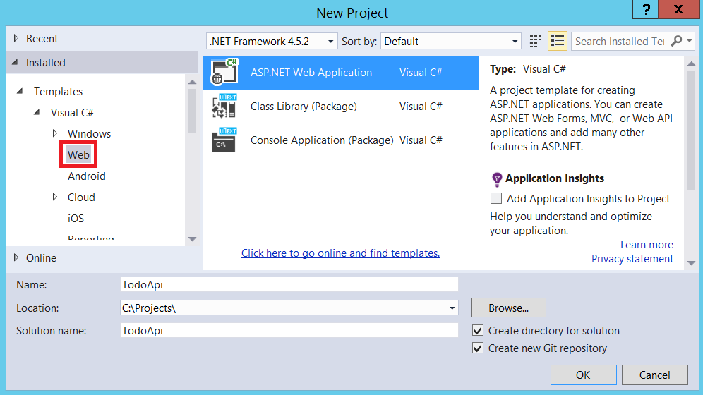
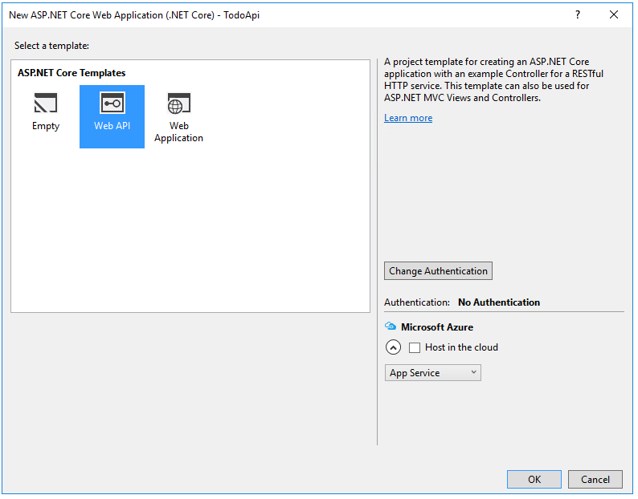
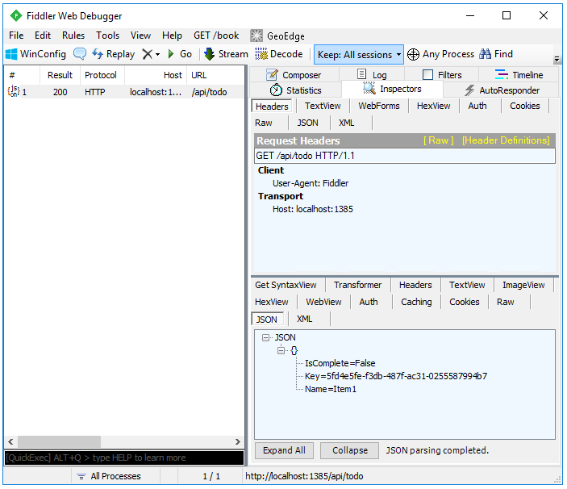
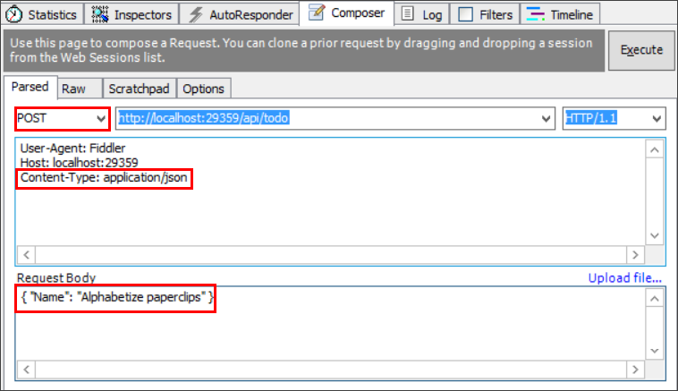
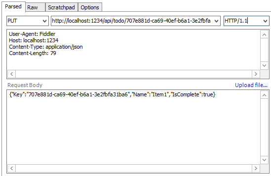

Building Your First Web API with ASP.NET Core MVC and Visual Studio
====================================================================

By `Mike Wasson`_ and `Rick Anderson`_

HTTP is not just for serving up web pages. It’s also a powerful platform for building APIs that expose services and data. HTTP is simple, flexible, and ubiquitous. Almost any platform that you can think of has an HTTP library, so HTTP services can reach a broad range of clients, including browsers, mobile devices, and traditional desktop apps.

In this tutorial, you’ll build a simple web API for managing a list of "to-do" items. You won’t build any UI in this tutorial.

ASP.NET Core has built-in support for MVC building Web APIs. Unifying the two frameworks makes it simpler to build apps that include both UI (HTML) and APIs, because now they share the same code base and pipeline.

.. note:: If you are porting an existing Web API app to ASP.NET Core, see :doc:`/migration/webapi`

.. contents:: Sections:
  :local:
  :depth: 1

Overview
--------
Here is the API that you’ll create:

=====================  ========================  ============  =============
API                    Description               Request body  Response body
=====================  ========================  ============  =============
GET /api/todo          Get all to-do items       None          Array of to-do items
GET /api/todo/{id}     Get an item by ID         None          To-do item
POST /api/todo         Add a new item            To-do item    To-do item
PUT /api/todo/{id}     Update an existing item   To-do item    None
DELETE /api/todo/{id}  Delete an item.           None          None
=====================  ========================  ============  =============

The following diagram show the basic design of the app.

.. image:: first-web-api/_static/architecture.png

- The client is whatever consumes the web API (browser, mobile app, and so forth). We aren’t writing a client in this tutorial.
- A *model* is an object that represents the data in your application. In this case, the only model is a to-do item. Models are represented as simple C# classes (POCOs).
- A *controller* is an object that handles HTTP requests and creates the HTTP response. This app will have a single controller.
- To keep the tutorial simple the app doesn’t use a database. Instead, it just keeps to-do items in memory. But we’ll still include a (trivial) data access layer, to illustrate the separation between the web API and the data layer. For a tutorial that uses a database, see :doc:`first-mvc-app/index`.

Install Fiddler
---------------

We're not building a client, we'll use `Fiddler <http://www.fiddler2.com/fiddler2/>`__ to test the API. Fiddler is a web debugging tool that lets you compose HTTP requests and view the raw HTTP responses.

Create the project
------------------

Start Visual Studio. From the **File** menu, select **New** > **Project**.

Select the **ASP.NET Core Web Application** project template. Name the project ``TodoApi`` and tap **OK**.

In the **New ASP.NET Core Web Application (.NET Core) - TodoApi** dialog, select the **Web API** template. Tap **OK**.

Add a model class
-----------------

A model is an object that represents the data in your application. In this case, the only model is a to-do item.

Add a folder named "Models". In Solution Explorer, right-click the project. Select **Add** > **New Folder**. Name the folder *Models*.

.. image:: first-web-api/_static/add-folder.png

.. note:: You can put model classes anywhere in your project, but the *Models* folder is used by convention.

Next, add a ``TodoItem`` class. Right-click the *Models* folder and select **Add** > **New Item**.

In the **Add New Item** dialog, select the **Class** template. Name the class ``TodoItem`` and click **OK**.

.. image:: first-web-api/_static/add-class.png

Replace the generated code with:

.. literalinclude:: first-web-api/sample/src/TodoApi/Models/TodoItem.cs
  :language: c#

Add a repository class
----------------------

A *repository* is an object that encapsulates the data layer, and contains logic for retrieving data and mapping it to an entity model. Even though the example app doesn’t use a database, it’s useful to see how you can inject a repository into your controllers. Create the repository code in the *Models* folder.

Start by defining a repository interface named ``ITodoRepository``. Use the class template (**Add New Item**  > **Class**).

.. literalinclude:: first-web-api/sample/src/TodoApi/Models/ITodoRepository.cs
  :language: c#

This interface defines basic CRUD operations.

Next, add a ``TodoRepository`` class that implements ``ITodoRepository``:

.. literalinclude:: first-web-api/sample/src/TodoApi/Models/TodoRepository.cs
  :language: c#

Build the app to verify you don't have any compiler errors.

Register the repository
-----------------------

By defining a repository interface, we can decouple the repository class from the MVC controller that uses it. Instead of instantiating a ``TodoRepository`` inside the controller we will inject an ``ITodoRepository`` the built-in support in ASP.NET Core for :doc:`dependency injection </fundamentals/dependency-injection>`.

This approach makes it easier to unit test your controllers. Unit tests should inject a mock or stub version of ``ITodoRepository``. That way, the test narrowly targets the controller logic and not the data access layer.

In order to inject the repository into the controller, we need to register it with the DI container. Open the *Startup.cs* file. Add the following using directive:

.. code-block:: c#

  using TodoApi.Models;

In the ``ConfigureServices`` method, add the highlighted code:

.. literalinclude:: first-web-api/sample/src/TodoApi/Startup.cs
  :language: c#
  :lines: 13-23
  :emphasize-lines: 9-10
  :dedent: 8

Add a controller
----------------

In Solution Explorer, right-click the *Controllers* folder. Select **Add** > **New Item**. In the **Add New Item** dialog, select the **Web  API Controller Class** template. Name the class ``TodoController``.

Replace the generated code with the following:

.. literalinclude:: first-web-api/sample/src/TodoApi/Controllers/TodoController.cs
  :language: c#
  :lines: 1-14,67-68

This defines an empty controller class. In the next sections, we'll add methods to implement the API.

Getting to-do items
-------------------

To get to-do items, add the following methods to the ``TodoController`` class.

.. literalinclude:: first-web-api/sample/src/TodoApi/Controllers/TodoController.cs
  :language: c#
  :lines: 17-31
  :dedent: 8

These methods implement the two GET methods:

- ``GET /api/todo``
- ``GET /api/todo/{id}``

Here is an example HTTP response for the ``GetAll`` method::

  HTTP/1.1 200 OK
  Content-Type: application/json; charset=utf-8
  Server: Microsoft-IIS/10.0
  Date: Thu, 18 Jun 2015 20:51:10 GMT
  Content-Length: 82

  [{"Key":"4f67d7c5-a2a9-4aae-b030-16003dd829ae","Name":"Item1","IsComplete":false}]

Later in the tutorial I'll show how you can view the HTTP response using the Fiddler tool.

Routing and URL paths
^^^^^^^^^^^^^^^^^^^^^

The `[HttpGet] <https://docs.asp.net/projects/api/en/latest/autoapi/Microsoft/AspNetCore/Mvc/HttpGetAttribute/index.html>`_ attribute specifies that these are HTTP GET methods. The URL path for each method is constructed as follows:

- Take the template string in the controller’s route attribute,  ``[Route("api/[controller]")]``
- Replace "[Controller]" with the name of the controller, which is the controller class name minus the "Controller" suffix. For this sample the name of the controller is "todo" (case insensitive). For this sample, the controller class name is **Todo**\Controller and the root name is "todo". ASP.NET MVC Core is not case sensitive.
- If the ``[HttpGet]`` attribute also has a template string, append that to the path. This sample doesn't use a template string.

For the ``GetById`` method,  "{id}" is a placeholder variable. In the actual HTTP request, the client will use the ID of the ``todo`` item. At runtime, when MVC invokes ``GetById``, it assigns the value of "{id}" in the URL the method's ``id`` parameter.

Return values
^^^^^^^^^^^^^

The ``GetAll`` method returns a CLR object. MVC automatically serializes the object to `JSON <http://www.json.org/>`__ and writes the JSON into the body of the response message. The response code for this method is 200, assuming there are no unhandled exceptions. (Unhandled exceptions are translated into 5xx errors.)

In contrast, the ``GetById`` method returns the more general ``IActionResult`` type, which represents a generic result type. That’s because ``GetById`` has two different return types:

- If no item matches the requested ID, the method returns a 404 error.  This is done by returning ``NotFound``.
- Otherwise, the method returns 200 with a JSON response body. This is done by returning an `ObjectResult <https://docs.asp.net/projects/api/en/latest/autoapi/Microsoft/AspNetCore/Mvc/ObjectResult/index.html>`_.

Use Fiddler to call the API
---------------------------

This step is optional, but it’s useful to see the raw HTTP responses from the web API.
In Visual Studio, press ^F5 to launch the app. Visual Studio launches a browser and navigates to ``http://localhost:port/api/todo``, where *port* is a randomly chosen port number. If you're using Chrome, Edge or Firefox, the *todo* data will be displayed. If you're using IE, IE will prompt to you open or save the *todo.json* file.

Launch Fiddler. From the **File** menu, uncheck the **Capture Traffic** option. This turns off capturing HTTP traffic.

.. image:: first-web-api/_static/fiddler1.png

Select the **Composer** page. In the **Parsed** tab, type ``http://localhost:port/api/todo``, where *port* is the port number. Click **Execute** to send the request.

.. image:: first-web-api/_static/fiddler2.png

The result appears in the sessions list. The response code should be 200. Use the **Inspectors** tab to view the content of the response, including the response body.

Implement the other CRUD operations
------------------------------------

The last step is to add ``Create``, ``Update``, and ``Delete`` methods to the controller. These methods are variations on a theme, so I'll just show the code and highlight the main differences.

Create
^^^^^^

.. literalinclude:: first-web-api/sample/src/TodoApi/Controllers/TodoController.cs
  :language: c#
  :lines: 33-42
  :dedent: 8

This is an HTTP POST method, indicated by the `[HttpPost] <https://docs.asp.net/projects/api/en/latest/autoapi/Microsoft/AspNetCore/Mvc/HttpPostAttribute/index.html>`_ attribute. The `[FromBody] <https://docs.asp.net/projects/api/en/latest/autoapi/Microsoft/AspNetCore/Mvc/FromBodyAttribute/index.html>`_ attribute tells MVC to get the value of the to-do item from the body of the HTTP request.

The `CreatedAtRoute <https://docs.asp.net/projects/api/en/latest/autoapi/Microsoft/AspNetCore/Mvc/Controller/index.html>`_ method returns a 201 response, which is the standard response for an HTTP POST method that creates a new resource on the server. ``CreateAtRoute`` also adds a Location header to the response. The Location header specifies the URI of the newly created to-do item. See `10.2.2 201 Created <http://www.w3.org/Protocols/rfc2616/rfc2616-sec10.html>`_.

We can use Fiddler to send a Create request:

#.  In the **Composer** page, select POST from the drop-down.
#.  In the request headers text box, add ``Content-Type: application/json``, which is a ``Content-Type`` header with the value ``application/json``. Fiddler automatically adds the Content-Length header.
#.  In the request body text box, enter the following: ``{"Name":"<your to-do item>"}``
#.  Click **Execute**.

Here is an example HTTP session. Use the **Raw** tab to see the session data in this format.

Request::

  POST http://localhost:29359/api/todo HTTP/1.1
  User-Agent: Fiddler
  Host: localhost:29359
  Content-Type: application/json
  Content-Length: 33

  {"Name":"Alphabetize paperclips"}

Response::

  HTTP/1.1 201 Created
  Content-Type: application/json; charset=utf-8
  Location: http://localhost:29359/api/Todo/8fa2154d-f862-41f8-a5e5-a9a3faba0233
  Server: Microsoft-IIS/10.0
  Date: Thu, 18 Jun 2015 20:51:55 GMT
  Content-Length: 97

  {"Key":"8fa2154d-f862-41f8-a5e5-a9a3faba0233","Name":"Alphabetize paperclips","IsComplete":false}

Update
^^^^^^

.. literalinclude:: first-web-api/sample/src/TodoApi/Controllers/TodoController.cs
  :language: c#
  :lines: 44-60
  :dedent: 8

``Update`` is similar to ``Create``, but uses HTTP PUT. The response is `204 (No Content) <http://www.w3.org/Protocols/rfc2616/rfc2616-sec9.html>`_.
According to the HTTP spec, a PUT request requires the client to send the entire updated entity, not just the deltas. To support partial updates, use HTTP PATCH.

Delete
^^^^^^

.. literalinclude:: first-web-api/sample/src/TodoApi/Controllers/TodoController.cs
  :language: c#
  :lines: 62-68
  :dedent: 8

The void return type returns a 204 (No Content) response. That means the client receives a 204 even if the item has already been deleted, or never existed. There are two ways to think about a request to delete a non-existent resource:

- "Delete" means "delete an existing item", and the item doesn’t exist, so return 404.
- "Delete" means "ensure the item is not in the collection." The item is already not in the collection, so return a 204.

Either approach is reasonable. If you return 404, the client will need to handle that case.

.. image:: first-web-api/_static/delete.png

Next steps
----------

- To learn about creating a backend for a native mobile app, see :doc:`/mobile/native-mobile-backend`.
- For information about deploying your API, see :doc:`Publishing and Deployment </publishing/index>`.
- `View or download sample code <https://github.com/aspnet/Docs/tree/master/aspnet/tutorials/first-web-api/sample>`__

