.. include:: /../common/stub-topic.txt

ASP.NET 5 on Nano Server
========================

By `Luke Latham`_

In this tutorial, you'll deploy an ASP.NET 5 web application to a Microsoft Azure Nano Server virtual machine and learn how to safely manage Nano Server using a Microsoft Azure Windows Server 2012 R2 virtual machine.

.. contents:: In this article:
  :local:
  :depth: 1

Introduction
------------
Prerequisites
^^^^^^^^^^^^^
Before you start, make sure that you have the followed the getting started steps for :doc:`/getting-started/installing-on-windows` and created (or obtained) a working ASP.NET 5 64-bit Core CLR app. For more information on creating your first ASP.NET 5 app, see :doc:`/tutorials/your-first-aspnet-application`.

.. note:: For additional information on installing ASP.NET 5 on other platforms, see :doc:`/getting-started/index`.

You will need a Microsoft Azure account to create the Azure Virtual Machines (servers) in this tutorial. If you don't have an Azure account, you can sign up at the `Microsoft Azure website <https://azure.microsoft.com/en-us/pricing/free-trial/>`_. If you would like information on signing up for an Azure account as an organization, see `Sign up for Azure as an organization <https://azure.microsoft.com/en-us/documentation/articles/sign-up-organization/>`_.

Nano Server
^^^^^^^^^^^
Windows Server is an all-purpose industry standard operating system for production IT workloads and a feat of engineering. As Windows Server has grown to encompass a vast array of solutions to meet IT demands, it has also grown in size and complexity. A craving exists now for a significantly smaller and faster version of Windows Server for cloud-based workloads. Nano Server was born for this purpose.

Nano Server is an optimized version of Windows Server for private clouds and datacenters. Nano Server features vastly reduced disk space requirements, fewer update requirements, added uptime due to reduced server restarts, and faster performance owing to fewer running processes. Nano Server is ideal as a compute host Hyper-V Virtual Machine, storage host, DNS server, or host for applications running behind IIS (or outside of IIS) inside or outside of a container.

This tutorial will walk you through setting up a Microsoft Azure Nano Server Virtual Machine and deploying an ASP.NET 5 application to your Nano Server. Because Nano Server is a "headless server," which means that no graphical user interface is available, we'll also spin up a Microsoft Azure Windows Server 2012 R2 Virtual Machine to safely manage our Nano Server. This tutorial cross-demonstrates important security concepts for reducing the attack surface of your Nano Server.

Follow this tutorial to get started quickly with ASP.NET 5 on Nano Server. Visit the linked content in the `Additional Resources <../tutorials/nano-server.html#id9>`_ section at the end of the tutorial to learn more about Nano Server.

Windows Server 2016 (Nano Server) Technical Preview
^^^^^^^^^^^^^^^^^^^^^^^^^^^^^^^^^^^^^^^^^^^^^^^^^^^
Nano Server is distributed with the `Windows Server 2016 Technical Preview (TP4) <https://www.microsoft.com/en-us/evalcenter/evaluate-windows-server-technical-preview>`_. The preview will expire on October 15, 2016. The preview is not eligible for use in production environments, and preview upgrades are not supported (i.e., upgrading from or to a Windows Server 2016 preview will not preserve custom configurations). Read the `release notes <https://technet.microsoft.com/library/dn765470.aspx>`_ and `system requirements <https://technet.microsoft.com/library/mt126134(WS.11).aspx>`_ before proceeding with this tutorial.

Deployment options for Nano Server
^^^^^^^^^^^^^^^^^^^^^^^^^^^^^^^^^^
This tutorial demonstrates deploying an ASP.NET 5 application to Nano Server running on a Microsoft Azure Resource Manager (ARM) Virtual Machine (VM). Other options include deployment to an on-premises Hyper-V virtual machine or Server Core on a physical computer. For more information on these alternative deployment options, see `Getting Started with Nano Server <https://technet.microsoft.com/en-us/library/mt126167.aspx>`_.

Interacting with Nano Server
^^^^^^^^^^^^^^^^^^^^^^^^^^^^
Windows PowerShell Remoting
^^^^^^^^^^^^^^^^^^^^^^^^^^^
This tutorial demonstrates interacting with Nano Server via Windows PowerShell remoting using the Remote PowerShell Tab feature of the `PowerShell Integrated Scripting Environment (ISE) <https://technet.microsoft.com/en-us/library/dd315244.aspx>`_ application.

If you prefer not to work with the PowerShell ISE Remote PowerShell Tab feature or if you are using Windows PowerShell, you can manually create a session with your Nano Server by using the following commands (but this approach is not used in this tutorial).

.. code-block:: powershell

  $a = "<NANO_SERVER_DNS_ADDRESS>"
  Set-Item WSMan:\localhost\Client\TrustedHosts $a
  $s = New-PSSession -ComputerName $a -Credential <username>
  Enter-PSSession -Session $s

For information on additional ways to interact with Nano Server, see `Getting Started with Nano Server <https://technet.microsoft.com/en-us/library/mt126167.aspx>`_.

Working with files and folders
^^^^^^^^^^^^^^^^^^^^^^^^^^^^^^
This tutorial utilizes a Server Message Block (SMB) file share using Microsoft Azure Files. An SMB file share is a convenient way to share files across computers on a network, including the Internet.

.. note:: If you install PowerShell v5.0 on the management VM, be aware that PowerShell v5.0 introduces a new feature in the ``Copy-Item`` command that also allows files and folders to be moved in and out of a remote PowerShell session (but this approach is not used in this tutorial). For more information on using ``Copy-Item``'s new ``-ToSession`` and ``-FromSession`` extensions, see `Copy To or From a PowerShell Session <http://blogs.technet.com/b/poshchap/archive/2015/10/30/copy-from-one-powershell-session-to-another.aspx>`_.

When working with a network share to move files and folders, you can drag-and-drop files and folders to a mapped network drive (locally only, because Nano Server doesn't have a GUI) or use PowerShell (locally or remotely). The commands shown below work equally well in a local or remote PowerShell tab.

Use the ``Copy-Item`` command to move files and folders to or from the share. In PowerShell, the period (``.``) refers to the current directory.

Move a file, named *some-file.txt*, from the current directory to the share:

.. code-block:: powershell

  Copy-Item -Path .\some-file.txt -Destination <DRIVE_LETTER>:

Move a folder, named *some-folder*, from the current directory to the share:

.. code-block:: powershell

  Copy-Item -Path .\some-folder -Destination <DRIVE_LETTER>: -Recurse

To move files and folders from the share to the current directory, use the ``Copy-Item`` command reversing the ``-Path`` and ``-Destination``.

Moving a file from the share to the current directory:

.. code-block:: powershell

  Copy-Item -Path <DRIVE_LETTER>:\some-file.txt -Destination .

Moving a folder from the share to the current directory:

.. code-block:: powershell

  Copy-Item -Path <DRIVE_LETTER>:\some-folder -Destination . -Recurse

The ``-Path`` and ``-Destination`` parameters are optional. The ``-Recurse`` switch can be replaced with ``-r``. The ``cp`` command will also invoke the ``Copy-Item`` command. The following commands accomplish the same results as the longer commands above.

Move a file to the share:

.. code-block:: powershell

  cp .\some-file.txt <DRIVE_LETTER>:

Move a folder to the share:

.. code-block:: powershell

  cp .\some-folder <DRIVE_LETTER>: -r

Move a file from the share:

.. code-block:: powershell

  cp <DRIVE_LETTER>:\some-file.txt .

Move a folder from the share:

.. code-block:: powershell

  cp <DRIVE_LETTER>:\some-folder . -r

Conventions used
^^^^^^^^^^^^^^^^
In this tutorial, commands will be shown with placeholders [in angle brackets (``<...>``)] for custom values that you must provide. Commands will also be shown with a set of naming conventions that will allow you to simply cut-and-paste the command for direct use, thus enhancing your enjoyment of the tutorial. The naming conventions used in this tutorial are shown in the table below.

.. list-table:: 
   :header-rows: 1

   * - Item
     - Name

   * - WS 2012 R2 Admin Username
     - adminuser

   * - Nano Server Admin Username
     - nanouser

   * - Azure Files File Share Container Name
     - data

   * - File Share Drive Letter
     - s

   * - ASP.NET 5 Publish Output Folder
     - output

   * - IIS Website Name
     - aspnet5

   * - IIS Website Project Location on Nano Server
     - *c:\\output*

   * - IIS Website IIS Physical Path
     - *c:\\output\\wwwroot*

   * - IIS Website Application Pool
     - aspnet5

IT infrastructure security
^^^^^^^^^^^^^^^^^^^^^^^^^^
Cyberattacks are a serious threat to company operations, and we should adopt strong security in our IT infrastructure to reduce the surface area for attacks and mitigate the damage from successful attacks. Before we get started with the tutorial, let's take a few minutes to go over an important security concept that will help us keep our servers safe.

A doctrine of infrastructure security is to limit the attack surface of our enterprise IT assets in part by limiting the number of management points to one or a few tightly-controlled management servers. Our goal is to limit our web servers' exposure to attacks from the public Internet by opening access to only those services that we require the web servers to perform for the public.

We will be creating a web server in this tutorial, so our goal is to only open ports 80 and 8000 (HTTP) and 443 (HTTPS) to the public Internet while locking-down all other public ports. Management and monitoring ports, such as 5985/5986 (WinRM ports for PowerShell remoting), will be open on a Virtual Network, where only our management server can gain access. As we add additional web servers to such a zone, we tremendously reduce the attack surface area compared to opening management and monitoring ports to the Internet on all of our web servers.

The importance of adopting strong security best practices cannot be understated. The number and sophistication of cyberattacks on enterprise IT infrastructure has ballooned in recent years. This tutorial cannot hope to instruct you in all of the best practices for secure server management to keep your organization safe from cyberattacks; however, we will adopt one important approach in this tutorial: limiting management points. This is one of many important practices that should be adopted. For more information and good starting points for further reading, visit `Windows Server Security (Microsoft TechNet) <https://technet.microsoft.com/en-us/library/windows-server-security.aspx>`_, `Microsoft Cloud Services and Network Security <https://azure.microsoft.com/en-us/documentation/articles/best-practices-network-security/>`_, and `Enterprise Security Best Practices <https://technet.microsoft.com/en-us/library/dd277328.aspx>`_.

Azure Services Configuration
----------------------------
Before we get started creating our VM's, let's create an Azure Resource Group, an Azure Storage Account (and an Azure Files network file share to go along with it), an Azure Virtual Network, and a pair of Network Security Groups (one for the management VM and one for the Nano Server). By preconfiguring these services, we will save time later when deploying our VM's.

.. note:: Azure service names frequently expose public endpoints or require unique names internally, so the names we give to several Azure services are only available on a first-come, first-served basis. You should choose an alphanumeric postfix to use with your Azure service names as you work through the tutorial. For example, we will use the number "1234" in the tutorial and name our management VM *vmm1234*, name our virtual network *vnet1234*, and name our Nano Sever *nano1234*. You should choose a postfix alphanumeric value to use for your tutorial experience. This will provide a consistent way for you to name your services while working though the tutorial without the likelihood of trying to use a service name in use by someone else's Azure subscription.

Azure Resource Group
^^^^^^^^^^^^^^^^^^^^
1. Navigate to the **`Azure Portal <https://portal.azure.com/>`_**. Click the button for **Resource Groups**.

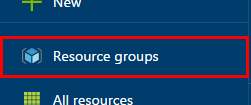
 
2. Click the **Add** button.

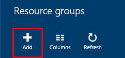
 
3. Supply a **Resource group name**, choose your **Subscription**, and select a **Resource group location** (Azure datacenter). We will use the name *group1234* for this tutorial and group our Azure services in the **West US** datacenter. Click the **Create** button to establish the resource group.

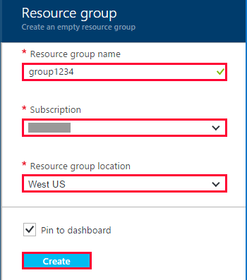
 
Azure Storage Account
^^^^^^^^^^^^^^^^^^^^^
1. Click the button for **Storage accounts**. Be careful **not** to accidently click **Storage accounts (classic)** immediately below.

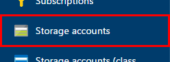
 
2. Click the **Add** button.

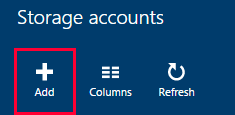
 
3. Provide a **Name**. We will use *storage1234* for this tutorial. Downgrade the storage **Type** to **Standard-LRS** and set **Diagnostics** to **Disabled**, which will be sufficient for demonstration purposes in this tutorial. Select the **Subscription** and choose the **Resource Group** we established earlier. Click the **Create** button to establish the storage account. Wait for the deployment to complete.

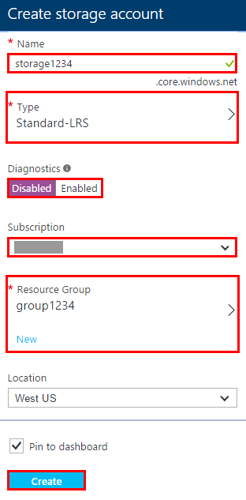
 
4. Create an Azure Files network file share container and map it to a local network drive. The storage account properties blade will appear when the storage account deployment is complete. Click the **Files** button in the **Services** area.

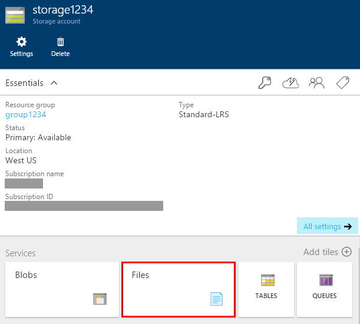
 
5. In the **File shares** area of the **File service** blade, click the button to create a file share.

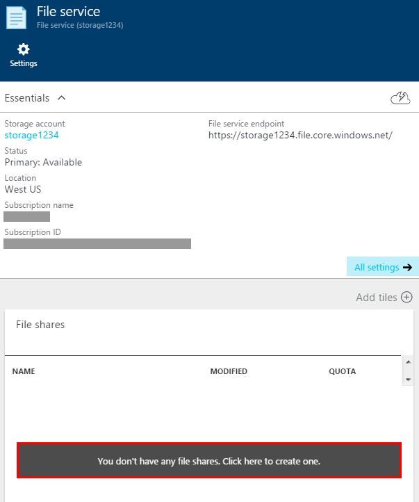
 
6. Create the file share by providing a **Name** (we will use *data*) and a **Quota** (*2* GB is plenty of space for our needs). Note that you will be charged for the space that you quote, so do not set aside much more space than you need. Click the **Create** button.

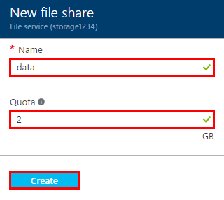
 
7. We will need the storage account key in future steps. Go back to the **Storage account** blade and click the **All settings** button, which will spawn the **Settings** blade. Open the **Access keys** blade and note the location of **KEY1**. You will be coming back to this blade later in the tutorial to obtain the storage account key. Of course, only cut-and-paste the key from the **Azure Portal** ... never store it unencrypted on any system.

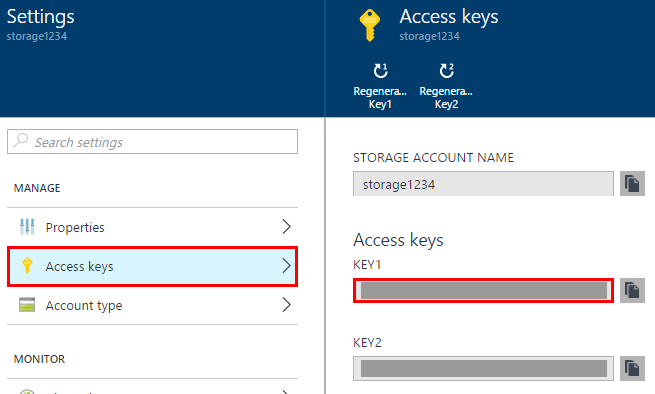
 
Azure Virtual Network
^^^^^^^^^^^^^^^^^^^^^
1. In the **Azure Portal**, click the **New** button, followed by **Networking**, followed by **Virtual network**.

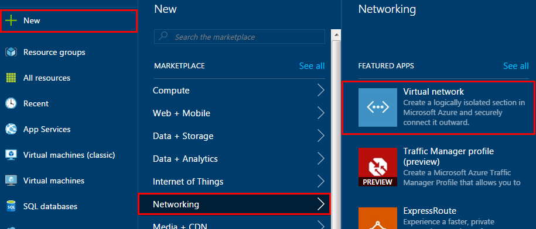
 
2. Set the **Select a deployment model** drop-down to **Resource Manager** and click the **Create** button.

.. image:: nano-server/_static/pre-12.png
 
3. The **Create virtual network** (VNet) blade will open. Provide a VNet **Name**. We will use *vnet1234* in the tutorial. We will use the default values provided by Azure, but you have an opportunity to set the **Address space**, **Subnet name**, and **Subnet address range** if you wish. Set the **Resource group** to the group you are using. In the tutorial, we established the resource group as *group1234*. You should select the resource group you created earlier. Click the **Create** button and wait for the deployment to complete.

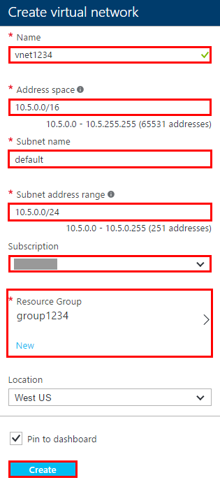
 
Azure Network Security Group (management VM)
^^^^^^^^^^^^^^^^^^^^^^^^^^^^^^^^^^^^^^^^^^^^
The Network Security Group (NSG) for the management VM will be different than for our Nano Server. Our management VM will only have Remote Desktop Protocol (RDP, port 3389) open to the Internet, while the Nano Server will only open HTTP (ports 80 and 8000) and HTTPS (port 443) to the Internet. The management port that we will be using, Windows Remote Management (WinRM, port 5985), will only be open on the VNet between the two servers. Because we're locking-down management traffic to the VNet, we are vastly reducing the public attack surface of our Nano Server.

.. note:: Naming network VNets, like naming servers, should adhere to a standard convention throughout the enterprise but is beyond the scope of this tutorial. If you are not familiar with naming conventions in networks, research the subject further.

.. note:: Another best practice in server security is to use non-standard ports for services where possible. Ordinarily, we would choose a non-standard port for Remote Desktop and map it to the correct internal port for Remote Desktop (RDP, port 3389). This is not necessary for the tutorial and would overly complicate our demonstration, because to configure such a port mapping, we would need to add an Azure Load Balancer (LB) with Network Address Translation (NAT) rules. This is well beyond the scope of this tutorial; however, you can obtain more information on the subject in `Get started configuring an internet facing load balancer using Azure Resource Manager <https://azure.microsoft.com/en-us/documentation/articles/load-balancer-arm-powershell/>`_.

1. In the **Azure Portal**, click the **Browse** button and scroll down to click the **Network security groups** button. Be careful **not** to accidently click the **Network security groups (classic)** button.

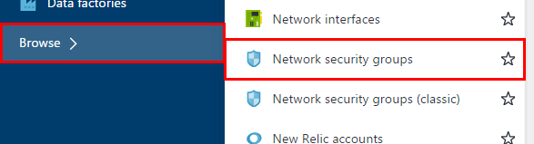
 
2. Click the **Add** button.

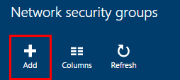
 
3. In the **Create network security group** blade, provide a **Name**, **Subscription**, and our **Resource Group**. In the tutorial, we will name the rule *vmm1234*. The abbreviation "vmm" stands for "virtual machine manager." Click the **Create** button and wait for the deployment to complete.

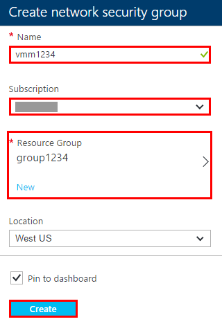
 
4. When the deployment completes, the **Azure Portal** will open to the NSG we just created. It's time to add an inbound security rule for RDP (port 3389). In the **Settings**, click the **Inbound security rules** button, followed by the **Add** button in the **Inbound security rules** blade.

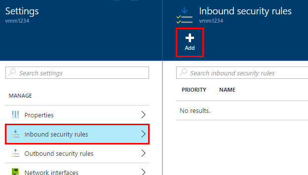
 
5. We will add one rule for RDP (port 3389). In the **Name** field, provide the name *default-allow-rdp*. Bump the **Priority** up to 1000. Click the **OK** button to create the rule. After you click the **OK** button, there will be a short delay of a few seconds before the new rule will appear in the Azure Portal UI in the list of **Inbound security rules**. Wait for the rule to appear in the UI before proceeding.

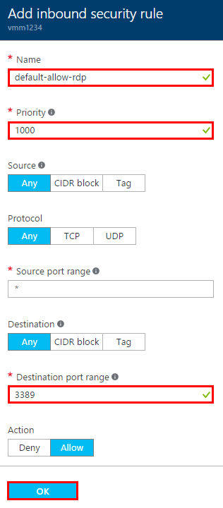
 
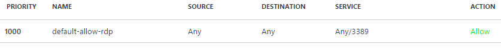

.. warning:: There are additional security considerations for security rules beyond the scope of this tutorial. Good starting points for learning more are `Security considerations for Azure Resource Manager <https://azure.microsoft.com/en-us/documentation/articles/best-practices-resource-manager-security/>`_ and `Azure Network Security Groups <https://azure.microsoft.com/en-us/documentation/articles/virtual-networks-nsg/>`_.

.. note:: As with naming NVets and servers, naming schemes for security rules are also worthy of your further research. In the tutorial, we will prefix names with "default" to denote that they are the default rules to apply in each group, provide the action of the rule ("allow" or "deny"), and specify the protocol/port of the rule.

.. tip:: Rules are processed in priority order lowest to highest (e.g., a rule with a **Priority** of 100 would be processed before a rule with a **Priority** of 200). Leave gaps between the rules that you create. When you return later to add new rules, you can add new rules in-between existing rules without editing existing rules. Note that once a rule is matched and applied, no further rules will be applied. If an early rule (lower **Priority** number) matches to deny the traffic and a later rule (higher **Priority** number) matches to allow the traffic, the traffic will be denied because the first rule (deny) matches and applies.

.. note:: We do not need to create an outbound security rule for RDP (port 3389). When a request arrives on the inbound port or port range of an NSG, the outbound traffic of the response is automatically allowed.

.. note:: If you would like to lock down the access to the management VM further by specifying a specific source IP address or range of IP addresses, you may do so with the **CIDR block** and **Source** settings. This is not necessary for the tutorial but will provide added security to your production networks, where limiting access to management points is critical.
 
Azure Network Security Group (Nano Server VM)
^^^^^^^^^^^^^^^^^^^^^^^^^^^^^^^^^^^^^^^^^^^^^^^^^^^^^
Let's turn our attention to the NSG that we need for our Nano Server. The Nano Server will require open services for HTTP (port 80) and HTTPS (port 443) to receive and respond to requests from the Internet. Later, our ASP.NET 5 application will be bound to HTTP on port 8000, so we will also open port 8000 in the NSG. Perform the following steps to create the NSG and add the inbound rules.

1. Go back to the **Network security groups** blade by clicking **Browse > Network security groups**. Click the **Add** button and provide a **Name** the NSG. In this tutorial, we will use *nano1234*, which will match the name of the Nano Server that we will create shortly. Set the **Subscription** and select the **Resource Group** you are using. In the tutorial, our Resource Group is called *group1234*. Click the **Create** button to create the NSG. Wait for the NSG to deploy. When it has deployed, the **Azure Portal** will open a blade to the NSG.

2. We will create the inbound rules for the Nano Server. There is no need to provide screenshots for this step, as the **Azure Portal** blades are identical to the ones we just used working with the management VM NSG. Click the **Inbound security rules** button. For each new rule, click the **Add** button, provide the rule information from the data shown below, and click the **OK** button to create each rule. You can create these rules one after the other without delaying between each addition; however, recall that you will need to wait for a few seconds after the final rule has been added to see it appear in the **Inbound security rules** blade. A screenshot is shown for the final NSG. Compare your NSG rules to the screenshot below and confirm your rules are correct.

.. note:: We do not need to open ports for management traffic between the management VM and the Nano Server on the VNet. A default rule is applied by Azure that allows inbound and outbound traffic on the VNet. For more information, see the *Default Rules* section of `What is a Network Security Group (NSG)? <https://azure.microsoft.com/en-us/documentation/articles/virtual-networks-nsg/>`_.

*NSG Rule for HTTP (Port 80) access*
  * **Name**: default-allow-http
  * **Priority**: 1000
  * **Source**: Any
  * **Protocol**: Any
  * **Source port range**: *
  * **Destination**: Any
  * **Destination port range**: 80
  * **Action**: Allow

*NSG Rule for HTTPS (Port 443) access*
  * **Name**: default-allow-https
  * **Priority**: 1100
  * **Source**: Any
  * **Protocol**: Any
  * **Source port range**: *
  * **Destination**: Any
  * **Destination port range**: 443
  * **Action**: Allow

*NSG Rule for HTTP (Port 8000) access for our ASP.NET 5 app*
  * **Name**: allow-http-aspnet5
  * **Priority**: 1200
  * **Source**: Any
  * **Protocol**: Any
  * **Source port range**: *
  * **Destination**: Any
  * **Destination port range**: 8000
  * **Action**: Allow

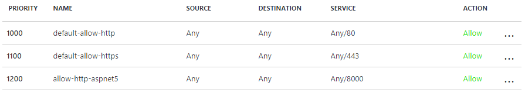
 
Create a Microsoft Azure Windows Server 2012 R2 VM
--------------------------------------------------
First, we will create a management Azure VM to interact with our Nano Server, which we will be spinning up in a few minutes. The management VM shouldn't be used for any other purpose than managing other VM's. Because it will likely only be used in times of management, you can stop (deallocate) the VM in the **Azure Portal** when it isn't needed to reduce costs and start (allocate/deploy) the VM whenever you need it.

.. note:: If you stop (deallocate) the management VM when not in use, you will obtain an even higher level of security, because no one can use a management VM for malicious purposes that isn't actually running. The most restrictive and safest management point philosophy is to have as few management points as possible, limit their exposure to attack, limit administrative scope for using them in the organization, and disable them when they are not actively serving a management role.

.. note:: Storage charges for a stopped (deallocated) VM apply. See `Azure Pricing <https://azure.microsoft.com/en-us/pricing/>`_ for details.

1. In the **Azure Portal**, click the button for **Virtual machines**.

.. image:: nano-server/_static/vmm-setup-01.png
 
2. Click the **Add** button.

.. image:: nano-server/_static/vmm-setup-02.png
 
3. In the **Recommended** section, click the **Windows Server** button.

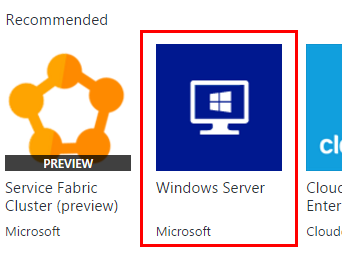
 
4. Select **Windows Server 2012 R2 Datacenter** from the list. Be careful **not** to accidently select the **Windows Server 2012 Datacenter** (not R2) button immediately above it.

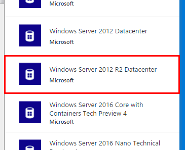
 
5. Set the **Select a deployment model** drop-down to **Resource Manager** and click the **Create** button.

.. image:: nano-server/_static/vmm-setup-05.png
 
6. Next, we will configure our management server.

.. note:: Server naming conventions is an important subject but beyond the scope of this tutorial. We will use a simple name, *vmm1234*, for our management server. The abbreviation "vmm" stands for "virtual machine manager," and is a common abbreviation in server names used for this purpose. Many excellent blog posts, articles, and books address IT asset naming, and you are encouraged to research the subject further if unfamiliar.

.. note:: Every asset that accepts credentials should have a unique username and password. If you aren't familiar with best practices in account usernames and password policies, you are encouraged to research the subject further.

**Basics** blade: Provide a **Name**, **User name**, **Password**, **Subscription**, and **Resource Group**. Click **OK** to proceed to the **Size** blade.

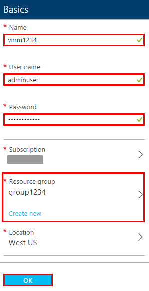
 
**Size** blade: Select a VM size. Click **View All** to see all of the available VM sizes. For this tutorial, we will use an **A1 Standard** VM size. Select a VM size and click the **Select** button.

.. image:: nano-server/_static/vmm-setup-07.png
 
**Storage** blade: For the **Disk type**, we will accept the default **Standard**. Use the storage account and VNet we created earlier. Click the **Public IP address** button to open the **Choose public IP address** blade, which will default to **Create new** and further open the **Create public IP address** blade. On the **Create public IP address** blade, accept the default **Name** and set the **Assignment** to **Static**. Click **OK**.

The **Azure Portal** will default to a new **Network security group**, but we want to select the one we created earlier for the management VM. For the tutorial, this is the *vmm1234* NSG. We will set **Diagnostics** to **Disabled** and leave the **Availability set** on the default **None** value. Click the **OK** button to see the **Summary** blade.

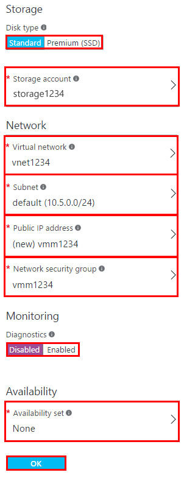

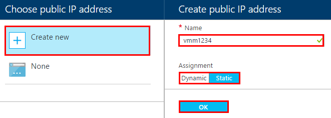

.. note:: We are setting a static public IP address for the management VM. When an Azure VM is stopped (deallocated), it will lose a dynamic public IP address. Since the tutorial is implying that the management VM can be stopped (deallocated) when it isn't in use and because we wish to use the same Remote Desktop Connection (RDP) settings file across management sessions, it's best to set a static public IP for this VM. If you prefer to leave the management VM with a dynamic public IP, then you will need to get a new Remote Desktop Connection (RDP) settings file from the **Azure Portal** each time you redeploy the VM in the **Azure Portal**. Note that there are pricing implications for assigning static public IP addresses. See the *Reserved IP pricing* section of `IP Address pricing <https://azure.microsoft.com/en-us/pricing/details/ip-addresses/>`_.
 
**Summary** blade: Click **OK** on the **Summary** blade to provision the VM.

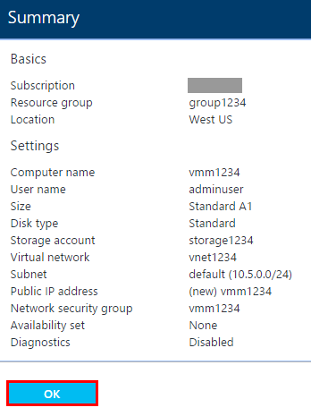
 
Wait for the deployment to complete. The **Azure Portal** will display the **Virtual machine** blade when the deployment is complete. Click the **Connect** button to download the Remote Desktop Connection (RDP) settings file so that you can login to the management VM later.

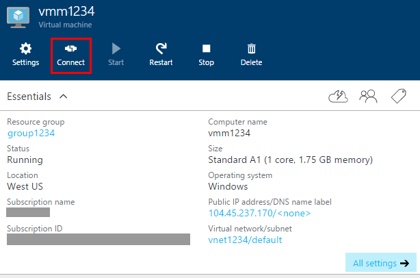
 
Create a Microsoft Azure Nano Server VM
---------------------------------------
1. In the **Azure Portal**, click the button for **Virtual machines**.

.. image:: nano-server/_static/nano-setup-01.png
 
2. Click the **Add** button.

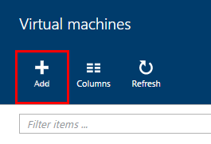
 
3. In the **Recommended** section, click the **Windows Server** button.

.. image:: nano-server/_static/nano-setup-03.png
 
4. Select **Windows Server 2016 Nano Technical Preview 4** from the list. Be careful **not** to accidently select the full **Windows Server 2016 Technical Preview 4** image immediately below the Nano Server image.

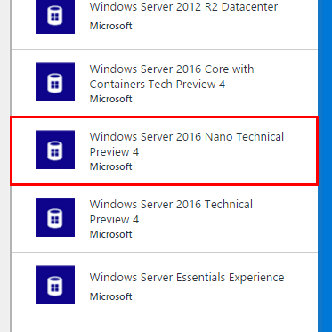
 
5. Set the **Select a deployment model** drop-down to **Resource Manager** and click the **Create** button.

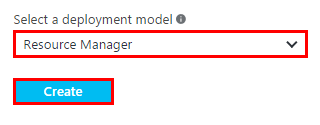
 
6. Next, we will configure the Nano Server.

**Basics** blade: Provide a **Name**, **User name**, **Password**, **Subscription**, and **Resource Group**. Click **OK** to proceed to the **Size** blade.

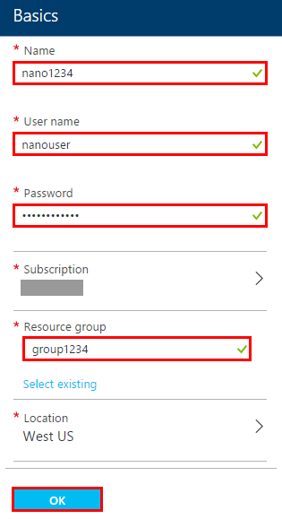
 
**Size** blade: Select a VM size. Click **View All** to see all of the available VM sizes. For this tutorial, we will use an **A1 Standard VM**. Select the VM size and click the **Select** button.

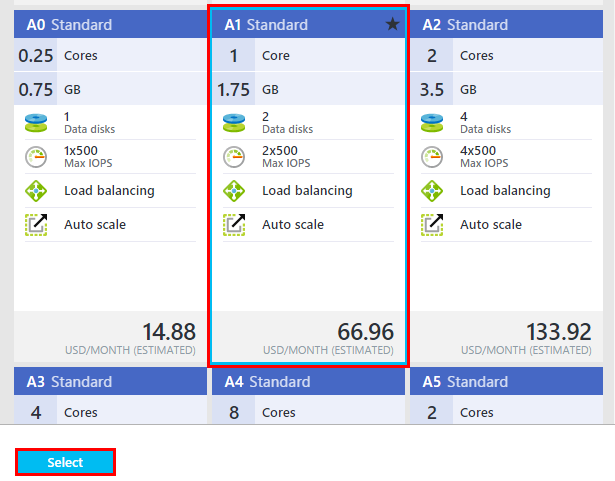
 
**Storage** blade: For the **Disk type**, we will accept the default **Standard**. Use the storage account and VNet we created earlier. We will accept the dynamic public IP address, since we have no intention of ever using Remote Desktop Connection with our Nano Server or have any other need for a static public IP address.

The **Azure Portal** will default to a new **Network security group**, but we want to select the one we created earlier for the Nano Server. For the tutorial, this is the *nano1234* NSG. We will leave the **Availability set** on the default **None** value. Click the **OK** button to see the **Summary** blade.

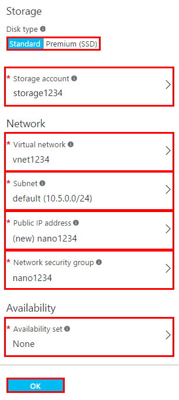
 
**Summary** blade: Click **OK** on the **Summary** blade to provision the VM.

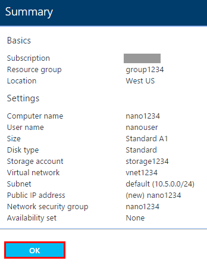
 
Wait for the deployment to complete. The **Azure Portal** will display the **Virtual machine** properties blade when the deployment is complete.

.. note:: In spite of the presence of a functioning **Connect** button that will download a Remote Desktop Connection (RDP) settings file, keep in mind that Nano Server is not capable of using RDP. Any attempt to connect to a Nano Server with RDP will fail.

7. Let's give our Nano Server a DNS name label. In the **Virtual machine** blade, click on the Public IP address.

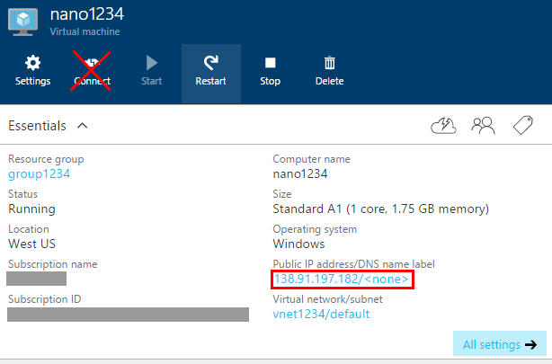
 
8. The **Public IP address** blade and its **Settings** blade will appear. Click on the **Configuration** button in the **Settings** blade.

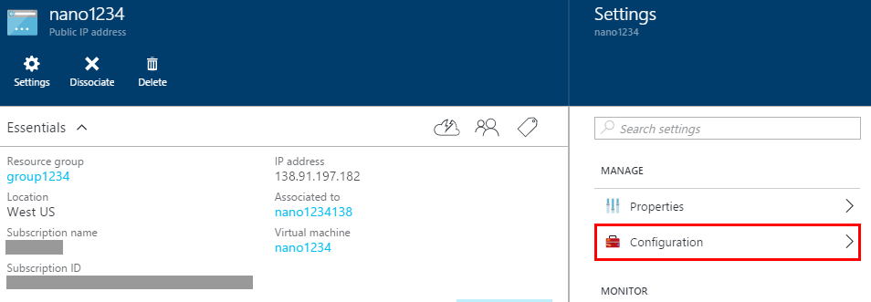
 
9. Enter a **DNS name label** and click the **Save** button at the top of the blade. For the tutorial VM, we will use the name of the VM itself, *nano1234*.

.. image:: nano-server/_static/nano-setup-12.png
 
Mount the Azure Files share locally
-----------------------------------
This tutorial will use a network file share to move files between our Nano Server and our local client computer. We've already created the Azure Files container that we need when we created our Azure Storage account earlier. We need to mount the container locally and on the Nano Server.

1. To mount the file share locally, open a **File Explorer** window and click the **Map network drive** button.

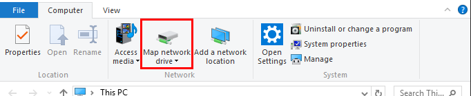
 
2. Select a **Drive** letter and provide the share in UNC format (*\\\\server\\container*) in the **Folder** field. The tutorial share uses the storage account *storage1234*, but you should substitute your storage account name for *storage1234*. Our tutorial share will connect to *\\\\storage1234.file.core.windows.net\\data*. Check the box for **Connect using different credentials**.

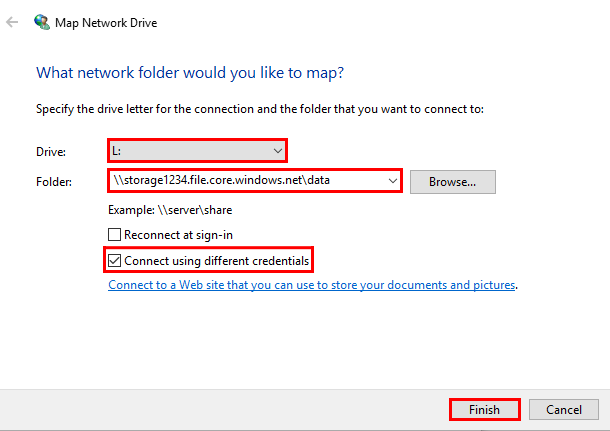
 
.. note:: We are not persisting our credentials for the share across reboots of the client computer in this tutorial. If you would like to persist the credentials with ``cmdkey`` so that the share is persisted across reboots, check the box for **Reconnect at sign-in** and see `Persisting connections to Microsoft Azure Files <http://blogs.msdn.com/b/windowsazurestorage/archive/2014/05/27/persisting-connections-to-microsoft-azure-files.aspx>`_ for instructions on the use of the ``cmdkey`` to persist the credentials.

3. Enter network credentials for the share. The **Username** is the name of the storage account, *storage1234* for the tutorial. Use the name of your storage account in this field. The **Password** is the storage account key. Copy the key from the **Azure Portal** into the **Password** field. Click the **OK** button to connect.

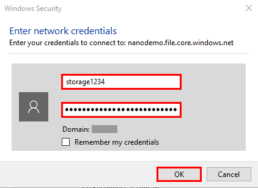
 
When the connection is successful, Windows will immediately open a window to the share, which will be empty. We can now drag-and-drop or copy files via PowerShell into the share locally.

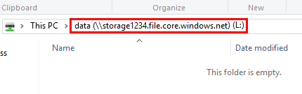
 
Access the Nano Server and mount the Azure Files share
------------------------------------------------------

1. Earlier, we downloaded the Remote Desktop Connection (RDP) settings file for the management VM. Open the connection to the server by double-clicking the file. When you open the connection, you will be greeted by the Windows Security window. Click on **Use another account**, and provide the username ("adminuser" for the tutorial) and the password you created for the management VM.

.. warning:: Although there is a convenient **Remember my credentials** checkbox available, **never** check this box to store credentials on the client machine, as there is a significant security risk in doing so.

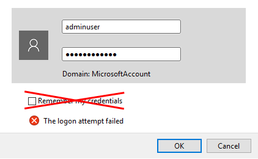

2. Run the PowerShell ISE application on the management VM as an Administrator. Right-click its icon and select **Run as administrator** from the pop-up menu.

3. Add the Nano Server DNS name label to your local Trusted Hosts on the management VM. In the tutorial, we use *nano1234*. You should use the DNS address label for your Nano Server.

.. code-block:: none

  Set-Item WSMan:\\localhost\\Client\\TrustedHosts "<NANO_SERVER_DNS_NAME_LABEL>"

For the tutorial naming, we will use the following command.

.. code-block:: none

  Set-Item WSMan:\\localhost\\Client\\TrustedHosts "nano1234"

Grant WinRM security configuration by clicking **Yes** in the pop-up window.

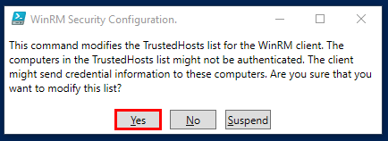
 
.. note:: If you receive an exception when attempting to add the Nano Server to the Trusted Hosts list, confirm that your WinRM service is running in Windows OS Services.
 
4. Open a remote PowerShell session to your Nano Server using **File > New Remote PowerShell Tab...** command in the **File** menu.

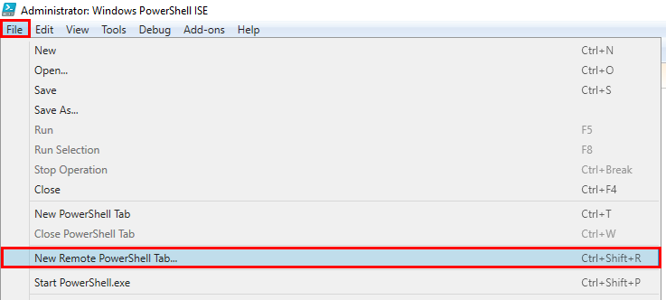

Provide the Nano Server DNS name in the **Computer** field and the VM Administrator account username in the **User name** field. Click the **Connect** button.
 
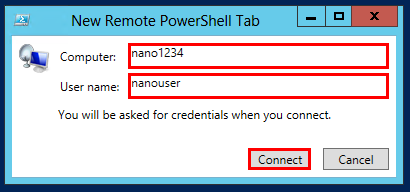

Provide your Nano Server VM Administrator account password in the **Password** field and click **OK** to connect. It will take several seconds to make the connection.
 
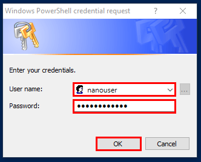

When the remote session opens, you will find yourself in the *Documents* folder of the Administrator's account on your Nano Server in a new PowerShell tab. We'll refer to henceforth in the tutorial to this PowerShell tab as the "**remote** PowerShell tab."
 
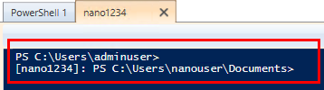
 
5. Execute the share drive mapping command in your **remote** PowerShell tab.

.. code-block:: none

  net use <DRIVE_LETTER>: \\<STORAGE_ACCOUNT>.file.core.windows.net\<CONTAINER> <STORAGE_ACCOUNT_KEY> /user:<STORAGE_ACCOUNT> /persistent:no

For the tutorial naming, we will use the following command.

.. code-block:: none

  net use s: \\storage1234.file.core.windows.net\data Tg3dg...d7w= /user:storage1234 /persistent:no

PowerShell will respond with **The command completed successfully** on success. We now have access to the share on the Nano Server.

Install Nano Server packages
----------------------------
In this section, we will install the IIS and Reverse Forwarders packages on the Nano Server.

1. Create a text file named *unattend.xml* on your client computer with the following contents.

.. code-block:: xml

  <?xml version="1.0" encoding="utf-8"?>
  <unattend xmlns="urn:schemas-microsoft-com:unattend">
    <servicing>
      <package action="install">
        <assemblyIdentity name="Microsoft-NanoServer-IIS-Package" version="10.0.10586.0" processorArchitecture="amd64" publicKeyToken="31bf3856ad364e35" language="neutral" />
        <source location="c:\packages\Microsoft-NanoServer-IIS-Package.cab" />
      </package>
      <package action="install">
        <assemblyIdentity name="Microsoft-NanoServer-IIS-Package" version="10.0.10586.0" processorArchitecture="amd64" publicKeyToken="31bf3856ad364e35" language="en-US" />
        <source location="c:\packages\en-us\Microsoft-NanoServer-IIS-Package.cab" />
      </package>
    </servicing>
    <cpi:offlineImage cpi:source="" xmlns:cpi="urn:schemas-microsoft-com:cpi" />
  </unattend>

Be sure to save the file in XML format with an *.xml* file extension. You can save the *unattend.xml* file directly to the share. Be careful when saving the file from a text editor, such as NotePad. When you have extensions for known file types hidden in your local operating system, an XML file may appear in directories as some-file.xml but will actually be known as some-file.xml.txt to the OS. The file's actual extension will show correctly in your PowerShell session tabs and in the file's properties.

2. Copy the *unattend.xml* file to the Nano Server *Documents* directory in your **remote** PowerShell tab.

.. code-block:: none

  cp <DRIVE_LETTER>:\unattend.xml c:\Users\<Username>\Documents

For the tutorial Nano Server, we will use the following command.

.. code-block:: none

  cp s:\unattend.xml c:\Users\nanouser\Documents

3. Run the following command from the *Documents* directory in your **remote** PowerShell tab to install the IIS packages.

.. code-block:: none

  dism /online /apply-unattend:.\unattend.xml

You will receive a ``0x80004005 error ("DISM failed. No operation was performed")`` exception, but you can safely ignore this message.

4. Install the Reverse Forwarders packages by running the following commands one at a time.

.. code-block:: none

  dism /online /add-package /packagepath:c:\packages\Microsoft-OneCore-ReverseForwarders-Package.cab

  dism /online /add-package /packagepath:c:\packages\en-us\Microsoft-OneCore-ReverseForwarders-Package.cab

.. note:: Do not attempt to add the Reverse Forwarders packages to the *unattend.xml* file above for installation. These commands should be run after the *unattend.xml* file is run for a successful install of the Reverse Forwarders packages.

.. note:: Reverse Forwarders provide shims for Win API calls to earlier libraries and new OneCore libraries allowing the calls to succeed without recompiling and linking for the new libraries. The Reverse Forwarders packages are currently required for ``libuv``, which is a key library supporting the Kestrel server of ASP.NET 5. For more information, see `Moving to Nano Server, the new deployment option in Windows Server 2016 <http://blogs.technet.com/b/windowsserver/archive/2015/11/16/moving-to-nano-server-the-new-deployment-option-in-windows-server-2016.aspx#Reverse%20Forwarders>`_.

.. note:: You can navigate to the *c:\\Packages* folder on your Nano Server to see other installable packages. Notable packages include Containers, Defender, DNS, Failover, OEM Drivers, Storage, and SCVMM.

5. Confirm that the IIS and Reverse Forwarders packages and their associated language packs are installed correctly with the following command.

.. code-block:: none

  dism /online /get-packages

Among the packages listed, you should see the following packages.

* **Feature Package**: Microsoft-NanoServer-IIS-Package
* **Language Package**: Microsoft-NanoServer-IIS-Package
* **Feature Package**: Microsoft-OneCore-ReverseForwarders
* **Language Package**: Microsoft-OneCore-ReverseForwarders

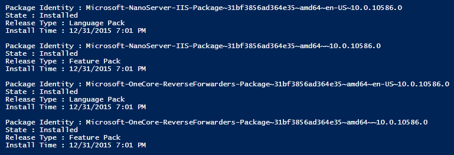
 
.. note::The install of the IIS packages will automatically open ports 80 and 443 in the Nano Server's firewall.

6. Manually create a pair of compressed files folders for our applications' application pools. The *Default Web Site* uses the *DefaultAppPool*. The .NET 5 application we will create in this tutorial will be called *aspnet5*, and we'll use an AppPool by the same name. Run the following two commands in your **remote** PowerShell tab to create the folders we need for caching compressed static content on the Nano Server.

.. code-block:: none

  mkdir "C:\inetpub\temp\IIS Temporary Compressed Files\DefaultAppPool"

  mkdir "C:\inetpub\temp\IIS Temporary Compressed Files\aspnet5"

7. Start the W3SVC service with the following command.

.. code-block:: none

  net start w3svc

The VM will respond with the following output.

.. code-block:: none

  The World Wide Web Publishing Service service is starting.
  The World Wide Web Publishing Service service was started successfully.

8. Confirm that IIS is serving requests by visiting the *Default Web Site* in a browser. The IIS start page should be returned. You can access the website at either the Nano Server's public IP address or at its Fully Qualified Domain Name (FQDN).

.. code-block:: none

  http://<NANO_SERVER_VM_PUBLIC_IP_ADDRESS>

  http://<NANO_SERVER_DNS_NAME_LABEL>.<DATACENTER>.cloudapp.azure.com

The tutorial *Default Web Site* will be returned at the following addresses.

.. code-block:: none

  http://138.91.197.182

  http://nano1234.westus.cloudapp.azure.com

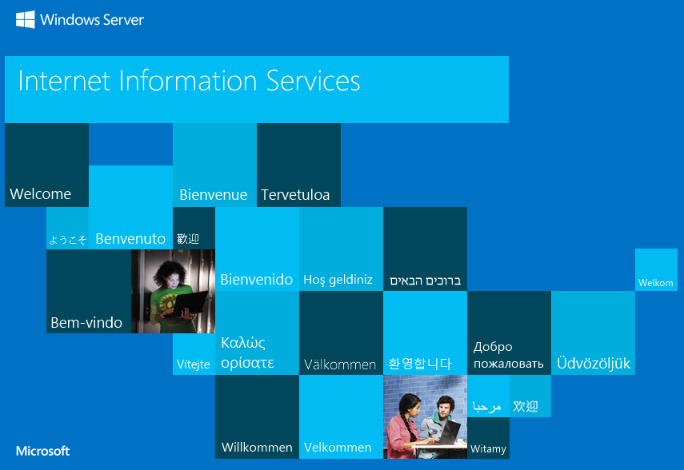
 
9. Delete the *unattend.xml* file from the *Documents* directory with the following command.

.. code-block:: none

  Remove-Item unattend.xml

.. tip:: The commands ``rm`` and ``del`` also work for deleting files and folders in PowerShell. For folders, use the ``-r`` (``-Recurse``) switch to recursively remove sub-files and sub-folders. The command ``del unattend.xml`` is equivalent to the ``Remove-Item`` command above.

Install the HttpPlatformHandler
-------------------------------
The *HttpPlatformHandler.dll* on Windows normally resides at *%windir%\\System32\\inetsrv\\httpPlatformHandler.dll*. If you've previously installed the 64-bit version of the HttpPlatformHandler locally, you may use this filepath to move the DLL to your Nano Server. If you have not installed the module, you may obtain the 64-bit version at `http://go.microsoft.com/fwlink/?LinkID=690721 <http://go.microsoft.com/fwlink/?LinkID=690721>`_.

.. note:: You should only move the 64-bit version of the HttpPlatformHandler to Nano Server, as 32-bit support (WOW64) is not available on Nano Server.

.. note:: Installation of the HttpPlatformHandler is a manual operation at this time. An installer for the module will be provided in the future.

1. Copy the *HttpPlatformHandler.dll* and its schema file from your local system to the share. Not all local installs of the HttpPlatformHandler install the schema file. Check your local system to determine if the schema file is present by opening *c:\\Windows\\System32\\inetsrv\\config\\schema* and looking for a file named *httpplatform_schema.xml*. If the file is not present, create it in a text editor with the following contents.

.. code-block:: xml

  <!--
    IIS Http Platform Handler Schema
    
    ** Please DO NOT edit this file yourself. **
    
    If you want to add configuration sections to the schema, you may place 
    them in *XML* files similar to this one, in this directory. They will be 
    picked up automatically on startup.
  -->
  <configSchema>
    <sectionSchema name="system.webServer/httpPlatform">
      <attribute name="processPath" type="string" expanded="true"/>
      <attribute name="arguments" type="string" expanded="true" defaultValue=""/>
      <attribute name="startupTimeLimit" type="uint" defaultValue="120" validationType="integerRange" validationParameter="0,3600"/> <!-- in seconds -->
      <attribute name="startupRetryCount" type="uint" defaultValue="10" validationType="integerRange" validationParameter="0,100"/>
      <attribute name="rapidFailsPerMinute" type="uint" defaultValue="10" validationType="integerRange" validationParameter="0,100"/>
      <attribute name="requestTimeout" type="timeSpan" defaultValue="00:02:00" validationType="timeSpanRange" validationParameter="0,2592000,60"/>
      <attribute name="stdoutLogEnabled" type="bool" defaultValue="false" />
      <attribute name="stdoutLogFile" type="string" defaultValue=".\httpplatform-stdout" expanded="true"/>
      <attribute name="processesPerApplication" type="uint" defaultValue="1" validationType="integerRange" validationParameter="1,100"/>
      <attribute name="forwardWindowsAuthToken" type="bool" defaultValue="false" />
      <element name="recycleOnFileChange">
        <collection addElement="file" clearElement="clear">
          <attribute name="path" type="string" required="true" validationType="nonEmptyString" expanded="true"/>
        </collection>
      </element>
      <element name="environmentVariables">
        <collection addElement="environmentVariable" clearElement="clear" >
          <attribute name="name" type="string" required="true" validationType="nonEmptyString"/>
          <attribute name="value" type="string" required="true"/>
        </collection>
      </element>
    </sectionSchema>
  </configSchema>

Be sure to save the file in XML format with an *.xml* file extension. Be careful when saving the file from a text editor, such as NotePad. When you have extensions for known file types hidden in your local operating system, an XML file may appear in directories as *some-file.xml* but will actually be known as *some-file.xml.txt* to the OS. The file's actual extension will show correctly in your PowerShell session tabs and in the file's properties.

Drag-and-drop the the module DLL and the schema file to the share on your local client computer.

2. Copy the *HttpPlatformHandler.dll* and *httpplatform_schema.xml* schema file into the *inetserv* and *inetserv\\config\\schema* directories in your **remote** PowerShell tab on the management VM.

.. code-block:: none

  cp <DRIVE_LETTER>:\httpPlatformHandler.dll c:\Windows\System32\inetsrv

  cp <DRIVE_LETTER>:\httpplatform_schema.xml c:\Windows\System32\inetsrv\config\schema

For the tutorial Nano Server, we will use the following commands.

.. code-block:: none

  cp s:\httpPlatformHandler.dll c:\Windows\System32\inetsrv

  cp s:\httpplatform_schema.xml c:\Windows\System32\inetsrv\config\schema

3. **RESTART the Nano Server VM**. In your **remote** PowerShell tab, close the session with the following command.

.. code-block:: none

  Exit-PSSession

Close the **remote** PowerShell tab. We will open a new tab in a moment after the VM restarts.

In the **Azure Portal**, click the **Restart** button on the Nano Server **Virtual machine** blade. Wait for the Nano Server to restart. Reconnect to the VM in PowerShell by selecting **File > New Remote PowerShell Tab...** and providing your credentials for the Nano Server VM Administrator account. Wait for a few seconds while the session is established by PowerShell ISE. Re-attach the share with the following command.

.. code-block:: none

  net use <DRIVE_LETTER>: \\<STORAGE_ACCOUNT>.file.core.windows.net\<CONTAINER> <STORAGE_ACCOUNT_KEY> /user:<STORAGE_ACCOUNT> /persistent:no

For the tutorial naming, we will use the following command.

.. code-block:: none

  net use s: \\storage1234.file.core.windows.net\data Tg3dg...d7w= /user:storage1234 /persistent:no

4. Backup the *applicationHost.config* file using the following command in your **remote** PowerShell tab.

.. code-block:: none

  cp c:\Windows\System32\inetsrv\config\applicationHost.config <DRIVE_LETTER>:\

For the tutorial Nano Server, we will use the following command.

.. code-block:: none

  cp c:\Windows\System32\inetsrv\config\applicationHost.config s:

5. Install the *IISAdministration* module in the **remote** PowerShell tab. The *IISAdministration* module provides commands for working with IIS in a PowerShell session. For more information, see `IIS Administration Cmdlets <https://technet.microsoft.com/en-us/library/mt270166.aspx>`_.

.. code-block:: none

  Import-Module IISAdministration

6. Update the *applicationHost.config* file on the Nano Server VM to provide IIS with access to the module. Paste the following PowerShell script into the script area of the **remote** PowerShell tab:

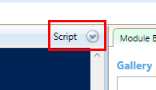

.. code-block:: powershell

  $sm = Get-IISServerManager
  # Add AppSettings section (for Asp.Net5)
  $sm.GetApplicationHostConfiguration().RootSectionGroup.Sections.Add("appSettings")
  # Unlock the handlers section
  $appHostconfig = $sm.GetApplicationHostConfiguration()
  $section = $appHostconfig.GetSection("system.webServer/handlers")
  $section.OverrideMode="Allow"
  # Add httpPlatform section to system.webServer
  $sectionHttpPlatform = $appHostConfig.RootSectionGroup.SectionGroups["system.webServer"].Sections.Add("httpPlatform")
  $sectionHttpPlatform.OverrideModeDefault = "Allow"
  # Add to globalModules
  $globalModules = Get-IISConfigSection "system.webServer/globalModules" | Get-IISConfigCollection
  New-IISConfigCollectionElement $globalModules -ConfigAttribute @{"name"="httpPlatformHandler";"image"="%SystemRoot%\system32\inetsrv\httpPlatformHandler.dll"}
  # Add to modules
  $modules = Get-IISConfigSection "system.webServer/modules" | Get-IISConfigCollection
  New-IISConfigCollectionElement $modules -ConfigAttribute @{"name"="httpPlatformHandler"}
  # Commit Changes
  $sm.CommitChanges()

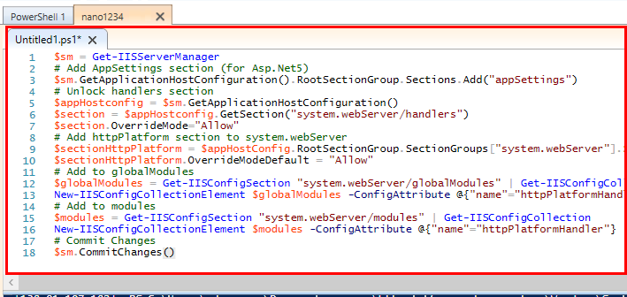
 
Click the **Run** button to execute the commands.

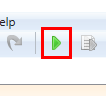
 
Close the script tab without saving. We will never want to run this script again on this VM, as the *applicationHost.config* file only requires these updates once in order to use the HttpPlatformHandler module in IIS.

 
.. warning:: **Do not** run this script multiple times. If you execute commands in this script multiple times, you will add elements more than once, and the *applicationHost.config* file will become corrupt and break IIS. If the file is corrupted by accident: (1) Restore the file from the known-good version previously saved to the share, (2) Run this script once on the restored *applicationHost.config* file, and (3) Close the script tab and do not save the script.

.. note:: When an installer is created for the HttpPlatformHandler for Nano Server, the manual modifications we just made to the *applicationHost.config* file will be executed automatically by the installer.

Deploy an ASP.NET 5 Core CLR app
--------------------------------
Web Deploy will eventually be supported for Nano Server, and XCopy should work now. A custom PowerShell script is also an option for moving projects to your Nano Server. This tutorial will simply rely upon copying the project to the VM using the share we have created.

1. Create or obtain an ASP.NET 5 Core CLR x64 project.

.. note:: Nano Server does not support .NET Framework or 32-bit (``clr``) projects. The project must depend on a 64-bit Core CLR runtime and packages.

2. Move your ASP.NET 5 project to the share. Drag-and-drop your published output folder to the share on your local client computer. Because even a small .NET 5 project will be over 100MB, this might take several minutes to complete on a slow Internet connection. Wait for the project copy operation to complete before proceeding.

3. Copy the project from the share to the Nano Server using the ``cp`` command with ``-r`` (``-Recurse``) in your **remote** PowerShell tab. We will place the application at the root of the *c:* drive.

.. code-block:: none

  cp <DRIVE_LETTER>:\<OUTPUT_FOLDER> c:\<PATH_TO_WHERE_APPLICATION_WILL_RESIDE_ON_NANO_SERVER> -r

For the tutorial application, we will use the following command.

.. code-block:: none

  cp s:\output c:\ -r

4. Configure the website Application Pool (AppPool) by executing the following commands. You can paste these commands into a PowerShell **Script** tab in the **remote** PowerShell tab and run them with the **Run** button, or you can execute the commands at the PowerShell command line prompt in the **remote** PowerShell tab.

.. code-block:: powershell

  $sm.ApplicationPools.Add("<IIS_WEBSITE_NAME>")
  $sm.CommitChanges()

For the tutorial application, we will use the following commands.

.. code-block:: powershell

  $sm.ApplicationPools.Add("aspnet5")
  $sm.CommitChanges()

5. Start the AppPool.

.. code-block:: powershell

  $ap = Get-IISAppPool -Name "<IIS_WEBSITE_NAME>"
  $ap.Start()

For the tutorial AppPool, we will use the following commands.

.. code-block:: powershell

  $ap = Get-IISAppPool -Name "aspnet5"
  $ap.Start()

Confirm the AppPool is running with the following command.

.. code-block:: powershell

  $sm.ApplicationPools

6. Create an IIS website on port 8000 and assign the AppPool we created for it.

.. code-block:: powershell

  Start-IISCommitDelay
  $mysite = New-IISSite -Name "<IIS_WEBSITE_NAME>" -BindingInformation "*:8000:" -PhysicalPath "<PATH_TO_WHERE_APPLICATION_WILL_RESIDE_ON_NANO_SERVER>\wwwroot" -Passthru
  $mysite.Applications["/"].ApplicationPoolName = "<IIS_WEBSITE_NAME>"
  Stop-IISCommitDelay

For the tutorial Nano Server application, we will use the following commands.

.. code-block:: powershell

  Start-IISCommitDelay
  $mysite = New-IISSite -Name "aspnet5" -BindingInformation "*:8000:" -PhysicalPath "c:\output\wwwroot" -Passthru
  $mysite.Applications["/"].ApplicationPoolName = "aspnet5"
  Stop-IISCommitDelay

7. Open port 8000 on the firewall.

.. code-block:: powershell

  New-NetFirewallRule -Name "<IIS_WEBSITE_NAME>" -DisplayName "HTTP on TCP/8000" -Protocol tcp -LocalPort 8000 -Action Allow -Enabled True

For the tutorial Nano Server IIS, we will use the following command.

.. code-block:: powershell

  New-NetFirewallRule -Name "aspnet5" -DisplayName "HTTP on TCP/8000" -Protocol tcp -LocalPort 8000 -Action Allow -Enabled True

8. Confirm the application is available by opening an Internet browser and navigating to the following addresses.

.. code-block:: none

  http://<NANO_SERVER_VM_PUBLIC_IP_ADDRESS>:8000

  http://<NANO_SERVER_DNS_NAME_LABEL>.<DATACENTER>.cloudapp.azure.com:8000

For the tutorial Nano Server, the following addresses will return the IIS Start Page.

.. code-block:: none

  http://138.91.197.182:8000

  http://nano1234.westus.cloudapp.azure.com:8000

 

 
Congratulations & Enjoy!

.. note:: The public IP address of the Nano Server is dynamically allocated by Azure. It will remain stable as long as the Nano Server isn't stopped (deallocated) and restarted (allocated) in the **Azure Portal**. Since we gave the Nano Server a stable DNS address label, we will always be able to reach it via the FQDN (i.e., the *azure.com* address) no matter what public IP address Azure allocates to the VM across re-deployments of the VM. If you would prefer a static public IP address for your Nano Server, configure it at any time in the **Azure Portal** the same way we configured the static public IP address for the management VM.

Clean up
--------
1. Exit the PowerShell **remote** session with the following command.

.. code-block:: powershell

  Exit-PSSession

You may close the **remote** PowerShell tab.

2. Except for the known-good *applicationHost.config* file, remove other files and folders from the share, unless you plan to use the share during the creation of new IIS Nano Servers. If you have no further use of the share, you may delete it in the **Azure Portal**.

3. If your management VM will only be used intermittently, you can stop (deallocate) the management VM to save money. Note that storage space taken up by the VM will continue to accrue charges. See `Azure Pricing <https://azure.microsoft.com/en-us/pricing/>`_ for details.

Nano Server Management
----------------------
We will outline four sources of information that will help you manage your Nano Server deployments and troubleshoot issues with the VM, IIS, and your ASP.NET 5 applications. This is not an exhaustive set of management options. We will examine how the VM's events are available through a remote Server Manager, a remote Event Log, the IIS log files, and the HttpPlatformHandler log. For other management and troubleshooting options, see `Getting Started with Nano Server <https://technet.microsoft.com/en-us/library/mt126167.aspx>`_.

Connecting to a remote Server Manager
^^^^^^^^^^^^^^^^^^^^^^^^^^^^^^^^^^^^^
1. Login to your WS 2012 R2 management server.

2. If you haven't already done so, add the Nano Server DNS name label to the server's Trusted Hosts by executing the following command from an elevated PowerShell prompt.

.. code-block:: powershell

  Set-Item WSMan:\localhost\Client\TrustedHosts "<NANO_SERVER_DNS_NAME_LABEL>"

For our tutorial Nano Server, we will use the following command.

.. code-block:: powershell

  Set-Item WSMan:\localhost\Client\TrustedHosts "nano1234"

Agree to modify the Trusted Hosts list for the WinRM client by typing *y* (yes) and pressing *Enter* on your keyboard when the pop-up window appears.

3. Obtain the subnet address of the Nano Server from the **Azure Portal** on the **Virtual network** blade. The **IP ADDRESS** for the Nano Server will appear in the **Connected devices** area next to the **Network interface** connected to the Nano Server. For the tutorial Nano Server, the subnet address is *10.5.0.5*. Add the subnet address of the Nano Server to our management VM's *Hosts* file. Open *File Explorer* and paste the address of the hosts file into the address bar.

*C:\\Windows\\system32\\drivers\\etc\\hosts*

 
The OS will request how you would like to open the file. Select **Notepad** from the list.

 
Enter the Nano Server's subnet address and its DNS address label with at least one space in between. Save the file and close *File Explorer*. See the example below for the tutorial Nano Server. This addition to the file will take effect immediately, so there is no need to restart the server.

.. note:: The subnet address shown, *10.5.0.5*, is for the tutorial Nano Server. You must obtain the subnet address of your Nano Server in the **Azure Portal**.
 
4. Store the Nano Server's username and password on the management VM. You must run the following command from an elevated Windows command prompt or from an elevated PowerShell command prompt (not PowerShell ISE).

.. code-block:: none

  cmdkey /add:<NANO_SERVER_DNS_NAME_LABEL> /user:<NANO_SERVER_DNS_NAME_LABEL>\<USERNAME> /pass

For our tutorial Nano Server, we will use the following command.

.. code-block:: none

  cmdkey /add:nano1234 /user:nano1234\nanouser /pass

Type the password for the Nano Server Administrator account and press *Enter* on the keyboard. The server will respond **CMDKEY: Credential added successfully.**

 
5. We need to ensure several ports are open on the Nano Server to allow access by the Server Manager. Open a **remote** PowerShell tab to the Nano Server by selecting **File > New Remote PowerShell Tab...** and entering the credentials for the Nano Server's Administrator account.

The following ports must be open.

* Remote Service Management (NP-In)
* Remote Service Management (RPC)
* Remote Service Management (RPC-EPMAP)
* Remote Event Log Management (NP-In) 
* Remote Event Log Management (RPC)
* Remote Event Log Management (RPC-EPMAP)
* Windows Firewall Remote Management (RPC)
* Windows Firewall Remote Management (RPC-EPMAP)

You do not need to enable these firewall rules on the management server ... only on the Nano Server. You also do not need to be concerned about the Azure NSG's in place, because port traffic on the VNet between the management VM and the Nano Server VM is allowed by default via a default rule given to the VNet by Azure.

Execute the following commands in the **remote** PowerShell tab.

.. code-block:: powershell

  Enable-NetFirewallRule -DisplayName "Remote Service Management (NP-In)"
  Enable-NetFirewallRule -DisplayName "Remote Service Management (RPC)"
  Enable-NetFirewallRule -DisplayName "Remote Service Management (RPC-EPMAP)"
  Enable-NetFirewallRule -DisplayName "Remote Event Log Management (NP-In)"
  Enable-NetFirewallRule -DisplayName "Remote Event Log Management (RPC)"
  Enable-NetFirewallRule -DisplayName "Remote Event Log Management (RPC-EPMAP)"
  Enable-NetFirewallRule -DisplayName "Windows Firewall Remote Management (RPC)"
  Enable-NetFirewallRule -DisplayName "Windows Firewall Remote Management (RPC-EPMAP)"

For more information on Server Manager, see `Manage Multiple, Remote Servers with Server Manager <https://technet.microsoft.com/en-us/library/hh831456.aspx>`_.

6. Click the **Add other servers to manage** button in the Server Manager's **Dashboard**.

You can also add the Nano Server by selecting **Add Servers** in the **Manage** drop-down menu.
 

 
7. Click the **DNS** tab and provide the DNS name of the Nano Server VM in the **Search** field. Click the magnifying glass (search).

 
8. The Nano Server will appear with its subnet address. Click the button on the right to add the server.

 
9. Click the **OK** button to add the server to Server Manager.

 
10. This should connect your Nano Server to Server Manager on the management VM. Click **All Servers** and click on the Nano Server to see its **Events**, **Services**, and **Roles and Features**.

11. If you right-click the Nano Server and **Refresh** it in the pop-up menu, a red **Refresh failed** bar will appear. Click **More...** to see the refresh failures.

These exceptions are normal at this time for Nano Server. The first exception refers to the Best Practices Analyzer, which does not run on Nano Server at this time. The second exception refers to performance counter data, which is also not available on Nano Server at this time. It's safe to ignore these notifications.
 

Connecting to a remote Event Log
^^^^^^^^^^^^^^^^^^^^^^^^^^^^^^^^
1. Login to your WS 2012 R2 management server. 

2. If you haven't already done so, add the Nano Server DNS name label to the server's Trusted Hosts by executing the following command from an elevated PowerShell prompt.

.. code-block:: powershell

  Set-Item WSMan:\localhost\Client\TrustedHosts "<NANO_SERVER_ DNS_NAME_LABEL>"

Agree to modify the Trusted Hosts list for the WinRM client by typing *y* and pressing *Enter* on your keyboard.

3. We need to ensure several ports are open on the Nano Server to allow access by the remote Event Log. Open a **remote** PowerShell tab to the Nano Server by selecting **File > New Remote PowerShell Tab...** and entering the credentials for the Nano Server's Administrator account.

The following ports must be open.

* Windows Management Instrumentation (DCOM-In)
* Remote Event Log Management (RPC)
* Remote Event Log Management (RPC-EPMAP)
* Remote Event Log Management (NP-In)

You do not need to enable these firewall rules on the management server ... only on the Nano Server. You also do not need to be concerned about the Azure NSG's in place, because port traffic on the VNet between the management VM and the Nano Server VM is allowed by default via a default rule given to the VNet by Azure.

Execute the following commands in the **remote** PowerShell tab.

.. code-block:: powershell

  Enable-NetFirewallRule -DisplayName "Windows Management Instrumentation (DCOM-In)"
  Enable-NetFirewallRule -DisplayName "Remote Event Log Management (RPC)"
  Enable-NetFirewallRule -DisplayName "Remote Event Log Management (RPC-EPMAP)"
  Enable-NetFirewallRule -DisplayName "Remote Event Log Management (NP-In)"

4. Open the Event Viewer on the management server. From the **Action** menu, select **Connect to Another Computer...**.

 
5. In the **Select Computer** pop-up window, enter the Nano Server VM DNS name in the **Another computer** field. Click **OK** and wait for the Event Viewer to connect to the Nano Server and load its events.

 

 
Examining IIS log files
^^^^^^^^^^^^^^^^^^^^^^^
In a **remote** PowerShell tab, find the IIS log files by navigating to the following locations.

* **Failed Request Log Files**: *C:\\inetpub\\logs\\FailedReqLogFiles*
* **IIS Log File Folders**: *C:\\inetpub\\logs\\LogFiles*

HttpPlatformHandler log files
^^^^^^^^^^^^^^^^^^^^^^^^^^^^^
1. Check your application's ``httpPlatform`` element in the *web.config* file. It should specify that log files are enabled with a path to the *logs* folder. Note that you supply a prefix for the log file filenames; however, the HttpPlatformHandler will add a timestamp and the file extension for you.

.. code-block:: xml

  <httpPlatform 
    processPath="%DNX_PATH%"
    arguments="%DNX_ARGS%"
    stdoutLogEnabled="true" 
    stdoutLogFile="..\logs\httpplatform"
    startupTimeLimit="3600"/>

2. After you've made at least one successful request to the application, log files will be generated in the project's *logs* folder. Note how the timestamp and extension were added automatically.

 
Useful IIS PowerShell Commands
------------------------------
General Commands
^^^^^^^^^^^^^^^^
To set the physical path of the *Default Web Site* to something other than the default in *c:\\inetpub*, use the following commands.

.. code-block:: powershell

  $sm = Get-IISServerManager
  $mysite = $sm.Sites["Default Web Site"]
  $mysite.Applications[0].VirtualDirectories[0].PhysicalPath = "c:\output\wwwroot"
  $sm.CommitChanges()

To set the physical path of the Default Web Site back to the default location, use the following commands.

.. code-block:: powershell

  $mysite = $sm.Sites["Default Web Site"]
  $mysite.Applications[0].VirtualDirectories[0].PhysicalPath = "%SystemDrive%\inetpub\wwwroot"
  $sm.CommitChanges()

To get IIS Server Manager object information, use the following command.

.. code-block:: powershell

  $sm = Get-IISServerManager

To list websites, then application pools, use the following commands.

.. code-block:: powershell

  $sm.Sites
  $sm.ApplicationPools

To get an IIS website, then stop and start the site, use the following commands.

.. code-block:: powershell

  $mysite = $sm.Sites["<IIS_WEBSITE_NAME>"]
  $mysite.Stop()
  $mysite.Start()

To get the IIS Application Pools, use the following command.

.. code-block:: powershell

  Get-IISAppPool

To get a specific AppPool, then stop, start, and recycle it, use the following commands.

.. code-block:: powershell

  $ap = Get-IISAppPool -Name "<APPPOOL_NAME>"
  $ap.Stop()
  $ap.Start()
  $ap.Recycle()

To create a new website, use the following command.

.. code-block:: powershell

  New-IISSite -Name <IIS_WEBSITE_NAME> -BindingInformation "*:<PORT>:www.mydomain.com" -PhysicalPath <PATH_TO_PROJECT_WWWROOT_FOLDER>

Setting up for TLS app access
^^^^^^^^^^^^^^^^^^^^^^^^^^^^^
To install an SSL certificate on Nano Server and configure IIS website bindings, use the following commands.

First, install the certificate.

.. code-block:: none

  certoc.exe -ImportPFX -p <CERT_PFX_PASSWORD> My c:\mycert.pfx

Obtain the thumbprint of the certificate with the following command.

.. code-block:: powershell

  Get-ChildItem Cert:\LocalMachine\my

Use the thumbprint to create the website binding with the following commands.

.. code-block:: powershell

  $cert = Get-Item Cert:\LocalMachine\my\<THUMBPRINT>
  $hash = $cert.GetCertHash()
  $sm.Sites["<IIS_WEBSITE_NAME>"].Bindings.Add("*:443:", $hash, "My", "0")
  $sm.CommitChanges()

If you would like an SNI binding, use the following command.

.. code-block:: powershell

  $sm.Sites["<IIS_WEBSITE_NAME>"].Bindings.Add("*:443:www.mydomain.com", $hash, "My", "Sni")

Additional Resources
--------------------
* `ASP.NET 5 Publishing and Deployment <http://docs.asp.net/en/latest/publishing/>`_
* `Getting Started with Nano Server <https://technet.microsoft.com/en-us/library/mt126167.aspx>`_
* `Nano Server TechNet Blog <http://blogs.technet.com/b/nanoserver/>`_
* `The Nano Server Channel (Channel 9) <https://channel9.msdn.com/Series/Nano-Server-Team>`_
* `IIS on Nano Server <https://technet.microsoft.com/en-us/library/mt627783.aspx>`_
* `IIS Administration Cmdlets <https://technet.microsoft.com/en-us/library/mt270166.aspx>`_
* `Nano Server IaaS Image in the Azure Gallery <http://blogs.technet.com/b/nanoserver/archive/2015/11/19/nano-server-iaas-image-in-the-azure-gallery.aspx>`_ (TechNet Blogs, Nov. 24, 2015), Refaat Issa
* `IISAdministration PowerShell Cmdlets (New feature in Windows 10 / Server 2016) <http://blogs.iis.net/bariscaglar/iisadministration-powershell-cmdlets-new-feature-in-windows-10-server-2016>`_
* `Azure Resource Manager Cmdlets <https://msdn.microsoft.com/en-us/library/azure/mt125356.aspx>`_
* `Get-IISConfigSection <https://technet.microsoft.com/en-us/library/mt270159.aspx>`_
* `IIS and Nano Server <https://channel9.msdn.com/Events/ASPNET-Events/ASPNET-Fall-Sessions/IIS-and-Nano-Server>`_ (ASP.NET Fall Sessions, Nov. 3, 2015), David So, Principal Software Engineer
* `Nano Server: The Future of Windows Server Starts Now <https://channel9.msdn.com/Events/DEVintersection/DEVintersection-2015/Nano-Server-The-Future-of-Windows-Server-Starts-Now>`_ (DEVintersection, Oct. 27, 2015), Jeffrey Snover, Distinguished Engineer Microsoft and the Lead Architect for the Windows Server and System Center Division
* `Nano Server and Azure PowerShell <https://channel9.msdn.com/Series/Nano-Server-Team/Nano-Server-and-Azure-PowerShell>`_
* `PowerShell: Windows Server 2016 Technical Preview and Windows 10 <https://technet.microsoft.com/en-us/library/mt156917.aspx>`_
* `What is DISM? <https://technet.microsoft.com/en-us/library/hh825236.aspx>`_

Acknowledgements
----------------
* David So, Principal Software Engineer, `Microsoft Corporation <http://www.microsoft.com/>`_
* Pawel Kadluczka, Senior Software Development Engineer, `Microsoft Corporation <http://www.microsoft.com/>`_
* Ben A. Adams, CTO, `Illyriad Games <http://www.illyriad.co.uk/>`_

.. _issue: https://github.com/aspnet/Docs/issues/194
