Deploy an ASP.NET Core web app to Azure using Visual Studio
============================================================

By `Rick Anderson`_

.. contents:: Sections:
  :local:
  :depth: 1

Set up the development environment
^^^^^^^^^^^^^^^^^^^^^^^^^^^^^^^^^^^

- `Install the latest Azure SDK for Visual Studio 2015 <http://go.microsoft.com/fwlink/?linkid=518003>`__. The SDK installs Visual Studio 2015 if you don't already have it.

.. note:: The SDK installation can take more than 30 minutes if your machine doesn't have many of the dependencies.

- Install `.NET Core + Visual Studio tooling <http://go.microsoft.com/fwlink/?LinkID=798306>`__

- Verify your `Azure account <https://portal.azure.com/>`__. You can `open a free Azure account <https://azure.microsoft.com/pricing/free-trial/>`__ or `Activate Visual Studio subscriber benefits <https://azure.microsoft.com/pricing/member-offers/msdn-benefits-details/>`__.

Create a web app
^^^^^^^^^^^^^^^^^^^^^^^^^^^^^^^^^^^

From the Visual Studio **Start** page, tap **New Project**.

.. image:: first-mvc-app/start-mvc/_static/new_project.png

Alternatively, you can use the menus to create a new project. Tap **File > New > Project**.

.. image:: first-mvc-app/start-mvc/_static/alt_new_project.png

Complete the **New Project** dialog:

- In the left pane, tap **Web**
- In the center pane, tap **ASP.NET Core Web Application (.NET Core)**
- Tap **OK**

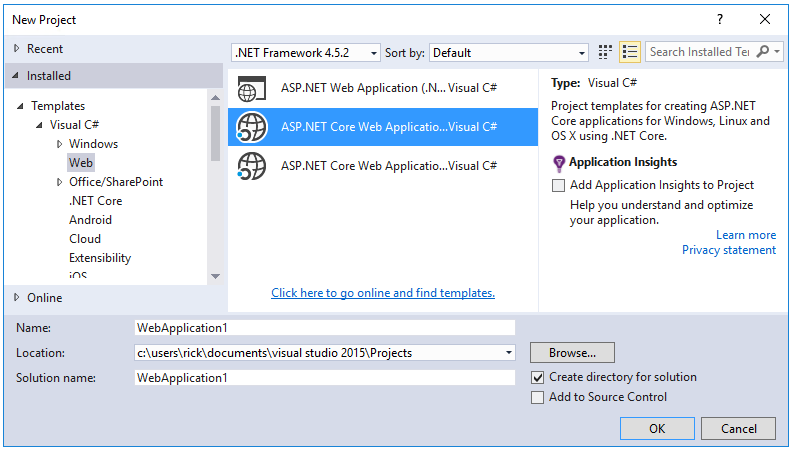

In the **New ASP.NET Core Web Application (.NET Core)** dialog:

- Tap **Web Application**
- Verify **Authentication** is set to **Individual User Accounts**
- Verify **Host in the cloud** is **not** checked
- Tap **OK**

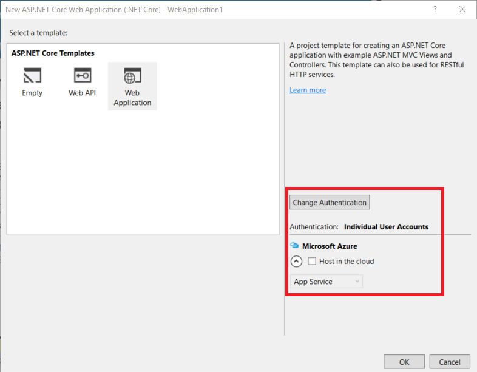

Test the app locally
^^^^^^^^^^^^^^^^^^^^^

- Use **Ctl-F5** to run the app
- Tap the **About** and **Contact** links. Depending on the size of your device, you might need to click the navigation icon to show the links

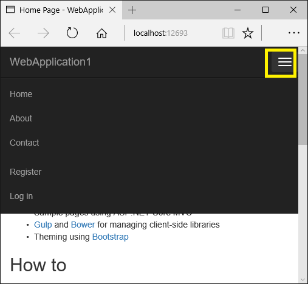

- Tap **Register** and register a new user. You can use a fictitious email. When you submit, you'll get the following error:

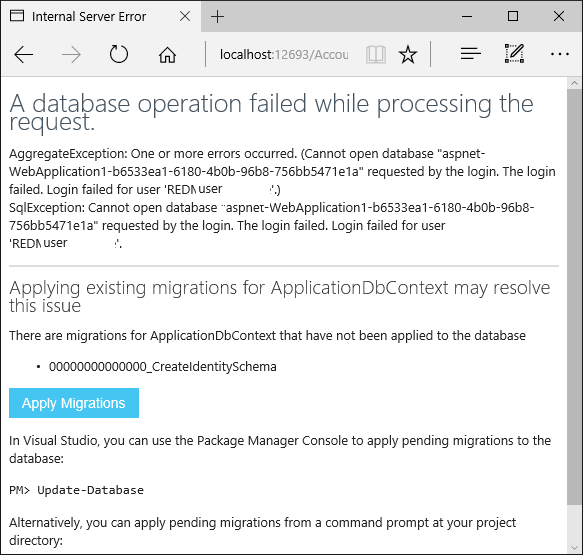

You can fix the problem two different ways:

- Tap **Apply Migrations** and when the page updates, refresh the screen
- Run the following from the command line in the project directory::

    dotnet ef database update

The app displays the email registration used to register and a **Log off** link.

.. image:: publish-to-azure-webapp-using-vs/_static/hello.png

Deploy the app to Azure
^^^^^^^^^^^^^^^^^^^^^^^^^^^^^^^^^^^

Right click on the project and select **Publish**

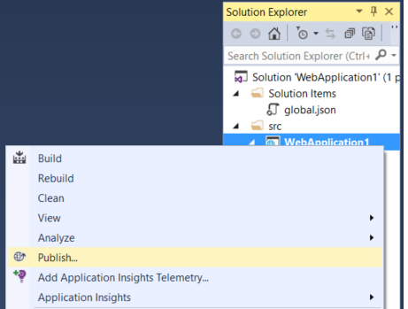

In the **Publish** dialog, tap **Microsoft Azure App Service**

.. image:: publish-to-azure-webapp-using-vs/_static/maas1.png

Tap **New** to enter a new resource group. Creating a new resource group will make it easy to delete all the Azure resources you create in this tutorial.

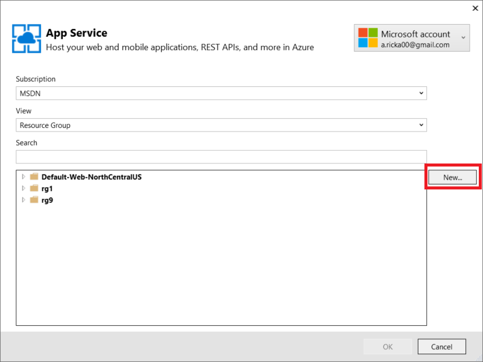

Create a new resource group and app service plan:

- Tap **New** for the resource group and enter a name for the new resource group
- Tap **New** for the  app service plan and select a location near you. You can keep the default generated name
- Tap **Explore additional Azure services** to create a new database

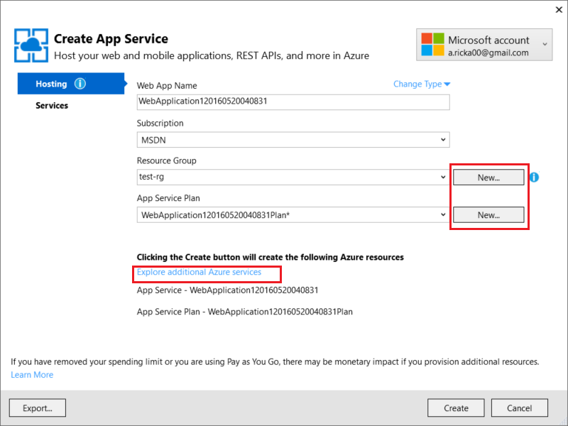

- Tap the green **+** icon to create a new SQL Database

.. image:: publish-to-azure-webapp-using-vs/_static/sql.png

- Tap  **New** on the **Configure SQL Database** dialog

.. image:: publish-to-azure-webapp-using-vs/_static/conf.png

- You can keep the default **Server Name**
- Enter an administrator user name and password, and then tap **OK**. Remember the user name and password.

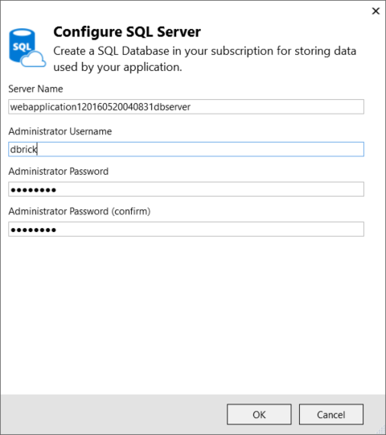

- Tap **OK** on the  **Configure SQL Database** dialog

- Tap **Create** on the **Create App Service** dialog

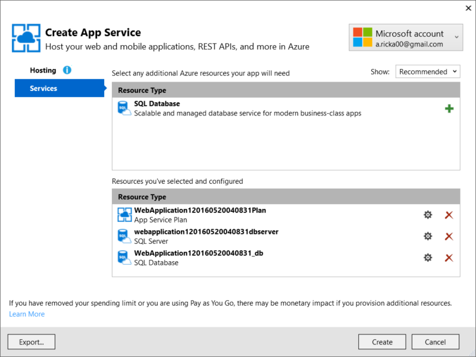

- Tap **Next** in the **Publish** dialog

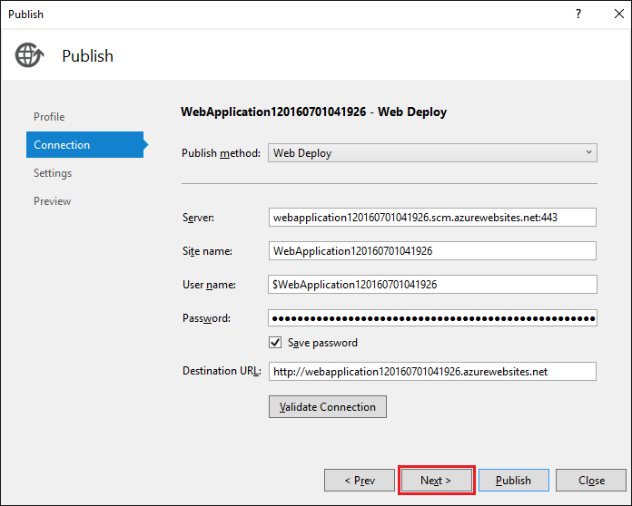

- On the **Settings** stage of the **Publish** dialog:

  - Check **Use this connection string at runtime**
  - Check **Apply this migration on publish**

  .. image:: publish-to-azure-webapp-using-vs/_static/pubs.png

- Tap **Publish**

Visual Studio will publish your app to Azure and launch the cloud app in your browser.

Test your app in Azure
-----------------------

- Test the **About** and **Contact** links
- Register a new user

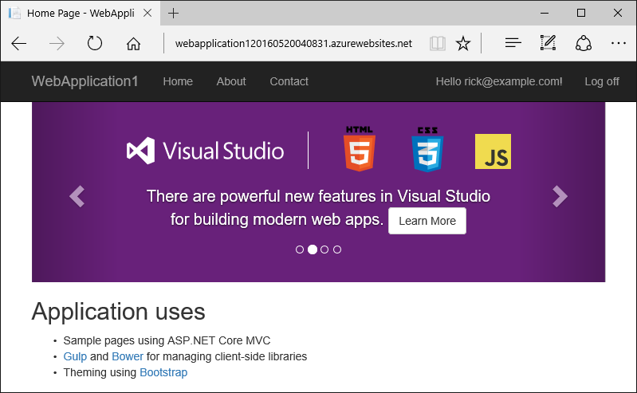

Update the app
--------------------

- Edit the *Views/Home/About.cshtml* Razor view file. Change the content, for example:

.. code-block:: html
  :emphasize-lines: 7

  @{
      ViewData["Title"] = "About";
  }
  <h2>@ViewData["Title"].</h2>
  <h3>@ViewData["Message"]</h3>

  
My updated about page.

- Right click on the project and select **Publish**

- Tap **Publish** and verify the changes you made are displayed on Azure

Clean up
--------------

When you have finished testing the app, log into the `Azure portal <https://portal.azure.com/>`__ and delete the app.

- Log into the `Azure portal <https://portal.azure.com/>`__
- In the left blade tap **Resource groups** and then tap the resource group you created

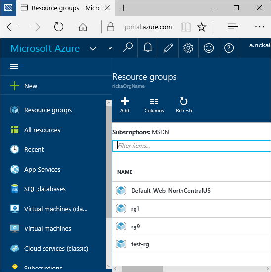

- In the **Resource group** blade tap **Delete**
- Enter the name of the resource group and tap **Delete**

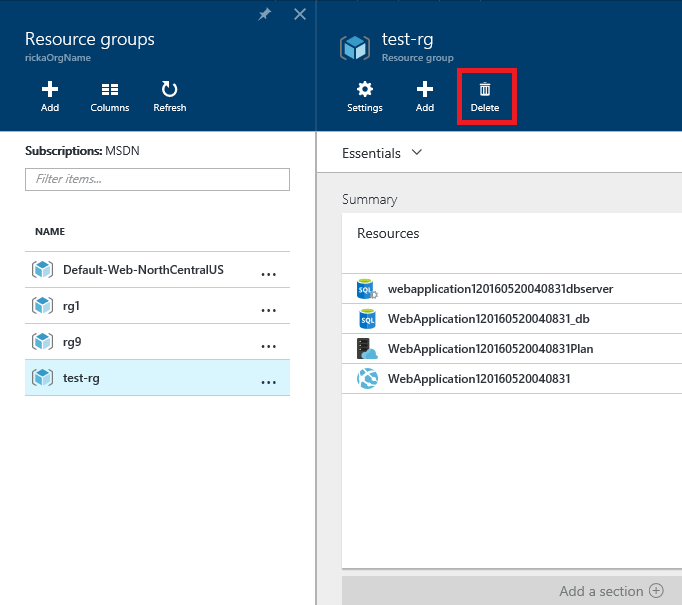

Next steps
-----------

- :doc:`/tutorials/first-mvc-app/start-mvc`
- :doc:`/intro`
- :doc:`/fundamentals/index`