Your First ASP.NET 5 Web App Using Visual Studio
================================================

By `Erik Reitan`_ 

In this tutorial, you’ll create a simple web app using ASP.NET 5. The app stores data in a SQL database using Entity Framework (EF) and uses ASP.NET MVC to support the basic CRUD operations (create, read, update, delete).  

.. contents:: In this article:
  :local:
  :depth: 1

Prerequisites
-------------
Before you start, make sure that you have the followed the getting started steps for :doc:`/getting-started/installing-on-windows`. This tutorial assumes you have already installed `Visual Studio 2015 <http://go.microsoft.com/fwlink/?LinkId=532606>`_ and the latest `ASP.NET 5  <http://go.microsoft.com/fwlink/?LinkId=627627>`_ runtime and tooling.

.. note:: For additional information about installing ASP.NET 5 on other platforms, see :doc:`/getting-started/index`.

Create a new ASP.NET 5 project
------------------------------

Start Visual Studio 2015. From the **File** menu, select **New** > **Project**. 

Select the **ASP.NET Web Application** project template. It appears under **Installed** > **Templates** > **Visual C#** > **Web**. Name the project ``ContosoBooks`` and click **OK**.

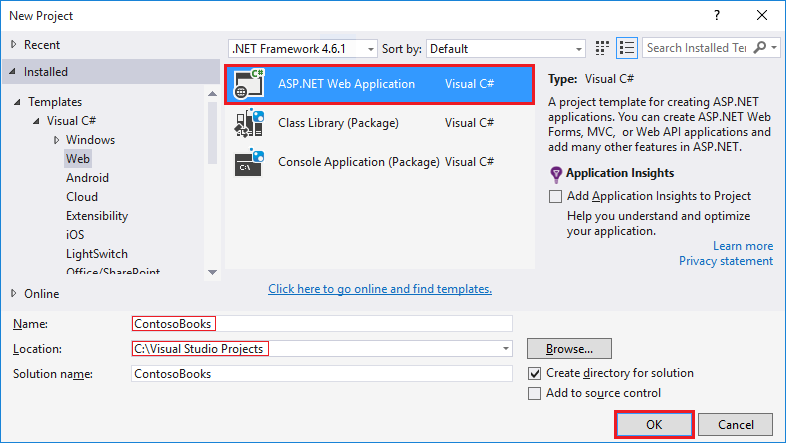

In the **New ASP.NET Project** dialog, select **Web Application** under **ASP.NET 5 Preview Templates**. Also, make sure the **Host in the cloud** checkbox is not selected and click **OK**.

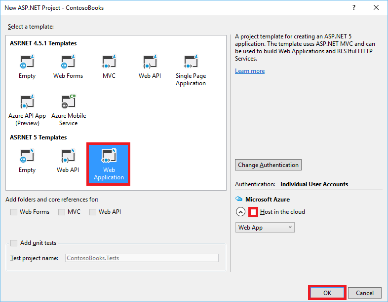

Running the default app
^^^^^^^^^^^^^^^^^^^^^^^

Once Visual Studio finishes creating the app, run the app by selecting **Debug** -> **Start Debugging**. As an alternative, you can press **F5**.

It may take time to initialize Visual Studio and the new app. Once it is complete, the browser will show the running app.				

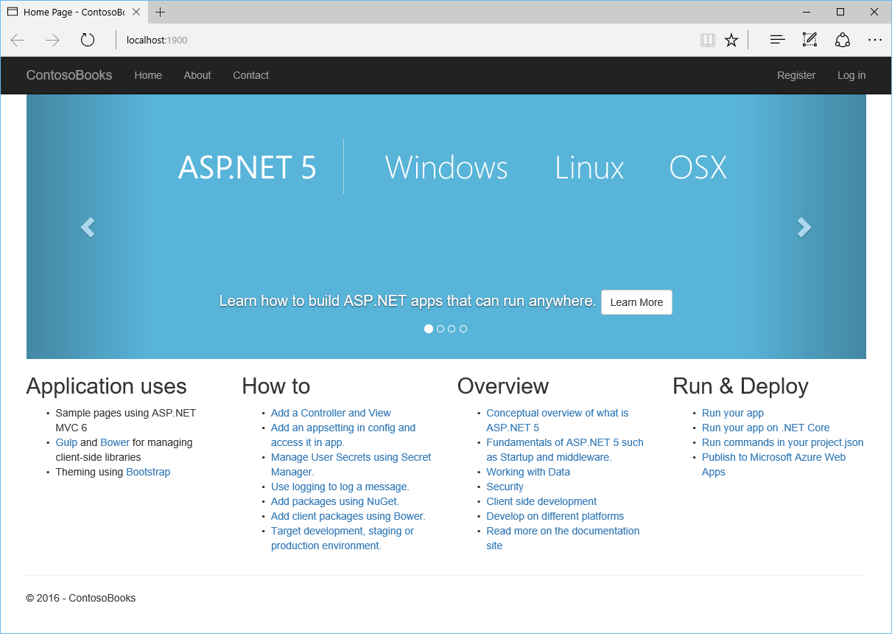

After reviewing the running Web app, close the browser and click the "Stop Debugging" icon in the toolbar of Visual Studio to stop the app.

Review the project
^^^^^^^^^^^^^^^^^^
In Visual Studio, the **Solution Explorer** window lets you manage files for the project. The web application template that you used to create this web app adds the following basic folder structure:

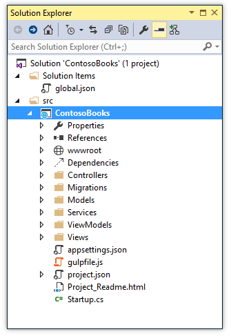

Visual Studio creates some initial folders and files for your project. The primary files that you should be familiar with include the following:

.. list-table:: 
   :header-rows: 1

   * - File name
     - Purpose	

   * - project.json      	
     - The presence of a *project.json* file defines a .NET Execution Environment (DNX) project. It is the *project.json* file that contains all the information that DNX needs to run and package your project. For additional details, including the *project.json* file schema, see `Working with DNX Projects <http://docs.asp.net/en/latest/dnx/projects.html>`_.

   * - global.json    
     - Visual Studio uses this file to configure the project.

   * - config.json      
     - This file allows you to include additional project information, such as connection string values. For more information, see `Configuration <http://docs.asp.net/en/latest/fundamentals/configuration.html>`_.  

   * - Statup.cs       
     - The ``Startup`` class provides the entry point for an application. The ``Startup`` class must define a ``Configure`` method, and may optionally also define a ``ConfigureServices`` method, which will be called when the application is started. For more information, see the application is started. For more information, see `Application Startup <http://docs.asp.net/en/latest/fundamentals/startup.htm>`_.

   * - Index.cshtml       
     - This ``view`` contains the HTML for the default page of the view.  

   * - _Layout.cshtml     
     - This ``view`` contains common HTML for multiple pages of the web app.   

   * - HomeController.cs     
     - This ``controller`` contains the classes that handle incoming browser requests, retrieve model data, and then specify view templates that return a response to the browser. 
	 
Understanding MVC
^^^^^^^^^^^^^^^^^
This project uses :ref:`ASP.NET MVC <mvc:index>`. MVC stands for model-view-controller. MVC is a pattern for developing applications that are well architected, testable, and easy to maintain. MVC-based applications contain:

	- **Models**: Classes that represent the data of the application  and that use validation logic to enforce business rules for that data.
	- **Views**: Template files that your application uses to dynamically  generate HTML responses.
	- **Controllers**: Classes that handle incoming browser requests, retrieve model data, and then specify view templates that return a response to the browser.
	
Understanding .NET Core
^^^^^^^^^^^^^^^^^^^^^^^
.NET Core 5 is a modular runtime and library implementation that includes a subset of the .NET Framework. .NET Core 5 has been designed for Windows, Linux and OS X. It consists of a set of libraries, called “CoreFX”, and a small, optimized runtime, called “CoreCLR”. .NET Core is open-source, so you can follow progress on the project and contribute to it on GitHub. For more information, see :doc:`/getting-started/choosing-the-right-dotnet`.
	 
Entity Framework
----------------
`Entity Framework <http://docs.efproject.net>`_ (EF) is an object-relational mapping (ORM) framework. It lets you work with relational data as objects, eliminating most of the data-access code that you'd usually need to write. Using EF, you can issue queries using LINQ, then retrieve and manipulate data as strongly typed objects. LINQ provides patterns for querying and updating data. Using EF allows you to focus on creating the rest of your application, rather than focusing on the data access fundamentals. 

Open the *project.json* file. In the dependencies section, you will see the following lines related to EF:

.. literalinclude:: your-first-aspnet-application/sample/src/ContosoBooks/project.json
    :language: json
    :lines: 8-10

These lines show that you can issues EF commands from the command window and that the EF NuGet package is included with your project.
	
	
Create a data model and scaffolding
-----------------------------------

Entity Framework supports a development paradigm called Code First. Code First lets you define your data models using classes. A class is a construct that enables you to create your own custom types by grouping together variables of other types, methods and events. You can map classes to an existing database or use them to generate a database. In this tutorial, you’ll begin by creating the entity classes that define the data models for the Web application. Then you will create a context class that manages the entity classes and provides data access to the database. You will then configure EF and populate the database.

Create entity classes
^^^^^^^^^^^^^^^^^^^^^
The classes you create to define the schema of the data are called entity classes. If you’re new to database design, think of the entity classes as table definitions of a database. Each property in the class specifies a column in the table of the database. These classes provide a lightweight, object-relational interface between object-oriented code and the relational table structure of the database.

The Web app will have two new entities:

- Book
- Author

You will define a class for each in the *Models* folder within **Solution Explorer**. Each class will define the 

.. note:: You can put model classes anywhere in your project. The *Models* folder is just a convention.

Right-click the *Models* folder and select **Add** > **New Item**. In the **Add New Item** dialog, select the **Class** template. In the **Name** edit box, type "Author.cs" and click **OK**. 

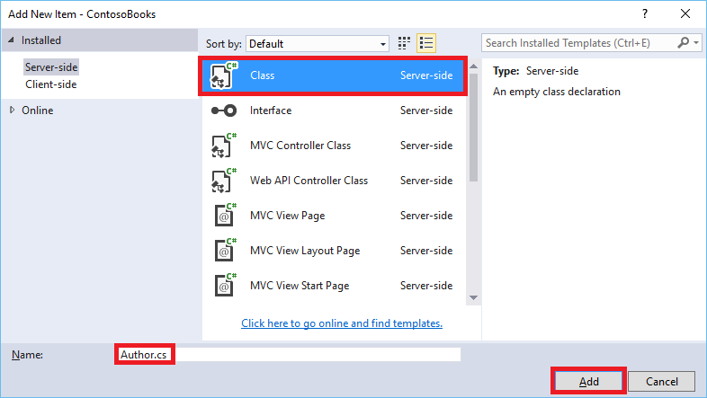

Replace the default code with the following code:

.. literalinclude:: your-first-aspnet-application/sample/src/ContosoBooks/Models/Author.cs
    :language: c#

Repeat these steps to add another class named ``Book`` with the following code:

.. literalinclude:: your-first-aspnet-application/sample/src/ContosoBooks/Models/Book.cs
    :language: c#

To keep the app simple, each book has a single author. The ``Author`` property provides a way to navigate the relationship from a book to an author. In EF, this type of property is called a *navigation property*. When EF creates the database schema, EF automatically infers that ``AuthorID`` should be a foreign key to the Authors table. 

Add Scaffolding
^^^^^^^^^^^^^^^
Scaffolding saves you time and coding effort by automatically generating the starting point for your application's CRUD (Create, Read, Update and Delete) operations. Starting from a simple model class, and, without writing a single line of code, you will create two controllers that will contain the CRUD operations related to books and authors, as well as the all the necessary views. 

To add a scaffolding, right-click the **Controllers** folder in **Solution Explorer**. Select **Add** –> **New Scaffolded Item**.

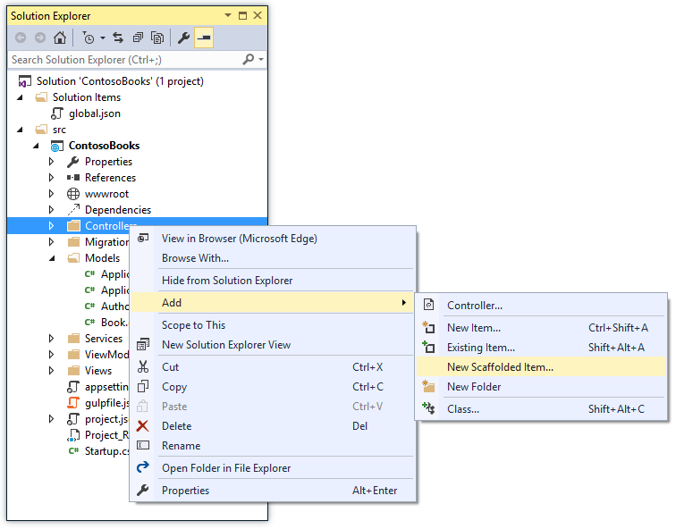

From the **Add Scaffold** dialog box, select **MVC 6 Controller with views, using Entity Framework**, then click the **Add** button.

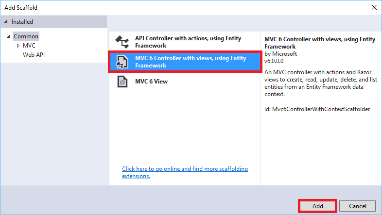

Next, in the **Add Controller** dialog box, set the model class dropdown to **Book (ContosoBooks.Models)**. Also, set the data context class to **ApplicationDbContext (ContosoBooks.Models)**. Make sure the **Generate views** checkbox is checked. Then click the **Add** button.

.. image:: your-first-aspnet-application/_static/15c-book-controller.png

As you can see in the above image, the **Add Controller** dialog box gives you the opportunity to select options for generating the controller and views. 

This scaffold creates the code that provides a controller and a set of views. The views provide the UI and code to create, read, update, delete, and list data from the database.

Repeat the above scaffolding steps to create an **Author** controller and related views. Use the **Author (ContosoBooks.Models)** model class and the **ApplicationDbContext (ContosoBooks.Models)** data context class as shown in the following image.

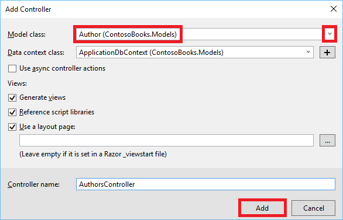

In the **Solution Explorer** you'll see that the new controllers were added within the **Controller** folder and new views were created within the **Views** folder.

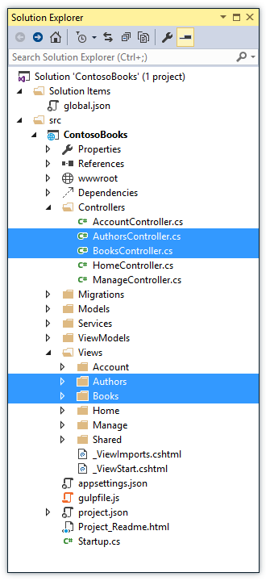

Configure the web app before including sample data
^^^^^^^^^^^^^^^^^^^^^^^^^^^^^^^^^^^^^^^^^^^^^^^^^^

Next, you'll add the ``Microsoft.Framework.DependencyInjection`` package to your app. 
In **Solution Explorer** find and open *project.json*. In the ``dependencies`` section, begin by typing the following line at the end of the section. 

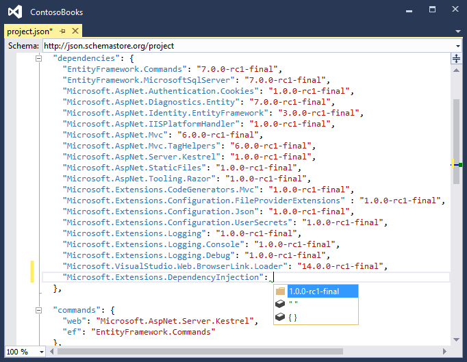
	
You will see that IntelliSense provides coding help as you type. Also, when you save *project.json*, Visual Studio will automaticaly resolve the new package reference.

.. image:: your-first-aspnet-application/_static/15d3-package-restore.png
	
After the above line has been added, the ``dependencies`` section of your *project.json* file will appear as follows:

.. literalinclude:: your-first-aspnet-application/sample/src/ContosoBooks/project.json
    :language: json
    :lines: 8-29
    :emphasize-lines: 21

Add sample data
^^^^^^^^^^^^^^^

Rather than entering several sample records by hand, you will add code that will by used to populate your database. Add a class named ``SampleData`` in the *Models* folder with the following code:

.. literalinclude:: your-first-aspnet-application/sample/src/ContosoBooks/Models/SampleData.cs
    :language: c#

You wouldn’t put this sample data class into production code, but it’s okay for this sample app scenario. 
	
Next, in **Solution Explorer**, open the *Startup.cs* file. Add the following line of code at the end of the *Configure* method:

.. literalinclude:: your-first-aspnet-application/sample/src/ContosoBooks/Startup.cs
    :language: c#
    :lines: 101
    :dedent: 12

After the above line has been added, the completed *Startup.cs* file will appear as follows:

.. literalinclude:: your-first-aspnet-application/sample/src/ContosoBooks/Startup.cs
    :language: c#
    :emphasize-lines: 101

Notice in *ConfigureServices* the app calls ``Configuration.Get`` to get the database connection string. During development, this setting comes from the *config.json* file. When you deploy the app to a production environment, you set the connection string in an environment variable on the host. If the Configuration API finds an environment variable with the same key, it returns the environment variable instead of the value that is in *config.json*.
	
Build the web application
^^^^^^^^^^^^^^^^^^^^^^^^^

To make sure that all the classes and changes to your Web application work, you should build the application.

From the **Build** menu, select **Build Solution**.

The **Output** window is displayed, and if all went well, you see a succeeded message.

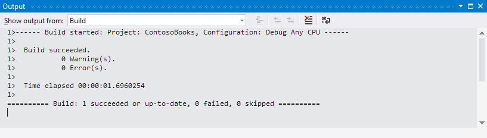

If you run into an error, re-check the above steps. The information in the **Output** window will indicate which file has a problem and where in the file a change is required. This information will enable you to determine what part of the above steps need to be reviewed and fixed in your project.

Using data migrations to create the database
--------------------------------------------
Data migrations in EF are used to perform model updates throughout your entire application. By initially using data migrations to create your database, you can modify your database after the model has changed with simple steps. This will allow you to build and maintain your web app more efficiently. The alternative to data migrations, where model or schema changes are required after the database has been created, involves recreating your entire database.

Open a **Command Prompt** in the project directory (ContosoBooks/src/ContosoBooks). 

.. note:: To open the **Command Prompt**, you can right-click the Windows **start** button and select **Command Prompt** from the menu. 

To find the project directory, in Visual Studio you can right-click the project name (ContosoBooks) in the **Solution Explorer** and select **Open Folder in File Explorer**. Copy your project path from **File Explorer** so you can copy it to the **Command Prompt**. For example, enter the following from the **Command Prompt** to change directories::

	cd C:\Projects\ContosoBooks\src\ContosoBooks
	
.. note:: Make sure that you have navigated to the *ContosoBooks* folder within the *src* folder.

Run each of the following commands from the **Command Prompt**:

.. code-block:: none

	dnu restore
	dnx ef migrations add Initial
	dnx ef database update

.. note:: If ``dnu restore`` is not a recognized command, you may have missed a prerequisite step (or part of a prerequisites step) at the beginning of this topic. For general EF command help, enter the following in the command window: ``dnx ef -?``. For help with the ``add`` command, enter the following in the command window: ``dnx ef migrations add -?``. And, for help with the ``update`` command, enter the following in the command window: ``dnx ef database update -?``.
	
The .NET Version Manager (**dnvm**) is a set of command line utilities that are used to update and configure .NET Runtime. 

`DNX <http://docs.asp.net/en/latest/dnx/overview.html>`_ stands for the .NET Execution Environment. The ``ef`` command is specificed in the *project.json* file of your project. For more information about ``dnvm``, ``dnu``, and ``dnx``, see `DNX Overview <http://docs.asp.net/en/latest/dnx/overview.html>`_.

The "``add Initial``" command creates a migration named "Initial" that adds code to the project, allowing EF to update the database schema. The ``update`` command creates the actual database. After you run this command, the *Migrations* folder of your project will be updated as follows:

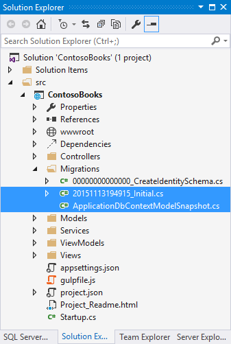

Also, you will be able to view the newly created database within **SQL Server Object Explorer**. 

.. image:: your-first-aspnet-application/_static/16a-database.png

Adding navigation
-----------------
Update the navigation for the web app. From **Solution Explorer**, open the *Views/Shared/_Layout.cshtml* file. Find the following markup:

.. code-block:: aspx-cs

    <li><a asp-controller="Home" asp-action="Index">Home</a></li>
    <li><a asp-controller="Home" asp-action="About">About</a></li>
    <li><a asp-controller="Home" asp-action="Contact">Contact</a></li>

Replace the above markup with the following markup:

.. code-block:: aspx-cs

	<li><a asp-controller="Books" asp-action="Index">Books</a></li>
	<li><a asp-controller="Authors" asp-action="Index">Authors</a></li>

The above changes will add a link to view Books and a link to view Authors. You created each of these views when you added scaffolding to the project.

Build the web application
^^^^^^^^^^^^^^^^^^^^^^^^^

To make sure that all the classes and changes to your Web app work, you should build the app again.

From the **Build** menu, select **Build Solution**.

Run the web app locally
-----------------------

Run the app now to see how you can view all of the products or just a set of products limited by category.

In the **Solution Explorer**, right-click the project name and select **View** -> **View in Browser**. As an alternative, you can press the **F5** key.

The browser will open and show the web app. Click on the **Books** link at the top of the page.

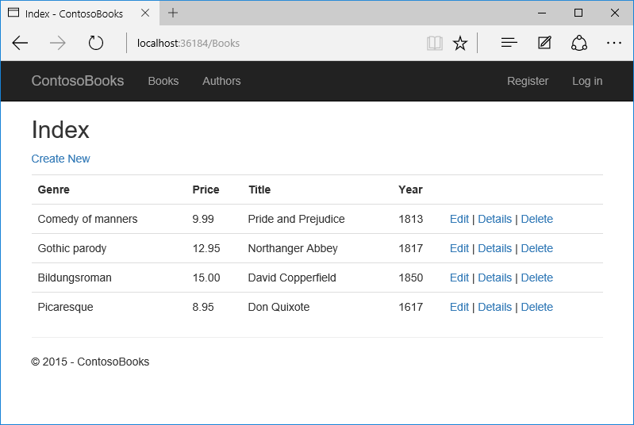

Close the browser and click the "Stop Debugging" icon in the toolbar of Visual Studio to stop the app.

Publish the web app to Azure App Service
----------------------------------------

In **Solution Explorer** of **Visual Studio**, right-click on the project and select **Publish**.

	.. image:: your-first-aspnet-application/_static/20-vs-publish.png

In the **Publish Web** window, click on **Microsoft Azure Web Apps** and log into your Azure subscription.

	.. image:: your-first-aspnet-application/_static/21-vs-publishwebdb.png
	
Make sure you are signed in to Azure with your Microsoft account, then click **New** to create a new Web app in Azure.

	.. image:: your-first-aspnet-application/_static/22-vs-selectexistingdb.png

Enter a unique site name, and select an app service plan, resource group, and region. Also, choose to create a database server, along with a database username and password. If you’ve created a database server in the past, use that. When you’re ready to continue, click **Create**.

	.. image:: your-first-aspnet-application/_static/23-vs-createwebappdb.png
	
On the **Connection** tab of the **Publish Web** window, click **Publish**.

	.. image:: your-first-aspnet-application/_static/24-vs-publishwebdb-target.png
	
You can view the publishing progress in eith the **Output** window or the **Azure App Service Activity** window within Visual Studio.

	.. image:: your-first-aspnet-application/_static/25-vs-webpubactivity.png
	
When publishing to Azure is complete, your web app will be displayed in a browser running on Azure.

	.. image:: your-first-aspnet-application/_static/26-browserazure.png

For additional publishing information, see `Publishing and Deployment <http://docs.asp.net/en/latest/publishing/>`_.

Additional Resources
--------------------
- `Introduction to ASP.NET 5 <http://docs.asp.net/en/latest/conceptual-overview/aspnet.html>`_
- `Understanding ASP.NET 5 Web Apps <http://docs.asp.net/en/latest/conceptual-overview/understanding-aspnet5-apps.html>`_
- `ASP.NET 5 Fundamentals <https://docs.asp.net/en/latest/fundamentals/index.html>`_
