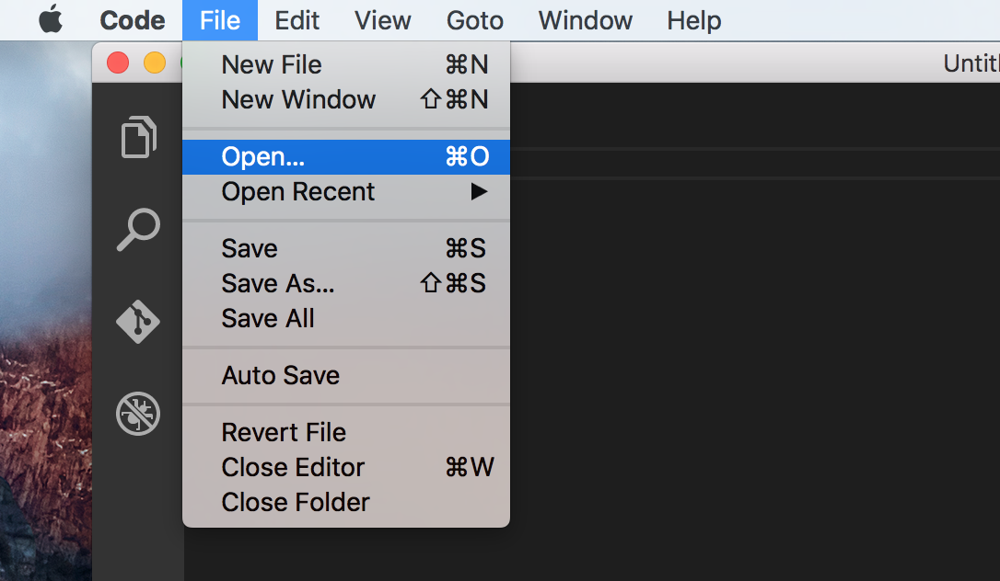
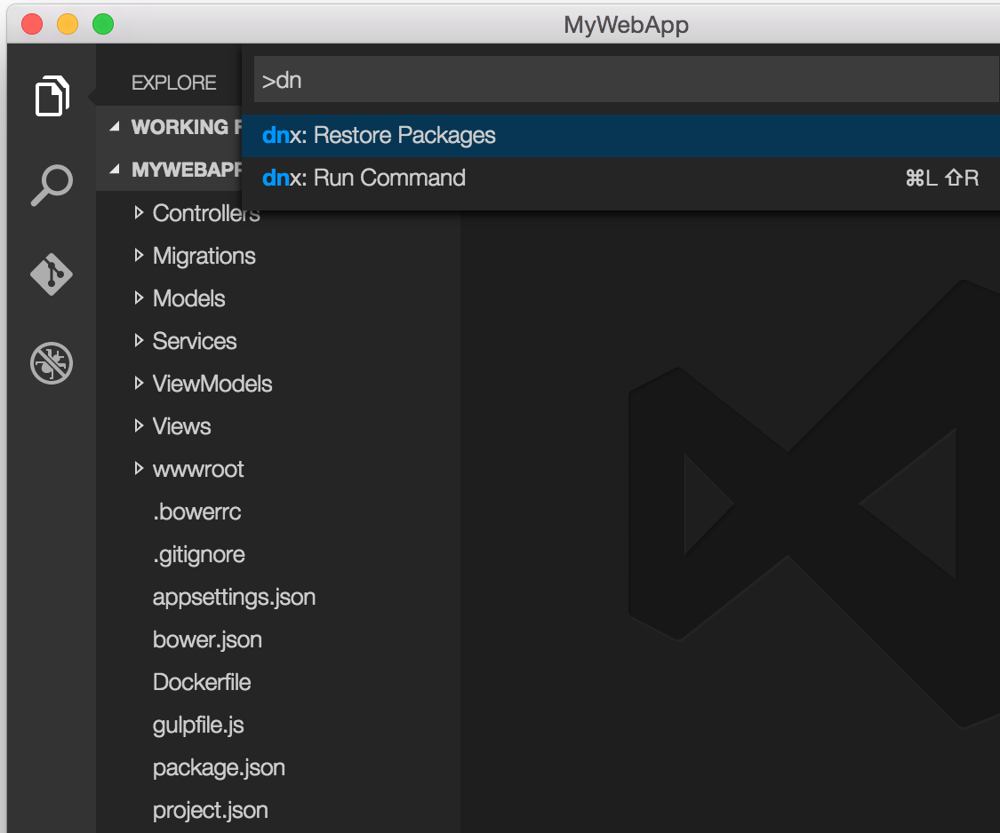
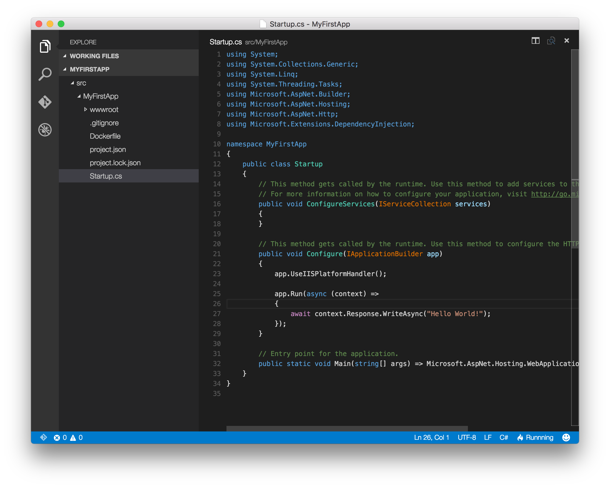
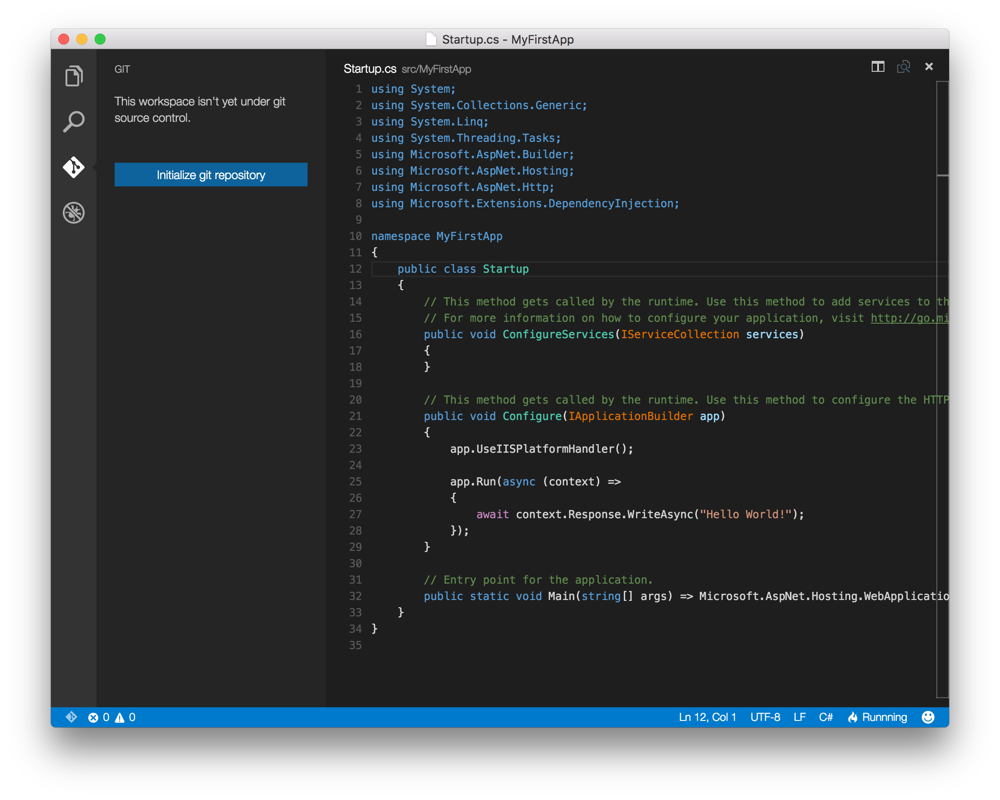
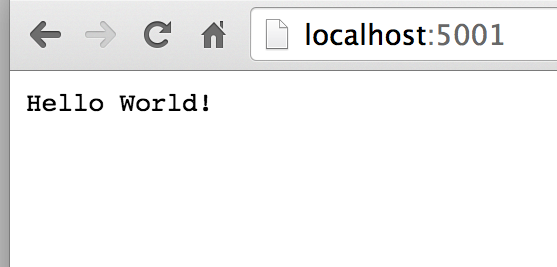
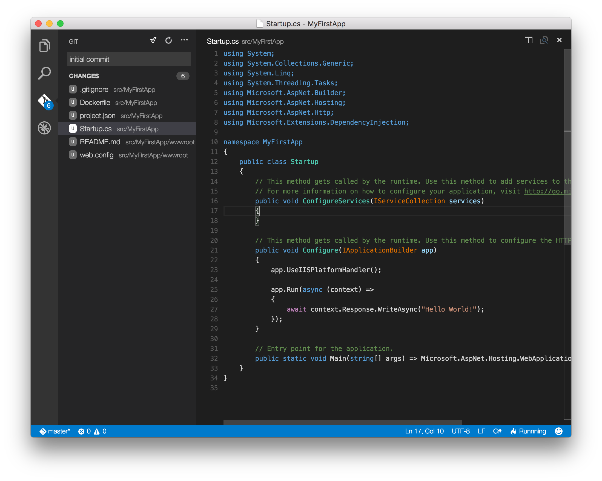
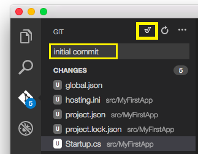
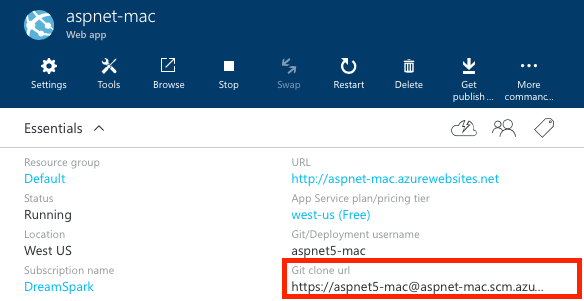
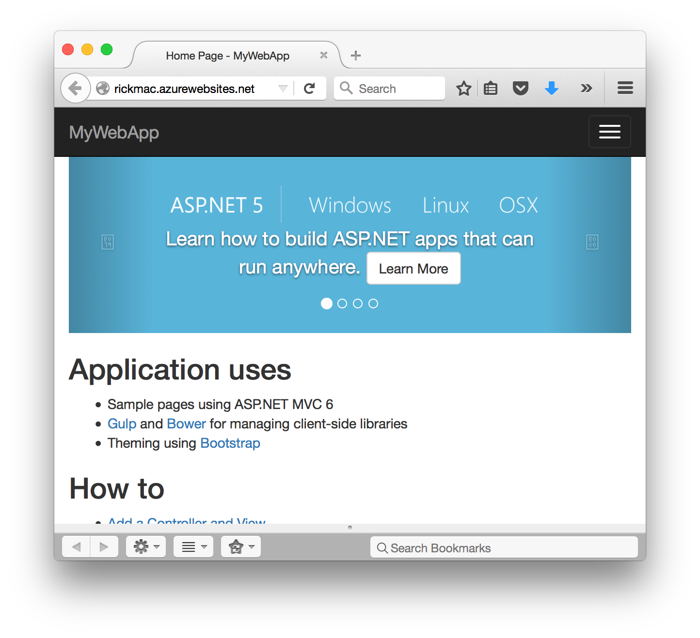

Your First ASP.NET Core Application on a Mac
====================================================

By `Daniel Roth`_, `Steve Smith`_ and `Rick Anderson`_

ASP.NET Core is cross-platform; you can develop and run web apps on Mac OS X, Linux and Windows. This article will show you how to write your first ASP.NET Core application on a Mac.

.. contents:: Sections:
  :local:
  :depth: 1

Setting Up Your Development Environment
---------------------------------------

To setup your development machine download and install `.NET Core`_ and `Visual Studio Code`_.

Scaffolding Applications Using Yeoman
-------------------------------------

Follow the instruction in :doc:`/client-side/yeoman` to create an ASP.NET Core project.

Developing ASP.NET Applications on a Mac With Visual Studio Code
----------------------------------------------------------------

- Start **Visual Studio Code**

.. image:: your-first-mac-aspnet/_static/vscode-welcome.png

- Tap **File > Open** and navigate to your ASP.NET app

From a Terminal / bash prompt, run ``dotnet restore`` to restore the project's dependencies. Alternately, you can enter ``command shift p`` and then type ``>d`` as shown:

This will allow you to run commands directly from within Visual Studio Code, including ``dotnet restore`` and any tools referenced in the *project.json* file.

At this point, you should be able to host and browse to this simple ASP.NET web application, which we'll see in a moment.

This empty project template simply displays "Hello World!". Open *Startup.cs* in Visual Studio Code to see how this is configured:

If this is your first time using Visual Studio Code (or just *Code* for short), note that it provides a very streamlined, fast, clean interface for quickly working with files, while still providing tooling to make writing code extremely productive. 

In the left navigation bar, there are four icons, representing four viewlets:

- Explore
- Search
- Git
- Debug

The Explore viewlet allows you to quickly navigate within the folder system, as well as easily see the files you are currently working with. It displays a badge to indicate whether any files have unsaved changes, and new folders and files can easily be created (without having to open a separate dialog window). You can easily Save All from a menu option that appears on mouse over, as well.

The Search viewlet allows you to quickly search within the folder structure, searching filenames as well as contents.

*Code* will integrate with Git if it is installed on your system. You can easily initialize a new repository, make commits, and push changes from the Git viewlet.

The Debug viewlet supports interactive debugging of applications. Currently only node.js and mono applications are supported by the interactive debugger.

Finally, Code's editor has a ton of great features. You should note right away that several using statements are underlined, because Code has determined they are not necessary. Note that classes and methods also display how many references there are in the project to them. If you're coming from Visual Studio, Code includes many of the keyboard shortcuts you're used to, such as ``command k c`` to comment a block of code, and ``command k u`` to uncomment.

Running Locally Using Kestrel
-----------------------------

The sample is configured to use :ref:`Kestrel <kestrel>` for the web server. You can see it configured in the *project.json* file, where it is specified as a dependency.

.. code-block:: json
 :linenos:
 :emphasize-lines: 14, 18
 
  {
    "version": "1.0.0-*",
    "userSecretsId": "aspnet5-MyWebApp-a1b07c55-6f20-4aaf-9852-9c964160a00c",
    "compilationOptions": {
      "emitEntryPoint": true
    },
    "tooling": {
      "defaultNamespace": "MyWebApp"
    },

    "dependencies": {
      "EntityFramework.Commands": "7.0.0-rc1-final",
      // Dependencies deleted for brevity.
      "Microsoft.AspNet.Server.Kestrel": "1.0.0-rc1-final"
    },

    "commands": {
      "web": "Microsoft.AspNet.Server.Kestrel",
      "ef": "EntityFramework.Commands"
    },

    // Markup deleted for brevity.

    "scripts": {
      "prepublish": [
        "npm install",
        "bower install",
        "gulp clean",
        "gulp min"
      ]
    }
  }

- Run ``dotnet run`` command to launch the app

- Navigate to ``localhost:5000``:

- To stop the web server enter ``Ctrl+C``.

Publishing to Azure
-------------------

Once you've developed your application, you can easily use the Git integration built into Visual Studio Code to push updates to production, hosted on `Microsoft Azure <http://azure.microsoft.com>`_. 

Initialize Git
^^^^^^^^^^^^^^

Initialize Git in the folder you're working in. Tap on the Git viewlet and click the ``Initialize Git repository`` button.

Add a commit message and tap enter or tap the checkmark icon to commit the staged files. 

Git is tracking changes, so if you make an update to a file, the Git viewlet will display the files that have changed since your last commit.

Initialize Azure Website
^^^^^^^^^^^^^^^^^^^^^^^^

You can deploy to Azure Web Apps directly using Git. 

- `Create a new Web App <https://tryappservice.azure.com/>`__ in Azure. If you don't have an Azure account, you can `create a free trial <http://azure.microsoft.com/en-us/pricing/free-trial/>`__. 

- Configure the Web App in Azure to support `continuous deployment using Git <http://azure.microsoft.com/en-us/documentation/articles/web-sites-publish-source-control/>`__.

Record the Git URL for the Web App from the Azure portal:

- In a Terminal window, add a remote named ``azure`` with the Git URL you noted previously.

  - ``git remote add azure https://Rick-Anderson@rickmac.scm.azurewebsites.net:443/rickmac.git``

- Push to master.

  - ``git push azure master`` to deploy. 

  .. image:: your-first-mac-aspnet/_static/git-push-azure-master.png

- Browse to the newly deployed web app.

Additional Resources
--------------------

- `Visual Studio Code <https://code.visualstudio.com>`__
- :doc:`/client-side/yeoman`
- :doc:`ASP.NET Fundamentals </fundamentals/index>`
