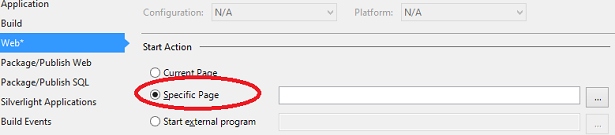
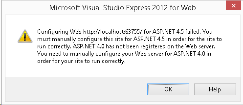
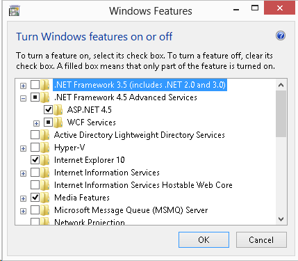

Release Notes for ASP.NET and Web Tools 2013.1 for Visual Studio 2012
====================
by [Microsoft](https://github.com/microsoft)

> This document describes the release of ASP.NET and Web Tools 2013.1 for Visual Studio 2012.

## Contents

- [Installation Notes](#install)
- [Software Requirements](#requirements)
- New Features in ASP.NET and Web Tools 2013.1 for Visual Studio 2012

    - [Bootstrap](#bootstrap)
    - [Templates](#templates)

        - [ASP.NET MVC 5 template](#mvc5template)
        - [ASP.NET Web API 2 template](#apitemplate)
        - [Item Templates](#itemtemplate)
    - [Entity Framework 6](#ef6)
    - [ASP.NET Scaffolding](#scaffold)
    - [Razor Editor](#razor)
    - [NuGet 2.7](#nuget)
- Known Issues and Breaking Changes

    - [ASP.NET Scaffolding](#issuescaffolding)

        - [MVC and Web API Scaffolding - HTTP 404, Not Found error](#404issue)
        - [Visual Studio Express 2012 for Web stops working after adding a scaffolded item](#expressissue)
    - [ASP.NET Razor 3](#issuerazor)

        - [Viewing cshtml file with Browse With or F5 causes a server error](#browseissue)
        - [Url Rewrite and Tilde(~)](#rewriteissue)
    - [Templates](#templateissue)

## Installation Notes

[Install](https://www.microsoft.com/web/handlers/webpi.ashx/getinstaller/WebNode11Pack.appids) ASP.NET and Web Tools 2013.1 for Visual Studio 2012.

## Software Requirements

You must have either Visual Studio 2012 or Visual Studio Express 2012 for Web.

## New Features in ASP.NET and Web Tools 2013.1 for Visual Studio 2012

### Bootstrap

When you scaffold MVC 5 controllers and views, the markup for the views uses [Bootstrap](http://getbootstrap.com/).

### Templates

#### ASP.NET MVC 5 template

We added a new MVC 5 template. It references the latest MVC 5 NuGet packages, and you can use scaffolding to add controllers and views.

#### ASP.NET Web API 2 template

We added a new Web API 2 template. It references the latest Web API 2 NuGet packages, and you can use scaffolding to add controllers and views.

#### Item Templates

We added new item templates for MVC 5 views, Web Pages (Razor 3), and Web API 2 controllers. They install the related NuGet packages to the project while adding new items.

### Entity Framework 6

When you scaffold an MVC or Web API controller using Entity Framework, we use Framework 6. For more information about Entity Framework, see the [Entity Framework Version History](https://msdn.com/data/jj574253).

You can also download and install the Entity Framework 6 Tools for Visual Studio 2012. See the [Get Entity Framework](https://msdn.com/data/ee712906#tooling).

### ASP.NET Scaffolding

ASP.NET Scaffolding is a code generation framework for ASP.NET Web applications. It makes it easy to add boilerplate code to your project that interacts with a data model.

In previous versions of Visual Studio, scaffolding was limited to ASP.NET MVC projects. With this update, you can now use scaffolding for any ASP.NET project, including Web Forms. This update does not support generating pages for a Web Forms project, but you can still use scaffolding with Web Forms by adding MVC dependencies to the project. Support for generating pages for Web Forms will be added in a future update.

When using scaffolding, we ensure that all required dependencies are installed in the project. For example, if you start with an ASP.NET Web Forms project and then use scaffolding to add a Web API Controller, the required NuGet packages and references are added to your project automatically.

To add MVC scaffolding to a Web Forms project, add a **New Scaffolded Item** and select **MVC 5 Dependencies** in the dialog window. There are two options for scaffolding MVC; Minimal and Full. If you select Minimal, only the NuGet packages and references for ASP.NET MVC are added to your project. If you select the Full option, the Minimal dependencies are added, as well as the required content files for an MVC project.

Support for scaffolding async controllers uses the new async features from Entity Framework 6.

For more information and tutorials, see [ASP.NET Scaffolding Overview](../2013/aspnet-scaffolding-overview.md). These tutorials show scaffolding with Visual Studio 2013, but they are also applicable to ASP.NET and Web Tools 2013.1 for Visual Studio 2012.

### Razor Editor

With this update, Visual Studio 2012 now supports Razor 3 tooling/editing.

### NuGet 2.7

NuGet 2.7 includes a rich set of new features which are described in detail at [NuGet 2.7 Release Notes](http://docs.nuget.org/docs/release-notes/nuget-2.7).

This version of NuGet removes the need for users to explicitly allow NuGet to restore missing packages. When installing NuGet 2.7, users implicitly consent to automatically restoring missing packages. Users can explicitly opt out of package restoration through the NuGet settings in Visual Studio. This change simplifies how package restoration works.

## Known Issues and Breaking Changes

### ASP.NET Scaffolding

#### MVC and Web API Scaffolding - HTTP 404, Not Found error

If you encounter an error when adding a scaffolded item to a project, it is possible your project will be left in an inconsistent state. Some of the changes made be scaffolding will be rolled back but other changes, such as the installed NuGet packages, will not be rolled back. If the routing configuration changes are rolled back, users will receive an HTTP 404 error when navigating to scaffolded items.

To fix this error for MVC, add a new scaffolded item and select MVC 5 Dependencies (either Minimal or Full). This process will add all of the required changes to your project.

To fix this error for Web API:

1. Add the following WebApiConfig class to your project.

    [!code-csharp[Main](aspnet-and-web-tools-20131-for-visual-studio-2012/samples/sample1.cs)]

    [!code-vb[Main](aspnet-and-web-tools-20131-for-visual-studio-2012/samples/sample2.vb)]
2. Configure WebApiConfig.Register in the Application\_Start method in Global.asax as follows:

    [!code-csharp[Main](aspnet-and-web-tools-20131-for-visual-studio-2012/samples/sample3.cs)]

    [!code-vb[Main](aspnet-and-web-tools-20131-for-visual-studio-2012/samples/sample4.vb)]

#### Visual Studio Express 2012 for Web stops working after adding a scaffolded item

If Visual Studio Express 2012 for Web stops working after adding scaffolded item with Entity Framework (such as Web API 2 Controller with actions, using Entity Framework), it is possible that Visual Studio Express failed to load the native image of an assembly dependent on System.Web.Extensions.

To correct this problem, configure Visual Studio Express to work with the MSIL image of System.Web.Extensions:

1. Open Command Prompt in the Administrator mode.
2. Go to %ProgramFiles%\Microsoft Visual Studio 11.0\Common7\IDE or %ProgramFiles(x86)%\Microsoft Visual Studio 11.0\Common7\IDE (for 64 bit Windows).
3. Open VWDExpress.exe.config in a text editor.
4. Add the following line under the &lt;configuration&gt;/&lt;runtime&gt; element:  

    [!code-xml[Main](aspnet-and-web-tools-20131-for-visual-studio-2012/samples/sample5.xml)]
5. Restart Visual Studio Express 2012 for Web.

### ASP.NET Razor 3

#### Viewing cshtml file withBrowse WithorF5causes a server error

When you create an MVC 5 project in Visual Studio 2012 (or open in Visual Studio 2012 an MVC 5 project that was created in Visual Studio 2013) and attempt to view a cshtml file by using Browse With or F5, you will receive an error that states - **Server Error in '/' Application**. The server attempts to navigate to `http://localhost:XXXX/Views/../XXXX.cshtml`

To resolve this issue, change the **Start Action** setting in your project to **Specific Page**. You do not need to provide a value for the page.

After making this change, selecting F5 navigates to the root of your application (`http://localhost:XXXX`). This behavior is not the same as the behavior for MVC 5 projects in Visual Studio 2013, where the **Current Page** setting launches the open page.

#### Url Rewrite and Tilde(~)

After upgrading to ASP.NET Razor 3 or ASP.NET MVC 5, the tilde(~) notation may no longer work correctly if you are using URL rewrites. The URL rewrite affects the tilde(~) notation in HTML elements such as &lt;A/&gt;, &lt;SCRIPT/&gt;, &lt;LINK/&gt;, and as a result the tilde no longer maps to the root directory.

For example, if you rewrite requests for **asp.net/content** to **asp.net**, the href attribute in &lt;A href="~/content/"/&gt; resolves to **/content/content/** instead of **/**. To suppress this change, you can set the **IIS\_WasUrlRewritten** context to false in each Web Page or in **Application\_BeginRequest** in Global.asax.

### Templates

When you create ASP.NET MVC projects with Visual Studio 2012 on Windows 8.1 or Windows Server 2012 R2, Visual Studio displays an error message that states "Configuring Web [url] for ASP.NET 4.5 failed."

You see this error because Visual Studio 2012 does not enable the ASP.NET 4.5 feature when it is installed on those releases of Windows. To enable ASP.NET 4.5, perform the steps described in [Turn Windows features on or off](https://windows.microsoft.com/en-us/windows-8/turn-windows-features-on-off).

Alternatively, you can enable ASP.NET 4.5 through the command line.

1. Open Command Prompt in the Administrator mode.
2. Run the following command to enable ASP.NET 4.5.  
    `dism /Online /Enable-Feature /FeatureName:NetFx4Extended-ASPNET45 /Quiet /NoRestart`