Windows Azure Authentication
====================
by [Rick Anderson](https://github.com/Rick-Anderson)

> Microsoft ASP.NET tools for Windows Azure Active Directory makes it simple to enable authentication for web applications hosted on [Windows Azure Web Sites](https://www.windowsazure.com/en-us/home/features/web-sites/). You can use Windows Azure Authentication to authenticate Office 365 users from your organization, corporate accounts synced from your on-premise Active Directory or users created in your own custom Windows Azure Active Directory domain. Enabling Windows Azure Authentication configures your application to authenticate users using a single [Windows Azure Active Directory](https://www.windowsazure.com/en-us/home/features/identity/) tenant.
> 
> The ASP.NET Windows Azure Authentication tool is not supported for web roles in a cloud service but we plan to do so in a future release. [Windows Identity Foundation](https://msdn.microsoft.com/en-us/library/hh291066(v=VS.110).aspx) (WIF) is supported in Windows Azure web roles.
> 
> For details on how to setup synchronization between your on-premise Active Directory and your Windows Azure Active Directory tenant please see [Use AD FS 2.0 to implement and manage single sign-on](https://technet.microsoft.com/en-us/library/jj205462.aspx).
> 
> Windows Azure Active Directory is currently available as a [free preview service](https://www.windowsazure.com/en-us/pricing/free-trial/?WT.mc_id=A443DD604).

## Requirements:

- Visual Studio 2012 or [Visual Studio Express 2012](https://www.microsoft.com/visualstudio/11/en-us/products/express)
- [Web Tools Extensions for Visual Studio 2012](https://go.microsoft.com/fwlink/?LinkID=282228&amp;clcid=0x409) or [Web Tools Extensions for Visual Studio Express 2012](https://go.microsoft.com/fwlink/?LinkID=282231&amp;clcid=0x409)
- [Microsoft ASP.NET Tools for Windows Azure Active Directory – Visual Studio 2012](https://go.microsoft.com/fwlink/?LinkID=282306) or [Microsoft ASP.NET Tools for Windows Azure Active Directory – Visual Studio Express 2012 for Web](https://go.microsoft.com/fwlink/?LinkId=282652)

## Create an ASP.NET Web Application with Visual Studio 2012

You can create any Web Application with Visual Studio 2012, this tutorial uses the ASP.NET MVC intranet template.

1. Create a new ASP.NET MVC 4 Intranet Application and accept all the defaults. (It must be an In **tra** net and not In **ter** net project).  
     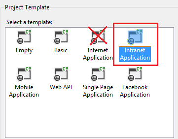

## Enable Window Azure Authentication (When you are a Global Administrator of the Tenet)

If you do not have an existing Windows Azure Active Directory tenant (For example, through an existing Office 365 account) you can create a new tenant by signing up for a [new Windows Azure Active Directory account](http://g.microsoftonline.com/0AX00en/5).

1. From the Project menu select **Enable Windows Azure Authentication**:  
  
 

2. Enter the domain for your Windows Azure Active Directory tenant (for example, contoso.onmicrosoft.com) and click **Enable**:

3. In the Web Authentication dialog sign in as an administrator for your Windows Azure Active Directory tenant:  
  
 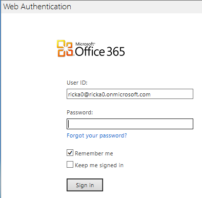

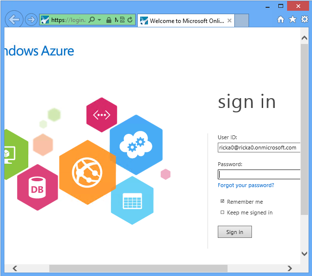

## Enable Window Azure by a non-administrator of the Tenet

If you do not have Global Administrator privilege for your Windows Azure Active Directory tenant, you can uncheck the checkbox for provisioning the application.

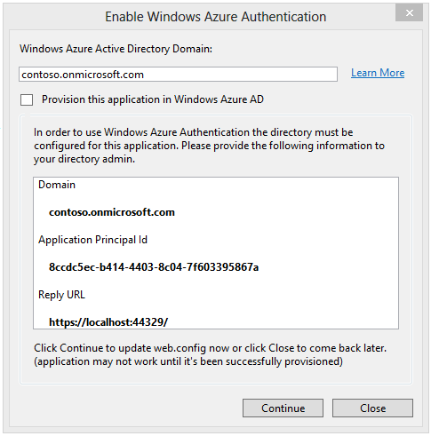

The dialog will display the **Domain**, **Application Principal Id** and **Reply URL** which are required for provisioning the application with an Azure Active Directory tenet. You need to give this information to someone who has sufficient privilege to provision the application. See[How to implement single sign-on with Windows Azure Active Directory - ASP.NET Application](https://www.windowsazure.com/en-us/develop/net/how-to-guides/web-sso/) for details on how to use cmdlet to create the service principal manually.  
Once the application has been successfully provisioned, you can click on **Continue to update web.config with the selected settings**. If you want to continue developing the application while waiting for provisioning to happen, you can click **Close to remember the settings in project file**. The next time you invoke Enable Windows Azure Authentication and uncheck the provisioning checkbox, you will see the same settings and you can click **Continue**, then click, **Apply these settings in web.config**.

1. Wait while your application is configured for Windows Azure Authentication and provisioned with Windows Azure Active Directory.
2. Once Windows Azure Authentication has been enabled for your application, click **Close:** 

    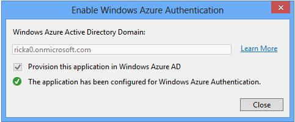
3. Hit F5 to run your application. You should automatically get redirected to login page. Use the directory tenet user credentials to login to the application..  

    
4. Because your application is currently using a self-signed test certificate you will receive a warning from the browser that the certificate was not issued by a trusted certificate authority.

    This warning can be safely ignored during local development by clicking **Continue to this website:** 

    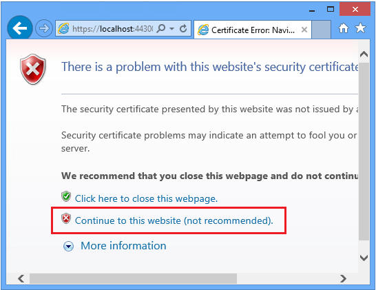
5. You have now successfully logged in to your application using Windows Azure Authentication!

    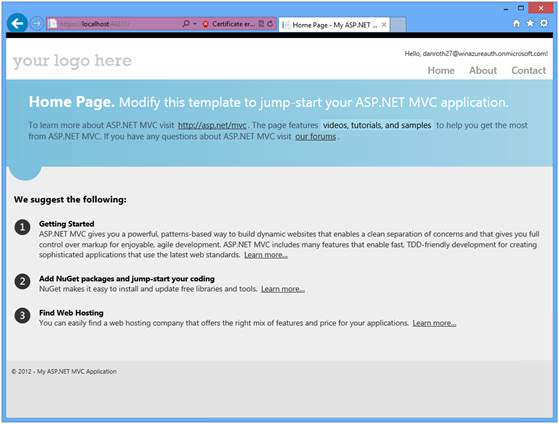

Enabling Windows Azure authentication makes the following changes to your application:

- An Anti-Cross-Site Request Forgery ([CSRF](https://www.owasp.org/index.php/Cross-Site_Request_Forgery_(CSRF))) class ( *App\_Start\AntiXsrfConfig.cs* ) is added to your project.
- The NuGet packages `System.IdentityModel.Tokens.ValidatingIssuerNameRegistry` is added to your project.
- Windows Identity Foundation settings in your application will be configured to accept security tokens from your Windows Azure Active Directory tenant. Click on the image below to see an expanded view of the changes made to the *Web.config* file.  
  
     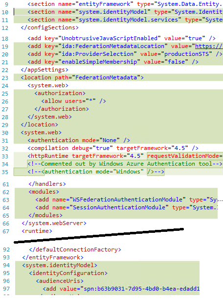
- A service principal for your application in your Windows Azure Active Directory tenant will be provisioned.
- HTTPS is enabled.

## Deploy the application to Windows Azure

For complete instructions, see [Deploying an ASP.NET Web Application to a Windows Azure Web Site](https://www.windowsazure.com/en-us/develop/net/tutorials/get-started/).

To publish an application using Windows Azure Authentication to an Azure Web Site:

1. Right click on your application and select **Publish:** 

    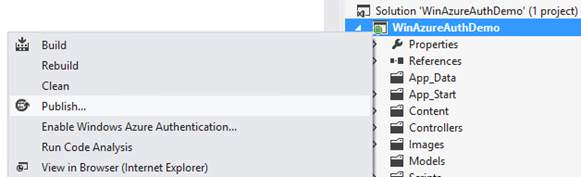
2. From the Publish Web dialog download and import a publishing profile for your Azure Web Site.

    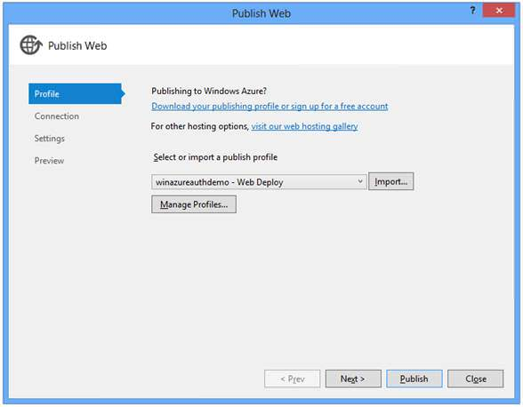
3. The **Connection** tab shows the **Destination URL** (the public facing URL for your application). Click **Validate Connection** to test your connection:

    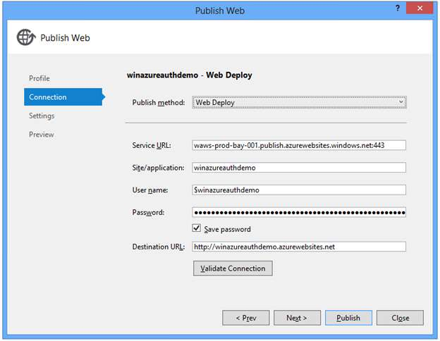
4. If you have published to this Azure Web Site previously consider checking the **Remove additional files at destination** setting to ensure your application publishes cleanly. Notice the **Enable Windows Azure Authentication** check box is slected.  

    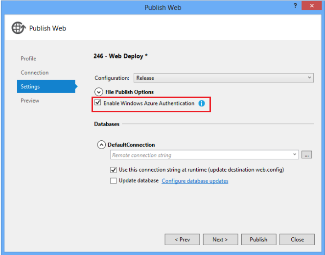
5. Optional: On the **Preview** tab click **Start Preview** to see the files deployed.

    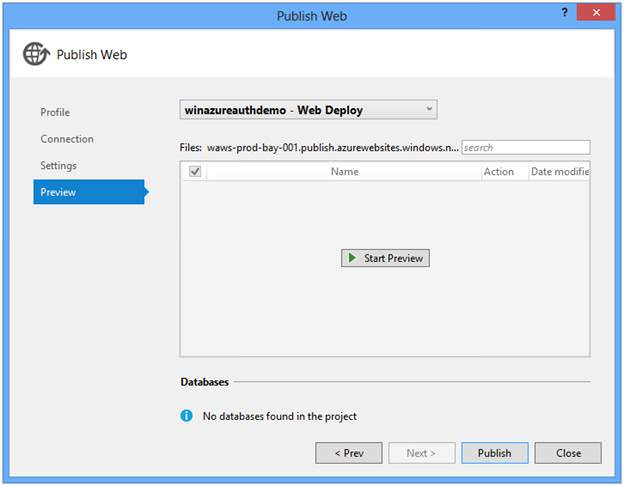
6. Click **Publish.**

    You will be prompted to enable Windows Azure Authentication for the target host. Click **Enable** to continue:

    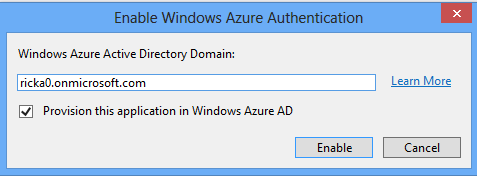
7. Enter your administrator credentials for your Windows Azure Active Directory tenant:

    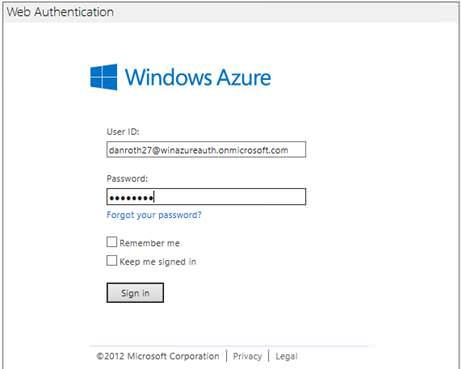
8. Once your application has been successfully published, a browser will open to the published web site.

    > [!NOTE]
    > It may take up to five minutes (typically must less) for your application to be fully provisioned with Windows Azure Active Directory after enabling Windows Azure Authentication for the target host. When you first run your application if you receive error ACS50001: Relying party with name ‘[realm]' was not found, then wait a few minutes and try running the application again.
9. When prompted, log in as a user in your directory:

    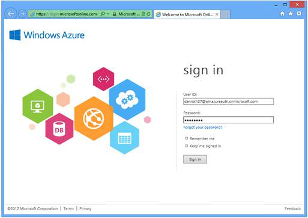
10. You have now successfully logged into your Azure hosted application using Windows Azure Authentication.  
  
     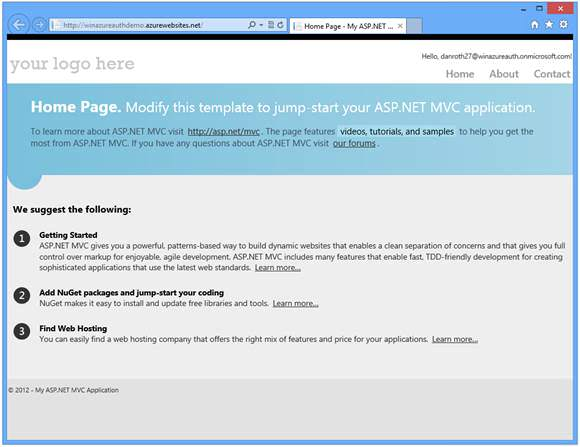

## Known Issues

#### Role-based authorization fails when using Windows Azure Authentication<o:p></o:p>

Windows Azure Authentication does not currently provide the necessary role claim so that role-based authorization can be performed. The role of the authenticated user must be manually retrieved from Windows Azure Active Directory.<o:p></o:p>

#### Browsing to an application with Windows Azure Authentication results in the error "ACS20016 The domain of the logged in user (live.com) does not match any allowed domain of this STS"<o:p></o:p>

If you are already logged in to a Microsoft Account (for example hotmail.com, live.com, outlook.com) and you attempt to access an application that has enabled Windows Azure Authentication you may get a 400 error response because the domain of your Microsoft Account is not recognized by Windows Azure Active Directory. To log into the application, log out from your Microsoft Account first.<o:p></o:p>

#### Logging into an application with Windows Azure Authentication enabled and a X509CertificateValidationMode other than None results in certificate validation errors for the accounts.accesscontrol.windows.net certificate<o:p></o:p>

Certificate validation is not required and should be left disabled. The thumbprint of the issuer certificate is validated by the WSFederationAuthenticationModule.<o:p></o:p>

#### When attempting to enable Windows Azure Authentication the Web Authentication dialog shows the error "ACS20016: The domain of the logged in user (contoso.onmicrosoft.com) does not match any allowed domain of this STS."<o:p></o:p>

You may see this error when you have previously successfully logged in using a different Windows Azure Active Directory account from within the same Visual Studio process. Log out from the specified account or restart Visual Studio. If you previously logged in and selected the option to "Keep me signed in" then you may need to clear your browser cookies.<o:p></o:p>

## ACS20012: The request is not a valid WS-Federation protocol message <o:p></o:p>

This can happen if you are already logged in with some other Microsoft ID to one of the Azure services. Use Private browser window like InPrivate in IE or Incognito in Chrome or clear all the cookies. <o:p></o:p>

## Additional Resources

- [Microsoft ASP.NET Tools for Windows Azure Active Directory – Visual Studio 2012](https://blogs.msdn.com/b/vbertocci/archive/2013/02/18/microsoft-asp-net-tools-for-windows-azure-active-directory-visual-studio-2012.aspx) – Vittorio Bertocci
- [Windows Azure Features: Identity](https://www.windowsazure.com/en-us/home/features/identity/)
- [TechNet: Windows Azure Active Directory](https://technet.microsoft.com/en-us/library/hh967619.aspx)
- [Windows Azure Active Directory: Develop Apps for your organization](https://activedirectory.windowsazure.com/Develop/Single-Tenant.aspx)
- [Windows Azure Active Directory: Develop Apps for multiple organizations](https://activedirectory.windowsazure.com/Develop/Multi-Tenant.aspx)
- [How to implement single sign-on with Windows Azure Active Directory](https://www.windowsazure.com/en-us/develop/net/how-to-guides/web-sso/)
- [Single Sign-On with Windows Azure Active Directory: a Deep Dive](https://blogs.msdn.com/b/vbertocci/archive/2012/07/05/single-sign-on-with-windows-azure-active-directory-a-deep-dive.aspx) – Vittorio Bertocci
- [Use AD FS 2.0 to implement and manage single sign-on](https://technet.microsoft.com/en-us/library/jj205462.aspx)