ASP.NET and Web Tools 2013.2  for Visual Studio 2013 Release Notes
====================
by [Microsoft](https://github.com/microsoft)

## Installation Notes

ASP.NET and Web Tools for Visual Studio 2013.2 are bundled in the main installer and can be downloaded as part of [Visual Studio 2013 Update 2](https://go.microsoft.com/fwlink/?LinkId=390521).

## Documentation

Tutorials and other information about ASP.NET and Web Tools for Visual Studio 2013.2 are available from the [ASP.NET web site](https://www.asp.net/).

## Software Requirements

ASP.NET and Web Tools for Visual Studio 2013.2 requires Visual Studio 2013.

## New Features in ASP.NET and Web Tools for Visual Studio 2013.2

The following sections describe the features that have been introduced in the release.

- [One ASP.NET Project Templates](#oneaspnet)
- [Support SSL when launching Web Applications on IIS Express](#ssl)
- [Visual Studio Web Editor Enhancements](#vswebeditor)
- [Browser Link](#browserlink)
- [Support for Azure App Service Web Apps in Visual Studio](#waws)
- [Create remote Azure resources when creating a new Web project](#AzureResources)
- [Web Publish Enhancements](#webpublish)
- [ASP.NET Scaffolding](#scaffolding)
- [NuGet 2.8.1](#nuget)
- [ASP.NET Web Forms](#webforms)
- [ASP.NET MVC 5.1.2](#mvc)
- [ASP.NET Web API 2.1.2](#webapi)
- [ASP.NET Web Pages 3.1.2](#webpages)
- [Entity Framework 6.1](#ef)
- [ASP.NET Identity 2.0.0](#identity)
- [Microsoft OWIN components](#owin)
- [ASP.NET SignalR 2.0.2](#signalr)

### One ASP.NET Project Templates

- Updates to ASP.NET Project templates to support Account confirmation and Password Reset.
- Update ASP.NET Web API template to support authentication using On Premises Organizational Accounts.
- The ASP.NET SPA template now contains authentication that is based on MVC and server side views. The template has a WebAPI controller which can only be accessed by authenticated users.

### Support SSL when launching Web Applications on IIS Express

To eliminate the security warning when browsing and debugging HTTPS on localhost, we added a dialog to allow Internet Explorer and Chrome to trust the self-signed IIS express SSL certificate.

For example, a web project property can be set to use SSL. Click F4 to bring up the properties dialog. Change **SSL Enabled** to true. Copy the SSL URL.

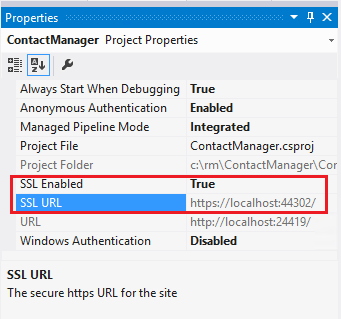

Set the web project property page web tab to use the HTTPS based URL (The SSL URL will be `https://localhost:44300/` unless you've previously created SSL Web Sites.)

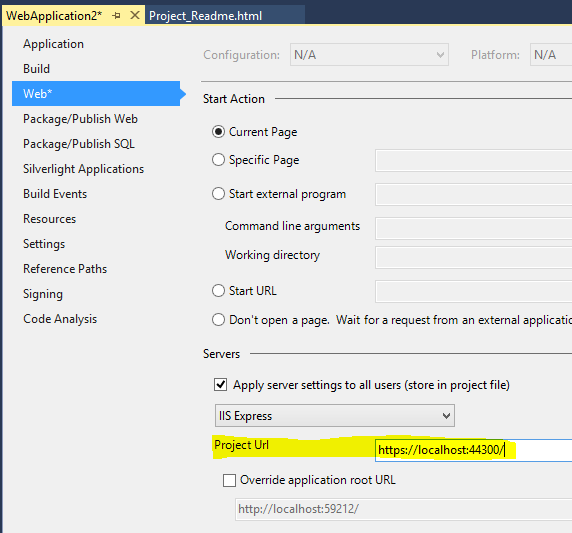

Press CTRL+F5 to run the application. Follow the instructions to trust the self-signed certificate that IIS Express has generated.

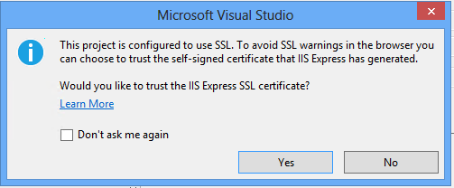

Read the **Security Warning** dialog and then click **Yes** if you want to install the certificate representing localhost.

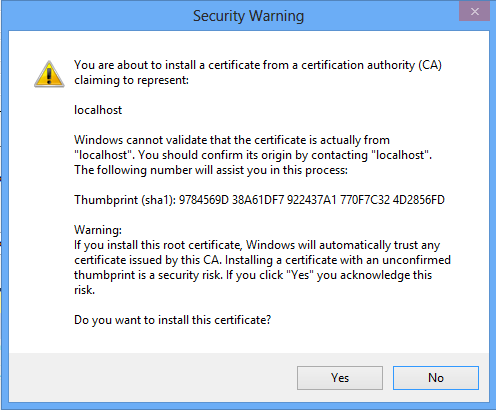

The site will be shown in IE or Chrome without the certificate warning in the browser.

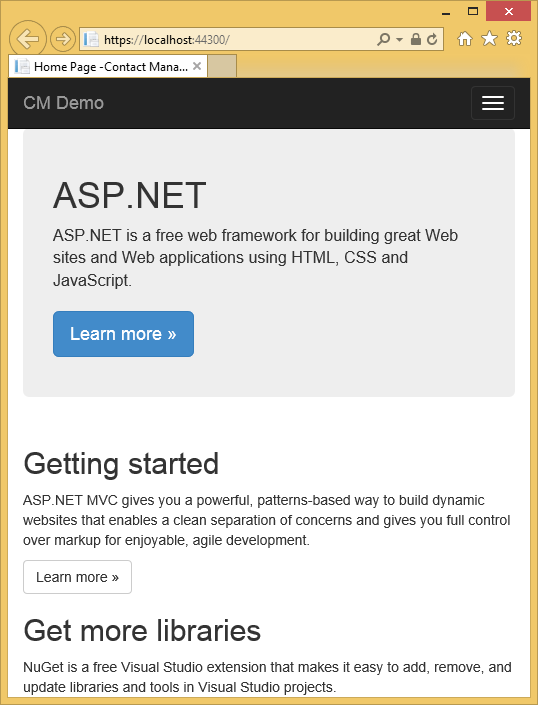

Firefox uses its own certificate store, so it will display a warning.

### Visual Studio Web Editor Enhancements

- **New JSON project item and editor**: We have added a JSON project item and editor to Visual Studio. Current JSON editor features include colorization, syntax validation, brace completion, outlining, tools option setting and more.

    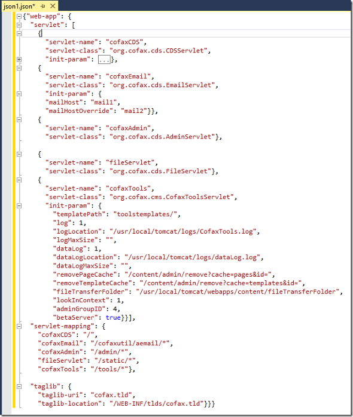

    IntelliSense now supports [JSON Schema](http://json-schema.org/) v3 and v4. There is a schema combo box to choose existing schemas, edit the local schema path, or simply drag drop a project JSON file to it to get the relative path.

    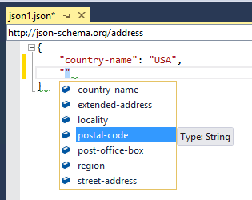    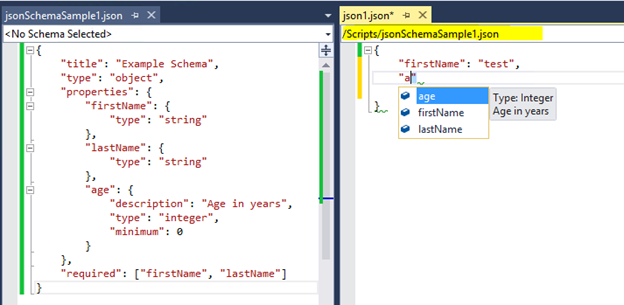
- **New Sass (SCSS) editor**: We added LESS in VS2013 RTM, and we now have a Sass project item and editor. Sass editor features are comparable to the LESS editor, and include colorization, variable and Mixins IntelliSense, comment/uncomment, quick info, formatting, syntax validation, outlining, goto definition, color picker, tools option setting etc.

    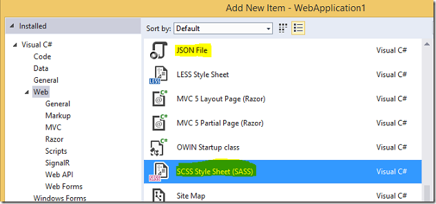    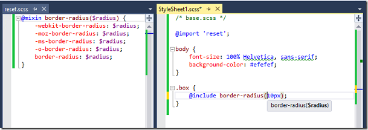
- **New URL Picker in HTML, Razor, CSS, LESS and Sass documents:** VS 2013 shipped with no URL picker outside of Web Forms pages. The new URL picker for HTML, Razor, CSS, LESS and Sass editors is a dialog-free, fluent typing picker that understands '..' and filters file lists appropriately for img tags and links.

    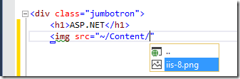        
- **Updates to LESS editor by adding more features**
- **Knockout Intellisense Upgrade**: We added a non-standard KnockOut syntax for VS intelliSense, "ko-vs-editor viewModel:" syntax. It can be used to bind to multiple view models on a page using comments in the form:

    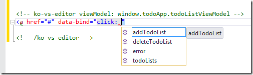

    We also added support for nested ViewModel IntelliSense, so you may drill into deeply nested objects on the ViewModel.

    `
`

    The IntelilSense displayed is the full IntelliSense of the JavaScript Object.

    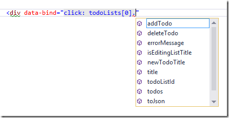
- **New URL Picker in HTML, Razor, CSS, LESS and Sass documents**: VS 2013 shipped with no URL picker outside of Web Forms pages. The new URL picker for HTML, Razor, CSS, LESS and Sass editors is a dialog-free, fluent typing picker that understands '..' and filters file lists appropriately for img tags and links.

        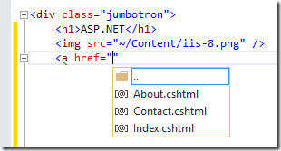    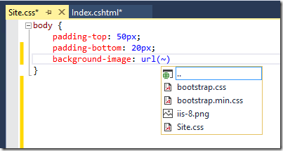

### Browser Link

- Browser Link now supports HTTPS connections and will list that in Dashboard with other connections as long as the certificate is trusted by browser.
- Static HTML source mapping
- SPA support for mapping data
- Auto-update mapping data

### Support for Azure App Service Web Apps in Visual Studio

- **Support Azure sign in.**
- **Remote debugging and Remote View for web apps**: We now support [remote debugging for web apps in Azure App Service](https://www.windowsazure.com/en-us/documentation/articles/web-sites-dotnet-troubleshoot-visual-studio/) and remote view of web app content files in the server explorer.

### Create remote Azure resources when creating a new Web project

We added an Azure ["Create Remote Resources"](https://www.windowsazure.com/en-us/documentation/articles/web-sites-dotnet-get-started/) checkbox on the new web application dialog. By choosing it, you will be able to integrate the experience of creating a new web application, setting up the Azure publishing site for testing, and creating publishing profile in a few simple steps.

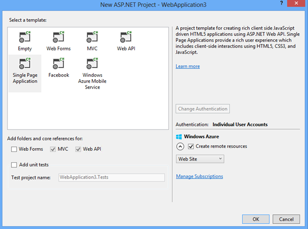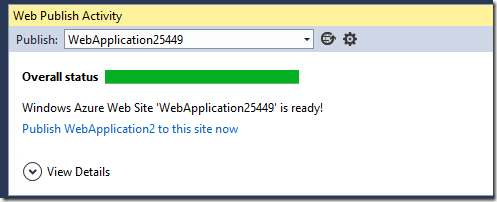

### Web Publish Enhancements

- Improve User experience for publishing.

### ASP.NET Scaffolding

- **Enum support:** If your model is using Enums, then the MVC Scaffolder will generate dropdown for Enum. This uses the Enum helpers in MVC.
- **Bootstrap support**: Updated the EditorFor templates in MVC Scaffolding so they use the Bootstrap classes.
- **Package support**: MVC and Web API Scaffolders will add 5.1 packages for MVC and Web API

The following screenshots demonstrate scaffolding models.

- Model code:

     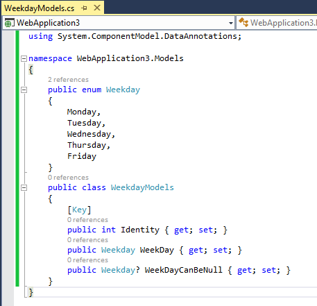
- Compile the model code, right-click, and select **Add**, **New Scaffolded Item**.

     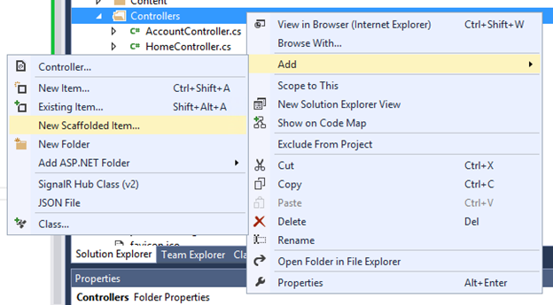
- Choose **MVC5 Controller with views, using Entity Framework**:

     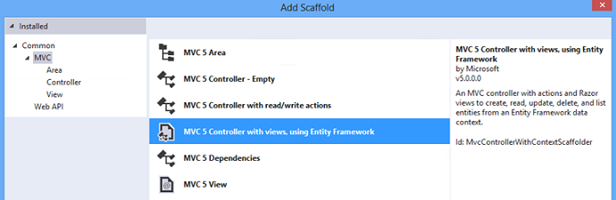
- **Add Controller** using the model:

    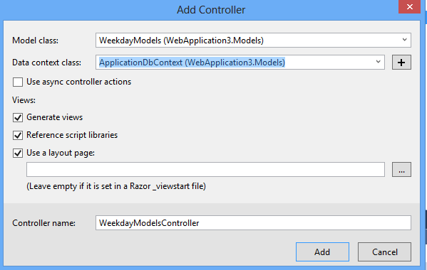
- Check the generated code, for example Views/WeekdayModels/Edit.cshtml contains `@Html.EnumDropDownListFor`: 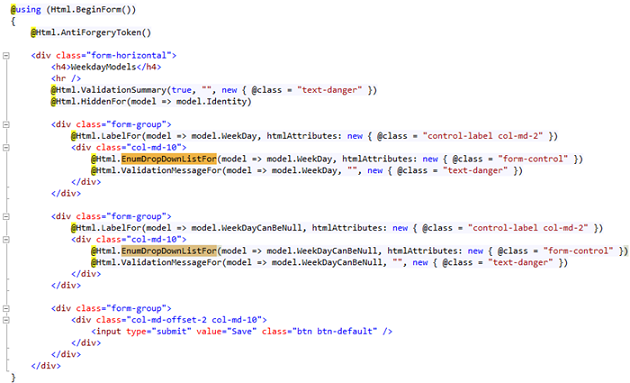
- Run the page to see the enum combobox generated, notice that if a value can be null, an empty string can be chosen for the combo box. For example, the **Create** page shows the following:

    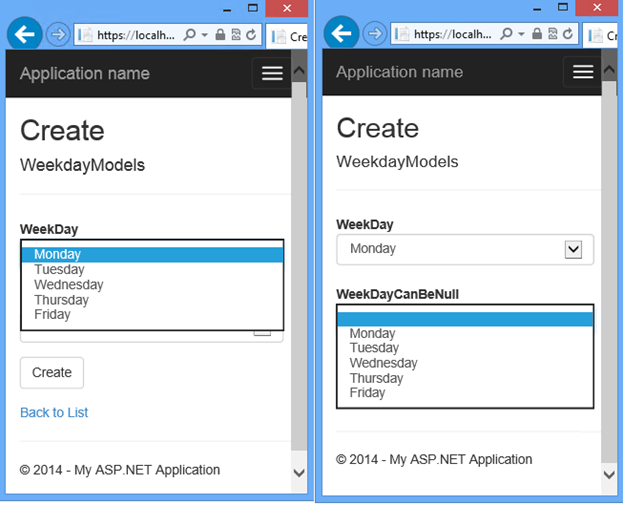

### NuGet 2.8.1

NuGet 2.8.1 RTM will be released in April 2014. Here are the salient points from the release notes, but please check the [full release notes](http://docs.nuget.org/docs/release-notes/nuget-2.8) for more information on these changes.

- **Target Windows Phone 8.1 Applications**: NuGet 2.8.1 now supports targeting Windows Phone 8.1 Applications using the target framework monikers 'WindowsPhoneApp', 'WPA', 'WindowsPhoneApp81', and 'WPA81'.
- **Patch Resolution for Dependencies**: When resolving package dependencies, NuGet has historically implemented a strategy of selecting the lowest major and minor package version which satisfies the dependencies on the package. Unlike the major and minor version, however, the patch version was always resolved to the highest version. Though the behavior was well-intentioned, it created a lack of determinism for installing packages with dependencies.
- **DependencyVersion Switch**: Though NuGet 2.8 changes the *default* behavior for resolving dependencies, it also adds more precise control over dependency resolution process via the -DependencyVersion switch in the package manager console. The switch enables resolving dependencies to the lowest possible version (default behavior), the highest possible version, or the highest minor or patch version. This switch only works for install-package in the powershell command.
- **DependencyVersion Attribute**: In addition to the -DependencyVersion switch detailed above, NuGet has also allowed for the ability to set a new attribute in the nuget.config file defining what the default value is, if the -DependencyVersion switch is not specified in an invocation of install-package. This value will also be respected by the NuGet Package Manager Dialog for any install package operations. To set this value, add the attribute below to your nuget.config file:

    `<config> <add key="dependencyversion" value="Highest" /> </config>`
- **Preview NuGet Operations With -whatif**: Some NuGet packages can have deep dependency graphs, and as such, it can be helpful during an install, uninstall, or update operation to first see what will happen. NuGet 2.8 adds the standard PowerShell -what if switch to the install-package, uninstall-package, and update-package commands to enable visualizing the entire closure of packages to which the command will be applied.
- **Downgrade Package**: It is not uncommon to install a prerelease version of a package in order to investigate new features and then decide to roll back to the last stable version. Prior to NuGet 2.8, this was a multi-step process of uninstalling the prerelease package and its dependencies, and then installing the earlier version. With NuGet 2.8, however, the update-package will now roll back the entire package closure (e.g. the package's dependency tree) to the previous version.
- **Development Dependencies**: Many different types of capabilities can be delivered as NuGet packages - including tools that are used for optimizing the development process. These components, while they can be instrumental in developing a new package, should not be considered a dependency of the new package when it is later published. NuGet 2.8 enables a package to identify itself in the .nuspec file as a developmentDependency. When installed, this metadata will also be added to the packages.config file of the project into which the package was installed. When that packages.config file is later analyzed for NuGet dependencies during nuget.exe pack, it will exclude those dependences marked as development dependencies.
- **Individual packages.config Files for Different Platforms**: When developing applications for multiple target platforms, it is common to have different project files for each of the respective build environments. It is also common to consume different NuGet packages in different project files, as packages have varying levels of support for different platforms. NuGet 2.8 provides improved support for this scenario by creating different packages.config files for different platform-specific project files.
- **Fallback to Local Cache**: Though NuGet packages are typically consumed from a remote gallery such as the [NuGet gallery](http://www.nuget.org) using a network connection, there are many scenarios where the client is not connected. Without a network connection, the NuGet client was not able to successfully install packages - even when those packages were already on the client's machine in the local NuGet cache. NuGet 2.8 adds automatic cache fallback to the package manager console.

    The cache fallback feature does not require any specific command arguments. Additionally, cache fallback currently works only in the package manager console - the behavior does not currently work in the package manager dialog.
- **Bug Fixes**: One of the major bug fixes made was performance improvement in the update-package -reinstall command.

    In addition to these features and the aforementioned performance fix, this release of NuGet also includes many other bug fixes. There were 181 total issues addressed in the release. For a full list of the work items fixed in NuGet 2.8, please view the [NuGet Issue Tracker](https://nuget.codeplex.com/workitem/list/advanced?release=NuGet%202.8&status=all) for this release.

### ASP.NET Web Forms

- The Web Forms templates now show how to do Account Confirmation and Password Reset for ASP.NET Identity.
- The Entity Data Source control and the Dynamic Data Provider for Entity Framework 6. For more details please see the following MSDN blog: [Dynamic Data provider and EntityDataSource control for Entity Framework 6](https://blogs.msdn.com/b/webdev/archive/2014/01/30/announcing-preview-of-dynamic-data-provider-and-entitydatasource-control-for-entity-framework-6.aspx).

### ASP.NET MVC 5.1.2

- [Attribute Routing Improvements](../../../mvc/overview/releases/mvc51-release-notes.md#AttributeRouting)
- [Bootstrap support for editor templates](../../../mvc/overview/releases/mvc51-release-notes.md#Bootstrap)
- [Enum support in views](../../../mvc/overview/releases/mvc51-release-notes.md#Enum)
- [Unobstrusive support for MinLength/ MaxLength attributes](../../../mvc/overview/releases/mvc51-release-notes.md#Unobtrusive)
- [Supporting the 'this' context in Unobtrusive Ajax](../../../mvc/overview/releases/mvc51-release-notes.md#thisContext)
- Various [bug fixes](https://aspnetwebstack.codeplex.com/workitem/list/advanced?keyword=&status=Closed&type=All&priority=All&release=v5.1%20Preview%7cv5.1%20RTM&assignedTo=All&component=MVC&sortField=AssignedTo&sortDirection=Ascending&page=0&reasonClosed=Fixed)

### ASP.NET Web API 2.1.2

- [Global error handling](../../../web-api/overview/releases/whats-new-in-aspnet-web-api-21.md#global-error)
- [Attribute routing enhancements](../../../web-api/overview/releases/whats-new-in-aspnet-web-api-21.md#attribute-routing)
- [Help page improvements](../../../web-api/overview/releases/whats-new-in-aspnet-web-api-21.md#help-page)
- [IgnoreRoute support](../../../web-api/overview/releases/whats-new-in-aspnet-web-api-21.md#ignoreroute)
- [BSON media-type formatter](../../../web-api/overview/releases/whats-new-in-aspnet-web-api-21.md#bson)
- [Better support for async filters](../../../web-api/overview/releases/whats-new-in-aspnet-web-api-21.md#async-filters)
- [Query parsing for the client formatting library](../../../web-api/overview/releases/whats-new-in-aspnet-web-api-21.md#query-parsing)
- Various [bug fixes](https://aspnetwebstack.codeplex.com/workitem/list/advanced?keyword=&status=Closed&type=All&priority=All&release=v5.1%20Preview%7cv5.1%20RTM&assignedTo=All&component=Web%20API%7cWeb%20API%20OData&sortField=AssignedTo&sortDirection=Ascending&page=0&reasonClosed=Fixed)

### ASP.NET Web Pages 3.1.2

- Various [bug fixes](https://aspnetwebstack.codeplex.com/workitem/list/advanced?keyword=&status=Closed&type=All&priority=All&release=v5.1%20Preview%7cv5.1%20RTM&assignedTo=All&component=Web%20Pages/Razor&sortField=AssignedTo&sortDirection=Ascending&page=0&reasonClosed=Fixed)

### Entity Framework 6.1

Entity Framework has been updated to version 6.1 for both runtime and tooling. Entity Framework (EF) 6.1 is a minor update to Entity Framework 6 and includes a number of bug fixes and new features. For detailed information on EF6.1, including links to documentation for the new features, see [Entity Framework Version History](https://msdn.microsoft.com/en-US/data/jj574253). The new features in this release include:

- **Tooling consolidation** provides a consistent way to create a new EF model. This feature extends the ADO.NET Entity Data Model wizard to support creating Code First models, including reverse engineering from an existing database. These features were previously available in Beta quality in the EF Power Tools.
- **Handling of transaction commit failures** provides the new [System.Data.Entity.Infrastructure.CommitFailureHandler](https://msdn.microsoft.com/en-us/library/system.data.entity.infrastructure.commitfailurehandler(v=vs.113).aspx) which makes use of the newly introduced ability to intercept transaction operations. The **CommitFailureHandler** allows automatic recovery from connection failures whilst committing a transaction.
- **IndexAttribute** allows indexes to be specified by placing an attribute on a property (or properties) in your Code First model. Code First will then create a corresponding index in the database.
- **The public mapping API** provides access to the information EF has on how properties and types are mapped to columns and tables in the database. In past releases this API was internal.
- **Ability to configure interceptors via the App/Web.config file**(allowing interceptors to be added without recompiling the application).
- **DatabaseLogger** is a new interceptor that makes it easy to log all database operations to a file. In combination with the previous feature, this allows you to easily switch on logging of database operations for a deployed application, without the need to recompile.
- **Migrations model change detection** has been improved so that scaffolded migrations are more accurate; performance of the change detection process has also been greatly enhanced.
- **Performance improvements** including reduced database operations during initialization, optimizations for null equality comparison in LINQ queries, faster view generation (model creation) in more scenarios, and more efficient materialization of tracked entities with multiple associations.

### ASP.NET Identity 2.0.0

- **Two-factor authentication**: ASP.NET Identity now supports two-factor authentication. Two-factor authentication provides an extra layer of security to your user accounts in the case where your password gets compromised. There is also protection for brute force attacks against the two factor codes.
- **Account Lockout:** Provides a way to lock out the user if the user enters their password or two-factor codes incorrectly. The number of invalid attempts and the timespan for the users are locked out can be configured. A developer can optionally turn off Account Lockout for certain user accounts should they need to.
- **Account Confirmation:** The ASP.NET Identity system now supports Account Confirmation. This is a fairly common scenario in most websites today where, when you register for a new account on the website, you are required to confirm your email before you can do anything in the website. Email Confirmation is useful because it prevents bogus accounts from being created. This is extremely useful if you are using email as a method of communicating with the users of your website such as Forum sites, banking, ecommerce, or social web sites.
- **Password Reset:** Password Reset is a feature where the user can reset their passwords if they have forgotten their password.
- **Security Stamp (Sign out everywhere):** Supports a way to regenerate the Security Token for the user in cases when the User changes their password or any other security related information such as removing an associated login (such as Facebook, Google, Microsoft Account and so on). This is needed to ensure that any tokens generated with the old password are invalidated. In the sample project, if you change the user's password then a new token is generated for the user and any previous tokens are invalidated. This feature provides an extra layer of security to your application since when you change your password, you will be logged out from everywhere (all other browsers) where you have logged into this application.
- **Make the type of Primary Key be extensible for Users and Roles**: In ASP.NET Identity 1.0, the type of primary key for table Users and Roles was strings. This means when the ASP.NET Identity system was persisted in SQL Server by using Entity Framework, we were using nvarchar. There were many discussions around this default implementation on Stack Overflow and based on the incoming feedback. We have provided an extensibility hook where you can specify what should be the primary key of your Users and Roles table. This extensibility hook is particularly useful if you are migrating your application and the application was storing UserIds are GUIDs or ints.
- **Support IQueryable on Users and Roles**: Added support for IQueryable on UsersStore and RolesStore, you can easily get the list of Users and Roles.
- **Support Delete operation through the UserManager**
- **Indexing on UserName**: In ASP.NET Identity Entity Framework implementation, we have added a unique index on the Username by using the new IndexAttribute in EF 6.1.0. This makes sure that Usernames are always unique and there was no race condition in which you could end up with duplicate usernames.
- **Enhanced Password Validator:** The password validator that was shipped in ASP.NET Identity 1.0 was a fairly basic password validator that was only validating the minimum length. There is a new password validator that gives you more control over the complexity of the password. Please note that even if you turn on all the settings in this password, we do encourage you to enable two-factor authentication for the user accounts.
- **IdentityFactory Middleware/ CreatePerOwinContext**:

    - **User Manager**: You can use Factory implementation to obtain an instance of UserManager from the OWIN context. This pattern is similar to what we use for getting AuthenticationManager from OWIN context for SignIn and SignOut. This is a recommended way of obtaining an instance of UserManager per request for the application.
    - **DbContextFactory**: ASP.NET Identity uses Entity Framework for persisting the Identity system in SQL Server. To do this the Identity System has a reference to the ApplicationDbContext. The DbContextFactory Middleware returns an instance of the ApplicationDbContext per request that you can use in your application.
- **ASP.NET Identity Samples NuGet package**: The Samples NuGet package can make it easier to install and run samples for ASP.NET Identity and follow the best practices. This is a sample ASP.NET MVC application. Please modify the code to suit your application before you deploy this in production. The sample should be installed in an empty ASP.NET application. For more information about the package, go to the following blog post: [Announcing RTM of ASP.NET Identity 2.0.0](https://blogs.msdn.com/b/webdev/archive/2014/03/20/test-announcing-rtm-of-asp-net-identity-2-0-0.aspx)

### Microsoft OWIN components

There were lots of bugs that were fixed in this release. Please see the [release notes for the 2.1.0 release](https://katanaproject.codeplex.com/releases/view/113281) for more detailed information.

### ASP.NET SignalR 2.0.2

There were lots of bugs that were fixed in this release. Please see the [release notes for the 2.0.2 release](https://github.com/SignalR/SignalR/releases/tag/2.0.2) for more detailed information.