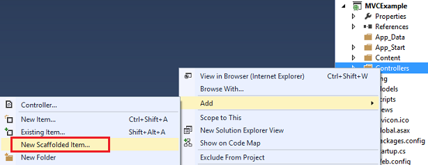
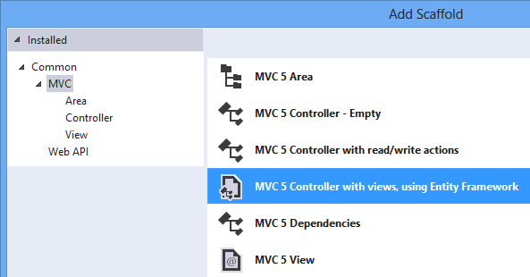
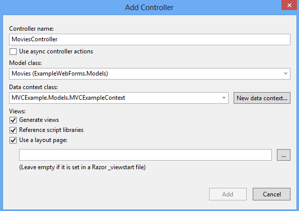
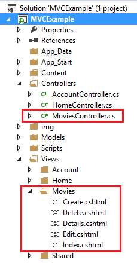
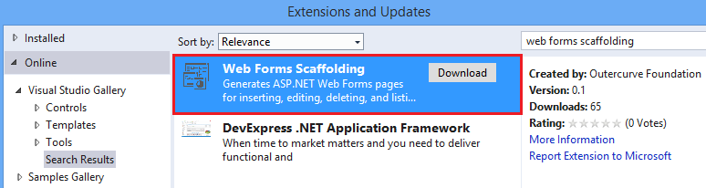
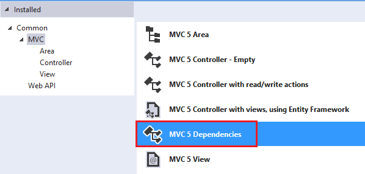
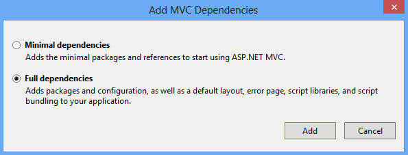

ASP.NET Scaffolding in Visual Studio 2013
====================
by [Tom FitzMacken](https://github.com/tfitzmac)

> ASP.NET Scaffolding is a new feature that is included in Visual Studio 2013.

## Overview

ASP.NET Scaffolding is a code generation framework for ASP.NET Web applications. Visual Studio 2013 includes pre-installed code generators for MVC and Web API projects. You add scaffolding to your project when you want to quickly add code that interacts with data models. Using scaffolding can reduce the amount of time to develop standard data operations in your project.

By default, Visual Studio 2013 does not support generating code for a Web Forms project, but you can use scaffolding with Web Forms by either adding MVC dependencies to the project or installing an extension. Both approaches are shown below.

Visual Studio 2013 Update 2 (currently RC) provides the ability to extend ASP.NET Scaffolding to meet the requirements of your scenario. With this functionality, you can create a customized scaffolding template and add it to Add New Scaffold dialog. Within the customized template, you specify the code that is generated when adding a scaffolded item. For more information, see [Creating a Custom Scaffolder for Visual Studio](https://go.microsoft.com/fwlink/p/?LinkId=395029).

## Prerequisites

To use ASP.NET Scaffolding, you must have:

- Microsoft Visual Studio 2013
- Web Developer Tools (part of default Visual Studio 2013 installation)
- ASP.NET Web Frameworks and Tools 2013 (part of default Visual Studio 2013 installation)

## Add a scaffolded item to MVC or Web API

To add a scaffold, right-click either the project or a folder within the project, and select **Add** – **New Scaffolded Item**, as shown in the following image.

From the **Add Scaffold** window, select the type of scaffold to add.

The **Add Controller** window gives you the opportunity to select options for generating the controller, including whether you want to use the new async features from Entity Framework 6.

The relevant classes and pages are created for your scenario. For example, the following image shows the MVC controller and views that were created through scaffolding for a model class named Movies.

## Add a scaffolded item to Web Forms

To add scaffolding that generates Web Forms code, you must either install an extension to Visual Studio or add MVC dependencies. Both approaches are shown below, but you only need to do one of these approaches.

### Web Forms Scaffolding Extension

You can install a Visual Studio extension that enable you to use scaffolding with a Web Forms project. In Visual Studio, select **Tools** and then **Extensions and Updates**. From this dialog search the Visual Studio Gallery for **Web Forms Scaffolding**.

For more information, see [Web Forms Scaffolding](https://go.microsoft.com/fwlink/p/?LinkId=396478).

### MVC Dependencies

To add MVC dependencies, select **Add** - **New Scaffolded Item**. In the Add Scaffold window, select **MVC Dependencies**, as shown below.

There are two options for scaffolding MVC; Minimal and Full. If you select Minimal, only the NuGet packages and references for ASP.NET MVC are added to your project. If you select the Full option, the Minimal dependencies are added, as well as the required content files for an MVC project. To easily use scaffolding, select Full dependencies.

After adding the dependencies, you will see a **readme.txt** file. Carefully follow the instructions in this file to ensure that your project works correctly.

When you have completed the steps in the readme.txt file, you can add a new scaffolded item as shown in the previous section about MVC and Web API. The automatically-generated views and controller will function correctly within your project.

## Tutorials

To create a customized scaffolder, see [Creating a Custom Scaffolder for Visual Studio](https://go.microsoft.com/fwlink/p/?LinkId=395029).

To customize the generated files, see [How to customize the generated files from the New Scaffolded Item dialog](https://blogs.msdn.com/b/webdev/archive/2013/12/26/how-to-customize-the-generated-files-from-the-new-scaffolded-item-dialog.aspx).

For an example of using scaffolding with **Database First development**, see [EF Database First with ASP.NET MVC](../../../mvc/overview/getting-started/database-first-development/setting-up-database.md).

For an example of using scaffolding in an **MVC** project, see [Getting Started with ASP.NET MVC 5](../../../mvc/overview/getting-started/introduction/getting-started.md).

For an example of using scaffolding in a **Web API** project, see [Create a REST API with Attribute Routing in Web API 2](../../../web-api/overview/web-api-routing-and-actions/create-a-rest-api-with-attribute-routing.md).